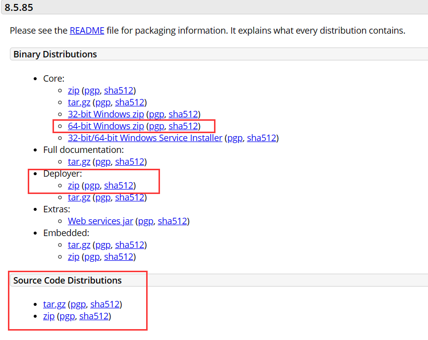
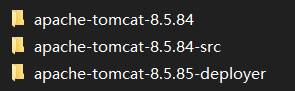
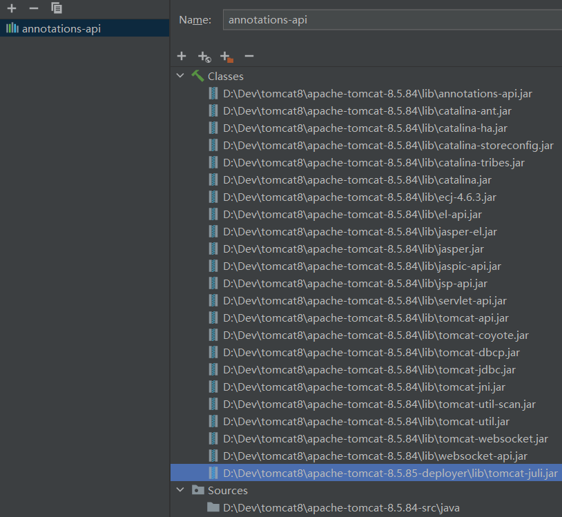

# IDEA如何本地调试tomcat

## Tomcat下载

官网下载Tomcat

[Apache Tomcat® - Apache Tomcat 8 Software Downloads](https://tomcat.apache.org/download-80.cgi)

这里下载的是Tomcat编译后的压缩包（调试的时候看到的是反编译的代码），为方便调试还得下载源码（下面的Source Code Distribution）

历史版本Tomcat查找：[Index of /dist/tomcat (apache.org)](https://archive.apache.org/dist/tomcat/)

共下载三个文件

# IDEA配置

IDEA创建Maven项目，选择maven-archetype-webapp

`Project Structure` => `Libraries ` =>  `+Java`

找到下载的Tomcat文件夹下的lib文件，选择里面所有的jar包

再添加源码包中的java目录

有时候可能会遇到源码和反编译的字节码不能对应上这个问题

将Deployer中的tomcat-juli.jar也添加到依赖中就能解决了

（`Project Structure` => `Problems`  => `fixed`）

剩下的Tomcat Local Server设置就不讲了。

接下来就可以愉快地调试Tomcat了