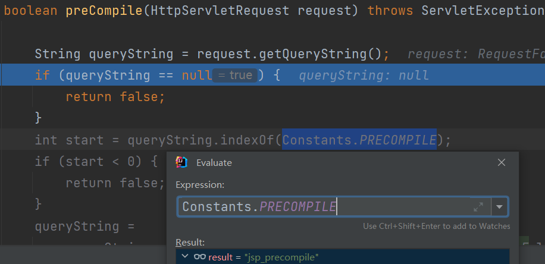

# 0x01 JSP Load Procedure

Tomcat中`jsp`和`jspx`都会交给`JspServlet`处理，看看其service方法

```java
public void service (HttpServletRequest request, HttpServletResponse response)
    throws ServletException, IOException {
    String jspUri = jspFile;
    if (jspUri == null) {
        // 检查请求是否是其他Servlet转发过来的
        jspUri = (String) request.getAttribute(
            RequestDispatcher.INCLUDE_SERVLET_PATH);
        if (jspUri != null) {
            String pathInfo = (String) request.getAttribute(
                RequestDispatcher.INCLUDE_PATH_INFO);
            if (pathInfo != null) {
                jspUri += pathInfo;
            }
        } else {
            // 获取ServletPath和PathInfo作为jspUri
            jspUri = request.getServletPath();
            String pathInfo = request.getPathInfo();
            if (pathInfo != null) {
                jspUri += pathInfo;
            }
        }
    }

    try {
        // 是否预编译
        boolean precompile = preCompile(request);
        serviceJspFile(request, response, jspUri, precompile);
    } // ....

}
```

当请求参数以`jsp_precompile`开头才会进行预编译



接着进入`serviceJspFile`

```java
private void serviceJspFile(HttpServletRequest request,
                            HttpServletResponse response, String jspUri,
                            boolean precompile)
    throws ServletException, IOException {
	 // 判断JSP是否已经被注册为一个Servlet
    // JspServletWrapper是Servlet的包装类
    JspServletWrapper wrapper = rctxt.getWrapper(jspUri);
    if (wrapper == null) {
        synchronized(this) {
            wrapper = rctxt.getWrapper(jspUri);
            if (wrapper == null) {
                // 判断JSP文件是否存在
                if (null == context.getResource(jspUri)) {
                    handleMissingResource(request, response, jspUri);
                    return;
                }
                // 创建JspServletWrapper
                wrapper = new JspServletWrapper(config, options, jspUri,rctxt);
                // 添加JspServletWrapper到JspRuntimeContext的jsps属性中
                rctxt.addWrapper(jspUri,wrapper);
            }
        }
    }

    try {
        // 调用JspServletWrapper的service方法
        wrapper.service(request, response, precompile);
    } catch (FileNotFoundException fnfe) {
        handleMissingResource(request, response, jspUri);
    }

}
```

```java
public JspServletWrapper getWrapper(String jspUri) {
    return jsps.get(jspUri);
}
// Map<String, JspServletWrapper> jsps
// 所有注册的JSP Servlet经过包装后，都会被保存在JspRuntimeContext的jsps属性中
public void addWrapper(String jspUri, JspServletWrapper jsw) {
    jsps.put(jspUri, jsw);
}
```

跟进`wrapper.service(request, response, precompile)`

`JspServletWrapper.service`主要做了如下操作：

- 根据jsp生成java文件并编译为class
- 将class文件注册为servlet
- 调用`servlet.service`方法完成调用

> tomcat的开发模式和生产模式的设定是通过conf文件夹下面的web.xml文件来配置的
>
> 在开发模式下，容器会经常检查jsp文件的时间戳来决定是否进行编译，如果jsp文件的时间戳比对应的.class文件的时间戳晚就证明jsp又进行了修改，需要再次编译，但是不断地进行时间戳的比对开销很大，会影响系统性能，而在生产模式下系统不会经常性的检查时间戳。所以一般在开发过程中使用开发模式，这样可以在jsp修改后再次访问就可以见到修改后的效果非常方便，而系统上线之后就要改为生产模式，虽然生产模式下会导致jsp的修改需要重启服务器才可以生效，但是上线后的改动较少而且性能很重要。


参考：

[【Web安全】JSP内存马研究 - 掘金 (juejin.cn)](https://juejin.cn/post/7020701580210995230)

[JSP内存马研究 - 先知社区 (aliyun.com)](https://xz.aliyun.com/t/10372)

[浅析JSP型内存马 | tyskillのBlog](https://tyskill.github.io/posts/jspservlet型内存马/)