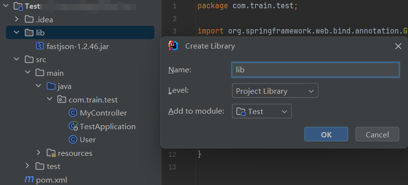
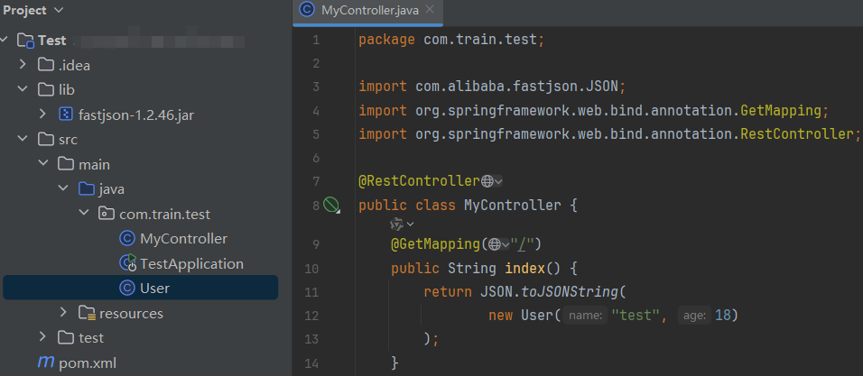

# Java篇

## 本地调试问题

题目给的jar/war中的依赖包本地没有，或者版本对不上

如何在IDEA中添加该依赖？以fastjson为例，新建一个目录，将该目录添加为library



接着就可以直接使用了



暂时不知道怎么改SpringBoot框架这个依赖。

## 打包问题

当出现本地没有的依赖时，我们是通过上面创建library的方式来本地运行的。

### Jar

用maven的Spring项目打包插件去打包，需要设置dependency，创建的library并不会被导进去。dependency指定本地依赖jar包位置又搞不来。。。(能打包成功但实际运行会报`NoClassDefFoundError`)

所以打包的思路就是先解压jar包，替换里面的字节码文件（本地运行可以build得到字节码文件），再打一次包。

`BOOT-INF/lib`放入依赖jar包，`BOOT-INF/classes`里替换字节码文件

进入解压后的目录执行

```sh
path\xxx\PatchTest-0.0.1-SNAPSHOT
$ jar -cf0M PatchSuccess.jar ./*
```

`-c`:创建一个新的 JAR 文件。

`-f`:指定 JAR 文件的名称。

`-0`:这个选项表示只打包，不进行任何压缩。

`-M`:不生成清单文件(`MANIFEST.MF`)。

### War

war包的依赖包放在WEB-INF/lib下，字节码文件放在WEB-INF/classes下


## 反序列化防御

原生反序列化，自定义`ObjectInputStream`

重写`readClassDescriptor`或`resolveClass`

```java
import java.io.IOException;
import java.io.InputStream;
import java.io.InvalidClassException;
import java.io.ObjectInputStream;
import java.io.ObjectStreamClass;
import java.util.ArrayList;

public class MyObjectInputStream extends ObjectInputStream {
   private static ArrayList blackList = new ArrayList();

   public MyObjectInputStream(InputStream inputStream) throws Exception {
      super(inputStream);
   }

   protected ObjectStreamClass readClassDescriptor() throws IOException, ClassNotFoundException {
      ObjectStreamClass readDesc = super.readClassDescriptor();
      for(int i = 0; i < 4; ++i) {
         if (readDesc.getName().contains((CharSequence)blackList.get(i))) {
            throw new InvalidClassException("bad hacker!");
         }
      }
      return readDesc;
   }

   static {
      blackList.add("javax.management.BadAttributeValueExpException");
      blackList.add("com.sun.syndication.feed.impl.ToStringBean");
      blackList.add("java.security.SignedObject");
      blackList.add("com.sun.rowset.JdbcRowSetImpl");
   }
}
```

```java
public class MyObjectInputStream extends ObjectInputStream {

   private static final String[] blacklist = new String[]{
           "java\\.security.*", "java\\.rmi.*",  "com\\.fasterxml.*", "com\\.ctf\\.*",
           "org\\.springframework.*", "org\\.yaml.*", "javax\\.management\\.remote.*"
   };

   public MyObjectInputStream(InputStream inputStream) throws IOException {
      super(inputStream);
   }

   protected Class resolveClass(ObjectStreamClass cls) throws IOException, ClassNotFoundException {
      if(!contains(cls.getName())) {
         return super.resolveClass(cls);
      } else {
         throw new InvalidClassException("Unexpected serialized class", cls.getName());
      }
   }

   public static boolean contains(String targetValue) {
      for (String forbiddenPackage : blacklist) {
         if (targetValue.matches(forbiddenPackage))
            return true;
      }
      return false;
   }
}
```

```java
public class MyownObjectInputStream extends ObjectInputStream {
    private ArrayList Blacklist = new ArrayList();

    public MyownObjectInputStream(InputStream in) throws IOException {
        super(in);
        this.Blacklist.add(Hashtable.class.getName());
        this.Blacklist.add(HashSet.class.getName());
        this.Blacklist.add(JdbcRowSetImpl.class.getName());
        this.Blacklist.add(TreeMap.class.getName());
        this.Blacklist.add(HotSwappableTargetSource.class.getName());
        this.Blacklist.add(XString.class.getName());
        this.Blacklist.add(BadAttributeValueExpException.class.getName());
        this.Blacklist.add(TemplatesImpl.class.getName());
        this.Blacklist.add(ToStringBean.class.getName());
        this.Blacklist.add("com.sun.jndi.ldap.LdapAttribute");
    }

    protected Class<?> resolveClass(ObjectStreamClass desc) throws IOException, ClassNotFoundException {
        if (this.Blacklist.contains(desc.getName())) {
            throw new InvalidClassException("dont do this");
        } else {
            return super.resolveClass(desc);
        }
    }
}
```

流量层面的检测：

```java
import java.io.ByteArrayOutputStream;
import java.util.ArrayList;
import java.util.HashMap;

public class ByteCompare {
    private static final ArrayList blacklist = new ArrayList();
    String[] s = new String[]{"java", "com.sun.org.apache.xalan.internal.xsltc.trax.TemplatesImpl", "com.fasterxml.jackson.databind.node.POJONode"};

    private static HashMap<Character, int[]> map;
    static {
        map = new HashMap<>();
        map.put('.', new int[]{0xc0, 0xae});
        map.put(';', new int[]{0xc0, 0xbb});
        map.put('$', new int[]{0xc0, 0xa4});
        map.put('[', new int[]{0xc1, 0x9b});
        map.put(']', new int[]{0xc1, 0x9d});
        map.put('a', new int[]{0xc1, 0xa1});
        map.put('b', new int[]{0xc1, 0xa2});
        map.put('c', new int[]{0xc1, 0xa3});
        map.put('d', new int[]{0xc1, 0xa4});
        map.put('e', new int[]{0xc1, 0xa5});
        map.put('f', new int[]{0xc1, 0xa6});
        map.put('g', new int[]{0xc1, 0xa7});
        map.put('h', new int[]{0xc1, 0xa8});
        map.put('i', new int[]{0xc1, 0xa9});
        map.put('j', new int[]{0xc1, 0xaa});
        map.put('k', new int[]{0xc1, 0xab});
        map.put('l', new int[]{0xc1, 0xac});
        map.put('m', new int[]{0xc1, 0xad});
        map.put('n', new int[]{0xc1, 0xae});
        map.put('o', new int[]{0xc1, 0xaf}); // 0x6f
        map.put('p', new int[]{0xc1, 0xb0});
        map.put('q', new int[]{0xc1, 0xb1});
        map.put('r', new int[]{0xc1, 0xb2});
        map.put('s', new int[]{0xc1, 0xb3});
        map.put('t', new int[]{0xc1, 0xb4});
        map.put('u', new int[]{0xc1, 0xb5});
        map.put('v', new int[]{0xc1, 0xb6});
        map.put('w', new int[]{0xc1, 0xb7});
        map.put('x', new int[]{0xc1, 0xb8});
        map.put('y', new int[]{0xc1, 0xb9});
        map.put('z', new int[]{0xc1, 0xba});
        map.put('A', new int[]{0xc1, 0x81});
        map.put('B', new int[]{0xc1, 0x82});
        map.put('C', new int[]{0xc1, 0x83});
        map.put('D', new int[]{0xc1, 0x84});
        map.put('E', new int[]{0xc1, 0x85});
        map.put('F', new int[]{0xc1, 0x86});
        map.put('G', new int[]{0xc1, 0x87});
        map.put('H', new int[]{0xc1, 0x88});
        map.put('I', new int[]{0xc1, 0x89});
        map.put('J', new int[]{0xc1, 0x8a});
        map.put('K', new int[]{0xc1, 0x8b});
        map.put('L', new int[]{0xc1, 0x8c});
        map.put('M', new int[]{0xc1, 0x8d});
        map.put('N', new int[]{0xc1, 0x8e});
        map.put('O', new int[]{0xc1, 0x8f});
        map.put('P', new int[]{0xc1, 0x90});
        map.put('Q', new int[]{0xc1, 0x91});
        map.put('R', new int[]{0xc1, 0x92});
        map.put('S', new int[]{0xc1, 0x93});
        map.put('T', new int[]{0xc1, 0x94});
        map.put('U', new int[]{0xc1, 0x95});
        map.put('V', new int[]{0xc1, 0x96});
        map.put('W', new int[]{0xc1, 0x97});
        map.put('X', new int[]{0xc1, 0x98});
        map.put('Y', new int[]{0xc1, 0x99});
        map.put('Z', new int[]{0xc1, 0x9a});
    }

    public ByteCompare() {
        for (String black: this.s){
            blacklist.add(black.getBytes());
            ByteArrayOutputStream twoBytesOutputStream = new ByteArrayOutputStream();
            ByteArrayOutputStream threeBytesOutputStream = new ByteArrayOutputStream();
            for (int i = 0; i < black.length(); i++) {
                char s = black.charAt(i);
                twoBytesOutputStream.write(map.get(s)[0]);
                twoBytesOutputStream.write(map.get(s)[1]);
                threeBytesOutputStream.write((byte) (0xe0 + ((s >> 12) & 0xf)));
                threeBytesOutputStream.write((byte) (0x80 + ((s >> 6) & 0x3f)));
                threeBytesOutputStream.write((byte) (0x80 + (s & 0x3f)));
            }
            blacklist.add(twoBytesOutputStream.toByteArray());
            blacklist.add(threeBytesOutputStream.toByteArray());
        }
    }

    public void Compared(byte[] OriginData) {
        for(int k = 0; k < 3; ++k) {
            for(int i = 0; i < OriginData.length - ((byte[])blacklist.get(k)).length + 1; ++i) {
                boolean found = true;
                for(int j = 0; j < ((byte[])blacklist.get(k)).length; ++j) {
                    if ((OriginData[i + j] & 0xFF) != (((byte[])blacklist.get(k))[j]  & 0xFF)) {
                        found = false;
                        break;
                    }
                }
                if (found) {
                    throw new NullPointerException("Don't hacker!");
                }
            }
        }

    }
}
```


