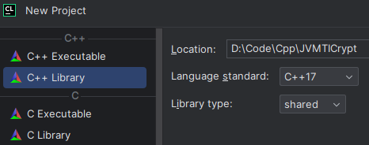
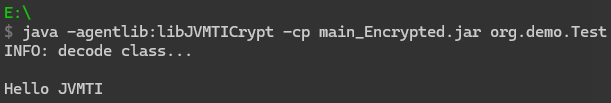

# 字节码文件加密

Java语言是编译型和解释型混合，源代码被编译为字节码文件，JVM再将字节码解释给CPU执行

反编译很简单，字节码文件基本上可以等同于源码文件。

对Java的加密可以分为对源码的加密和对字节码的加密，有如下几种方案

* 源码混淆
  * 对变量、函数、类名等进行替换、混淆
  * 使代码不容易阅读
* 字节码转换
  * ClassLoader
    * 自定义类加载器，读取字节码后对字节码解密后再加载
  * Instrumentation
    * 自定义`ClassFileTransformer`，调用`transform`对字节码进行解密
    * `java -javaagent:xx.jar -jar yy.jar`
    * 解密后的字节码再载入JVM
  * JVMTI
    * C/C++将解密算法封装到一个动态链接库
    * `java -agentpath:xx.dll –jar yy.jar`
    * 通过`Agent_OnLoad`引入`ClassFileLoadHook`实现运行前字节码的解密

源码混淆只是增加源码阅读障碍，JVM仍能执行

而字节码转换则完全把字节码文件换为一个没有意义的二进制文件，JVM不能执行

Instrumentation/JVMTI将对源码的保护转移到了对加解密算法的保护，如果解密的JavaAgent/动态链接库泄露了，也可能被破解。

另外，运行时JVM中的字节码已经是原本的字节码，因此通过`class dump`也能拿到源码。

考虑到动态链接库还可以用加壳等方式保护，下面简单实现一个基于JVMTI的加解密

在此之前先介绍一下JVMTI编程，官方文档👉https://docs.oracle.com/javase/8/docs/platform/jvmti/jvmti.html

# Agent_Onload

当使用`-agentlib:xxx.dll`启动Java程序时，JVM会首先从动态链接库中寻找函数`Agent_Onload`。

JVMTI是基于事件驱动的，JVM每执行到一定的逻辑就会主动调用一些事件的回调接口，这些接口可以供开发者扩展自己的逻辑。

一般地，JVMTI程序的加载过程为如下流程

1. 获取JVMTI环境（JVMTIEnvironment）
2. 注册所需功能（Capabilities）
3. 注册事件通知（Event Notification）
4. 指定事件回调函数（Callback Method）

## capabilities

capabilities函数用来使能JVMTI函数和事件，简单来说就是要添加capabilities才能实现对应的功能。

每个JVMTI环境都有它自己的一组capabilities，初始时为空，在`OnLoad`阶段进行capability的添加。添加capability可能会导致程序执行速度的降低。

capabilities的数据结构定义如下

```cpp
typedef struct {
	...
	unsigned int can_xxx : 1;
	...
} jvmtiCapabilities;
```

下面列举一些capabilities

| Field                                | Description                                                  |
| ------------------------------------ | ------------------------------------------------------------ |
| `can_get_bytecodes`                  | Can get bytecodes of a method `GetBytecodes`                 |
| `can_redefine_classes`               | Can redefine classes with `RedefineClasses`                  |
| `can_get_source_file_name`           | Can get the source file name of a class                      |
| `can_access_local_variables`         | Can set and get local variables                              |
| `can_generate_breakpoint_events`     | Can `set` and thus get            `Breakpoint` events        |
| `can_generate_all_class_hook_events` | Can generate ClassFileLoadHook events for every loaded class |
| `can_generate_method_entry_events`   | Can generate method entry events on entering a method        |
| `can_retransform_classes`            | Can retransform classes with `RetransformClasses`            |

```cpp
jvmtiError
AddCapabilities(jvmtiEnv* env,
            const jvmtiCapabilities* capabilities_ptr)
```

设置capabilities：

```cpp
jvmtiCapabilities capas;
memset(&capas, 0, sizeof(capas));
jvmtiError err;

capas.can_xxx = 1;
err = (*jvmti)->AddCapabilities(jvmti, &capas);
```

## event&callback

agent可以响应程序中发生的event，并调用对应的回调函数进行处理

不同的event对应不同的callback，不同的函数参数保存着event发生时的附加信息

上面的能力表中看到有有些是`events`结尾的，即event需要的capability

按照如下步骤设置event：

1. `AddCapabilities`添加event所需的capabilities
2. `SetEventCallbacks`设置event的回调函数
3. `SetEventNotificationMode`使能event

### 回调event

```cpp
jvmtiError
SetEventCallbacks(jvmtiEnv* env,
            const jvmtiEventCallbacks* callbacks,
            jint size_of_callbacks)
```

下面是`jvmtiEventCallbacks`的结构体定义

```cpp
typedef struct {
    jvmtiEventClassFileLoadHook ClassFileLoadHook;
    jvmtiEventClassLoad ClassLoad;
    jvmtiEventBreakpoint Breakpoint;
    jvmtiEventFieldAccess FieldAccess;
    jvmtiEventFieldModification FieldModification;
    jvmtiEventMethodEntry MethodEntry;
    jvmtiEventMethodExit MethodExit;
    // ....
} jvmtiEventCallbacks;
```

可以看出，和capability一样，event也是由JVMTI预先定义的，设置相对应的字段即可

设置event回调函数

```cpp
jvmtiEventCallbacks cbs;
memset(&cbs, 0, sizeof(cbs));
jvmtiError err;

cbs.Xxx = &cb_Xxx;
err = (*jvmti)->SetEventCallbacks(jvmti, &cbs, sizeof(cbs));
```

cb_Xxx为我们实现的回调函数接口的地址

不同事件的回调函数的接口参数不同，比如`ClassLoad`

当一个类被首次加载时，`ClassLoad`事件会被触发

```cpp
void JNICALL
ClassLoad(jvmtiEnv *jvmti_env,
            JNIEnv* jni_env,
            jthread thread,  // 加载该类的线程
            jclass klass)  // klass为被加载的类
```

### 使能event

```cpp
typedef enum {
    JVMTI_ENABLE = 1,
    JVMTI_DISABLE = 0
} jvmtiEventMode;

jvmtiError
    SetEventNotificationMode(jvmtiEnv* env,
                             jvmtiEventMode mode,
                             jvmtiEvent event_type,
                             jthread event_thread,
                             ...)
```

默认所有的event为非使能状态

```cpp
typedef enum { 
    JVMTI_EVENT_SINGLE_STEP = 1, 
    JVMTI_EVENT_BREAKPOINT = 2, 
      ... 
} jvmtiEvent;
```

jvmtiEvent用于标识event，`JVMTI_EVENT_回调函数名`

使能event：

```cpp
error = jvmti->SetEventNotificationMode(JVMTI_ENABLE, JVMTI_EVENT_CLASS_FILE_LOAD_HOOK, NULL);
// NULL表示在全局（所有线程）使能
```

# Build

CLion新建项目



```java
public class ByteCodeEncryptor {
    public native static byte[] encrypt(byte[] src);
    public native static byte[] decrypt(byte[] src);
}
```

`javah -jni ByteCodeEncryptor`获取头文件`ByteCodeEncryptor.h`

将该头文件放到工程目录下

`CMakeLists.txt`

```cmake
cmake_minimum_required(VERSION 3.26)
project(JVMTICrypt)

set(CMAKE_CXX_STANDARD 17)

add_library(JVMTICrypt SHARED library.cpp
        ByteCodeEncryptor.h)

# 设置jni头文件包含路径
set(JAVA_INCLUDE_PATH path2jdk/include)
set(JAVA_AWT_INCLUDE_PATH path2jdk/include/win32)
set(BUILD_USE_64BITS on)

# 包含头文件
include_directories(${JAVA_INCLUDE_PATH} ${JAVA_AWT_INCLUDE_PATH})
```

`library.cpp`

```cpp
#include <iostream>
#include <cstring>
#include "ByteCodeEncryptor.h"
#include "jni.h"
#include <jvmti.h>
#include <jni_md.h>


void encode(char *str) {
    unsigned int m = strlen(str);
    for (int i = 0; i < m; i++) {
        str[i] = str[i] + 1;
    }
}

void decode(char *str) {
    unsigned int m = strlen(str);
    for (int i = 0; i < m; i++) {
        str[i] = str[i] - 1;
    }
}


JNIEXPORT jbyteArray JNICALL
Java_ByteCodeEncryptor_encrypt(JNIEnv *env, jclass cla, jbyteArray text) {
    char *dst = (char *) env->GetByteArrayElements(text, 0);
    encode(dst);
    env->SetByteArrayRegion(text, 0, strlen(dst), (jbyte *) dst);
    return text;
}


void JNICALL ClassDecryptHook(
        jvmtiEnv *jvmti_env,
        JNIEnv *jni_env,
        jclass class_being_redefined,
        jobject loader,
        const char *name,
        jobject protection_domain,
        jint class_data_len,
        const unsigned char *class_data,
        jint *new_class_data_len,
        unsigned char **new_class_data
) {
    *new_class_data_len = class_data_len;
    jvmti_env->Allocate(class_data_len, new_class_data);

    unsigned char *_data = *new_class_data;

    if (name && strncmp(name, "org/demo/", 9) == 0) {

        for (int i = 0; i < class_data_len; i++) {
            _data[i] = class_data[i];
        }
        printf("%s\n", "INFO: decode class... \n");
        decode((char *) _data);
    } else {
        for (int i = 0; i < class_data_len; i++) {
            _data[i] = class_data[i];
        }
    }
}

JNIEXPORT jint JNICALL Agent_OnLoad(JavaVM *vm, char *options, void *reserved) {
    jvmtiEnv *jvmti;
    jint ret = vm->GetEnv((void **) &jvmti, JVMTI_VERSION);
    if (JNI_OK != ret) {
        printf("ERROR: Unable to access JVMTI!\n");
        return ret;
    }
    jvmtiCapabilities capabilities;
    (void) memset(&capabilities, 0, sizeof(capabilities));

    capabilities.can_generate_all_class_hook_events = 1;
    capabilities.can_tag_objects = 1;
    capabilities.can_generate_object_free_events = 1;
    capabilities.can_get_source_file_name = 1;
    capabilities.can_get_line_numbers = 1;
    capabilities.can_generate_vm_object_alloc_events = 1;

    jvmtiError error = jvmti->AddCapabilities(&capabilities);
    if (JVMTI_ERROR_NONE != error) {
        printf("ERROR: Unable to AddCapabilities JVMTI!\n");
        return error;
    }

    jvmtiEventCallbacks callbacks;
    (void) memset(&callbacks, 0, sizeof(callbacks));

    callbacks.ClassFileLoadHook = &ClassDecryptHook;
    error = jvmti->SetEventCallbacks(&callbacks, sizeof(callbacks));
    if (JVMTI_ERROR_NONE != error) {
        printf("ERROR: Unable to SetEventCallbacks JVMTI!\n");
        return error;
    }

    error = jvmti->SetEventNotificationMode(JVMTI_ENABLE, JVMTI_EVENT_CLASS_FILE_LOAD_HOOK, NULL);
    if (JVMTI_ERROR_NONE != error) {
        printf("ERROR: Unable to SetEventNotificationMode JVMTI!\n");
        return error;
    }

    return JNI_OK;
}
```

Build得到一个动态链接库`libJVMTICrypt.dll`

接着创建一个jar用作测试

`manifest `

```
Manifest-Version: 1.0
Main-Class: org.demo.Test
```

```java
package org.demo;

public class Test {
    public static void main(String[] args) {
        System.out.println("Hello JVMTI");
    }
}
```

`jar -cvfm main.jar manifest -C src .`

对`main.jar`进行加密

```java
import java.io.ByteArrayOutputStream;
import java.io.File;
import java.io.InputStream;
import java.nio.file.Files;
import java.util.Enumeration;
import java.util.jar.JarEntry;
import java.util.jar.JarFile;
import java.util.jar.JarOutputStream;

public class Encrypt {
    static {
        System.load("E:/libJVMTICrypt.dll");
    }

    public static void main(String[] args) {
        try {
            ByteArrayOutputStream baos = new ByteArrayOutputStream();
            byte[] buf = new byte[1024];
            String fileName = "E:/main.jar";

            File dstFile = new File(fileName.substring(0, fileName.indexOf(".")) + "_Encrypted.jar");
            JarOutputStream dstJar = new JarOutputStream(Files.newOutputStream(dstFile.toPath()));
            JarFile srcJar = new JarFile(fileName);
            for (Enumeration<JarEntry> enumeration = srcJar.entries(); enumeration.hasMoreElements(); ) {
                JarEntry entry = enumeration.nextElement();
                InputStream is = srcJar.getInputStream(entry);
                int len;
                while ((len = is.read(buf, 0, buf.length)) != -1) {
                    baos.write(buf, 0, len);
                }
                byte[] bytes = baos.toByteArray();
                String name = entry.getName();
                System.out.println(name);
                if (name.startsWith("org/demo/") && bytes.length != 0) {
                    try {
                        bytes = ByteCodeEncryptor.encrypt(bytes);
                    } catch (Exception e) {
                        e.printStackTrace();
                    }
                }
                JarEntry ne = new JarEntry(name);
                dstJar.putNextEntry(ne);
                dstJar.write(bytes);
                baos.reset();
            }
            srcJar.close();
            dstJar.close();
            System.out.println("encrypt finished");
        } catch (Exception e) {
            e.printStackTrace();
        }
    }
}
```

`java -agentlib:libJVMTICrypt -cp main_Encrypted.jar org.demo.Test`运行加密的jar



