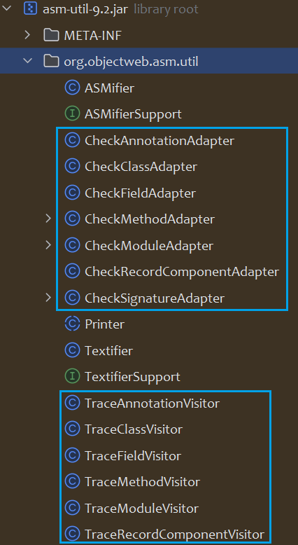

# ASM Intro

## Preface

字节码增强技术是一类对现有字节码进行修改或者动态生成全新字节码文件的技术


## What Is ASM

ASM是一个操作Java字节码的类库

> ASM provides a simple API for decomposing, modifying, and recomposing binary Java classes (i.e. ByteCode).

一个`.java`文件经过Java编译器（`javac`）编译之后会生成一个`.class`文件，`.class`文件中存储的是字节码（ByteCode）数据，ASM所操作的对象即字节码（ByteCode）

字节码文件是具有一定格式的文件，ASM首先将字节码拆分为多个部分(decompose)，再对某一部分的信息进行修改(modify)，最后将多个部分重新组织为一个新的字节码(recompose)。

既然ASM是操作字节码的工具，而字节码的生成又和Java版本有关，因此需要注意ASM版本和Java版本的兼容，尽量选择较高的ASM版本

| ASM Release | Release Date | Java Support                              |
| ----------- | ------------ | ----------------------------------------- |
| 2.0         | 2005-05-17   | Java 5 language support                   |
| 3.2         | 2009-06-11   | support for the new `invokedynamic` code. |
| 4.0         | 2011-10-29   | Java 7 language support                   |
| 5.0         | 2014-03-16   | **Java 8 language support**               |
| 6.0         | 2017-09-23   | Java 9 language support                   |
| 6.1         | 2018-03-11   | Java 10 language support                  |
| 7.0         | 2018-10-27   | **Java 11 language support**              |
| 7.1         | 2019-03-03   | Java 13 language support                  |
| 8.0         | 2020-03-28   | Java 14 language support                  |
| 9.0         | 2020-09-22   | Java 16 language support                  |
| 9.1         | 2021-02-06   | **JDK 17 support**                        |

## What ASM can do


* generation：创建新的字节码
* transformation：对已有字节码进行变换
* analysis：对已有字节码进行分析

## Real World ASM

* Fastjson：通过 `ASM` 为 `JavaBean` 生成一个独立的 `JavaBeanSerializer` 子类，代替反射提高效率
* Spring：Spring框架的AOP是通过CGLIB（Code Generation Library）动态代理实现的，而CGLIB是基于ASM构建的
* JDK：Lambda表达式的调用是通过ASM实现的。`rt.jar` 中 `jdk.internal.org.objectweb.asm` 即为JDK内置的ASM代码

# ASM Structure

ASM主要分成两部分：

* `Core API`: `asm.jar`、`asm-util.jar`、`asm-commons.jar`
* `Tree API`：`asm-tree.jar`、`asm-analysis.jar`


`Core API`

* 不需要把这个类的整个结构读取到内存，用流式的方法来处理字节码文件
* 类比解析XML文件中的SAX方式
* 优点：节约内存
* 缺点：编程难度较大

`Tree API`

* 把整个类的结构读取到内存中
* 类比解析XML文件中的DOM方式
* 优点：编程简单
* 缺点：消耗内存

maven依赖：

```xml
<dependencies>
    <dependency>
        <groupId>org.ow2.asm</groupId>
        <artifactId>asm</artifactId>
        <version>9.2</version>
    </dependency>
    <dependency>
        <groupId>org.ow2.asm</groupId>
        <artifactId>asm-util</artifactId>
        <version>9.2</version>
    </dependency>
    <dependency>
        <groupId>org.ow2.asm</groupId>
        <artifactId>asm-commons</artifactId>
        <version>9.2</version>
    </dependency>
</dependencies>
```

## Core API

### asm.jar

最重要的三个类：

* `ClassReader`: 读取字节码文件，并拆分为不同的部分（decompose）
* `ClassVisitor`: 对字节码中某一部分进行修改（modify）
* `ClassWriter`: 将各个部分重组为完整的字节码文件（recompose）

对已有类进行修改，需要这三个类的参与。

对应的还有`FieldVisitor`、`FieldWriter`和`MethodVisitor`、`MethodWriter`


### asm-util.jar

主要包含一些工具类



* `Check`开头的类，负责检查生成的class文件是否正确
* `Trace`开头的类，负责打印class文件的内容，方便追踪class文件内部信息

### asm-commons.jar

特定场景中的工具类

# Gratitution

https://lsieun.github.io/java-asm-01