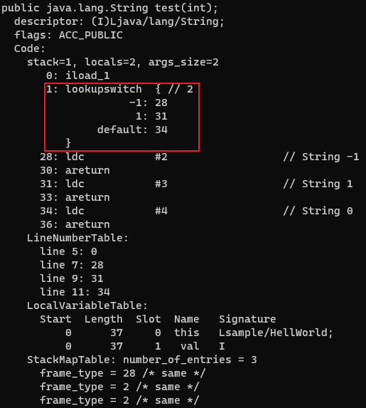

对于字节码的generation，主要是ClassVisitor和ClassWriter的参与，ClassReader将在transform部分介绍。

# ClassVisitor

`ClassVisitor`是一个抽象类，不能直接new，它有两个常用的子类分别是`ClassWriter`(`Core API`)和`ClassNode`(`Tree API`)

```java
/*
A ClassVisitor that generates a corresponding ClassFile structure, as defined in the Java Virtual Machine Specification (JVMS). It can be used alone, to generate a Java class "from scratch", or with one or more ClassReader and adapter ClassVisitor to generate a modified class from one or more existing Java classes.
*/
public class ClassWriter extends ClassVisitor
```

```java
// A node that represents a class.
public class ClassNode extends ClassVisitor
```

`ClassVisitor`定义了两个字段`api`和`cv`

```java
public abstract class ClassVisitor {
    /**
   * The ASM API version implemented by this visitor. The value of this field must be one of Opcodes
   */
    protected final int api;

    /** The class visitor to which this visitor must delegate method calls. May be null. */
    protected ClassVisitor cv;

    public ClassVisitor(final int api, final ClassVisitor classVisitor) {
        this.api = api;
        this.cv = classVisitor;
    }
}
```

* `api`指定当前使用的ASM版本，取值为`Opcodes.ASM4 ~ Opcodes.ASM9`，这里的版本是ASM9
* `cv`也是一个`ClassVisitor`，用于连接多个`ClassVisitor`

`ClassVisitor`中定义了很多`visitXxx`方法，这里使用了访问者模式。主要看四个方法：`visit()`、`visitField()`、`visitMethod()`、`visitEnd()`

这些方法的参数实际上都和字节码文件的结构相对应

```
ClassFile {
    u4             magic;
    u2             minor_version;
    u2             major_version;
    u2             constant_pool_count;
    cp_info        constant_pool[constant_pool_count-1];
    u2             access_flags;
    u2             this_class;
    u2             super_class;
    u2             interfaces_count;
    u2             interfaces[interfaces_count];
    u2             fields_count;
    field_info     fields[fields_count];
    u2             methods_count;
    method_info    methods[methods_count];
    u2             attributes_count;
    attribute_info attributes[attributes_count];
}
field_info {
    u2             access_flags;
    u2             name_index;
    u2             descriptor_index;
    u2             attributes_count;
    attribute_info attributes[attributes_count];
}
method_info {
    u2             access_flags;
    u2             name_index;
    u2             descriptor_index;
    u2             attributes_count;
    attribute_info attributes[attributes_count];
}
// method的方法体由Code属性表示
Code_attribute {
    u2 attribute_name_index;
    u4 attribute_length;
    u2 max_stack; 
    u2 max_locals; 
    u4 code_length;
    u1 code[code_length];
    u2 exception_table_length;
    {   u2 start_pc;
        u2 end_pc;
        u2 handler_pc;
        u2 catch_type;
    } exception_table[exception_table_length];
    u2 attributes_count;
    attribute_info attributes[attributes_count];
}
// u? 表示占用?个字节
```

```java
public void visit(
    final int version,
    final int access,
    final String name,
    final String signature,
    final String superName,
    final String[] interfaces)
```

* version – the class version
* access – the class's access flags
* name – the internal name of the class
* signature – the signature of this class. May be null if the class is not a generic one, and does not extend or implement generic classes or interfaces
* superName – the internal of name of the super class
* interfaces – the internal names of the class's interfaces

```java
public FieldVisitor visitField(
    final int access,
    final String name,
    final String descriptor,
    final String signature,
    final Object value)
```

* access – the field's access flags
* name – the field's name
* descriptor – the field's descriptor
* signature – the field's signature. May be null if the field's type does not use generic types
* value – the field's initial value

```java
public MethodVisitor visitMethod(
    final int access,
    final String name,
    final String descriptor,
    final String signature,
    final String[] exceptions)
```

* access – the method's access flags
* name – the method's name
* descriptor – the method's descriptor
* signature – the method's signature. May be null if the method parameters, return type and exceptions do not use generic types
* exceptions – the internal names of the method's exception classes

在字节码中，描述符是对类型的简单化描述

* 对于字段，描述符即字段本身的类型
* 对于方法，描述符为方法接受的参数类型和返回值的类型

| Java 类型             | ClassFile 描述符                                    |
| --------------------- | --------------------------------------------------- |
| `boolean`             | `Z`（Z 表示 Zero，零表示 `false`，非零表示 `true`） |
| `byte`                | `B`                                                 |
| `char`                | `C`                                                 |
| `double`              | `D`                                                 |
| `float`               | `F`                                                 |
| `int`                 | `I`                                                 |
| `long`                | `J`                                                 |
| `short`               | `S`                                                 |
| `void`                | `V`                                                 |
| `non-array reference` | `L<InternalName>;`                                  |
| `array reference`     | `[`                                                 |
| `String`              | `Ljava/lang/String;`                                |
| `Object`              | `Ljava/lang/Object;`                                |
| `void`                | `V`                                                 |

另外，对于`visitMethod`的第二个参数`name`，若我们要生成构造方法，这里固定为`<init>`；若要生成静态代码块，`name`为`<clinit>`，`signature`为`()V`

```java
/*
Visits the end of the class. This method, which is the last one to be called, is used to inform the visitor that all the fields and methods of the class have been visited.
*/
public void visitEnd()
```

这四个方法内部都是调用的`cv.visitXxx()`


这些`visitXxx`方法是有调用顺序的

```java
/*
A visitor to visit a Java class. The methods of this class must be called in the following order: 
visit 
[visitSource][visitModule][visitNestHost][visitOuterClass]
(
visitAnnotation|
visitTypeAnnotation|
visitAttribute
)*
(
visitNestMember|
[*visitPermittedSubclass]|
visitInnerClass|
visitRecordComponent|
visitField|visitMethod
)*
visitEnd
*/
public abstract class ClassVisitor
```

* `[]`表示最多调用一次
* `*`表示调用0次或多次
* `()`和`|`表示可以任选一个方法，不分先后顺序

由于我们只关注四个`visitXxx`方法，上面的调用可以简化为

```java
visit
(
 visitField |
 visitMethod
)* 
visitEnd
```

# ClassWriter

```java
/*
A ClassVisitor that generates a corresponding ClassFile structure, as defined in the Java Virtual Machine Specification (JVMS). It can be used alone, to generate a Java class "from scratch", or with one or more ClassReader and adapter ClassVisitor to generate a modified class from one or more existing Java classes.
*/
public class ClassWriter extends ClassVisitor{
    public static final int COMPUTE_MAXS = 1;
    public static final int COMPUTE_FRAMES = 2;
    
  // The minor_version and major_version fields of the JVMS ClassFile structure.
  	private int version;

  // The symbol table for this class (contains the constant_pool and the BootstrapMethods)
  	private final SymbolTable symbolTable;

  // The access_flags field of the JVMS ClassFile structure
  	private int accessFlags;

  // The this_class field of the JVMS ClassFile structure
  	private int thisClass;

  // The super_class field of the JVMS ClassFile structure
  	private int superClass;

  // The interface_count field of the JVMS ClassFile structure
  	private int interfaceCount;

  // The 'interfaces' array of the JVMS ClassFile structure
  	private int[] interfaces;

  /*
   * The fields of this class, stored in a linked list of FieldWriter linked via their
   * FieldWriter#fv field. This field stores the first element of this list.
   */
  	private FieldWriter firstField;

  /**
   * The fields of this class, stored in a linked list of FieldWriter linked via their
   * FieldWriter#fv field. This field stores the last element of this list.
   */
  	private FieldWriter lastField;

  /**
   * The methods of this class, stored in a linked list of MethodWriter linked via their
   * MethodWriter#mv field. This field stores the first element of this list.
   */
  	private MethodWriter firstMethod;

  /**
   * The methods of this class, stored in a linked list of MethodWriter linked via their
   * MethodWriter#mv field. This field stores the last element of this list.
   */
  	private MethodWriter lastMethod;

  // The number_of_classes field of the InnerClasses attribute
  	private int numberOfInnerClasses;

  // The 'classes' array of the InnerClasses attribute
  	private ByteVector innerClasses;
}
```

* `COMPUTE_MAXS`: A flag to automatically compute the **maximum stack size** and the **maximum number of local variables of methods**. If this flag is set, then the arguments of the MethodVisitor.visitMaxs method of the MethodVisitor returned by the visitMethod method will be ignored, and computed automatically from the signature and the bytecode of each method.
* `COMPUTE_FRAMES`: A flag to automatically compute the **stack map frames of methods** from scratch. If this flag is set, then the calls to the MethodVisitor.visitFrame method are ignored, and the stack map frames are recomputed from the methods bytecode. The arguments of the MethodVisitor.visitMaxs method are also ignored and recomputed from the bytecode. In other words, COMPUTE_FRAMES implies COMPUTE_MAXS.

`COMPUTE_FRAMES`包含了`COMPUTE_MAXS`的功能，不仅计算`max stack size`和`max local variables`，还计算`stack map frames`，所以一般都使用`COMPUTE_FRAMES`

注意：虽然这个字段能够自动计算，但代码中仍要调用`visitMaxs`，否则会报错

使用`ClassWriter`创建一个字节码文件，分为三步：

* 创建`ClassWriter`对象
* 调用`ClassWriter#visitXxx`方法
* 调用`ClassWriter#toByteArray`方法

## Best Practice

尝试生成如下类

```java
package sample;

public class HelloWorld {
    public static final int NUM = 17;
    public String name;

    public HelloWorld() {
    }

    public int hi(Object a) {
        return 6;
    }
}
```

```java
package demo;

import com.sun.org.apache.xml.internal.security.utils.JavaUtils;
import org.objectweb.asm.ClassWriter;
import org.objectweb.asm.FieldVisitor;
import org.objectweb.asm.MethodVisitor;
import static org.objectweb.asm.Opcodes.*;

public class Test {
    public static void main(String[] args) throws Exception {
        JavaUtils.writeBytesToFilename("HelloWorld.class", dump());
    }

    public static byte[] dump() throws Exception {
        ClassWriter cw = new ClassWriter(ClassWriter.COMPUTE_FRAMES);
        cw.visit(V1_8,     // version Java8
                ACC_PUBLIC,   // access flag
                "sample/HelloWorld",  // name - Internal Name
                null,   // signature
                "java/lang/Object",    // superName
                null);    // interfaces
        {
            FieldVisitor fv1 = cw.visitField(ACC_PUBLIC + ACC_FINAL + ACC_STATIC, // access flag
                    "NUM", // name
                    "I",  // descriptor
                    null,  // signature
                    17);   // value , could be null
            fv1.visitEnd();
        }
        {
            FieldVisitor fv2 = cw.visitField(ACC_PUBLIC, "name", "Ljava/lang/String;", null, null);
            fv2.visitEnd();
        }
        {
            MethodVisitor mv1 = cw.visitMethod(ACC_PUBLIC, "<init>", "()V", null, null);
            mv1.visitEnd();
        }
        {
            MethodVisitor mv2 = cw.visitMethod(ACC_PUBLIC, "hi", "(Ljava/lang/Object;)I", null, null);
            mv2.visitLdcInsn(6);
            mv2.visitInsn(IRETURN);
            mv2.visitEnd();
        }
        cw.visitEnd();
        return cw.toByteArray();
    }
}
```

注意这里`visit`的第三个参数name是`Internal Name`的格式，Java源码中使用类名的形式是**Fully Qualified Class Name**，如`java.lang.String`，编译成class文件后类名的格式会变成`Internal Name`，`.`变成`/`，如`java/lang/String`

对于比较复杂的类，可以用IDEA的插件`ASM Bytecode Viewer`去生成（网上推荐的`ASM Bytecode Outline`不兼容高版本的IDEA）

# FieldVisitor

`ClassVisitor#visitField`返回了一个`FieldVisitor`对象，和`ClassVistor`类很像

```java
// A visitor to visit a Java field.
public abstract class FieldVisitor {
    protected final int api;
    protected FieldVisitor fv;
    public FieldVisitor(final int api) {
        this(api, null);
    }
}
```

`FieldVisitor`调用`visitXxx`也遵循一定的调用顺序

```
(
 visitAnnotation |
 visitTypeAnnotation |
 visitAttribute
)*
visitEnd
```

# FieldWriter

`ClassVisitor#visitField`的实现就是通过`FieldWriter`(父类为`FieldVisitor`)来实现的

```java
// ClassWriter#visitField
@Override
public final FieldVisitor visitField(
    final int access,
    final String name,
    final String descriptor,
    final String signature,
    final Object value) {
    FieldWriter fieldWriter =
        new FieldWriter(symbolTable, access, name, descriptor, signature, value);
    if (firstField == null) {
        firstField = fieldWriter;
    } else {
        lastField.fv = fieldWriter;
    }
    return lastField = fieldWriter;
}
```

在`toByteArray`方法中也用到了`FieldWriter`的两个方法`computeFieldInfoSize()`和`putFieldInfo()`

# MethodVisitor

`ClassVisitor#visitMethod`返回了一个`MethodVisitor`对象，和`ClassVistor`类很像。

```java
// A visitor to visit a Java method
public abstract class MethodVisitor {
    protected final int api;
    protected MethodVisitor mv;
    public MethodVisitor(final int api) {
        this(api, null);
    }
}
```

```java
(visitParameter)*
[visitAnnotationDefault]
(visitAnnotation | visitAnnotableParameterCount | visitParameterAnnotation | visitTypeAnnotation | visitAttribute)*
[
    visitCode
    (
        visitFrame |
        visitXxxInsn |
        visitLabel |
        visitInsnAnnotation |
        visitTryCatchBlock |
        visitTryCatchAnnotation |
        visitLocalVariable |
        visitLocalVariableAnnotation |
        visitLineNumber
    )*
    visitMaxs
]
visitEnd
```

`visitCode()`和`visitMaxs()`之间的方法主要负责当前方法的方法体中opcode内容

# MethodWriter

`ClassVisitor#visitMethod`的实现就是通过`MethodWriter`(父类为`MethodVisitor`)来实现的，这时候初始化了方法头的信息

```java
@Override
public final MethodVisitor visitMethod(
    final int access,
    final String name,
    final String descriptor,
    final String signature,
    final String[] exceptions) {
    MethodWriter methodWriter =
        new MethodWriter(symbolTable, access, name, descriptor, signature, exceptions, compute);
    if (firstMethod == null) {
        firstMethod = methodWriter;
    } else {
        lastMethod.mv = methodWriter;
    }
    return lastMethod = methodWriter;
}
```

同样`toByteArray()`中用到了`MethodWriter`的两个方法`computeMethodInfoSize()`和`putMethodInfo()`

## Best Practice

* challenge1：

```java
package sample;

public class HellWorld {
    static {
        System.out.println("static block");
    }
    public HellWorld() {
        super();
    }
}
```

```java
ClassWriter cw = new ClassWriter(ClassWriter.COMPUTE_FRAMES);
cw.visit(V1_8,
         ACC_PUBLIC,
         "example/HellWorld",
         null,
         "java/lang/Object",
         null);
{
    MethodVisitor mv1 = cw.visitMethod(ACC_PUBLIC,
                                       "<init>",
                                       "()V",
                                       null,
                                       null);
    mv1.visitCode();
    mv1.visitVarInsn(ALOAD, 0);   // push locals[0] to operand stack
    mv1.visitMethodInsn(INVOKESPECIAL,  // call method of super class
                        "java/lang/Object",
                        "<init>", "()V",
                        false);
    mv1.visitInsn(RETURN);
    mv1.visitMaxs(1, 1);
    mv1.visitEnd();
}
{
    MethodVisitor mv2 = cw.visitMethod(ACC_STATIC, "<clinit>", "()V", null, null);
    mv2.visitCode();
    mv2.visitFieldInsn(GETSTATIC,   // get static field
                       "java/lang/System", "out", "Ljava/io/PrintStream;");
    mv2.visitLdcInsn("static block");
    mv2.visitMethodInsn(INVOKEVIRTUAL,    // call method of instance
                        "java/io/PrintStream", "println", "(Ljava/lang/String;)V", false);
    mv2.visitInsn(RETURN);
    mv2.visitMaxs(2, 0);
    mv2.visitEnd();
}
cw.visitEnd();
return cw.toByteArray();
```

* challenge2：

假设有一个`Dog`类

```java
package demo;

public class Dog {
    public String name;
    public int age;

    public Dog(String name, int age) {
        this.name = name;
        this.age = age;
    }

    @Override
    public String toString() {
        return "Dog{" +
                "name='" + name + '\'' +
                ", age=" + age +
                '}';
    }
}
```

生成如下类：

```java
package sample;

import demo.Dog;

public class HellWorld {
    public static Dog test() {
        return new Dog("taco", 8);
    }
}
```

```java
{
    MethodVisitor mv2 = cw.visitMethod(ACC_PUBLIC | ACC_STATIC, "test", "()Ldemo/Dog;", null, null);
    mv2.visitCode();
    mv2.visitTypeInsn(NEW, "demo/Dog");
    mv2.visitInsn(DUP);
    mv2.visitLdcInsn("taco");
    mv2.visitIntInsn(BIPUSH, 8);
    mv2.visitMethodInsn(INVOKESPECIAL, "demo/Dog", "<init>", "(Ljava/lang/String;I)V", false);
    mv2.visitInsn(ARETURN);
    mv2.visitMaxs(4, 2);
    mv2.visitEnd();
}
```

* challenge 3 ：

```java
package sample;

public class HellWorld {
    public static void test(int a, int b) {
        int val = Math.max(a, b);
        System.out.println(val);
    }
}
```

```java
MethodVisitor mv2 = cw.visitMethod(ACC_PUBLIC | ACC_STATIC, "test", "(II)V", null, null);
mv2.visitCode();
mv2.visitVarInsn(ILOAD, 0);
mv2.visitVarInsn(ILOAD, 1);
mv2.visitMethodInsn(INVOKESTATIC, "java/lang/Math", "max", "(II)I", false);
mv2.visitVarInsn(ISTORE, 2);
mv2.visitFieldInsn(GETSTATIC, "java/lang/System", "out", "Ljava/io/PrintStream;");
mv2.visitVarInsn(ILOAD, 2);
mv2.visitMethodInsn(INVOKEVIRTUAL, "java/io/PrintStream", "println", "(I)V", false);
mv2.visitInsn(RETURN);
mv2.visitMaxs(2, 3);
mv2.visitEnd();
```

# Label

Java程序中有三种基本控制结构：顺序、选择和循环，但转化为字节码后，只存在顺序和跳转两种指令

这时候就要用到Label类了

以下面程序为例

```java
public class Test {
    public boolean cmp(int flag) {
        if (flag > 0) {
            return true;
        } else {
            return false;
        }
    }
}
```

`javap -verbose Test`查看字节码


`ifle`表示当栈顶int类型数值小于等于0时跳转(判断条件为假)，跳转的位置即后面跟的数字6，6这里表示相对偏移量。

如果判断条件为假，即栈顶int类型数值小于等于0，则跳转到6，`iconst_0`表示把0这个常量压入operand stack，最后`ireturn`返回栈顶的int数据；如果判断条件为真，即栈顶int类型数值大于0，则顺序执行4、5，返回1。

```java
/*
A position in the bytecode of a method. Labels are used for jump, goto, and switch instructions, and for try catch blocks. A label designates the instruction that is just after. 
*/
public class Label {
    // The offset of this label in the bytecode of its method
	int bytecodeOffset;
}
```

`Label`类的`bytecodeOffset`即对应上面的相对偏移量

通过调用`MethodVisitor#visitLabel(Label)`来标记跳转目标

# Best Practice

## If

```java
package example;

public class HellWorld {
    public void test(boolean flag) {
        if (flag) {
            System.out.println("value is true");
        } else {
            System.out.println("value is false");
        }

    }
}
```

```java
MethodVisitor mv2 = cw.visitMethod(ACC_PUBLIC, "test", "(Z)V", null, null);
// 准备两个Label
Label elseLabel = new Label();
Label returnLabel = new Label();

mv2.visitCode();
mv2.visitVarInsn(ILOAD, 1);
mv2.visitJumpInsn(IFEQ, elseLabel);
mv2.visitFieldInsn(GETSTATIC, "java/lang/System", "out", "Ljava/io/PrintStream;");
mv2.visitLdcInsn("value is true");
mv2.visitMethodInsn(INVOKEVIRTUAL, "java/io/PrintStream", "println", "(Ljava/lang/String;)V", false);
mv2.visitJumpInsn(GOTO, returnLabel);

mv2.visitLabel(elseLabel);   // label在要跳转语句的前面
mv2.visitFieldInsn(GETSTATIC, "java/lang/System", "out", "Ljava/io/PrintStream;");
mv2.visitLdcInsn("value is false");
mv2.visitMethodInsn(INVOKEVIRTUAL, "java/io/PrintStream", "println", "(Ljava/lang/String;)V", false);

mv2.visitLabel(returnLabel);
mv2.visitInsn(RETURN);

mv2.visitMaxs(0, 0);
mv2.visitEnd();
```

## Switch

```java
package example;

public class HellWorld {
    public String test(int var1) {
        switch (var1) {
            case 0:
                return "-1";
            case 1:
                return "1";
            default:
                return "0";
        }
    }
}
```

看一眼字节码



这里用到了`lookupswitch`指令，即将栈顶元素和查找表比较，根据匹配值跳转到不同的语句。

```java
MethodVisitor mv2 = cw.visitMethod(ACC_PUBLIC, "test", "(I)Ljava/lang/String;", null, null);
Label caseLabel1 = new Label();
Label caseLabel2 = new Label();
Label defaultLabel = new Label();
Label returnLabel = new Label();

mv2.visitCode();
mv2.visitVarInsn(ILOAD, 1);
//            mv2.visitTableSwitchInsn(0, 1, defaultLabel, new Label[]{caseLabel1, caseLabel2});
mv2.visitLookupSwitchInsn(defaultLabel, new int[]{0, 1}, new Label[]{caseLabel1, caseLabel2});

// case1
mv2.visitLabel(caseLabel1);
mv2.visitLdcInsn("-1");
mv2.visitInsn(ARETURN);

// case2
mv2.visitLabel(caseLabel2);
mv2.visitLdcInsn("1");
mv2.visitInsn(ARETURN);

// default
mv2.visitLabel(defaultLabel);
mv2.visitLdcInsn("0");
mv2.visitInsn(ARETURN);

mv2.visitMaxs(0, 0);
mv2.visitEnd();
```

```java
/**
   * Visits a LOOKUPSWITCH instruction.
   *
   * @param dflt beginning of the default handler block.
   * @param keys the values of the keys.
   * @param labels beginnings of the handler blocks. labels[i] is the beginning of      * the handler block for the keys[i] key.
*/
public void visitLookupSwitchInsn(final Label dflt, final int[] keys, final Label[] labels)
```

`visitLookupSwitchInsn`第一个参数为default标签，第二个参数为case匹配的值数组（这里为0和1），第三个为case标签数组，和第二个参数一一对应。

也可以用`visitTableSwitchInsn`，

```java
/**
   * Visits a TABLESWITCH instruction.
   *
   * @param min the minimum key value.
   * @param max the maximum key value.
   * @param dflt beginning of the default handler block.
   * @param labels beginnings of the handler blocks. labels[i] is the beginning of      * the handler block for the min + i key.
*/
public void visitTableSwitchInsn(final int min, final int max, final Label dflt, final Label... labels)
```

`visitTableSwitchInsn`要求case的值是连续的，即`max-min+1=labels.length`

## For

```java
package sample;

public class HellWorld {
    public void test() {
        for (int i = 0; i < 10; i++) {
            System.out.println(i);
        }
    }
}
```


* `iconst_0`：0整型常量入栈，作为i的初始值
* `istore_1`：栈顶元素存入局部变量表，即0存入locals[1]
* `iload_1`：locals[1]入栈
* `bipush 10`：10整型入栈
* `if_icmple`：比较栈顶两个值的大小，即比较locals[1]和10的大小，若10≤locals[1]，即i≥10，跳转到21`return`
* `iinc 1, 1`：对locals[1]进行+1操作。在局部变量表中完成，无需压入操作数栈

```java
MethodVisitor mv2 = cw.visitMethod(ACC_PUBLIC, "test", "()V", null, null);
Label returnLabel = new Label();
Label forLabel = new Label();

// for init
mv2.visitInsn(ICONST_0);
mv2.visitVarInsn(ISTORE, 1);
// for loop condition
mv2.visitLabel(forLabel);
mv2.visitVarInsn(ILOAD, 1);
mv2.visitIntInsn(BIPUSH, 10);
mv2.visitJumpInsn(IF_ICMPGE, returnLabel);
// for body
mv2.visitFieldInsn(GETSTATIC, "java/lang/System", "out", "Ljava/io/PrintStream;");
mv2.visitVarInsn(ILOAD, 1);
mv2.visitMethodInsn(INVOKEVIRTUAL, "java/io/PrintStream", "println", "(I)V", false);
mv2.visitIincInsn(1, 1);
mv2.visitJumpInsn(GOTO, forLabel);
// return
mv2.visitLabel(returnLabel);
mv2.visitInsn(RETURN);

mv2.visitMaxs(0, 0);
mv2.visitEnd();
```

## Try-Catch

```java
package sample;

public class HellWorld {
    public void test() {
        try {
            System.out.println("Before Sleep");
            Thread.sleep(1000);
            System.out.println("After Sleep");
        } catch (InterruptedException e) {
            e.printStackTrace();
        }
    }
}
```


多了个`Exception table`，其中`from to`规定try的代码块，使用`visitTryCatchBlock`来构建

```java
  /**
   * Visits a try catch block.
   *
   * @param start the beginning of the exception handler's scope (inclusive).
   * @param end the end of the exception handler's scope (exclusive).
   * @param handler the beginning of the exception handler's code.
   * @param type the internal name of the type of exceptions handled by the handler,    * or null to catch any exceptions (for "finally" blocks).
   */
  public void visitTryCatchBlock(final Label start, final Label end, final Label handler, final String type)
```

```java
MethodVisitor mv2 = cw.visitMethod(ACC_PUBLIC, "test", "()V", null, null);
Label startLabel = new Label();
Label endLabel = new Label();
Label exceptionHandlerLabel = new Label();
Label returnLabel = new Label();

mv2.visitCode();
mv2.visitTryCatchBlock(startLabel, endLabel, exceptionHandlerLabel, "java/lang/InterruptedException");

// try block
mv2.visitLabel(startLabel);
mv2.visitFieldInsn(GETSTATIC, "java/lang/System", "out", "Ljava/io/PrintStream;");
mv2.visitLdcInsn("Before Sleep");
mv2.visitMethodInsn(INVOKEVIRTUAL, "java/io/PrintStream", "println", "(Ljava/lang/String;)V", false);
mv2.visitLdcInsn(1000L);
mv2.visitMethodInsn(INVOKESTATIC, "java/lang/Thread", "sleep", "(J)V", false);
mv2.visitFieldInsn(GETSTATIC, "java/lang/System", "out", "Ljava/io/PrintStream;");
mv2.visitLdcInsn("After Sleep");
mv2.visitMethodInsn(INVOKEVIRTUAL, "java/io/PrintStream", "println", "(Ljava/lang/String;)V", false);
mv2.visitLabel(endLabel);

mv2.visitJumpInsn(GOTO, returnLabel);

// catch block
mv2.visitLabel(exceptionHandlerLabel);
mv2.visitVarInsn(ASTORE, 1);   // catch参数存入locals[1]
mv2.visitVarInsn(ALOAD, 1);
mv2.visitMethodInsn(INVOKEVIRTUAL, "java/lang/InterruptedException", "printStackTrace", "()V", false);

mv2.visitLabel(returnLabel);
mv2.visitInsn(RETURN);

mv2.visitMaxs(0, 0);
mv2.visitEnd();
```
