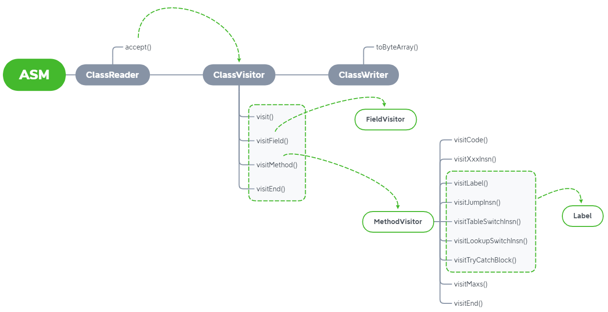

# ClassReader

`ClassWriter`用于生成字节码文件，而`ClassReader`用于读取字节码文件

配合字节码文件的结构去理解

```
ClassFile {
    u4             magic;
    u2             minor_version;
    u2             major_version;
    u2             constant_pool_count;
    cp_info        constant_pool[constant_pool_count-1];
    u2             access_flags;
    u2             this_class;
    u2             super_class;
    u2             interfaces_count;
    u2             interfaces[interfaces_count];
    u2             fields_count;
    field_info     fields[fields_count];
    u2             methods_count;
    method_info    methods[methods_count];
    u2             attributes_count;
    attribute_info attributes[attributes_count];
}
```

```java
/* 
A parser to make a ClassVisitor visit a ClassFile structure, as defined in the Java Virtual Machine Specification (JVMS). This class parses the ClassFile content and calls the appropriate visit methods of a given ClassVisitor for each field, method and bytecode instruction encountered.
*/
public class ClassReader {
    // A byte array containing the JVMS ClassFile structure to be parsed.
    final byte[] classFileBuffer;
    // The offset in bytes, in classFileBuffer, of each cp_info entry of the ClassFile's constant_pool array, plus one
    private final int[] cpInfoOffsets;
    // The offset in bytes of the ClassFile's access_flags field.
    public final int header;

    public ClassReader(final byte[] classFile) {
        this(classFile, 0, classFile.length);
    }

    public ClassReader(final String className) throws IOException {
        this(
            readStream(
                ClassLoader.getSystemResourceAsStream(className.replace('.', '/') + ".class"), true));
    }
}
```

* `classFileBuffer`：读取到的字节码数据
* `cpInfoOffsets`：字节码中的常量池（constant pool）的位置
* `header`：字节码的访问标识符的位置

构造器读取字节码后，会根据class文件的结构填充这几个字段。

用`ClassReader`读取如下类的基本信息：

```java
package sample;

import java.io.Serializable;

public class HelloWorld extends Exception implements Serializable, Cloneable {
}
```

```java
ClassReader cr = new ClassReader("sample.HelloWorld");

System.out.println("access: " + cr.getAccess());
System.out.println("className: " + cr.getClassName());
System.out.println("superName: " + cr.getSuperName());
System.out.println("interfaces: " + Arrays.toString(cr.getInterfaces()));
```

> access: 33
>
> className: sample/HelloWorld
>
> superName: java/lang/Exception
>
> interfaces: [java/io/Serializable, java/lang/Cloneable]

`ClassReader`提供一个`access`方法来让`ClassVisitor`*访问*字节码文件

```java
/*
Makes the given visitor visit the JVMS ClassFile structure passed to the constructor of this ClassReader.
*/
public void accept(final ClassVisitor classVisitor, final int parsingOptions)
```

第二个参数`parsingOptions` 可选值有以下5个，会对`ClassVisitor`的visit行为造成不同的影响

- `0`：生成所有ASM代码
- `ClassReader.SKIP_CODE`：忽略代码信息，如`visitXxxInsn`调用
- `ClassReader.SKIP_DEBUG`：忽略调试信息，如`visitParameter`、`visitLineNumber`、`visitLocalVariable`
- `ClassReader.SKIP_FRAMES`：忽略frame信息，如`visitFrame`
- `ClassReader.EXPAND_FRAMES`：对frame信息进行扩展

使用`ClassReader.SKIP_DEBUG | ClassReader.SKIP_FRAMES`能得到功能完整，复杂度低的字节码文件

修改字节码文件的流程如下：



`ClassReader`是旧字节码的入口，`ClassWriter`是新字节码的出口，中间可以有多个`ClassVisitor`来修改字节码。代码结构如下：

```java
ClassReader cr = new ClassReader("classfile");
ClassWriter cw = new ClassWriter(ClassWriter.COMPUTE_FRAMES);
ClassVisitor cv = new ClassVisitor(Opcodes.ASM9, cw) {
    // TODO
};
cr.accept(cv, ClassReader.SKIP_DEBUG | ClassReader.SKIP_FRAMES);
cw.toByteArray();
```

`ClassVisitor`是抽象类，将上面的cv替换为我们自定义的`ClassVisitor`子类即可

# Best Practice

## Modify Class Meta Data

重写`visit`方法

```java
import org.objectweb.asm.ClassVisitor;

public class InterfaceVisitor extends ClassVisitor {
    public InterfaceVisitor(int api, ClassVisitor classVisitor) {
        super(api, classVisitor);
    }

    @Override
    public void visit(int version, int access, String name, String signature, String superName, String[] interfaces) {
        super.visit(version, access, name, signature, superName, new String[]{"java/lang/Serializable"});
    }
}
```

修改了`visit`的`interfaces`参数，同样其他参数也可以修改。如修改Java版本`version`，类名`name`，父类`superName`

## Modify Class Field

重写`visitField`方法

### Remove Field

```java
public class FieldDelVisitor extends ClassVisitor {
    private final String fieldName;
    private final String fieldDesc;

    public FieldDelVisitor(int api, ClassVisitor classVisitor, String fieldName, String fieldDesc) {
        super(api, classVisitor);
        this.fieldName = fieldName;
        this.fieldDesc = fieldDesc;
    }

    @Override
    public FieldVisitor visitField(int access, String name, String descriptor, String signature, Object value) {
        if (name.equals(fieldName) && descriptor.equals(fieldDesc)) {
            return null;
        }
        return super.visitField(access, name, descriptor, signature, value);
    }
}
```

正常情况下`ClassVisitor#visitField`会返回一个`FieldVisitor`对象，最后会调用其`fv.visitEnd`，返回null就断掉了

### Add Field

同样，想要添加新字段，只需再调用一次`ClassVisitor#visitField`，再调用`fv.visitEnd`

但需要思考一下在哪里进行字段插入的操作。

一个类有几个字段就会执行几次`visitField`，若要在这里插入还需设置一个全局标志位来判断新字段是否插入，否则后面的`visitField`会造成重复插入。

`visitEnd`最后调用一次，是个不错的选择，就在这插入新字段。

```java
public class FieldAddVisitor extends ClassVisitor {
    private final String fieldName;
    private final String fieldDesc;
    private final int fieldAccess;
    private final Object fieldValue;

    public FieldAddVisitor(int api, ClassVisitor classVisitor, String fieldName, String fieldDesc, int fieldAccess, Object fieldValue) {
        super(api, classVisitor);
        this.fieldName = fieldName;
        this.fieldDesc = fieldDesc;
        this.fieldAccess = fieldAccess;
        this.fieldValue = fieldValue;
    }

    @Override
    public FieldVisitor visitField(int access, String name, String descriptor, String signature, Object value) {
        return super.visitField(access, name, descriptor, signature, value);
    }

    @Override
    public void visitEnd() {
        FieldVisitor fv = super.visitField(fieldAccess, fieldName, fieldDesc, null, fieldValue);
        fv.visitEnd();
        super.visitEnd();
    }
}
```

## Modify Class Method

重写`MethodDelVisitor`方法

### Remove Method

和上面删除字段的思路一样。

```java
public class MethodDelVisitor extends ClassVisitor {
    private final String methodName;
    private final String methodDesc;

    public MethodDelVisitor(int api, ClassVisitor classVisitor, String methodName, String methodDesc) {
        super(api, classVisitor);
        this.methodName = methodName;
        this.methodDesc = methodDesc;
    }

    @Override
    public MethodVisitor visitMethod(int access, String name, String descriptor, String signature, String[] exceptions) {
        if (name.equals(methodName) && descriptor.equals(methodDesc)) {
            return null;
        }
        return super.visitMethod(access, name, descriptor, signature, exceptions);
    }
}
```

### Add Method

```java
public abstract class MethodAddVisitor extends ClassVisitor {
    private final String methodName;
    private final String methodDesc;
    private final int methodAccess;

    public MethodAddVisitor(int api, ClassVisitor classVisitor, String methodName, String methodDesc, int methodAccess) {
        super(api, classVisitor);
        this.methodName = methodName;
        this.methodDesc = methodDesc;
        this.methodAccess = methodAccess;
    }

    @Override
    public MethodVisitor visitMethod(int access, String name, String descriptor, String signature, String[] exceptions) {
        return super.visitMethod(access, name, descriptor, signature, exceptions);
    }

    @Override
    public void visitEnd() {
        MethodVisitor mv = super.visitMethod(methodAccess, methodName, methodDesc, null, null);
        generateMethodBody(mv);
        super.visitEnd();
    }

    protected abstract void generateMethodBody(MethodVisitor mv);
}
```

```java
ClassVisitor cv = new MethodAddVisitor(ASM9, cw, "mul", "(II)I", ACC_PUBLIC) {
    @Override
    protected void generateMethodBody(MethodVisitor mv) {
        mv.visitVarInsn(ILOAD, 1);
        mv.visitVarInsn(ILOAD, 2);
        mv.visitInsn(IMUL);
        mv.visitInsn(IRETURN);
        mv.visitMaxs(0, 0);
        mv.visitEnd();
    }
};
```

### Update Method

#### enter & exit

如何在方法进入和退出时添加一些逻辑呢？

回想`MethodVisitor`的调用顺序

`visitCode`(方法体开始) -> `visitXxxIns`(方法体) -> `visitMaxs` -> `visitEnd`

方法进入时的逻辑可以在`visitCode`处添加，此时尚未进入方法体。但注意调用`visitMaxs`时已经退出方法体了，可能执行了return或throw异常，两种情况都是通过`visitInsn(opcode)`实现的，所以方法退出的逻辑可以在`visitInsn`处添加。

```java
public class MethodInOutVisitor extends ClassVisitor {
    private final String methodName;
    private final String methodDesc;

    public MethodInOutVisitor(int api, ClassVisitor classVisitor, String methodName, String methodDesc) {
        super(api, classVisitor);
        this.methodName = methodName;
        this.methodDesc = methodDesc;
    }

    @Override
    public MethodVisitor visitMethod(int access, String name, String descriptor, String signature, String[] exceptions) {
        MethodVisitor mv = super.visitMethod(access, name, descriptor, signature, exceptions);
        if (name.equals(methodName) && descriptor.equals(methodDesc)) {
            mv = new MethodExitAdapter(api, mv);
        }
        return mv;
    }

    private static class MethodExitAdapter extends MethodVisitor {
        public MethodExitAdapter(int api, MethodVisitor methodVisitor) {
            super(api, methodVisitor);
        }

        @Override
        public void visitCode() {
            super.visitFieldInsn(GETSTATIC, "java/lang/System", "out", "Ljava/io/PrintStream;");
            super.visitLdcInsn("Method Enter...");
            super.visitMethodInsn(INVOKEVIRTUAL, "java/io/PrintStream", "println", "(Ljava/lang/String;)V", false);

            super.visitCode();
        }

        @Override
        public void visitInsn(int opcode) {
            if(opcode == ATHROW || (opcode >= IRETURN && opcode <= RETURN)) {
                super.visitFieldInsn(GETSTATIC, "java/lang/System", "out", "Ljava/io/PrintStream;");
                super.visitLdcInsn("Method Exit...");
                super.visitMethodInsn(INVOKEVIRTUAL, "java/io/PrintStream", "println", "(Ljava/lang/String;)V", false);
            }

            super.visitInsn(opcode);
        }
    }
}
```

`visitMethod`中判断当前方法名和方法描述符是否为目标方法，是则返回自定义的`MethodVisitor`。`visitInsn`判断当前`opcode`是否为throw或return

#### AdviceAdapter

ASM提供了一个抽象类来实现在方法进入前后添加逻辑，它有两个方法`onMethodEnter`和`onMethodExit`

```java
/*
Generates the "before" advice for the visited method. The default implementation of this method does nothing. Subclasses can use or change all the local variables, but should not change state of the stack. This method is called at the beginning of the method or after super class constructor has been called (in constructors).
*/
protected void onMethodEnter() {}

/*
Generates the "after" advice for the visited method. The default implementation of this method does nothing. Subclasses can use or change all the local variables, but should not change state of the stack. This method is called at the end of the method, just before return and athrow instructions. The top element on the stack contains the return value or the exception instance. For example:
  public void onMethodExit(final int opcode) {
    if (opcode == RETURN) {
      visitInsn(ACONST_NULL);
    } else if (opcode == ARETURN || opcode == ATHROW) {
      dup();
    } else {
      if (opcode == LRETURN || opcode == DRETURN) {
        dup2();
      } else {
        dup();
      }
      box(Type.getReturnType(this.methodDesc));
    }
    visitIntInsn(SIPUSH, opcode);
    visitMethodInsn(INVOKESTATIC, owner, "onExit", "(Ljava/lang/Object;I)V");
  }
 
  // An actual call back method.
  public static void onExit(final Object exitValue, final int opcode) {
    ...
  }
*/
protected void onMethodExit(final int opcode) {}
```

```java
import org.objectweb.asm.ClassVisitor;
import org.objectweb.asm.MethodVisitor;
import org.objectweb.asm.Type;
import org.objectweb.asm.commons.AdviceAdapter;

public class MethodAroundVisitor extends ClassVisitor {
    private final String methodName;
    private final String methodDesc;

    public MethodAroundVisitor(int api, ClassVisitor classVisitor, String methodName, String methodDesc) {
        super(api, classVisitor);
        this.methodName = methodName;
        this.methodDesc = methodDesc;
    }

    @Override
    public MethodVisitor visitMethod(int access, String name, String descriptor, String signature, String[] exceptions) {
        MethodVisitor mv = super.visitMethod(access, name, descriptor, signature, exceptions);
        if (name.equals(methodName) && descriptor.equals(methodDesc)) {
            mv = new MethodAroundAdapter(api, mv, access, name, descriptor);
        }
        return mv;
    }

    private static class MethodAroundAdapter extends AdviceAdapter {
        protected MethodAroundAdapter(int api, MethodVisitor methodVisitor, int access, String name, String descriptor) {
            super(api, methodVisitor, access, name, descriptor);
        }

        private void hello(String s){
            super.visitFieldInsn(GETSTATIC, "java/lang/System", "out", "Ljava/io/PrintStream;");
            super.visitLdcInsn(s);
            super.visitMethodInsn(INVOKEVIRTUAL, "java/io/PrintStream", "println", "(Ljava/lang/String;)V", false);
        }

        @Override
        protected void onMethodEnter() {
            hello("Method Enter...");
        }

        @Override
        protected void onMethodExit(int opcode) {
            if (opcode == ATHROW) {
                super.visitLdcInsn("abnormal return");
            }
            else if (opcode == RETURN) {
                super.visitLdcInsn("return void");
            }
            else if (opcode == ARETURN) {
                dup();
            }
            else {
                if (opcode == LRETURN || opcode == DRETURN) {
                    dup2();
                }
                else {
                    dup();
                }
                box(Type.getReturnType(this.methodDesc));
            }
            hello("Method Exit...");
        }
    }
}
```

# The End

暂时到这吧，后面有需要再回过来补充。