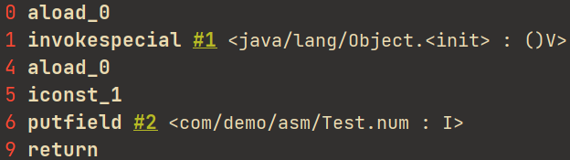
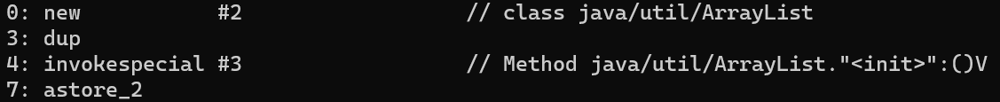

# Class ByteCode

在字节码中，所有变量和方法都是以符号引用的形式保存在class文件的常量池中。字节码被类加载器加载后，class文件中的常量池会被加载到方法区的运行时常量池，动态链接会将运行时常量池中的符号引用转化为调用方法的直接引用。

（IDEA配合`jclasslib Bytecode Viewer`来查看字节码）

以下面这个类为例子

```java
package com.demo.asm;

public class Test {
    private int num = 1;
    public static int NUM = 100;

    public int func(int a, int b) {
        return add(a, b);
    }

    public int add(int a, int b) {
        return a + b + num;
    }

    public int sub(int a, int b) {
        return a - b - NUM;
    }
}
```

`javap -c Test.class`

> javap 是 Java Class文件分解器，可以用于反编译，也可以用于查看字节码
>
> `-c`输出类中的所有方法以及字节码信息

```assembly
public class com.demo.asm.Test {
  public static int NUM;

  public com.demo.asm.Test();
    Code:
       0: aload_0
       1: invokespecial #1                  // Method java/lang/Object."<init>":()V
       4: aload_0
       5: iconst_1
       6: putfield      #2                  // Field num:I
       9: return

  public int func(int, int);
    Code:
       0: aload_0
       1: iload_1
       2: iload_2
       3: invokevirtual #3                  // Method add:(II)I
       6: ireturn

  public int add(int, int);
    Code:
       0: iload_1
       1: iload_2
       2: iadd
       3: aload_0
       4: getfield      #2                  // Field num:I
       7: iadd
       8: ireturn

  public int sub(int, int);
    Code:
       0: iload_1
       1: iload_2
       2: isub
       3: getstatic     #4                  // Field NUM:I
       6: isub
       7: ireturn

  static {};
    Code:
       0: bipush        100
       2: putstatic     #4                  // Field NUM:I
       5: return
}
```

主要看一下莫名其妙生成出来的构造方法



* 左边的数字表示每个指令的偏移量，保存在PC程序计数器中
* 中间为JVM指令的助记符

* 右边的`#1、#2`表示操作数

JVM的栈帧中存储如下内容

* 局部变量（Local Variables）
* 操作数栈/表达式栈（Operand Stack）
* 动态链接（Dynamic Linking）指向运行时常量池的方法引用
* 方法返回地址（Return Address）

在讲解指令之前先了解一下局部变量表

JVM会为每个方法分配对应的局部变量表。局部变量表也称为局部变量数组或本地变量表，定义为一个数字数组，每个slot存储方法参数和定义在方法体内的局部变量。如果方法为实例方法，则第一个slot为this指针，若是静态方法则没有。

* 0 aload_0

  aload_x 从局部变量表的相应位置x装载一个对象引用到操作数栈的栈顶

  aload_0表示把第0个引用类型本地变量（即this指针）推送到操作数栈顶

  > a代表对象引用
  >
  > 还有其他用于用于装载非对象引用的指令
  >
  > iload、lload、fload、dload（i=int、l=long、f=float、d=double）
  >
  > 对应aload还有astore，将操作数栈栈顶元素放入局部变量表

* 1 invokespecial #1

  弹栈并执行#1的方法

  调用构造函数，这里调用了父类的构造器（#1符号引用指向对应的init方法）

  （`()V`表示返回void，参数为空）

* 5 iconst_1

  将int型常量1推送至栈顶

* 6 putfield

  接受一个操作数，这个操作数引用的是运行时常量池里的一个字段，这里为num（即#2符号引用）。putfield会弹出栈顶两个值，即更新this的num字段为常量1。

可以看出JVM执行字节码的流程和CPU执行机器码的步骤一样，均为取指译码执行

> 方法调用指令
>
> * invokestatic：调用静态方法
> * invokespecial：
>   * 调用实例构造方法
>   * 调用私有方法
>   * 调用父类方法
> * invokeinterface：调用接口方法
> * invokevirtual：调用虚方法（除上面三种情况之外的方法，如调用对象方法）
> * invokedynamic：Lambda的原理

现在再看下面完整的字节码应该就不成问题了。

* `javac -g Test.java`  （`-g`生成局部变量）
* `javap -verbose Test.class`

> -verbose 显示详细信息，输出栈大小，方法参数的个数

```assembly
public class com.demo.asm.Test
  minor version: 0
  major version: 52
  flags: ACC_PUBLIC, ACC_SUPER
Constant pool:
   #1 = Methodref          #6.#26         // java/lang/Object."<init>":()V
   #2 = Fieldref           #5.#27         // com/demo/asm/Test.num:I
   #3 = Methodref          #5.#28         // com/demo/asm/Test.add:(II)I
   #4 = Fieldref           #5.#29         // com/demo/asm/Test.NUM:I
   #5 = Class              #30            // com/demo/asm/Test
   #6 = Class              #31            // java/lang/Object
   #7 = Utf8               num
   #8 = Utf8               I
   #9 = Utf8               NUM
  #10 = Utf8               <init>
  #11 = Utf8               ()V
  #12 = Utf8               Code
  #13 = Utf8               LineNumberTable
  #14 = Utf8               LocalVariableTable
  #15 = Utf8               this
  #16 = Utf8               Lcom/demo/asm/Test;
  #17 = Utf8               func
  #18 = Utf8               (II)I
  #19 = Utf8               a
  #20 = Utf8               b
  #21 = Utf8               add
  #22 = Utf8               sub
  #23 = Utf8               <clinit>
  #24 = Utf8               SourceFile
  #25 = Utf8               Test.java
  #26 = NameAndType        #10:#11        // "<init>":()V
  #27 = NameAndType        #7:#8          // num:I
  #28 = NameAndType        #21:#18        // add:(II)I
  #29 = NameAndType        #9:#8          // NUM:I
  #30 = Utf8               com/demo/asm/Test
  #31 = Utf8               java/lang/Object
{
  public static int NUM;
    descriptor: I
    flags: ACC_PUBLIC, ACC_STATIC

  public com.demo.asm.Test();
    descriptor: ()V
    flags: ACC_PUBLIC
    Code:
      stack=2, locals=1, args_size=1
         0: aload_0
         1: invokespecial #1                  // Method java/lang/Object."<init>":()V
         4: aload_0
         5: iconst_1
         6: putfield      #2                  // Field num:I
         9: return
      LineNumberTable:
        line 3: 0
        line 4: 4
      LocalVariableTable:
        Start  Length  Slot  Name   Signature
            0      10     0  this   Lcom/demo/asm/Test;

  public int func(int, int);
    descriptor: (II)I
    flags: ACC_PUBLIC
    Code:
      stack=3, locals=3, args_size=3
         0: aload_0
         1: iload_1
         2: iload_2
         3: invokevirtual #3                  // Method add:(II)I
         6: ireturn
      LineNumberTable:
        line 8: 0
      LocalVariableTable:
        Start  Length  Slot  Name   Signature
            0       7     0  this   Lcom/demo/asm/Test;
            0       7     1     a   I
            0       7     2     b   I

  public int add(int, int);
    descriptor: (II)I
    flags: ACC_PUBLIC
    Code:
      stack=2, locals=3, args_size=3
         0: iload_1
         1: iload_2
         2: iadd
         3: aload_0
         4: getfield      #2                  // Field num:I
         7: iadd
         8: ireturn
      LineNumberTable:
        line 12: 0
      LocalVariableTable:
        Start  Length  Slot  Name   Signature
            0       9     0  this   Lcom/demo/asm/Test;
            0       9     1     a   I
            0       9     2     b   I

  public int sub(int, int);
    descriptor: (II)I
    flags: ACC_PUBLIC
    Code:
      stack=2, locals=3, args_size=3
         0: iload_1
         1: iload_2
         2: isub
         3: getstatic     #4                  // Field NUM:I
         6: isub
         7: ireturn
      LineNumberTable:
        line 16: 0
      LocalVariableTable:
        Start  Length  Slot  Name   Signature
            0       8     0  this   Lcom/demo/asm/Test;
            0       8     1     a   I
            0       8     2     b   I

  static {};
    descriptor: ()V
    flags: ACC_STATIC
    Code:
      stack=1, locals=0, args_size=0
         0: bipush        100
         2: putstatic     #4                  // Field NUM:I
         5: return
      LineNumberTable:
        line 5: 0
}
SourceFile: "Test.java"
```

* new指令

```java
java.util.List<String> cmds = new java.util.ArrayList<String>();
```

new指令后面都会跟着一个dup指令，再跟着一个invokespecial指令，再用astore存储对象引用到局部变量表



new：创建一个对象，并将其引用值入栈

dup：复制栈顶值并将栈顶值入栈

invokespecial：调用实例初始化方法，需要从操作数栈弹出一个this引用

astore：将操作数栈顶元素弹出，放入局部变量表。

可知要把new一个对象并把它的引用放入局部变量表，需要弹栈两次，因此才多了dup指令

# CheatSheet

* ldc: 将int、float、或者一个类、方法类型或方法句柄的符号引用、String型常量值从常量池中推送至栈顶
* iconst: -1~5的int数值常量入栈
* bipush: -128~127的int数值常量入栈
* ifeq：当栈顶int类型数值等于0时跳转
* ifne：当栈顶int类型数值不等于0时跳转
* iflt：当栈顶int类型数值小于0时跳转
* ifle：当栈顶int类型数值小于等于0时跳转
* ifgt：当栈顶int类型数值大于0时跳转
* ifge：当栈顶int类型数值大于等于0时跳转
* ifnull：为null时跳转
* ifnonnull：不为null时跳转

# Reference

[Java 进阶之字节码剖析_CSDN博客](https://blog.csdn.net/Chenhui98/article/details/126740433)
