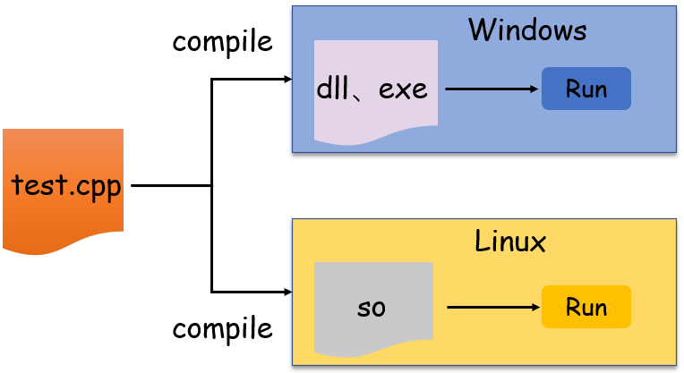
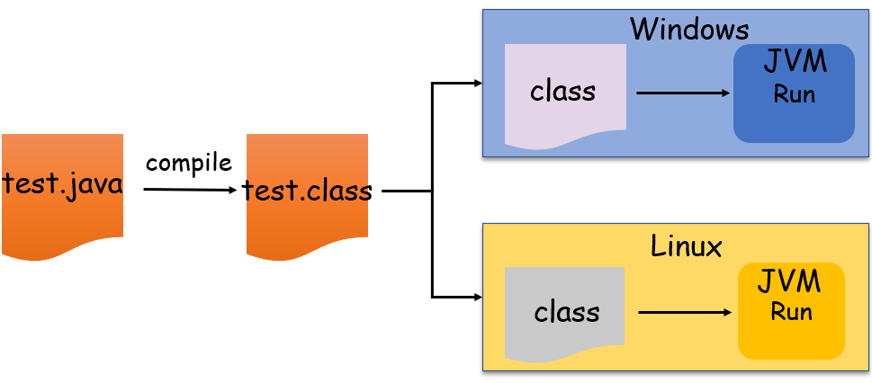
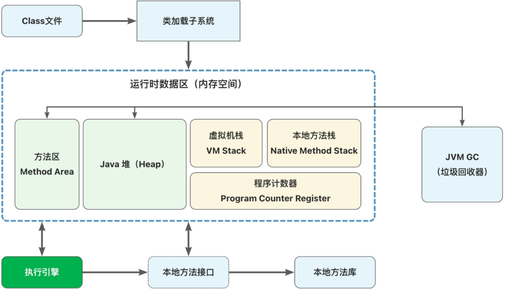
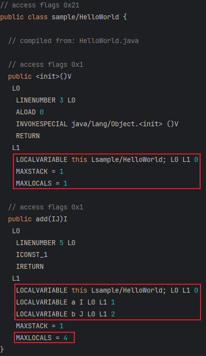

# 0x01 JVM Intro

Java是一门**面向对象、静态类型**的语句，具有跨平台的特点，“一次编译、到处运行”

对于C++等编译型语言来说，它们被直接翻译成机器语言指令。而对于JAVA来说，首先由编译器将源代码编译成字节码，在运行时由JVM解释成机器指令来执行，JVM屏蔽了OS的差异





~~学过计组的都知道~~ 指令集架构ISA分为**基于栈的指令集架构**和**基于寄存器的指令集架构**

JVM属于前者，基于栈的指令能够更好实现跨平台，因为栈是在内存中分配的。而寄存器往往与硬件挂钩，不同的硬件架构不一样，不利于跨平台。

JVM针对每个操作系统开发其对应的解释器，只要操作系统上有对应的JVM，那么class文件就能在上面运行起来，做到一次编译、到处运行

# 0x02 JVM LifeCycle

JVM随着Java程序的运行而运行，随着程序的结束而结束

一个Java程序对应一个JVM进程

JVM的线程分为两种

* 守护线程：JVM自己使用的线程，如垃圾回收GC
* 普通线程：Java程序的线程

只要JVM中有普通线程在执行，JVM进程就不会停止

我们下载Java的时候是下载的JDK，JDK是面向开发人员使用的SDK，提供了Java的开发工具和运行环境，JDK中包含了JRE，JRE即Java的运行环境，JVM包含在JRE中

# 0x03 JVM Architecture



## Class File

class文件由Java编译器生成，`.java -> .class`

其存储的不是操作系统可以直接识别的二进制代码，而是根据Java虚拟机规范所定义的指令集、符号表等信息。

## ClassLoader

JVM默认提供三个类加载器

* `Bootstrap Classloader`：启动类加载器，**负责加载JDK的核心类库，如rt.jar、resource.jar、charset.jar**
* `Extension Classloader`：扩展类加载器，负责加载扩展类库，默认加载`$JAVA_HOME`下的`jre/lib/*.jar`或`-Djava.ext.dirs`指定目录下的jar包
* `App Classloader`：系统类加载器，**负责加载应用程序`classpath`目录下的所有jar和class文件**

除了启动类加载器，另外两个继承自`java.lang.ClassLoader`

可以看看[Java双亲委派模型](../Foundation/Parents_Delegate.md)

## Method Area

方法区存储JVM加载完成的类型信息、常量、静态变量等

方法区和堆区一样，都是线程共享的内存区域

类型信息包括如下

* full type name
* full superclass name
* class or interface
* list of superclass's interfaces
* modifier
* Fields
* Methods
* A reference to class Classloader
* A reference to class Class
* constant pool for the type

## Java Heap

堆区负责存放对象实例，当Java创建一个**类的实例对象或数组**时，都会在堆中为新对象分配内存。JVM中只有一个堆，程序所有线程都共享堆。堆的内存资源回收由JVM GC管理

## JVM Stack

栈区只保存**基础数据类型和对象的引用**

栈内创建的基本类型数据超出其作用域后会被自动释放掉，不由JVM GC管理

而在栈内创建的引用类型实例，依然由JVM GC管理

当一个线程创建运行时，与之对应的栈就创建了，每个栈中的数据都是私有的，其他线程不能访问。

每个线程对应一个栈（JVM stack），每个栈包含若干栈帧（stack frame），每个栈帧对应着每个方法的每次调用

当调用一个新的方法时，就会在JVM Stack上分配一个frame空间（入栈）；当方法退出时，相应的frame空间也会在JVM Stack上被清除（出栈）

栈帧包含三个部分

* 局部变量区（基本类型变量、对象实例的引用）
* 操作数栈区（存放执行过程产生的中间结果）
* 运行环境区

局部变量区local variable是一个数组，索引从0开始

操作数栈区operand stack是一个栈结构，遵循后进先出LIFO

在编译的时候，local variable和operand stack的空间大小就被确定下来了

在运行时，local variable和operand stack上存放的数据会随着方法的执行而不断发生变化

在方法刚开始调用时，operand stack为空，不存储任何数据，而local variable的状态就由当前方法决定了

* 非静态方法：local variable索引0处存储`this`变量
* 方法参数：`long`和`double`占用local variable的两个slot，其他类型占用一个slot

以下面的类为例，使用`ASM Bytecode Viewer`查看

```java
package sample;

public class HelloWorld {
    public int add(int a, long b) {
        return 1;
    }
}
```



可以看到MAXSTACK和MAXLOCALS这时候已经确定了。

## Native Method Stack

JVM Stack执行的是Java Method，而本地方法栈执行的是Native Method，本地方法不是使用Java语言编写的，而是由C或其他语言编写的，不由JVM运行。

可以看看[JNI](../Foundation/jni.md)

## PC

JVM架构中，字节码解释器工作时就是通过改变程序计数器的值来决定下一条要执行的字节码指令。JVM的多线程是通过线程轮流切换并分配处理器执行时间的方式来实现的，所以**每个线程都有一个独立的程序计数器**

# 0x04 Constant Pool

我们说的常量池一般有三种

## class常量池

Java代码编译后生成Class文件，里面的常量池保存着字面量、符号引用等信息，JVM把Class文件加载后，Class常量池里的内容会被存放到运行时常量池

## 运行时常量池

运行时常量池是方法区的一部分，存储着基本类型的数据和对象的引用

## 字符串常量池

字符串由一个`char[]`构成，当Java程序里频繁出现相同字面量的代码时，重复的创建和销毁对象是非常浪费资源的（JDK7之后字符串常量池从方法区迁移到堆区）

```java
String str = "test"
```

当运行上面代码时，JVM会到字符串常量池查找"test"这个字面量对象是否存在

若存在直接返回该对象的引用，若不存在则创建一个对象，并返回其引用

而当使用`new String()`来构造字符串对象时，不管字符串常量池是否有这个对象，都会重新创建一个字符串对象

```java
String str1 = "test";
String str2 = "test";
System.out.println(str1 == str2);  // true
String str3 = new String("test");
System.out.println(str1 == str3); // false
```

# Reference

[Java JVM 运行机制及基本原理 - 知乎 (zhihu.com)](https://zhuanlan.zhihu.com/p/25713880)