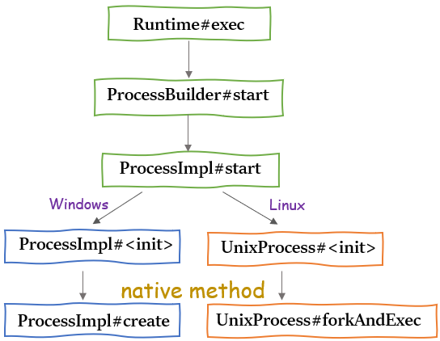
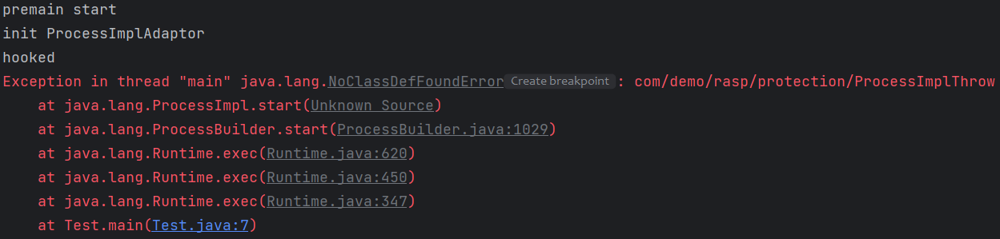
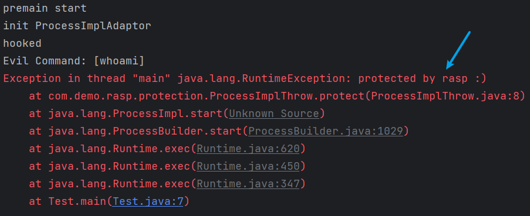
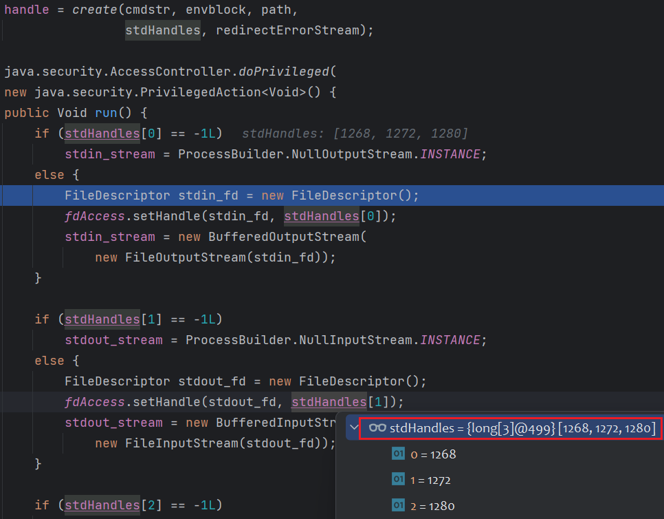
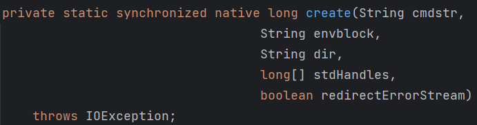
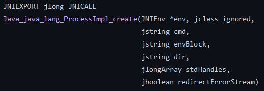
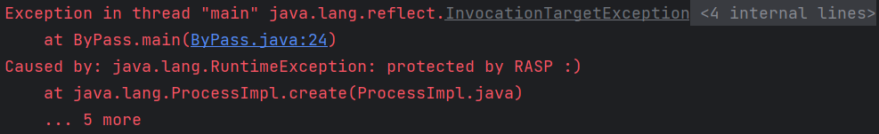
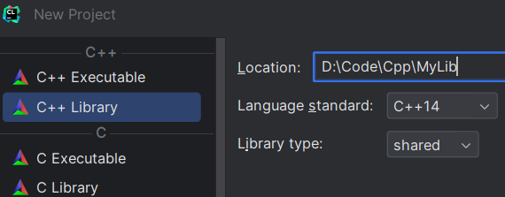

# Preface

Rasp的大概原理就是，利用Java Agent插桩技术，在JVM加载特定字节码前进行hook，或者重新加载某个类的字节码，对字节码进行修改，在敏感函数执行前添加安全检测的逻辑。

因此重点就放在了类和函数的hook点。

在实际应用中，还得考虑如下因素：

* Rasp对源程序性能的影响
* 插桩后源程序是否还能正常稳定运行
* Rasp依赖与原项目依赖的冲突

# Rasp Against Command Execution

本篇尝试实现一个简易的RASP来防御命令执行。

回忆Java中命令执行的调用链：

> java.lang.Runtime#exec
>
> ​		-> java.lang.ProcessBuilder#start
>
> ​				-> java.lang.ProcessImpl#start
>
> ​					-> ProcessImpl#<init>
>
> ​						-> native create

对于Windows和Linux系统，最终的调用类不同，但最后都会执行到native方法



为屏蔽操作系统差异，我们这里hook点瞄在`ProcessImpl#start`处。当然攻击者可以通过调用更底层的方法来绕过。

## premain

Java程序启动时就加载了`java.lang.ProcessImpl`类，通过premain来hook这个类。(agent main也行|retransformClasses重新加载这个类)

```java
package com.demo.rasp.agent;

import com.demo.rasp.transformer.RaspTransformer;

import java.lang.instrument.ClassFileTransformer;
import java.lang.instrument.Instrumentation;

public class RaspAgent {
    public static void premain(String agentArgs, Instrumentation inst) {
        System.out.println("premain start");
        ClassFileTransformer transformer = new RaspTransformer();
        inst.addTransformer(transformer, true);
    }
}
```

```java
package com.demo.rasp.transformer;

import com.demo.rasp.adpator.ProcessImplAdaptor;
import static org.objectweb.asm.Opcodes.*;
import org.objectweb.asm.ClassReader;
import org.objectweb.asm.ClassVisitor;
import org.objectweb.asm.ClassWriter;
import java.lang.instrument.ClassFileTransformer;
import java.security.ProtectionDomain;

public class RaspTransformer implements ClassFileTransformer {
    @Override
    public byte[] transform(ClassLoader loader, String className, Class<?> classBeingRedefined, ProtectionDomain protectionDomain, byte[] classfileBuffer) {
        if (className.equals("java/lang/ProcessImpl")) {
            ClassReader cr = new ClassReader(classfileBuffer);
            ClassWriter cw = new ClassWriter(ClassWriter.COMPUTE_FRAMES);
            ClassVisitor cv = new ProcessImplAdaptor(ASM9, cw);
            cr.accept(cv, ClassReader.SKIP_DEBUG | ClassReader.EXPAND_FRAMES);
            return cw.toByteArray();
        }
        return classfileBuffer;
    }
}
```

实现了一个ClassFileTransformer的子类。addTransformer方法配置之后，后续的类加载都会被Transformer拦截，在`transform`方法中对字节码进行修改后再返回。判断当前类名是否为`java/lang/ProcessImpl`(注意这里已经是字节码层面的了，所以类名格式是`Internal Name`)。修改字节码的步骤在前面ASM已经介绍过了。

## transformation

根据`ProcessImpl#start`的方法名和方法描述符来hook（`ProcessImpl`就只有这一个start方法，没有重载方法，也可以不判断方法描述符）

```java
static Process start(String cmdarray[],
                     java.util.Map<String,String> environment,
                     String dir,
                     ProcessBuilder.Redirect[] redirects,
                     boolean redirectErrorStream)
```

```java
package com.demo.rasp.adpator;

import org.objectweb.asm.ClassVisitor;
import org.objectweb.asm.MethodVisitor;
import org.objectweb.asm.commons.AdviceAdapter;
import static org.objectweb.asm.Opcodes.*;

public class ProcessImplAdaptor extends ClassVisitor {
    public ProcessImplAdaptor(int api, ClassVisitor classVisitor) {
        super(api, classVisitor);
        System.out.println("init ProcessImplAdaptor");
    }

    @Override
    public MethodVisitor visitMethod(int access, String name, String descriptor, String signature, String[] exceptions) {
        if (name.equals("start") &&
                descriptor.equals("([Ljava/lang/String;Ljava/util/Map;Ljava/lang/String;[Ljava/lang/ProcessBuilder$Redirect;Z)Ljava/lang/Process;")) {
            System.out.println("hooked");
            MethodVisitor mv = super.visitMethod(access, name, descriptor, signature, exceptions);
            return new AdviceAdapter(ASM9, mv, access, name, descriptor) {
                @Override
                protected void onMethodEnter() {
                    mv.visitVarInsn(ALOAD, 0);
                    super.visitMethodInsn(INVOKESTATIC, "com/demo/rasp/protection/ProcessImplThrow", "protect", "([Ljava/lang/String;)V", false);
                }
            };
        }
        return super.visitMethod(access, name, descriptor, signature, exceptions);
    }
}
```

`ProcessImpl#start`是静态方法，局部变量表里第一个(0号索引)存的为方法的第一个参数，即待执行的命令。

`aload_0`将其入栈，到这就获取到执行的命令。为方便处理，这里调用了自己写的一个类的方法。

```java
package com.demo.rasp.protection;

import java.util.Arrays;

public class ProcessImplThrow {
    public static void protect(String[] cmd) {
        System.out.println("Evil Command: " + Arrays.toString(cmd));
        throw new RuntimeException("protected by rasp :)");
    }
}
```

打印命令并抛出异常。

## package

接着将这个项目打成jar包。这里用到了`maven-assembly-plugin`插件，方便把maven依赖也打进jar包，并指定`manifest`

```xml
<build>
    <plugins>
        <plugin>
            <groupId>org.apache.maven.plugins</groupId>
            <artifactId>maven-assembly-plugin</artifactId>
            <version>3.3.0</version>
            <configuration>
                <archive>
                    <manifestEntries>
                        <Premain-Class>com.demo.rasp.agent.RaspAgent</Premain-Class>
                        <Can-Redefine-Classes>true</Can-Redefine-Classes>
                        <Can-Retransform-Classes>true</Can-Retransform-Classes>
                    </manifestEntries>
                </archive>
                <descriptorRefs>
                    <descriptorRef>jar-with-dependencies</descriptorRef>
                </descriptorRefs>
            </configuration>
            <executions>
                <execution>
                    <id>make-assembly</id>
                    <phase>package</phase>
                    <goals>
                        <goal>single</goal>
                    </goals>
                </execution>
            </executions>
        </plugin>
    </plugins>
</build>
```

## verification

接着新建一个工程来验证我们的rasp jar包是否能正常运作

```java
import java.io.IOException;

public class Test {
    public static void main(String[] args) throws IOException {
        Runtime.getRuntime().exec("calc");
    }
}
```

添加VM Options，`-javaagent:path\Rasp-1-jar-with-dependencies.jar`

这时候兴冲冲地去运行，却被狠狠打了一脸



`NoClassDefFoundError`👺 What the hell?

hook到方法了，就是修改字节码时出错了，找不到我们自定义的`ProcessImplThrow`类

但为什么`ProcessImplAdaptor`不会报这个错?o.O

根据以往的经验，`NoClassDefFoundError`是字节码找到了，但加载时出错了。

先看看通过`-javaagent`注入进去的类的类加载器是什么

在premain和main中分别添加如下打印语句

```java
// premain
System.out.println(Class.forName("com.demo.rasp.ProcessImplHook").getClassLoader());
// main
System.out.println(Test.class.getClassLoader());
```

可知是同一个类加载器——系统类加载器。

Java中一个类由其类加载器和字节码文件来唯一标识，就算字节码文件一样，如果类加载器不同，类就是不同的类。

注意到我们的`ProcessImplHook#hook`是由`ProcessImpl#start`去调用的，这个类是由BootStrapClassLaoder去加载的。根据双亲委派模型，类加载时会先交给其parent去加载，若parent加载不了，再由自己加载。BootStrapClassLaoder已经是最顶上的类加载器了，其搜索范围是`<JAVA_HOME>\lib`，这是找不到我们的classpath下的类。因此我们需要把这个rasp jar包的位置添加到BootStrapClassLoader的搜索路径中。`Instrumentation`刚好提供了一个方法`appendToBootstrapClassLoaderSearch`来实现这点。

实际上OpenRasp用的就是这个来解决。

```java
// premain
addJarToBootStrap(inst);
// =====================
public static void addJarToBootStrap(Instrumentation inst) {
    URL localUrl = RaspAgent.class.getProtectionDomain().getCodeSource().getLocation();
    try {
        String path = URLDecoder.decode(
            localUrl.getFile().replace("+", "%2B"), "UTF-8");
        System.out.println(path);
        inst.appendToBootstrapClassLoaderSearch(new JarFile(path));
    } catch (IOException e) {
        throw new RuntimeException(e);
    }
}
```

（这里添加到`BootstrapClassLoader`搜索范围的类貌似都需要是公开类，`addJarToBootStrap`要放在premain的开头，否则会有一些奇怪的错误）

成功！



当然也可以不调用自定义的类，直接给`ProcessImpl`加个方法，这样就不存在类加载的问题了。但是需要手搓ASM

```java
@Override
public void visitEnd() {
    MethodVisitor mv = super.visitMethod(ACC_PUBLIC | ACC_STATIC, "hook", "([Ljava/lang/String;)V", null, null);
    mv.visitCode();

    mv.visitFieldInsn(GETSTATIC, "java/lang/System", "out", "Ljava/io/PrintStream;");
    mv.visitTypeInsn(NEW, "java/lang/StringBuilder");
    mv.visitInsn(DUP);
    mv.visitMethodInsn(INVOKESPECIAL, "java/lang/StringBuilder", "<init>", "()V", false);
    mv.visitLdcInsn("Evil Command: ");
    mv.visitMethodInsn(INVOKEVIRTUAL, "java/lang/StringBuilder", "append", "(Ljava/lang/String;)Ljava/lang/StringBuilder;", false);
    mv.visitVarInsn(ALOAD, 0);
    mv.visitMethodInsn(INVOKESTATIC, "java/util/Arrays", "toString", "([Ljava/lang/Object;)Ljava/lang/String;", false);
    mv.visitMethodInsn(INVOKEVIRTUAL, "java/lang/StringBuilder", "append", "(Ljava/lang/String;)Ljava/lang/StringBuilder;", false);
    mv.visitMethodInsn(INVOKEVIRTUAL, "java/lang/StringBuilder", "toString", "()Ljava/lang/String;", false);
    mv.visitMethodInsn(INVOKEVIRTUAL, "java/io/PrintStream", "println", "(Ljava/lang/String;)V", false);

    mv.visitTypeInsn(NEW, "java/lang/RuntimeException");
    mv.visitInsn(DUP);
    mv.visitLdcInsn("protected by rasp :)");
    mv.visitMethodInsn(INVOKESPECIAL, "java/lang/RuntimeException", "<init>", "(Ljava/lang/String;)V", false);
    mv.visitInsn(ATHROW);

    mv.visitMaxs(0, 0);
    mv.visitEnd();

    super.visitEnd();
}
```

`onMethodEnter`改成

```java
mv.visitVarInsn(ALOAD, 0);
super.visitMethodInsn(INVOKESTATIC, "java/lang/ProcessImpl", "hook", "([Ljava/lang/String;)V", false);
```

# Bypass

上面的hook点在`ProcessImpl#start`，我们可以通过调用更底层的函数来绕过。

以windows为例，直接调用`ProcessImpl`的native方法`create`

利用`sun.misc.Unsafe#allocateInstance`去实例化`ProcessImpl`

这里讲一下如何获取到命令执行的返回结果

之前调用`Runtime#exec`会返回一个`Process`对象，而`ProcessImpl`是`Process`的实现类

`getInputStream`返回`Process`对象的`stdout_stream`标准输出流，我们获取命令执行的结果大概是这样子的

```java
Process process = Runtime.getRuntime().exec("whoami");

BufferedReader reader = new BufferedReader(new InputStreamReader(process.getInputStream()));
String line;
while ((line = reader.readLine()) != null) {
    System.out.println(line);
}
```

由于我们调用的 `create` native方法，无法得到一个完整的`ProcessImpl`对象，无法直接调用`getInputStream`，只能看它构造函数怎么获取命令执行的结果了。

调试可知，经过`create`调用后，stdHandler由原本的`long[]{-1L,-1L,-1L}`变为新的三个值，这三个值分别是标准输入、输出、错误的文件描述符。由`stdout_fd`可获取到命令执行的返回结果。



```java
import sun.misc.JavaIOFileDescriptorAccess;
import sun.misc.Unsafe;

import java.io.*;
import java.lang.reflect.Field;
import java.lang.reflect.Method;

public class ByPass {
    public static void main(String[] args) throws Exception {
        Class<?> clazz = Class.forName("sun.misc.Unsafe");
        Field field = clazz.getDeclaredField("theUnsafe");
        field.setAccessible(true);
        Unsafe unsafe = (Unsafe) field.get(null);
        Class<?> processImpl = Class.forName("java.lang.ProcessImpl");
        Process process = (Process) unsafe.allocateInstance(processImpl);
        Method create = processImpl.getDeclaredMethod("create", String.class, String.class, String.class, long[].class, boolean.class);
        create.setAccessible(true);
        long[] stdHandles = new long[]{-1L, -1L, -1L};
        create.invoke(process, "whoami", null, null, stdHandles, false);

        JavaIOFileDescriptorAccess fdAccess
            = sun.misc.SharedSecrets.getJavaIOFileDescriptorAccess();
        FileDescriptor stdout_fd = new FileDescriptor();
        fdAccess.setHandle(stdout_fd, stdHandles[1]);
        InputStream inputStream = new BufferedInputStream(
            new FileInputStream(stdout_fd));

        BufferedReader reader = new BufferedReader(new InputStreamReader(inputStream));

        String line;
        while ((line = reader.readLine()) != null) {
            System.out.println(line);
        }
    }
}
```

# Hook Native

那就把hook点改成native方法呗。但native方法不在java层面，不存在方法体，如何用ASM去修改呢?

`Instrumentation`提供了一个方法`setNativeMethodPrefix`，看一下这个方法的描述

> This method modifies the failure handling of native method resolution by allowing retry with a prefix applied to the name. When used with the ClassFileTransformer, it enables native methods to be instrumented.
>
> Since native methods cannot be directly instrumented (they have no bytecodes), they must be wrapped with a non-native method which can be instrumented. For example, if we had:
> ```java
> native boolean foo(int x);
> ```
>
> We could transform the class file (with the ClassFileTransformer during the initial definition of the class) so that this becomes:
>
> ```java
> boolean foo(int x) {
> ... record entry to foo ...
> return wrapped_foo(x);
> }
> native boolean wrapped_foo(int x);
> ```
>
> Where foo becomes a wrapper for the actual native method with the appended prefix "wrapped_".
>
> The wrapper will allow data to be collected on the native method call, but now the problem becomes linking up the wrapped method with the native implementation. That is, the method wrapped_foo needs to be resolved to the native implementation of foo, which might be:
> ```java
> Java_somePackage_someClass_foo(JNIEnv* env, jint x)
> ```
>
> This function allows the prefix to be specified and the proper resolution to occur. Specifically, when the standard resolution fails, the resolution is retried taking the prefix into consideration. There are two ways that resolution occurs, explicit resolution with the JNI function RegisterNatives and the normal automatic resolution. For RegisterNatives, the JVM will attempt this association:
>
> ```java
> method(foo) -> nativeImplementation(foo)
> ```
>
> When this fails, the resolution will be retried with the specified prefix prepended to the method name, yielding the correct resolution:
>
> ```java
> method(wrapped_foo) -> nativeImplementation(foo)
> ```
>
> For automatic resolution, the JVM will attempt:
>
> ```java
> method(wrapped_foo) -> nativeImplementation(wrapped_foo)
> ```
>
> When this fails, the resolution will be retried with the specified prefix deleted from the implementation name, yielding the correct resolution:
>
> ```java
> method(wrapped_foo) -> nativeImplementation(foo)
> ```

给原本的native方法加上一个前缀，再套一层方法来调用添加前缀的native方法。

这时候需要重新建立java方法和native方法的映射关系。

以openJDK为例，`ProcessImpl#create`和其C实现对应如下：



`https://github.com/openjdk/jdk/blob/master/src/java.base/windows/native/libjava/ProcessImpl_md.c`



native方法的名称格式为`Java_PackageName_ClassName_MethodName`，这个规则称为标准解析(`standard resolution`)

如果给jvm增加一个ClassFileTransformer并设置native prefix，jvm将进行自动解析(`normal automatic resolution`)

```java
// premain
if (inst.isNativeMethodPrefixSupported()) {
    // 添加native方法前缀解析
    inst.setNativeMethodPrefix(transformer, NATIVE_PREFIX);
} else {
    throw new UnsupportedOperationException("Native Method Prefix UnSupported");
}
```

`setNativeMethodPrefix`要在`inst.addTransformer`之后调用，否则会抛出异常`transformer not registered in setNativeMethodPrefix`

要开启native prefix，还得在`MANIFEST.MF`中设置`Can-Set-Native-Method-Prefix: true`

`<Can-Set-Native-Method-Prefix>true</Can-Set-Native-Method-Prefix>`

用ASM老是报错了StackOverFlowError。真吐了🤮

换`javassist`，虽然灵活性没有ASM高，但在这个案例中使用够够的了。

修改上面的`RaspTransformer`

```java
package com.demo.rasp.transformer;

import com.demo.rasp.hook.ProcessImplHook;
import java.lang.instrument.ClassFileTransformer;
import java.security.ProtectionDomain;

public class RaspTransformer implements ClassFileTransformer {

    @Override
    public byte[] transform(ClassLoader loader, String className, Class<?> classBeingRedefined, ProtectionDomain protectionDomain, byte[] classfileBuffer) {
        if (className.equals("java/lang/ProcessImpl")) {
            try {
                return ProcessImplHook.transform();
            } catch (Exception e) {
                e.printStackTrace();
                throw new RuntimeException(e);
            }
        }
        return classfileBuffer;
    }
}
```

创建一个`ProcessImplHook`类，用于读取目标类并修改类字节码后返回字节数组

```java
package com.demo.rasp.hook;

import javassist.*;
import javassist.bytecode.AccessFlag;

public class ProcessImplHook {
    public static byte[] transform() throws Exception {
        ClassPool pool = ClassPool.getDefault();
        CtClass clazz = pool.getCtClass("java.lang.ProcessImpl");
        if (clazz.isFrozen()) {
            clazz.isFrozen();
        }
        CtMethod create = clazz.getDeclaredMethod("create");
        CtMethod wrapped = CtNewMethod.copy(create, clazz, null);
        wrapped.setName("RASP_create");
        clazz.addMethod(wrapped);

        create.setModifiers(create.getModifiers() & ~AccessFlag.NATIVE);
        create.setBody("{if($1.equals(\"calc\")) throw new RuntimeException(\"protected by RASP :)\");return RASP_create($1,$2,$3,$4,$5);}");
        clazz.detach();
        return clazz.toBytecode();
    }
}
```

`CtNewMethod.copy`将`create`方法复制一份，并加上前缀`RASP_`，后面jvm将自动解析这个native方法

接下来在原来的方法的基础上去掉`NATIVE`的访问修饰符，设置方法体，`$1`表示第一个参数，以此类推。

判断第一个参数（即`cmdstr`）是否为恶意命令，是的话则抛出异常，否则调用加上前缀`RASP_`的`native`方法，直接return，参数原封不动传入。

成功！



# Native Bypass

可以看到上面hook本地方法本质上就是给native方法换了个名，再套上原来的壳，如果我们知道native方法的前缀，理论上应该是能绕过的。

## JNI

既然Runtime底层的native方法受限了，干脆我们自己定义一个native方法。下面以Windows为例

首先编写一个含native方法的java类

```java
public class NativeByPass {
    private native void eval(String cmd);
}
```

`javah -jni NativeByPass`生成一个头文件`NativeByPass.h`

```h
#include <jni.h>

#ifndef _Included_NativeByPass
#define _Included_NativeByPass
#ifdef __cplusplus
extern "C" {
#endif
/*
 * Class:     NativeByPass
 * Method:    eval
 * Signature: (Ljava/lang/String;)V
 */
JNIEXPORT void JNICALL Java_NativeByPass_eval
  (JNIEnv *, jobject, jstring);

#ifdef __cplusplus
}
#endif
#endif

```

函数名格式和上面介绍的一样`Java_somePackage_someClass_foo`

CLion新建一个`C++ Library`项目，设置`Library type`为`shared`



把创建项目生成的`library.cpp`和`library.h`文件删除，将`javah`生成的头文件复制进去，并创建一个同名的cpp文件

修改`CMakeLists.txt`

```cmake
cmake_minimum_required(VERSION 3.26)
project(MyLib)

set(CMAKE_CXX_STANDARD 14)

add_library(MyLib SHARED library.cpp
        NativeByPass.cpp
        NativeByPass.h)

# 设置jni头文件包含路径
set(JAVA_INCLUDE_PATH path2jdk/include)
set(JAVA_AWT_INCLUDE_PATH path2jdk/include/win32)
set(BUILD_USE_64BITS on)

# 包含头文件
include_directories(${JAVA_INCLUDE_PATH} ${JAVA_AWT_INCLUDE_PATH})
# 创建分享动态链接库文件
add_library(MyLib SHARED NativeByPass.cpp NativeByPass.h)
```

`NativeByPass`实现JNI定义的接口

`JNIEnv`这个结构体包含了一些用于将Java中的类型转化为Cpp类型的函数，都定义在`jni.h`

```cpp
#include "NativeByPass.h"
#include <stdlib.h>

JNIEXPORT void JNICALL Java_NativeByPass_eval(JNIEnv *env, jobject obj, jstring str) {
    const char *cmd = env->GetStringUTFChars(str, JNI_FALSE);
    system(cmd);
}
```

`CTRL + F9` build工程，在`cmake-build-debug`目录下多了一个`libMyLib.dll`

回到Java，下面为我们要加载的类

```java
public class NativeByPass {
    private native void eval(String cmd);
    static {
        System.load("path/libMyLib.dll");
        new NativeByPass().eval("calc");
    }
}
```

模拟类加载，成功弹出计算器！绕过RASP

```java
public class ByPass2 {
    public static void main(String[] args) throws Exception {
        Class.forName("NativeByPass");
    }
}
```

## Pwn

之前阿里云CTF看到的一个神奇的打法

大概是读取`/proc/self/maps`，然后修改进程的内存`/proc/self/mem`

涉及pwn，暂时研究不了。

附上佬的wp👉`https://godspeedcurry.github.io/posts/aliyunctf2023-bypassit2`
