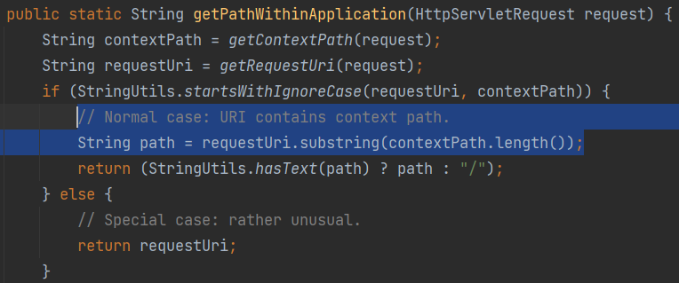

# 请求路径未标准化造成的绕过

CVE-2010-3863

影响版本：`shiro < 1.1.0`

`Shiro`在对请求路径与`shiro.ini`配置文件配置的`AntPath`进行对比前未进行路径标准化，导致使用时可能绕过权限校验

```java
	<dependency>
      <groupId>org.slf4j</groupId>
      <artifactId>slf4j-api</artifactId>
      <version>1.7.25</version>
    </dependency>

    <dependency>
      <groupId>org.apache.shiro</groupId>
      <artifactId>shiro-web</artifactId>
      <version>1.0.0-incubating</version>
    </dependency>

    <dependency>
      <groupId>org.apache.shiro</groupId>
      <artifactId>shiro-core</artifactId>
      <version>1.0.0-incubating</version>
    </dependency>

    <dependency>
      <groupId>javax.servlet</groupId>
      <artifactId>javax.servlet-api</artifactId>
      <version>4.0.1</version>
    </dependency>

    <dependency>
      <groupId>org.apache.tomcat</groupId>
      <artifactId>tomcat-catalina</artifactId>
      <version>9.0.60</version>
    </dependency>
```

web.xml配置

`Shiro 1.1.0`之前：

```xml
<filter>
    <filter-name>ShiroFilter</filter-name>
    <filter-class>org.apache.shiro.web.servlet.IniShiroFilter</filter-class>
    <init-param>
        <param-name>configPath</param-name>
        <param-value>classpath:shiro.ini</param-value>
    </init-param>
</filter>
<filter-mapping>
    <filter-name>ShiroFilter</filter-name>
    <url-pattern>/*</url-pattern>
</filter-mapping>
```

`Shiro 1.1.0`之后：

```xml
  <!-- 初始化SecurityManager对象所需要的环境-->
  <context-param>
    <param-name>shiroEnvironmentClass</param-name>
    <param-value>org.apache.shiro.web.env.IniWebEnvironment</param-value>
  </context-param>

  <!-- 指定Shiro的配置文件的位置 -->
  <context-param>
    <param-name>shiroConfigLocations</param-name>
    <param-value>classpath:shiro.ini</param-value>
  </context-param>

  <!-- 监听服务器启动时，创建shiro的web环境。
       即加载shiroEnvironmentClass变量指定的IniWebEnvironment类-->
  <listener>
    <listener-class>org.apache.shiro.web.env.EnvironmentLoaderListener</listener-class>
  </listener>

  <!-- shiro的过滤入口，过滤一切请求 -->
  <filter>
    <filter-name>shiroFilter</filter-name>
    <filter-class>org.apache.shiro.web.servlet.ShiroFilter</filter-class>
  </filter>
  <filter-mapping>
    <filter-name>shiroFilter</filter-name>
    <!-- 过滤所有请求 -->
    <url-pattern>/*</url-pattern>
  </filter-mapping>
```

`org.apache.shiro.web`定义了一个`WebSecurityManager`作为安全管理器

`web.xml`中注册了`org.apache.shiro.web.servlet.ShiroFilter`作为过滤器，其继承了`AbstractShiroFilter`并重写了`init`方法


`FilterChainResolver`根据`shiro.ini`配置中的URL与过滤器的匹配关系，执行匹配到的过滤器链对`ServletRequest`进行过滤。如下为Ant风格的的URL与过滤器的匹配关系

```ini
[urls]
/** = anon
/user/** = authc
/admin/put = authc, roles[admin]
/admin/** = authc
/audit/** = authc, perms["audit:list"]
```

shiro提供了一些认证和授权相关的过滤器

| 过滤器 | 过滤器类                 | 说明                                                         | 默认 |
| ------ | ------------------------ | ------------------------------------------------------------ | ---- |
| authc  | FormAuthenticationFilter | 基于表单的过滤器；如“/**=authc”，如果没有登录会跳到相应的登录页面登录 | 无   |
| logout | LogoutFilter             | 退出过滤器，主要属性：redirectUrl：退出成功后重定向的地址，如“/logout=logout” | /    |
| anon   | AnonymousFilter          | 匿名过滤器，即不需要登录即可访问；一般用于静态资源过滤；示例“/static/**=anon” | 无   |

| 过滤器 | 过滤器类                       | 说明                                                         | 默认 |
| ------ | ------------------------------ | ------------------------------------------------------------ | ---- |
| roles  | RolesAuthorizationFilter       | 角色授权拦截器，验证用户是否拥有所有角色；主要属性： loginUrl：登录页面地址（/login.jsp）；unauthorizedUrl：未授权后重定向的地址；示例“/admin/**=roles[admin]” | 无   |
| perms  | PermissionsAuthorizationFilter | 权限授权拦截器，验证用户是否拥有所有权限；属性和roles一样；示例“/user/**=perms["user:create"]” | 无   |
| port   | PortFilter                     | 端口拦截器，主要属性：port（80）：可以通过的端口；示例“/test= port[80]”，如果用户访问该页面是非80，将自动将请求端口改为80并重定向到该80端口，其他路径/参数等都一样 | 无   |
| rest   | HttpMethodPermissionFilter     | rest风格拦截器，自动根据请求方法构建权限字符串（GET=read, POST=create,PUT=update,DELETE=delete,HEAD=read,TRACE=read,OPTIONS=read, MKCOL=create）构建权限字符串；示例“/users=rest[user]”，会自动拼出“user:read,user:create,user:update,user:delete”权限字符串进行权限匹配（所有都得匹配，isPermittedAll） | 无   |
| ssl    | SslFilter                      | SSL拦截器，只有请求协议是https才能通过；否则自动跳转会https端口（443）；其他和port拦截器一样； | 无   |

父类`AbstractShiroFilter`的`doFilterInternal`方法中，通过`WebSecurityManager`把当前的`request`和`response`封装为`Subject`对象，`execute`执行后续逻辑

`executeChain`获取当前`request`对应的过滤器链（对应规则在`shiro.ini`中）


`pathMatches(pathPattern, requestURI)`判断请求路径是否在匹配列表里，若匹配成功，`filterChainManager.proxy(originalChain, pathPattern)`返回一个代理`originalChain`的过滤链代理，代理者就是`pathPattern`对应的过滤链。


若请求路径以上下文路径开头，字符串截取获取的请求路径；否则返回整个请求路径



实际上这里没有对URL进行标准化路径处理，可以通过一些特殊字符绕过检测

比如在上面`shiro.ini`的url配置下，访问`/admin/put`是需要认证和授权的


`Shiro1.1.0`在`getRequestUri`中增加了`normalize`对请求路径进行标准化。

对 `/`、`//`、`/./`、`/../` 等进行了处理。
