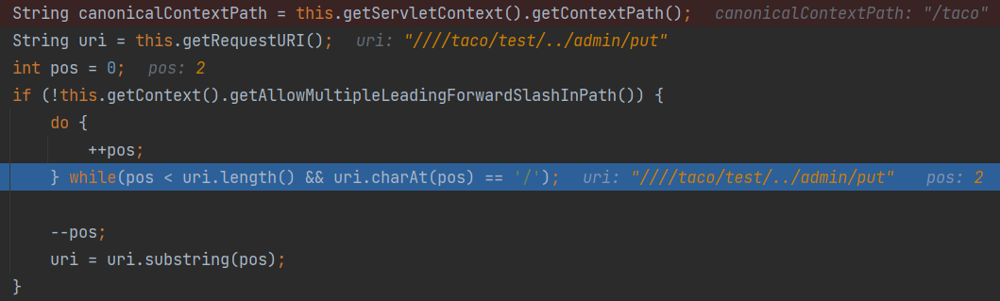

# Context Path路径标准化导致绕过

CVE-2016-6802

影响版本：`shiro < 1.3.2`

`Shiro`使用非根`servlet`上下文路径中存在安全漏洞。远程攻击者通过构造的请求，利用此漏洞可绕过目标`servlet`过滤器并获取访问权限。

上一个请求路径未标准化类似

`getPathWithinApplication`先后获取到上下文路径和请求路径，若请求路径以上下文路径开头，截断后并返回；否则返回整个请求路径

跟进`getContextPath`

`request.getContextPath()`实际上是tomcat内部去解析的，逻辑在`org.apache.catalina.connector#getContextPath`

获取`Application Context`和请求的URL，对URL进行如下操作

* 去除开头的斜杠，只保留一个

* 获取第二个斜杠前面的内容作为`candidate`

* 去除请求参数、URL解码、标准化（处理`/./、/../、//等`），判断`candidate`和`Application Context`是否相等，若不等则继续获取下一个斜杠之前的内容

假设`Application Context`为`/taco`，若我们请求的路径为`////hello/try/../../taco/admin/put`

* 保留首个斜杠 =>  `/hello/try/../../taco/admin/put`
* `/hello`不匹配`/taco`，获取下一个斜杠前面的内容
* `/hello/try`不匹配`/taco`
* `/hello/try/..`标准化后`/hello`不匹配`/taco`
* `/hello/try/../..`标准化后`/`不匹配`/taco`
* `/hello/try/../../taco`标准化后`/taco`，成功匹配，返回`/hello/try/../../taco`

`Shiro 1.0.0`之后的版本对`Request uri`进行了标准化，而`getContextPath()`返回的是没有标准化的，可以利用此绕过

显然后面版本的修复就是对`getContextPath()`进行`normalize`标准化。

Shiro这波感觉有点自己造轮子了。

`getContextPath()`可以直接调用`request.getServletContext().getContextPath()`

