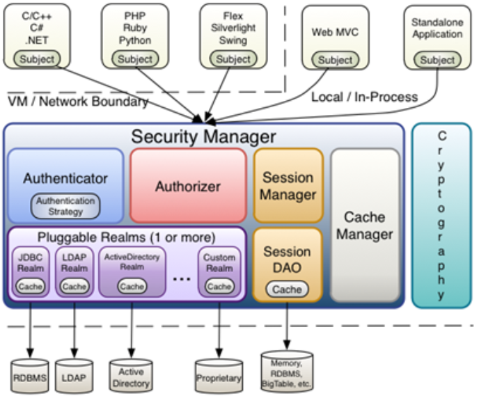
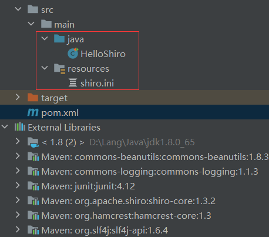
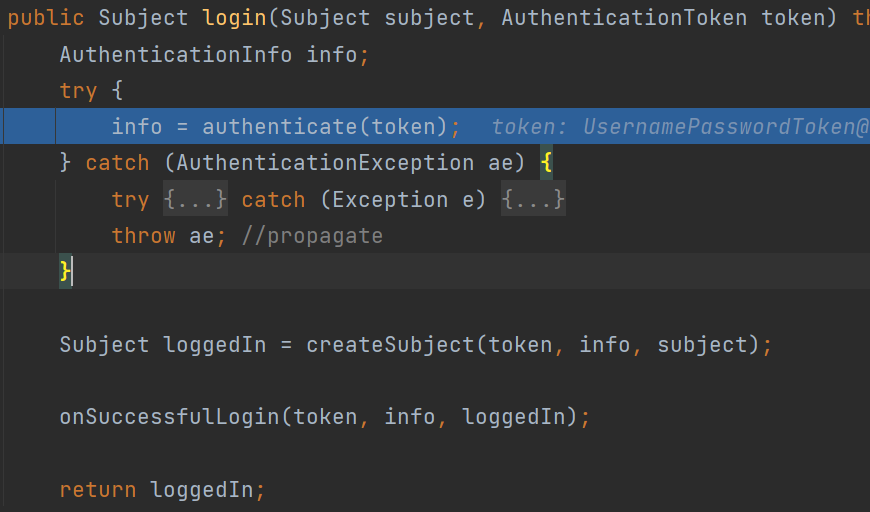
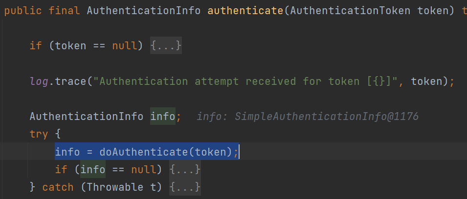
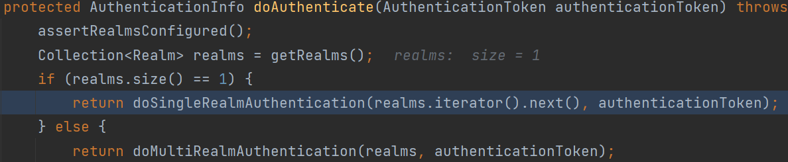
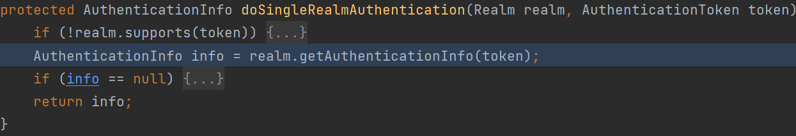
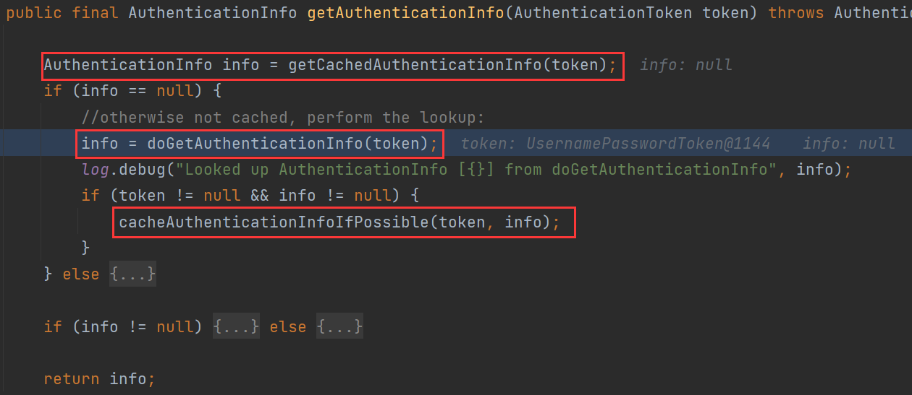
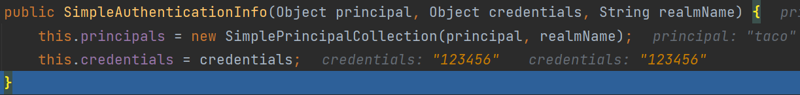
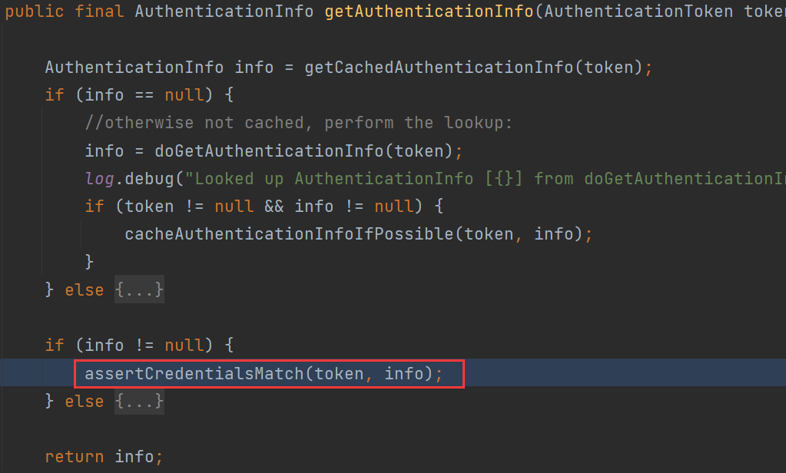

# 0x01 Concept Build

## 身份认证 authentication

身份认证：判断一个用户是否为合法用户

例如：密码登录、手机短信验证、第三方授权

关键对象

* Subject：主体，访问系统的用户
* Principal：身份信息，是主体进行身份验证的标识，具有唯一性，如用户名、手机号、邮箱地址
* Credential：凭证信息，用于认证主体身份的信息，如密码、证书

## 访问控制/授权 access control/authorization

主体进行身份认证后，系统为其分配相对应的权限，访问资源时系统校验其是否有访问此资源的权限

关键对象

* user：当前操作的用户、程序
* resource：被访问的资源
* role：角色
* permission：权限操作许可权

授权即确定who对what进行how操作

# 0x02 Shiro Intro

Shiro是apache旗下的一个安全认证框架，能够实现用户身份认证、权限授权、加密、会话管理等功能。



* Subject

> 主体，外部应用与Subject进行交互，Subject将用户作为当前操作的主体，这个主体可以是一个通过浏览器请求的用户，也可能是一个运行的程序。Subject在shiro中是一个接口，接口中定义了很多认证授相关的方法，外部程序通过Subject进行认证授权，而Subject是通过SecurityManager安全管理器进行认证授权

* SecurityManager

> 安全管理器，它是shiro的核心，负责对所有的Subject进行安全管理。通过SecurityManager可以完成Subject的认证、授权等，SecurityManager是通过Authenticator进行认证，通过Authorizer进行授权，通过SessionManager进行会话管理等。SecurityManager是一个接口，继承了Authenticator, Authorizer, SessionManager这三个接口

* Authenticator

> 认证器，对用户登录时进行身份认证

* Authorizer

> 授权器，用户通过认证器认证通过，在访问功能时需要通过授权器判断用户是否有此功能的操作权限。

* Realm（数据库读取+认证功能+授权功能实现）

> 相当于datasource数据源，SecurityManager进行安全认证需要通过Realm获取用户权限数据
>
> 如果用户身份数据在数据库那么realm就需要从数据库获取用户身份信息。

* SessionManager

> 会话管理，shiro框架定义了一套会话管理，它不依赖web容器的session，所以shiro可以使用在非web应用上，也可以将分布式应用的会话集中在一点管理，此特性可使它实现单点登录。

* SessionDAO

> 会话dao，是对Session会话操作的一套接口
>
> 可以通过jdbc将会话存储到数据库，也可以把session存储到缓存服务器

* CacheManager

> 缓存管理，将用户权限数据存储在缓存，提高性能

* Cryptography

> 密码管理，shiro提供了一套加密/解密的组件，方便开发。比如提供常用的散列、加/解密等功能

# 0x03 Quick Start

```xml
<dependency>
    <groupId>commons-logging</groupId>
    <artifactId>commons-logging</artifactId>
    <version>1.1.3</version>
</dependency>

<dependency>
    <groupId>org.apache.shiro</groupId>
    <artifactId>shiro-core</artifactId>
    <version>1.3.2</version>
</dependency>
```

## 身份认证

1. 用户名、密码等用户信息封装为token
2. Subject获取token并交给SecurityManager
3. SecurityManager将token委托给Authenticator进行身份认证
4. Authenticator将token与Realm对比，验证token合法性



```protobuf
# shiro.ini
# 声明用户账号
[users]
taco=123456
```

```java
import org.apache.shiro.SecurityUtils;
import org.apache.shiro.authc.UsernamePasswordToken;
import org.apache.shiro.config.IniSecurityManagerFactory;
import org.apache.shiro.mgt.SecurityManager;
import org.apache.shiro.subject.Subject;
import org.apache.shiro.util.Factory;
import org.junit.Test;

public class HelloShiro {
    @Test
    public void shiroLogin() {
        //导入权限ini文件构建权限工厂
        Factory<SecurityManager> factory = new IniSecurityManagerFactory("classpath:shiro.ini");
        SecurityManager securityManager = factory.getInstance();
        SecurityUtils.setSecurityManager(securityManager);
        Subject subject = SecurityUtils.getSubject();
        UsernamePasswordToken token = new UsernamePasswordToken("taco", "123456");
        subject.login(token);
        if(subject.isAuthenticated()) {
            System.out.println("Login Success");
        } else {
            System.out.println("Login Failure");
        }
    }
}
```

## 数据源

SecurityManager进行安全认证需要通过Realm获取用户权限数据

我们可以自定义Realm

```properties
#声明自定义的realm，且为安全管理器指定realms
[main]
definitionRealm=realm.MyRealm
securityManager.realms=$definitionRealm
```

```java
package service;

public interface SecurityService {

    /**
     * @Description 查找密码按用户登录名
     * @param loginName 登录名称
     * @return
     */
    String findPasswordByLoginName(String loginName);
}
```

```java
package service.impl;

import service.SecurityService;

public class SecurityServiceImpl implements SecurityService {

    public String findPasswordByLoginName(String loginName) {
        return "123456";
    }
}
```

```java
package realm;

import org.apache.shiro.authc.*;
import org.apache.shiro.authz.AuthorizationInfo;
import org.apache.shiro.realm.AuthorizingRealm;
import org.apache.shiro.subject.PrincipalCollection;
import service.SecurityService;
import service.impl.SecurityServiceImpl;

public class MyRealm extends AuthorizingRealm {
    @Override
    protected AuthorizationInfo doGetAuthorizationInfo(PrincipalCollection principalCollection) {
        return null;
    }

    @Override
    protected AuthenticationInfo doGetAuthenticationInfo(AuthenticationToken token) throws AuthenticationException {
        String loginName = (String)token.getPrincipal();
        SecurityService service = new SecurityServiceImpl();
        String password = service.findPasswordByLoginName(loginName);
        if ("".equals(password)||password==null){
            throw new UnknownAccountException("User Does not exist");
        }
        return  new SimpleAuthenticationInfo(loginName,password,getName());
    }
}
```

让我们跟一下`SecurityManager`是如何进行认证的

`securityManager#login`



`AbstractAuthentication#authenticate`



`ModularRealmAuthenticator#doAuthenticate`判断是单个数据源还是多个数据源

`ModularRealmAuthenticator#doSingleRealmAuthentication`调用`AuthenticatingRealm#getAuthenticationInfo`





先尝试从缓存中获取认证信息`getCachedAuthenticationInfo(token)`

调用我们自定义的Realm的`doGetAuthenticationInfo`



获取用户对应的密码后封装为`SimpleAuthenticationInfo`返回

接着尝试将token和info放入缓存，方便下次快速认证。



`assertCredentialsMatch`对比`token`和`info`是否匹配，不匹配会抛出异常

## 授权

1. `Subject.isPermitted/hashRole`委托给`SecurityManager`
2. `SecurityManager`委托给内部组件`Authorizer`
3. `Authorizer`将其委托给`Realm`
4. `Realm`将用户请求的参数封装成**权限对象**，根据我们重写的`doGetAuthorizationInfo`获取从数据库查询到的**权限集合**
5. `Realm`遍历权限集合，一一与用户的权限对象对比，命中则返回true

进行授权的前提是用户通过认证

修改`MyRealm.java`

```java
protected AuthorizationInfo doGetAuthorizationInfo(PrincipalCollection principalCollection) {
    String loginName = (String) principalCollection.getPrimaryPrincipal();
    SecurityService securityService = new SecurityServiceImpl();
    List<String> roles = securityService.findRoleByloginName(loginName);
    List<String> permissions = securityService.findPermissionByloginName(loginName);
	// 模拟从数据库查找对用角色和资源
    SimpleAuthorizationInfo authorizationInfo = new SimpleAuthorizationInfo();
    authorizationInfo.addRoles(roles);
    authorizationInfo.addStringPermissions(permissions);
    return authorizationInfo;
}
```

`SecurityServiceImpl`添加

```java
@Override
public List<String> findRoleByloginName(String loginName) {
    List<String> list = new ArrayList();
    list.add("admin");
    list.add("dev");
    return list;
}

@Override
public List<String>  findPermissionByloginName(String loginName) {
    List<String> list = new ArrayList();
    list.add("order:add");
    list.add("order:list");
    list.add("order:del");
    return list;
}
```

```java
@Test
public void permissionTest(){
    Subject subject = shiroLogin("taco", "123456");
    if(subject.isAuthenticated()) {
        System.out.println("Login Success");
    }
    if(subject.hasRole("admin")) {
        System.out.println("Admin Role");
    }
    try {
        subject.checkRole("coder");
        System.out.println("Coder Role");
    }catch (Exception e){
        System.out.println(e);
    }
    if(subject.isPermitted("order:list")) {
            System.out.println("Got Permissions of List");
    }
    try {
        subject.checkPermissions("order:add", "order:del");
        System.out.println("Got Permissions of Add and Del");
    }catch (Exception e){
        System.out.println(e);
    }
}

public Subject shiroLogin(String loginName, String passwd) {
    Factory<SecurityManager> factory = new IniSecurityManagerFactory("classpath:shiro.ini");
    SecurityManager securityManager = factory.getInstance();
    SecurityUtils.setSecurityManager(securityManager);
    Subject subject = SecurityUtils.getSubject();
    UsernamePasswordToken token = new UsernamePasswordToken(loginName, passwd);
    subject.login(token);
    return subject;
}
```

> Login Success
>
> Admin Role
>
> org.apache.shiro.authz.UnauthorizedException: Subject does not have role [coder]
>
> Got Permissions of List
>
> Got Permissions of Add and Del

鉴权过程和认证过程类似，这里就不看源码了

> 鉴权方法中：
>
> 以check开头的会抛出异常
>
> 以is和has开头会返回布尔值
