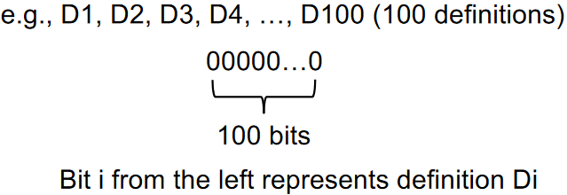
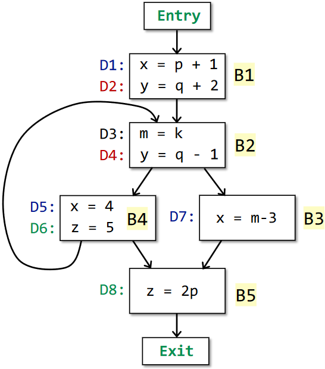
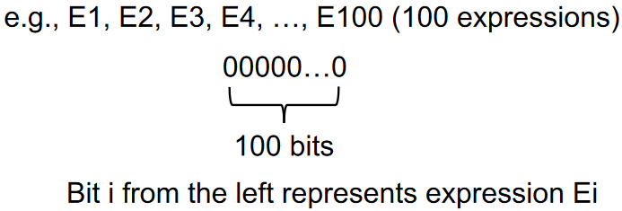

# 0x03 Data Flow Analysis

## Overview of DFA

DFA：Data Flow Analysis

How application-specific data flows through the nodes and edges of CFG（source code->IR->CFG）

> most static analyzer tends to may analysis
>
> * may analysis
>   * outputs information that may be true (over-approximation)
> * must analysis
>   * outputs information that must be true (under-approximation)

different data-flow analysis applications have

different data abstraction and

different flow safe-approximation strategies and

different transfer functions and control-flow handlings

> e.g., determine the sgin of a variable
>
> data abstraction：+、-、0、unknown、undefined
>
> transfer function：+ op + = + , + op - = -
>
> control-flow handlings：union the signs at merges

## Preliminaries of DFA

### Input and Output States

* Each execution of an IR statement transforms an input state to a new output state
* The input/output state is associated with the program point before/after the statement
* 

> In each data-flow analysis application, we associate with every program point a data-flow value that represents an abstraction of the set of all possible program states that can be observed for that point.
>
> 

DFA is to find a solution to a set of safe-approximation-directed constraints on the IN[s]’s and OUT[s]’s for all statements

* constraints based on semantics of statements（transfer function）
* constraints based on the flows of control1

### Transfer Function


### Control Flow


## Reaching Definitions analysis

> A definition d at program point p reaches a point q if there is path from p to q such that d is not “killed” along that path

* A definition of a variable v is a statement that assigns a value to v
* how to be “killed”: new definition of v


Reaching definitions can be used to detect possible undefined variables.

> e.g., introduce a dummy definition for each variable v at the entry of CFG, and if the dummy definition of v reaches a point p where v is used, then v may be used before definition (as undefined reaches v)

So reaching definitions analysis is may analysis.

(不放过动态运行时所有可能的路径)

### Abstraction

The definitions of all the variables in a program can be represented by bit vectors.



### Safe-Approximation

#### Transfer Function


> genB：definitions generated in this BB.
>
> killB: new definition D in this BB kills other definitions
>
> obviously, same variables in definition bit vectors can not exist at the same time.

#### Control Flow


reaching definition is a may analysis.So here use union(∪) as the meet operator.

#### Algorithm


For Example:



CFG above can be transfered to pseudo-code below.

```
D1
D2
do {
	D3
	D4
	if(condition){
		D5
		D6
	} else {
		D7
		break
	}
} while(condition)
D8
```

* Iteration 0 —— init


* Iteration 1

IN[B1] = 0000 0000 = OUT[Entry]

OUT[B1] = 1100 0000  generate D1、D2


IN[B2] = 1100 0000 = OUT[B1] ∪ OUT[B4]

OUT[B2] = 1011 0000  generate D3、D4，kill D2


IN[B3] = 1011 0000 = OUT[B2]

OUT[B3] = 0011 0010   generate D7，kill D1


IN[B4] = 1011 0000 = OUT[B2]

OUT[B4] = 0011 1100   generate D5、D6，kill D1


IN[B5] = 0011 1110 = OUT[B4] ∪ OUT[B3]

OUT[B5] = 0011 1011   generate D8, kill D6


* Iteration 2

IN[B1] = 0000 0000 = OUT[Entry]

OUT[B1] = 1100 0000  generate D1、D2


IN[B2] = 1111 1100 = OUT[B1] ∪ OUT[B4]

OUT[B2] = 1011 1100  generate D3、D4，kill D2


IN[B3] = 1011 1100 = OUT[B2]

OUT[B3] = 0011 0110   generate D7，kill D1、D5


IN[B4] = 1011 1100 = OUT[B2]

OUT[B4] = 0011 1100   generate D5、D6，kill D1、D7、D8


IN[B5] = 0011 1110 = OUT[B4] ∪ OUT[B3]

OUT[B5] = 0011 1011   generate D8, kill D6


* Iteration 3

IN[B1] = 0000 0000 = OUT[Entry]

OUT[B1] = 1100 0000  generate D1、D2


IN[B2] = 1111 1100 = OUT[B1] ∪ OUT[B4]

OUT[B2] = 1011 1100  generate D3、D4，kill D2


IN[B3] = 1011 1100 = OUT[B2]

OUT[B3] = 0011 0110   generate D7，kill D1、D5


IN[B4] = 1011 1100 = OUT[B2]

OUT[B4] = 0011 1100   generate D5、D6，kill D1、D7、D8


IN[B5] = 0011 1110 = OUT[B4] ∪ OUT[B3]

OUT[B5] = 0011 1011   generate D8, kill D6


The final result is the green part which means definitions can reach this point in the program.

> Why this iterative algorithm can finally stop?
>
> 
>
> INs will not change if OUTs do not change
>
> OUTs will not change if INs do not change
>
> Reach a fixed point. Also related with monotonicity

## Live Variables Analysis

Live variables analysis tells whether the value of variable v at program point p could be used along some path in CFG starting at p.If so, v is live at p; otherwise, v is dead at p.


> information of live variables can be used for register allocations.
>
> e.g., all registers are full and we need to use one, then we should favor using a register with a dead value.

### Abstraction

All variables in a program can be represented by bit vectors.


### Safe-Approximation

redefinition will break the path. forwards analysis requires record of previous state, so we use **backwards analysis**

One live path will be ok, so we use **may analysis**

#### Control Flow


#### Transfer Function


> useB：variables used before redefined in B
>
> defB：variables redefined in B
>
> OUT[B]：variables live coming out of B

note: we focus on the live state of variables at some program point.

#### Algorithm


* Iteration 0 —— init


* Iteration 1

IN[Exit] = 000 0000


OUT[B5] = 000 0000 = IN[Exit]

IN[B5] = 000 1000    use p, redefine z


OUT[B3] = 000 1000 = IN[B5]

IN[B3] = 100 1000    use x


OUT[B4] = 000 1000 = IN[B5] ∪ IN[B2]

IN[B4] = 010 1000    use y, redefine x、q


OUT[B2] = 110 1000 = IN[B3] ∪ IN[B4]

IN[B2] = 100 1001    use k, redefine m、y


OUT[B1] = 100 1001 = IN[B2]

IN[B1] = 001 1101    use p、q、z, redefine x、y


* Iteration 2

IN[Exit] = 000 0000


OUT[B5] = 000 0000 = IN[Exit]

IN[B5] = 000 1000    use p, redefine z


OUT[B3] = 000 1000 = IN[B5]

IN[B3] = 100 1000    use x


OUT[B4] = 100 1001 = IN[B5] ∪ IN[B2]

IN[B4] = 010 1001    use y, redefine x、q


OUT[B2] = 110 1001 = IN[B3] ∪ IN[B4]

IN[B2] = 100 1001    use k, redefine m、y


OUT[B1] = 100 1001 = IN[B2]

IN[B1] = 001 1101    use p、q、z, redefine x、y


* Iteration 3

IN[Exit] = 000 0000


OUT[B5] = 000 0000 = IN[Exit]

IN[B5] = 000 1000    use p, redefine z


OUT[B3] = 000 1000 = IN[B5]

IN[B3] = 100 1000    use x


OUT[B4] = 100 1001 = IN[B5] ∪ IN[B2]

IN[B4] = 010 1001    use y, redefine x、q


OUT[B2] = 110 1001 = IN[B3] ∪ IN[B4]

IN[B2] = 100 1001    use k, redefine m、y


OUT[B1] = 100 1001 = IN[B2]

IN[B1] = 001 1101    use p、q、z, redefine x、y


The final result is the green part which means variable is live along the path(can be used in future) from this program point

## Available Expressions Analysis

An expression `x op y` is available at program point p if

1. all paths from the entry to p must pass through the evaluation of `x op y`
2. after the last evaluation of `x op y`, there is no redefinition of x or y

> available expressions can be used for detecting global common subexpressions.

### Abstraction

All the expressions in a program can be represented by bit vectors.



### Safe-Approximation

#### Transfer Function


#### Control Flow

All paths from entry to point p must pass through the evaluation of `x op y`，so we use must analysis

for safety of the analysis, it may report an expression as unavailable even if it is truly available.（用于编译器优化，不能优化错误的内容, under-approximation）


#### Algorithm


* Iteration 0 —— init


* Iteration 1

OUT[Entry] = 00000


IN[B1] = 00000

OUT[B1] = 10000   generate E1


IN[B2] = 10000  OUT[B1] ∩ OUT[B4]

OUT[B2] = 01010   generate E2、E4，kill E1


IN[B3] = 01010 = OUT[B2]

OUT[B3] = 00011    generate E5，kill E2


IN[B4] = 01010 = OUT[B2]

OUT[B4] = 01110    generate E3、E4


IN[B5] = 00010 = OUT[B3] ∩ OUT[B4]

OUT[B5] = 01010    generate E4、E2，kill E3


* Iteration 2

OUT[Entry] = 00000


IN[B1] = 00000

OUT[B1] = 10000   generate E1


IN[B2] = 00000  OUT[B1] ∩ OUT[B4]

OUT[B2] = 01010   generate E2、E4，kill E1


IN[B3] = 01010 = OUT[B2]

OUT[B3] = 00011    generate E5，kill E2


IN[B4] = 01010 = OUT[B2]

OUT[B4] = 01110    generate E3、E4


IN[B5] = 00010 = OUT[B3] ∩ OUT[B4]

OUT[B5] = 01010    generate E4、E2，kill E3


## Summary


