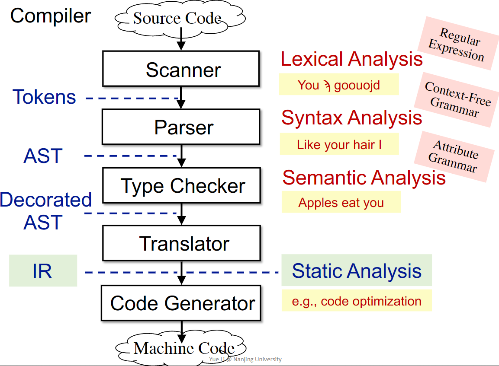
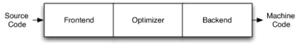
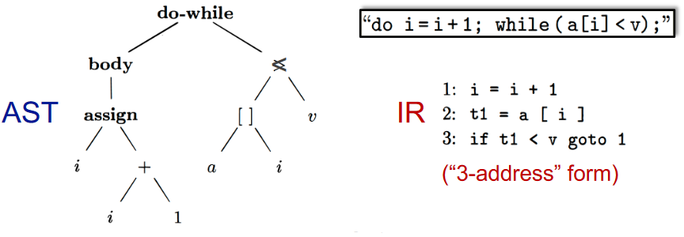
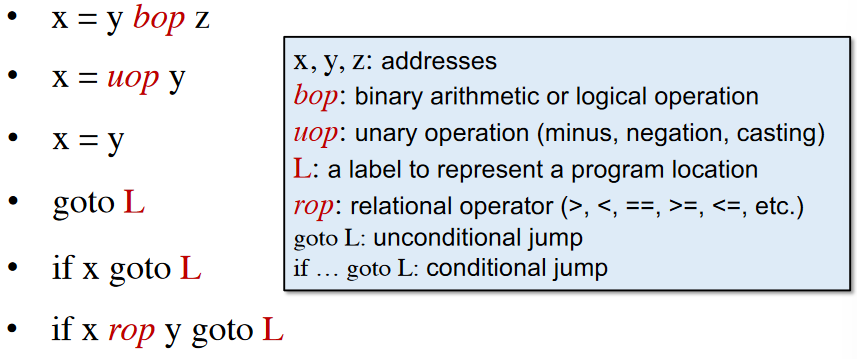
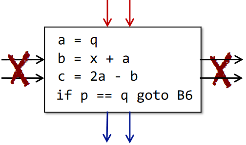
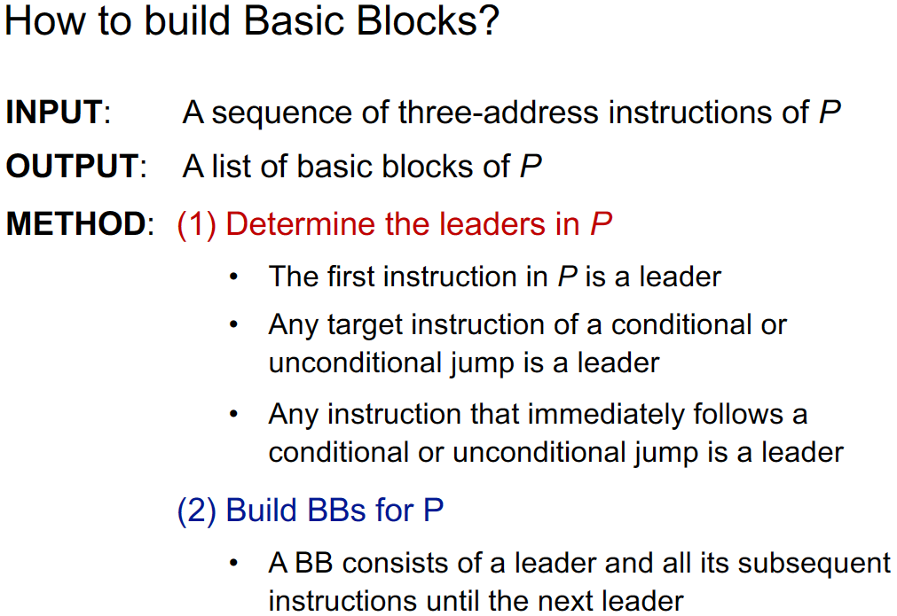
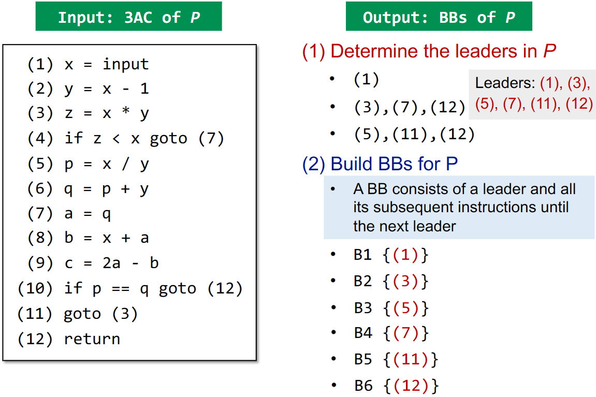
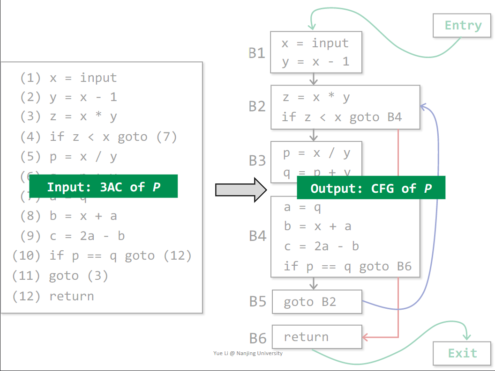

# 0x02 Intermediate Representation

## Compiler and Static Analyzer

### Compiler Structure

How does Compiler work?

传统编译器架构：

* Frontend：前端

  * Lexical Analysis：词法分析
  * Syntax Analysis：语法分析
  * Semantic Analysis：语义分析
  * Translator：生成中间代码（Intermediate Representation）

* Optimizer：优化器

* Backend：后端

  Code Generator生成机器码

## AST vs IR

why IR is better for static analysis than AST？

AST：

* high-level and closed to grammar structure
* usually language dependent
* suitable for fast type checking
* lack of control flow information

IR：

* low-level and closed to machine code
* usually language independent
* compact and uniform
* contains control flow information
* usually considered as the basis for static analysis

## 3-Address Code

3-Address Code（3AC）

* There is at most one operator on the right side of an instruction
* Each 3AC contains at most 3 address

note：There is no fixed realization of the 3AC.

Address can means：

* Name
* Constant
* Compiler-generated temporary variable

Some Common 3AC Forms：

> Soot is one of the most popular static analysis framework for Java
>
> Soot's IR is Jimple：typed 3-address code

> JVM complement：
>
> invoke special：call constructor、superclass methods、private methods
>
> invoke virtual：instance methods call（virtual dispatch）
>
> invoke interface：checking interface implement
>
> invoke static：call static methods
>
> invoke dynamic：dynamic language runs on JVM
>
> methods signature：
> <class name: return type method name(param1 type, param2 type,...)>

## Control Flow Graph

* Building Control Flow Graph（CFG）
* CFG serves as the basic structure for static analysis
* The node in CFG can be an individual 3AC（or a Basic Block 【BB】）

Basic Blocks are maximal sequences of consecutive three-address instructions

* It can be entered only at the beginning
* It can be exited only at the end
* 

Build CFG through BBs

The nodes of CFG are basic blocks

*  There is an edge from block A to block B if and only if
   * There is a conditional or unconditional jump from the end of A to the beginning of B
   * B immediately follows A in the original order of instructions and A does not end in an unconditional jump
   * A is a predecessor of B and B is a successor of A
*  It is normal to replace the jumps to instruction labels by jumps to basic blocks
*  Usually we add two nodes, Entry and Exit
   *  An edge from Entry to the BB containing the first instruction of IR
   *  An edge to Exit from any BB containing an instruction that could be the last instruction of IR

