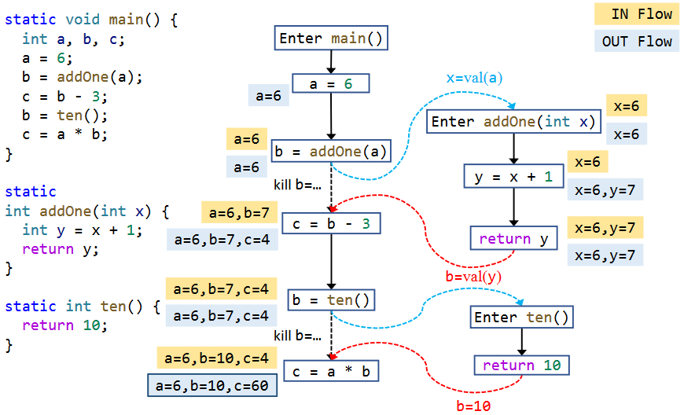

# Interprocedural Analysis

## Intro

all analyses we learnt previously are intraprocedural which can not deal with method calls.

Take Constant Propagation for example：


we make the most conservative assumption for method calls（safe-approximation）

* x = NAC
* y = NAC
* n = NAC

which leads to imprecision.

For better precision, introducing interprocedural analysis（propagate data-flow information along interprocedural control-flow edges）. First we need **call graph** to perform interprocedural analysis.

Call Graph is a representation of calling relationships in the program.

It consists of a set of call edges from call-sites to their target methods(callees)


Some applications of Call Graph：

* Interprocedural Analyses
* Program optimization
* Program understanding
* Program debugging
* Program testing
* .....

Call Graph Construction for OOPLs


Before proceeding, we need to learn some basic knowledge about method calls in Java

|                  | Static Call    |                         Special Call                         |          Virtual Call          |
| :--------------: | -------------- | :----------------------------------------------------------: | :----------------------------: |
|   instruction    | invokestatic   |                        invokespecial                         | invokeinterface、invokevirtual |
| receiver objects | ×              |                              √                               |               √                |
|   description    | static methods | constructors、private instance methods、superclass instance methods |     other instance methods     |
|  target methods  | 1              |                              1                               |        ≥1(polymorphism)        |
|   determinacy    | Compile-time   |                         Compile-time                         |            Run-time            |

static call and special call can be determined at compile-time, but virtual call can be only determined at run-time. The former is trivial and the latter is non-trivial(key to call graph construction for OOPLs)

During run-time, a virtual call is dynamically resolved based on（method dispatch）

1. type of the receiver object(caller)
2. method signature at the call site


We define function Dispatch(c, m) to simulate the procedure of run-time method dispatch


finding the class type which contains the called method is important.


> Dispatch(B, A.foo()) = A.foo()
>
> Dispatch(C, A.foo()) = C.foo()

## CHA

Class Hierarchy Analysis

* Require the class hierarchy information (inheritance structure) of the whole program
* Resolve a virtual call based on the **declared type** of **receiver variable** of the call site

> ```java
> A a = ...
> a.foo()
> ```
>
> Assume the receiver variable `a` may point to objects of class `A` or all subclasses of `A`
> 
>Resolve target methods by looking up the class hierarchy of class `A`

Taking the class inheritance relationship above as an example, let's take a look at the bytecode of the method call.

```java
public class C extends B{
    @Override
    public void foo() {
        super.foo();
        this.secret();
    }
    private void secret(){
    }
    public C() {
    }
}
```

corresponding jvm bytecode👇

```java
ALOAD 0
INVOKESPECIAL B.foo ()V
ALOAD 0
INVOKESPECIAL C.secret ()V
RETURN

<init>
aload_0
invokespecial <B.<init> : ()V>
return
```

`super.foo()` calls the `foo` method of the superclass of class C. But we know that class B does not have a `foo` method. So `invokespecial` also needs to dispatch.

For calls to private methods and constructors, the corresponding class can be found directly in the method signature.

In addition, the constructor first calls the parent class's no-argument

In fact, static methods can also be inherited, so `invokestatic` also requires dispatch.

So what we need to focus on are calls to methods that can be overridden.

```java
A a = new C();
a.foo();
```

corresponding jvm bytecode👇

```java
new <C>
dup
invokespecial <C.<init> : ()V>
astore_1
aload_1
invokevirtual <A.foo : ()V>
return
```

You can see that the class pointed to in the method signature followed by `invokevirtual` is the declared type of the receiver object.

Given the polymorphic nature of Java, the actual method invoked might be the `foo` method superseded by a subclass of class A. So we shall find the foo method of class A and its subclasses.

We define function Resolve(cs) to resolve possible target methods of a call site cs by CHA


inheritance structure


> Resolve(c.foo()) = {C.foo()}
>
> Resolve(a.foo()) = {A.foo(), C.foo(), D.foo()}
>
> Resolve(b.foo()) = {A.foo(), C.foo(), D.foo()}
>
> NOTE: if
>
> ```java
> B b = new B();
> b.foo();
> ```
>
> still, Resolve(b.foo()) = {A.foo(), C.foo(), D.foo()}
>
> CHA produces two spurious call targets

Features of CHA：

* advantage: fast
  * Only consider the declared type of receiver variable at the call-site, and its inheritance hierarchy
  * Ignore data and control-flow information
* disadvantage: imprecise
  * Easily introduce spurious target methods
* common usage: IDE

`Navigate -> Call Hierarchy`


Call Graph Construction —— Algorithm

* Start from entry method(main method in java)
* For each reachable method m, resolve target methods for each call site cs in m via CHA(Resolve(cs))
* Repeat until no new method is discovered


Here we ignore constructor call

* Round 0

WL = [A.main()]

* Round 1

Resolve(a.foo()) = {A.foo()}

WL = [A.foo()] RM = [A.main()]

* Round 2

Resolve(a.bar()) = {A.bar(), B.bar(), C.bar()}

WL = [A.bar(), B.bar(), C.bar()] RM = [A.main(), A.foo()]

* Round 3

Resolve(c.bar()) = {C.bar()}

WL = [B.bar(), C.bar(), C.bar()] RM = [A.main(), A.foo(), A.bar()]

* Round 4

WL = [C.bar(), C.bar()] RM = [A.main(), A.foo(), A.bar(), B.bar()]

* Round 5

Resolve(A.foo()) = {A.foo()}

WL = [C.bar(), A.foo()] RM = [A.main(), A.foo(), A.bar(), B.bar(), C.bar()]

* Round 6

WL = [] RM = [A.main(), A.foo(), A.bar(), B.bar(), C.bar()]


## ICFG

CFG represents structure of an individual method while ICFG represents structure of the whole program.

An ICFG of a program consists of CFGs of the methods in the program, plus two kinds of additional edges:

* Call edges: from call sites to the entry nodes of their callees
* Return edges: from exit nodes of the callees to the statements following their call sites (return site)

The edge from call site to return site is called call-to-return edge.

ICFG = CFGs + call & return edges

We build call & return edges via Call Graph


## Inter DFA

How to analyze the whole program with method calls based on ICFG

|                    | intraprocedural |       interprocedural       |
| ------------------ | --------------- | :-------------------------: |
| representation     | CFG             |            ICFG             |
| transfer functions | node transfer   | node transfer+edge transfer |

Edge transfer
• Call edge transfer: transfer data flow from call site to the entry node of callee (along call edges)
• Return edge transfer: transfer data flow from exit node of the callee to the return site (along return edges)

For call site, the transfer function is identity function.

We leave the handling of the LHS(Left-Hand-Side) variable(return value) to edge transfer



> Why call-to-return edge exists?
>
> * allow the analysis to propagate local data-flow
> * we have to propagate local data-flow across target methods without call-to-return edge（inefficient and troublesome）
>
> Why need to kill LHS variable on call-to-return edge?
>
> * LHS variable’s value will flow to return site along the return edges.
> * merge its previous value with return edge will cause impression.

Interprocedural Constant Propagation In Summary

* Node transfer
  * Call nodes: identity
  * Other nodes: same as intraprocedural constant propagation
* Edge transfer
  * Normal edges: identity
  * Call-to-return edges: kill the value of LHS variable of the call site, propagate values of other local variables
  * Call edges: pass argument values
  * Return edges: pass return values
