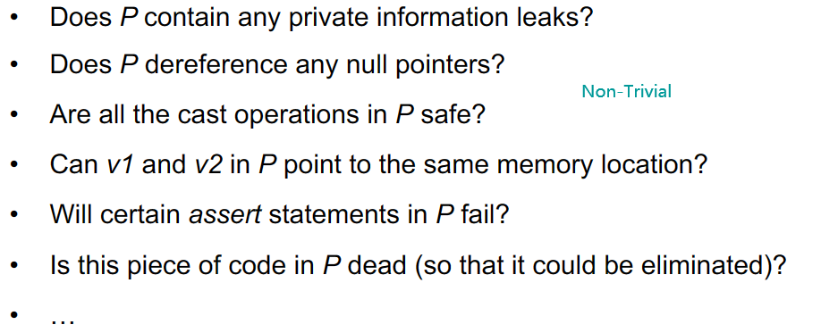
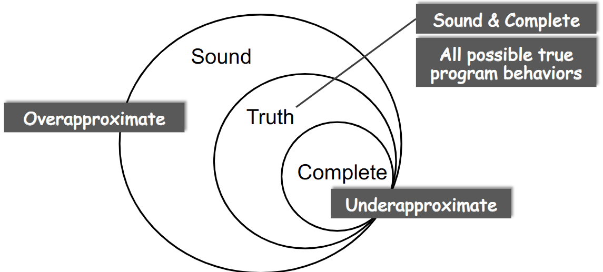
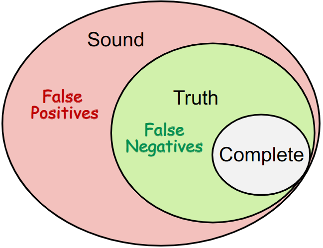

# 0x00 Resource

[Static Program Analysis | Tai-e (pascal-lab.net)](http://tai-e.pascal-lab.net/lectures.html)

https://www.bilibili.com/video/BV1b7411K7P4

NOTEs Are Taken From Online Shared Course *Static Program Analysis* conducted by Teacher Yue Li and Tian Tan in NJU. Here I appreciate these two teachers for your selfless sharing. 😭

# 0x01 Intro

Programming Languages（PL）can not live without Program analysis

Why Need Static Analysis：

* Program Reliability

  Null pointer dereference、memory leak（malloc without free）

* Program Security

  Private information leak、injection attack

* Compiler Optimization

  Dead code elimination、code motion

* Program Understanding

  IDE call hierarchy、type indication

Static analysis analyzes a program P to reason about its behaviors and determines whether it satisfies some properties before running P

> Rice's Theorem：
>
> Any non-trivial property of the behavior of programs in a r.e. language is undecidable
>
> r.e. (recursively enumerable) = recognizable by a Turing-machine
>
> A property is trivial if either it is not satisfied by any r.e. language, or if it is satisfied by all r.e. languages; otherwise it is non-trivial.
>
> non-trivial properties ≈ the properties related with run-time behaviors of programs

So there is no perfect static analysis strategy

* Sound  ≈  误报
* Complete   ≈  漏报

But we can make some compromises to reach a useful static analysis

* Compromise soundness (false negatives)
* Compromise completeness (false positives)

Mostly compromising completeness: Sound but not fully-precise static analysis

Static Analysis: ensure (or get close to) soundness, while making good trade-offs between analysis precision and analysis speed

How to Do Static Analysis：

* Abstraction
* Over-approximation
  * Transfer functions：
    * define how to evaluate different program statements on abstract values.
    * defined according to “analysis problem” and the “semantics” of different program statements
  * Control flows
    * flow merging

