# Intro

What’s the problem of context-insensitive pointer analysis.

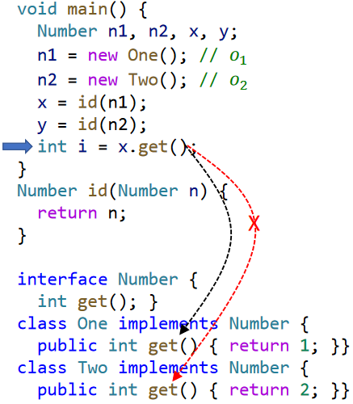

construct the PFG👇

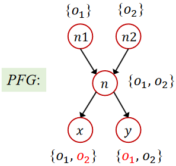

The `id` method is executed many times. Different arguments may flow into the parameters every time which leads to different return values.

perform constant-propagation analysis, i = NAC which is false positive.

# Context Sensitivity

In dynamic execution, a method may be called multiple times under different calling contexts.

Under different calling contexts, the variables（parameters and return variables） of the method may point to different objects.

In Context-Insensitive pointer analysis, objects under different contexts are mixed and propagated to other parts of program(through return values or side-effects), causing spurious data flows.

> The object pointing information of the parameters passed in each time the method is called is mixed together, resulting in a spurious value in the return value of the method, and some side effects of the method (such as modifying the fields of the object) also produce some spurious values.

Context sensitivity models calling contexts by distinguishing different data flows of different contexts to improve precision.  

## Cloning-Based CS

The most straightforward approach to implement context sensitivity is by cloning context.

In cloning-based context-sensitive pointer analysis, each method is qualified by one or more contexts.

The variables are also qualified by contexts (inherited from the method they are declared in)

Essentially each method and its variables are cloned, one clone per context.

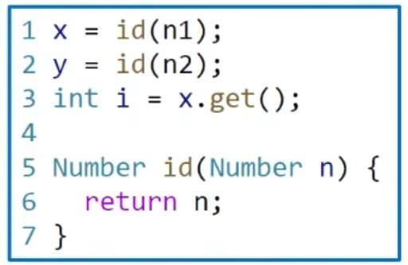

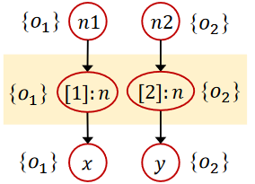

## CS Heap

OO programs are typically heap-intensive (heap/object operation is frequent)

To improve precision, context sensitivity should also be applied to heap abstraction.

The abstract objects are also qualified by contexts(called heap contexts, inherited from the method where the object is allocated)

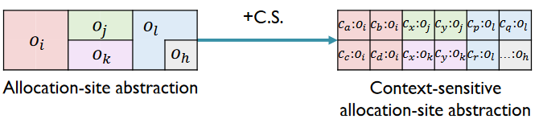

> Why Context-Sensitive Heap Improve Precision?
>
> * In dynamic execution, an allocation site can create multiple objects under different calling contexts
> * Different objects (allocated by the same site) may be manipulated with different data flows, e.g., stored different values to their field
> * Analysis without heap context may lose precision by merging the data flows of different contexts to one abstract object
> * distinguishing different objects from the same allocation site by heap contexts gains precision

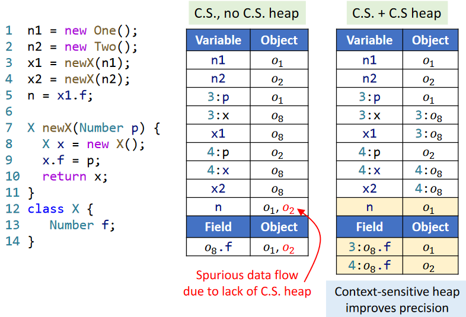

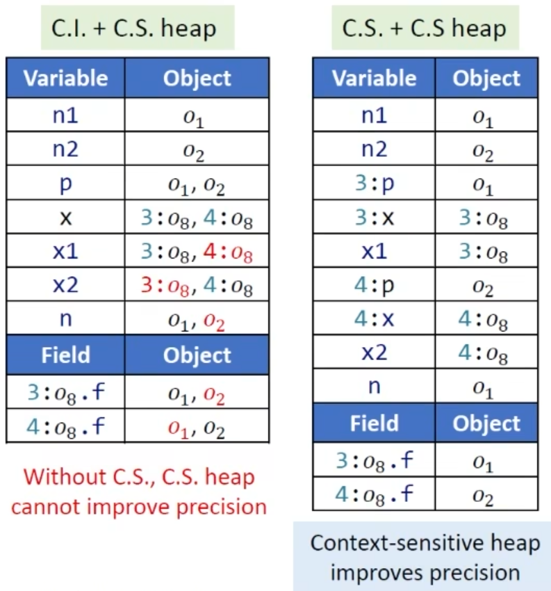

We need both a variable context and a heap context to be effective.

## Rule

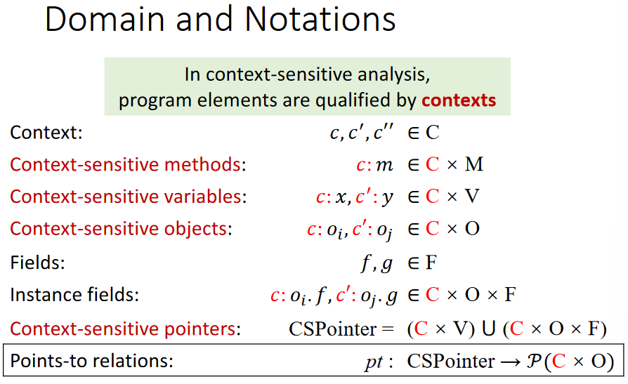

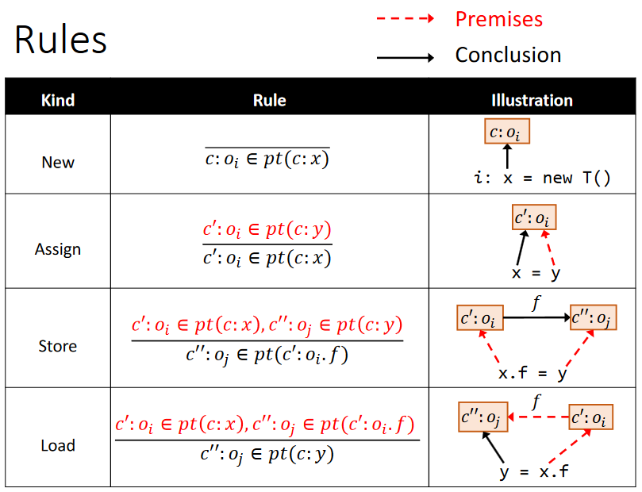

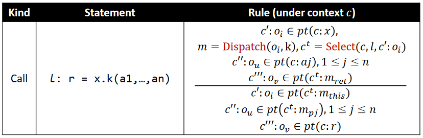

> for assign statement `x = y`,
>
> `x` and `y` are in the same method so they share the same context

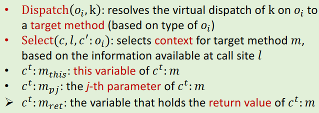

# Algorithm

pretty same as C.I. analysis 

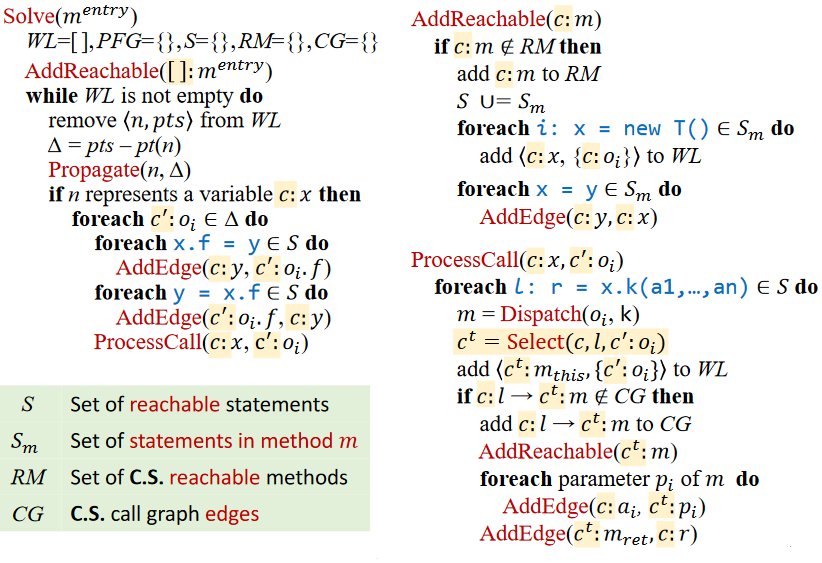

`Propagate` and `AddEdge` are exactly same as in C.I. analysis

# Variants

Different `Select` refers to different analysis variants.

> Select(c, l, c’:oi)
>
> c: caller context
>
> l: call site
>
> c’:oi : receiver object with heap context 
>
> C.I. analysis can be seen as a special case of C.S. analysis where `Select` always returns the same context.
>
> Select(_, _, _) = []

## Call-site sensitivity

The oldest and best-known context sensitivity strategy is **call-site sensitivity** (call-string) 

Each context consists of a list of call sites(call chain)

At a method call, append the call site to the caller context as callee context.(essentially the **abstraction of call stack** in dynamic  execution)

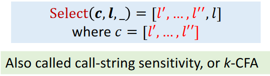

（CFA, aka Control Flow Analysis）

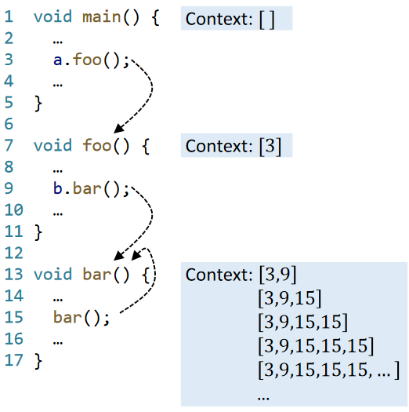

recursion is terrible(leads to infinite loop)

To ensure termination of pointer analysis and avoid too many contexts (long call chains) in real-world, we set an upper bound for length of contexts, denoted by k

For call-site sensitivity, each context consists of the last k call sites of the call chains.

In practice, k is a small number (usually ≤3)

usually, k=2 for method contexts, k=1 for heap context

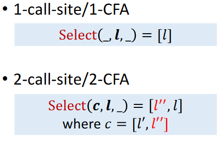

1-Call-Site Example:

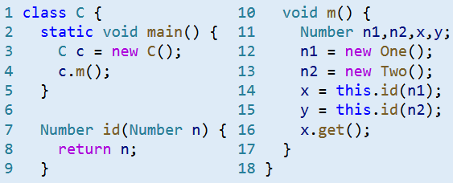

For simplicity, here we do not apply C.S. heap and omit this variable of C.id(Number) and we only care about class C.

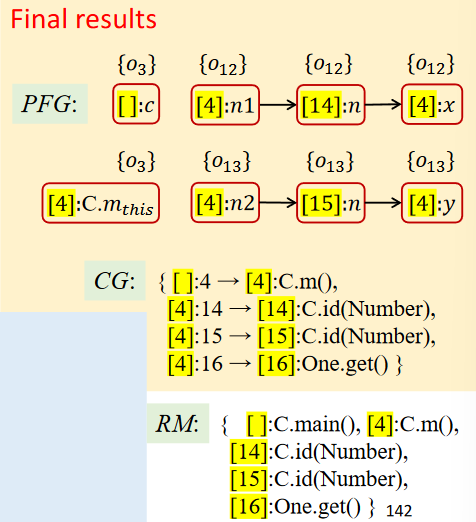

## Object sensitivity

Each context consists of a list of abstract objects(represented by their allocation sites)

At a method call, use the receiver object with its heap context as callee context

Distinguish the operations of data flow on different objects

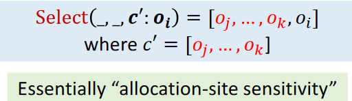

Example:

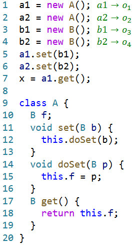

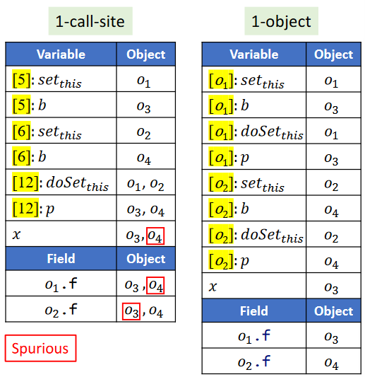

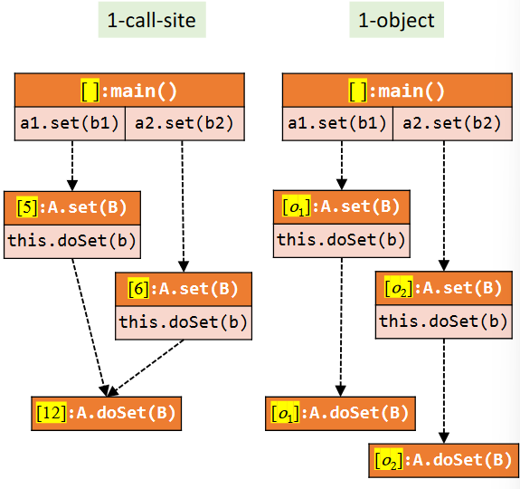

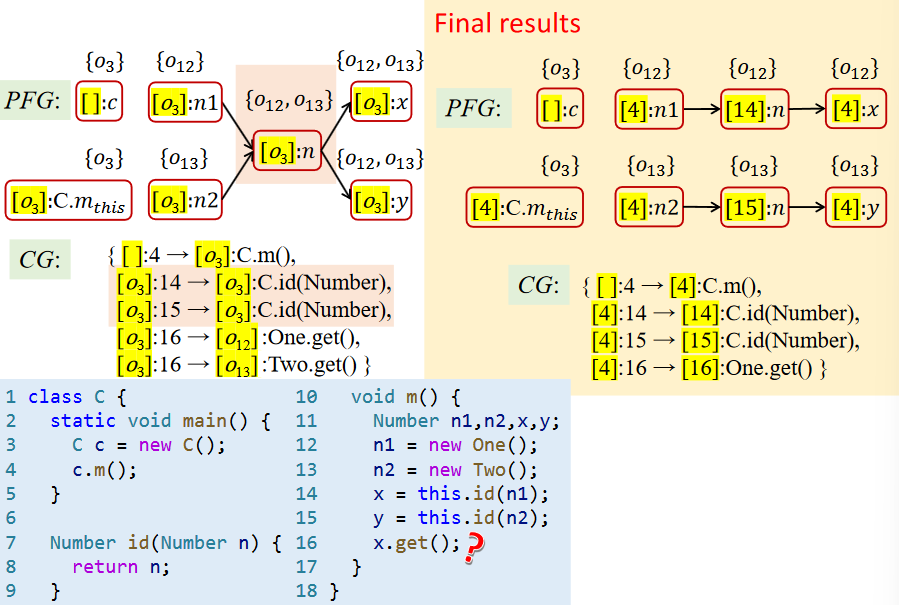

From above, we can see that

For 1 limitation, when the same method of the same receiver object is called multiple times , the object sensitivity may not be precise; when there is multiple layers of nested calls, the call-site sensitivity may not be precise.

Call-Site vs. Object Sensitivity

* In theory, their precision is incomparable
* In practice, object sensitivity generally outperforms call-site sensitivity for OO languages.

## Type sensitivity

Each context consists of a list of types

At a method call, use the type containing the allocation site of the receiver object with its heap context as callee context.(A coarser abstraction over object sensitivity)

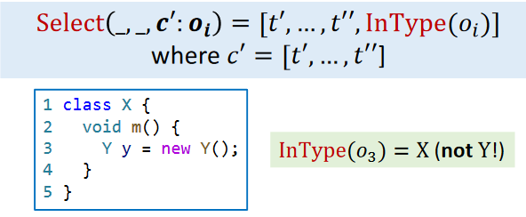

Under the same k-limiting, the precision of type sensitivity is no better than object sensitivitiy.

Compared to object sensitivity, type sensitivity trades precision for better efficiency, by merging the allocation sites in the same type in contexts.

In practice, type sensitivity is less precise but more efficient than object sensitivitity.

In general:

* Precision: object > type > call-site
* Efficiency: type > object > call-site

