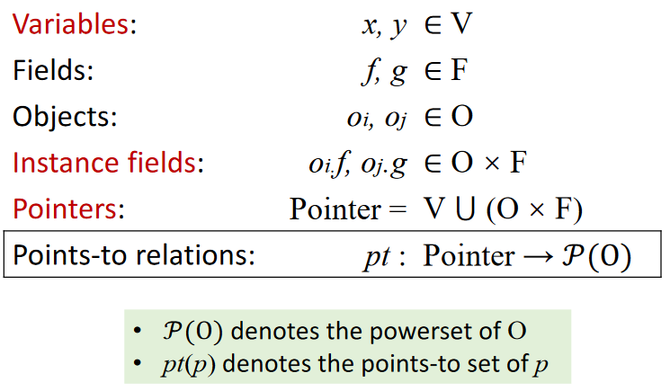
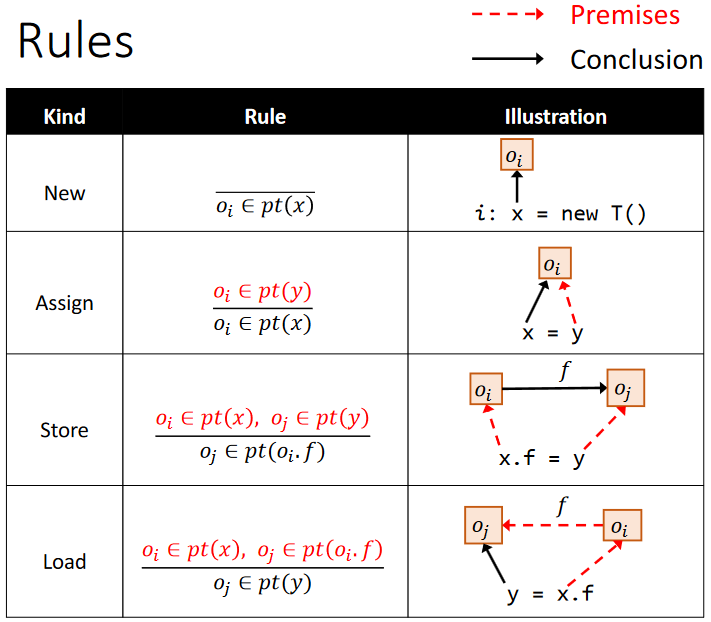
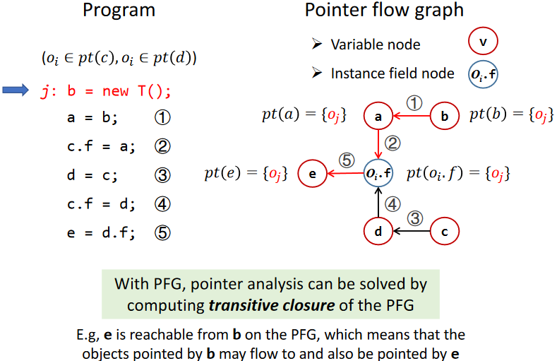
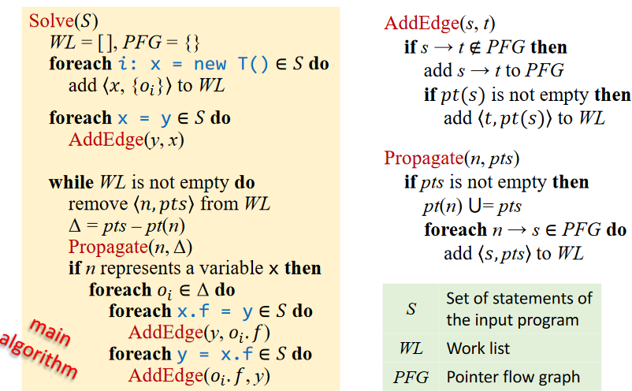
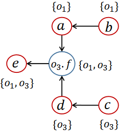
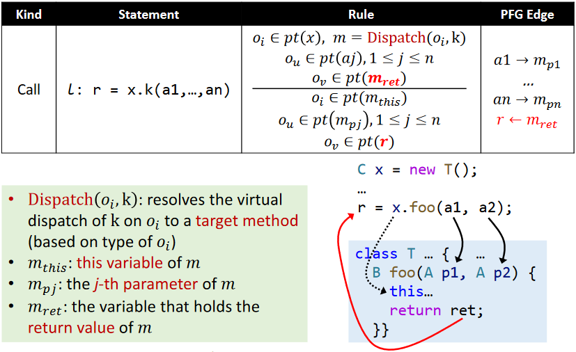
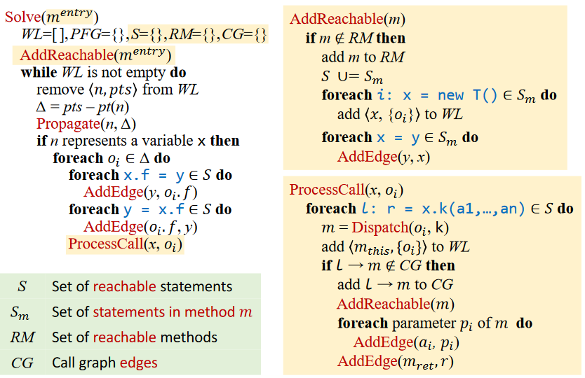
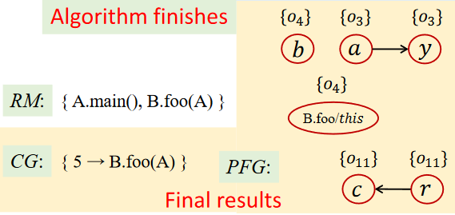

# 	Rule

Domain and Notations





Essentially, pointer analysis is to propagate points-to information among pointers (variables & fields)

It’s about solving a system of inclusion constraints for pointers

Key to implementation: when pt(x) is changed, propagate the changed part to the related pointers of x

# PFG

Pointer flow graph of a program is a directed graph that expresses how objects flow among the pointers in the program.

* Nodes: Pointer = V ⋃ (O × F)
  A node n represents a variable or a field of an abstract object
* Edges: Pointer × Pointer
  An edge x->y means that the objects pointed by pointer x may flow to (and also be pointed to by) pointer y



As shown above, the building of PFG depends on some points-to information which need a PFG to be obtained from.

So PFG is dynamically updated during pointer analysis.

# Algorithm



> Why ∆ = pts - pt(n) ?
>
> differential propagation: avoid redundant propagation of points-to information and infinite loop.

When a edge is added to PFG, we need to propagate the source’s points-to information(if not empty) to the target.

When a node’s pointer set is updated, we need to propagate the differential information to it’s successors.

An Example:

```java
1 b = new C();
2 a = b;
3 c = new C();
4 c.f = a;
5 d = c;
6 c.f = d;
7 e = d.f;
```

* Init

WL: [<b, {o1}>、<c, {o3}>]

PFG: b->a、c->d

pt(b) = {}、pt(a) = {}、pt(c) = {}、pt(d) = {}

* Round 1

process `<b, {o1}>`

pt(b) = {o1}

WL: [<c, {o3}>、<a, {o1}>]

PFG: b->a、c->d

* Round 2

process `<c, {o3}>`

pt(b) = {o1}、pt(c) = {o3}

WL: [<a, {o1}>、<d, {o3}>]

PFG: b->a、c->d、a->o3.f、d->o3.f

* Round 3

process `<a, {o1}>`

pt(b) = {o1}、pt(c) = {o3}、pt(a) = {o1}

WL: [<d, {o3}>、<o3.f, {o1}>]

PFG: b->a、c->d、a->o3.f、d->o3.f

* Round 4

process `<d, {o3}>`

pt(b) = {o1}、pt(c) = {o3}、pt(a) = {o1}、pt(d) = {o3}

WL: [<o3.f, {o1}>、<o3.f, {o3}>]

PFG: b->a、c->d、a->o3.f、d->o3.f、o3.f->e

* Round 5

process `<o3.f, {o1}>`

pt(b) = {o1}、pt(c) = {o3}、pt(a) = {o1}、pt(d) = {o3}

pt(o3.f) = {o1}

WL: [<o3.f, {o3}>、<e, {o1}>]

PFG: b->a、c->d、a->o3.f、d->o3.f、o3.f->e

* Round 6

process `<o3.f, {o3}>`

pt(b) = {o1}、pt(c) = {o3}、pt(a) = {o1}、pt(d) = {o3}

pt(o3.f) = {o1, o3}

WL: [<e, {o1}>、<e, {o3}>]

PFG: b->a、c->d、a->o3.f、d->o3.f、o3.f->e

* Round 7

process `<e, {o1}>`

pt(b) = {o1}、pt(c) = {o3}、pt(a) = {o1}、pt(d) = {o3}

pt(o3.f) = {o1, o3}、pt(e) = {o1}

WL: [<e, {o3}>]

PFG: b->a、c->d、a->o3.f、d->o3.f、o3.f->e

* Round 8

process `<e, {o3}>`

pt(b) = {o1}、pt(c) = {o3}、pt(a) = {o1}、pt(d) = {o3}

pt(o3.f) = {o1, o3}、pt(e) = {o1, o3}

WL: []

PFG: b->a、c->d、a->o3.f、d->o3.f、o3.f->e



#   PTA with Method Calls

inter-procedural pointer analysis requires call graph

* CHA
  * resolve call targets based on the class hierarchy of caller’s declared type
  * imprecise, introduce spurious call graph edges and points-to relations
* Pointer analysis
  * resolve call targets based on pt(receiver object)
  * more precise than CHA, both for call graph and points-to relations



> Why not add PFG edge x->m~this~
>
> Receiver object should only flow to this variable of the corresponding target method
>
> PFG edge x->m~this~ would introduce spurious points-to relations for this variables
>
> `this` variable is special as it can determine the real class type containing the called method

Obviously pointer analysis and call graph construction are mutually dependent.(The former needs call graph to provide call & return information to achieve interprocedural analysis.The latter needs pointer analysis to provide points-to information to obtain more precise call relations.)

To be efficient, only reachable methods and statements are analyzed. Reachable methods will be gradually discovered during analysis.



When a variable’s points-to information changes, find if statements like `load`、`store`、`call` exists.

When a called method is found, dispatch it first, propagate the points-to information to `this` variable in the method, try to add the method to the reachable method(extract it’s `New` and `Assign` statements), add edge between arguments and parameters, return variable and return-site variable.

An Example:

```java
1 class A {
2 	static void main() {
3 	 	A a = new A();
4 	 	A b = new B();
5 	 	A c = b.foo(a);
6 	}
7 	A foo(A x) { … }
8 }
9 class B extends A {
10 	A foo(A y) {
11 		A r = new A();
12 		return r;
13   }
14 }
```

* Initialization

RM = {A.main()}

WL = [<a, {o3}>、<b, {o4}>]

CG = {}

* Round 1

Process `<a, {o3}>`

pt(a) = {o3}

RM = {A.main()}

WL = [<b, {o4}>]

* Round 2

Process `<b, {o4}>`

pt(a) = {o3}、pt(b) = {o4}

Dispatch(o4.class, foo) = B.foo(A)

CG = {5->B.foo(A)}

RM = {A.main(), B.foo(A)}

WL = [<B.foo/this, {o4}>、<r, {o11}>、<B.foo.y, {o3}>]

PFG = {a->y, r->c}

* Round 3

Process `<B.foo/this, {o4}>`

pt(a) = {o3}、pt(b) = {o4}、pt(B.foo/this)= {o4}

CG = {5->B.foo(A)}

RM = {A.main(), B.foo(A)}

WL = [<r, {o11}>、<y, {o3}>]

PFG = {a->y, r->c}

* Round 4

Process `<r, {o11}>`

pt(a) = {o3}、pt(b) = {o4}、pt(B.foo/this)= {o4}、pt(r) = {o11}

CG = {5->B.foo(A)}

RM = {A.main(), B.foo(A)}

WL = [<y, {o3}>, <c, {o11}>]

PFG = {a->y, r->c}

* Round 5

Process `<y, {o3}>`

pt(a) = {o3}、pt(b) = {o4}、pt(B.foo/this)= {o4}、pt(r) = {o11}

pt(y) = {o3}

CG = {5->B.foo(A)}

RM = {A.main(), B.foo(A)}

WL = [<c, {o11}>]

PFG = {a->y, r->c}

* Round 6

Process `<c, {o11}>`

pt(a) = {o3}、pt(b) = {o4}、pt(B.foo/this)= {o4}、pt(r) = {o11}

pt(B.foo.y) = {o3}、pt(c) = {o11}

CG = {b.foo(a)->B.foo(A)}

RM = {A.main(), B.foo(A)}

WL = []

PFG = {a->y, r->c}


