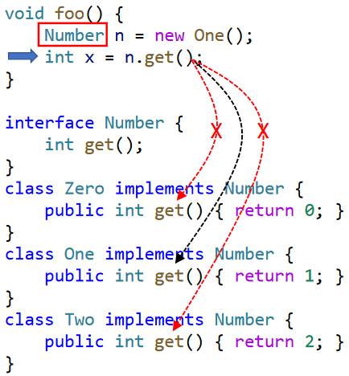
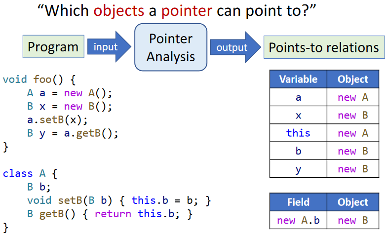
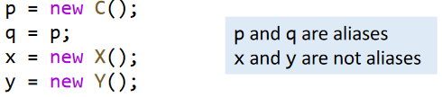
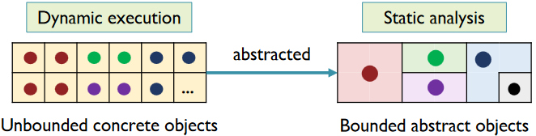
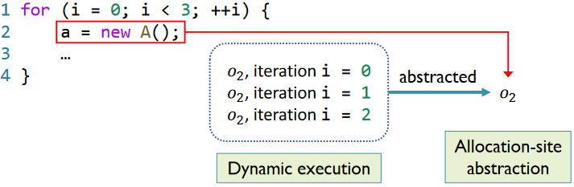
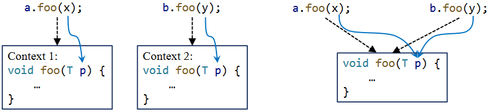
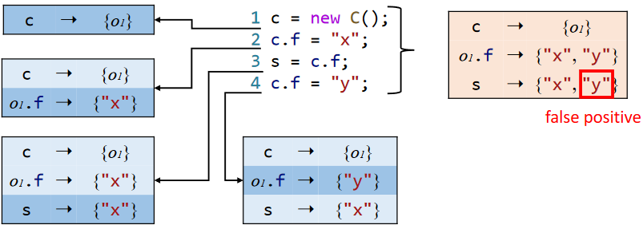
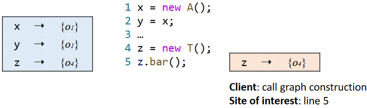

# Pointer Analysis

## Intro

problem of CHA：impression

CHA only considers class hierarchy(ignores data-flow information)

Constant Propagation result: `x = NAC`（imprecise）

introducing Pointer Analysis~ 

It is a fundamental static analysis based on points-to relation. For java, it computes which objects a pointer (variable or field) can point to.(over-approximation/may analysis)

Two closely related but different concepts

* Pointer analysis: which objects a pointer can point to?
* Alias analysis: can two pointers point to the same object?

alias information can be derived from points-to relations

Applications of Pointer Analysis:

* Fundamental information
  * Call Graph、aliases
* Compiler optimization
  * Virtual call inlining
* Bug detection
  * Null pointer detection
* Security analysis
  * information flow analysis
* ......

> Pointer analysis is one of the most fundamental static program analyses,on which virtually all others are built.

## Factors

Multiple factors affect the precision and efficiency of the pointer analysis.

| Factor              |                  Problem                  |                 Choice                 |
| ------------------- | :---------------------------------------: | :------------------------------------: |
| Heap abstraction    |          how 2 model heap memory          |       allocation-site、storeless       |
| Context sensitivity |        how 2 model calling context        | context-sensitive、context-insensitive |
| Flow sensitivity    |         how 2 model control flow          |    flow-sensitive、flow-insensitive    |
| Analysis scope      | which parts of program should be analyzed |      whole-program、demand-driven      |

### Heap Abstraction

In dynamic execution, the number of heap objects can be unbounded due to loops and recursion.

To ensure termination, heap abstraction models dynamically allocated, unbounded concrete objects as finite abstract objects for static analysis

The most commonly-used heap abstraction is allocation-site abstraction

* Model concrete objects by their allocation sites
* One abstract object per allocation site to represent all its allocated concrete objects

### Context Sensitivity

|                     Context-sensitive                     | Context-insensitive                    |
| :-------------------------------------------------------: | -------------------------------------- |
|    Distinguish different calling contexts of a method     | Merge all calling contexts of a method |
| Analyze each method multiple times, once for each context | Analyze each method once               |

obviously context-insensitive analysis may lose precision.

### Flow Sensitivity

|                        Flow-sensitive                        |                       Flow-insensitive                       |
| :----------------------------------------------------------: | :----------------------------------------------------------: |
|        Respect the execution order of the statements         | Ignore the control-flow order, treat the program as a set of unordered statements |
| Maintain a map of points-to relations at each program location | Maintain one map of points-to relations for the whole program |

All data-flow analyses we’ve learnt previously are flow-sensitive

There is no hard evidence shows that flow-sensitive analysis shows a lot of greater performance than flow-insensitive analysis in Java. So we choose flow-insensitive analysis.

### Analysis Scope

|                        Whole-program                         | Demand-driven                                                |
| :----------------------------------------------------------: | ------------------------------------------------------------ |
| Compute points-to information for all pointers in the program | Only compute points-to information for the pointers that may affect specific sites of interest (on demand) |
|         Provide information for all possible clients         | Provide information for specific client                      |

There may be duplicate computation of points-to information if many demand-driven tasks are required.

In this lecture, we conduct pointer analysis base on:

* allocation-site heap abstraction
* context-sensitive/context-insensitive analysis (both will be discussed)
* Flow-insensitive analysis
* whole-program analysis-scope

## Concerned statements

We only focus on pointer-affecting statement

pointers in Java:

* Local variable: x
* Static field: C.f
* Instance field: x.f
* Array element: array[i]

In this lecture, we focus on local variables and instance field

Pointer-Affecting Statements:

* New
  * `x = new T()`
* Assign
  * `x = y`
* Store
  * `x.f = y`
* Load
  * `y = x.f`
* Call
  * `r = x.k(a, …)`

