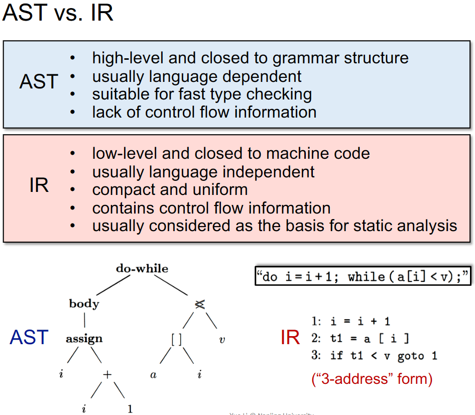

# 0x00 Resource

[Static Program Analysis | Tai-e (pascal-lab.net)](http://tai-e.pascal-lab.net/lectures.html)

https://www.bilibili.com/video/BV1b7411K7P4

NOTEs Are From Online Shared Course *Static Program Analysis* conducted by Teacher Yue Li and Tian Tan in NJU. Here I appreciate these two teachers for your selfless sharing. 😭

# 0x01 Intro

Programming Languages（PL）can not live without Program analysis

Why Need Static Analysis：

* Program Reliability

  Null pointer dereference、memory leak（malloc without free）

* Program Security

  Private information leak、injection attack

* Compiler Optimization

  Dead code elimination、code motion

* Program Understanding

  IDE call hierarchy、type indication

Static analysis analyzes a program P to reason about its behaviors and determines whether it satisfies some properties before running P

> Rice's Theorem：
>
> Any non-trivial property of the behavior of programs in a r.e. language is undecidable
>
> r.e. (recursively enumerable) = recognizable by a Turing-machine
>
> A property is trivial if either it is not satisfied by any r.e. language, or if it is satisfied by all r.e. languages; otherwise it is non-trivial.
>
> non-trivial properties ≈ the properties related with run-time behaviors of programs

So there is no perfect static analysis strategy

* Sound  ≈  误报
* Complete   ≈  漏报

But we can make some compromises to reach a useful static analysis

* Compromise soundness (false negatives)
* Compromise completeness (false positives)

Mostly compromising completeness: Sound but not fully-precise static analysis

Static Analysis: ensure (or get close to) soundness, while making good trade-offs between analysis precision and analysis speed

How to Do Static Analysis：

* Abstraction
* Over-approximation
  * Transfer functions：
    * define how to evaluate different program statements on abstract values.
    * defined according to “analysis problem” and the “semantics” of different program statements
  * Control flows
    * flow merging

# 0x02 Intermediate Representation

## Compiler Structure

How does Compiler work?

传统编译器架构：

* Frontend：前端

  * Lexical Analysis：词法分析
  * Syntax Analysis：语法分析
  * Semantic Analysis：语义分析
  * Translator：生成中间代码（Intermediate Representation）

* Optimizer：优化器

* Backend：后端

  Code Generator生成机器码

## 3-Address Code

Whay IR？

3-Address Code（3AC）

* There is at most one operator on the right side of an instruction
* Each 3AC contains at most 3 address

Address can means：

* Name
* Constant
* Compiler-generated temporary variable

> Soot is one of the most popular static analysis framework for Java
>
> Soot's IR is Jimple：typed 3-address code

> JVM complement：
>
> invoke special：call constructor、superclass methods、private methods
>
> invoke virtual：instance methods call（virtual dispatch）
>
> invoke interface：checking interface implement
>
> invoke static：call static methods
>
> invoke dynamic：dynamic language runs on JVM
>
> methods signature：
> <class name: return type method name(param1 type, param2 type,...)>

## Control Flow Graph

* Building Control Flow Graph（CFG）
* CFG serves as the basic structure for static analysis
* The node in CFG can be an individual 3AC（or a Basic Block 【BB】）

Basic Blocks are maximal sequences of consecutive three-address instructions

* It can be entered only at the beginning
* It can be exited only at the end

Build CFG through BBs

The nodes of CFG are basic blocks

*  There is an edge from block A to block B if and only if
  * There is a conditional or unconditional jump from the end of A to the beginning of B
  * B immediately follows A in the original order of instructions and A does not end in an unconditional jump
* It is normal to replace the jumps to instruction labels by jumps to basic blocks
* Usually we add two nodes, Entry and Exit

# 0x03 Data Flow Analysis

