# Motivation

Most program languages are **imperative** (tells how to do)

On the other hand, there are some program languages are **declarative** (tells what to do, like SQL)

The rules we learn in pointer analysis can be seen as specifications which can be implemented by declarative language.

Compared with imperative languages, declarative language are more:

* succint
* readable（logic-based specification）
* easy to implement

# Intro to Datalog

* Datalog is a declarative logic programming language that is a subset of Prolog
* It emerged as a database language, later found a variety of applications
  * program analysis
  * declarative networking
  * big data
  * cloud computing

`Datalog = Data + Logic`

## predicates

In datalog, a predicate(relation)(谓词) is a set of statements(陈述)

Essentially, a predicate is a table of data, a fact asserts that a particular tuple belongs to a relation.

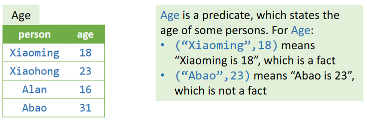

## Atoms

Atoms are basic elements of Datalog, which represent predicates of the form.

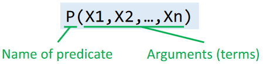

terms can be:

* variables（stand for any value）
* constant

### relational atom

P(X~1~,X~2~,…,X~n~) is called relational atom, it evaluates to true when predicate P contains the tuple described by X~1~,X~2~,…,X~n~

### arithmetic atoms

E.g., age >= 18

## Rules

* Rule is a way of expressing logical inferences
* Rule also serves to specify how facts are deduced

The form of a rule is

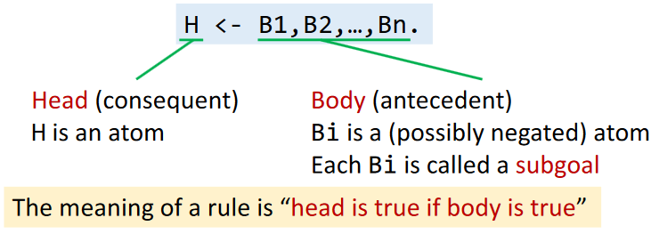

`,` can be read as (logical) and

head is true if all subgoals B1, B2, ..., and Bn are true

```sql
# deduce adults via Datalog rule
Adult(person) <-
	Age(person, age),
	age >= 18
```

There are two ways to express logical or in Datalog

```sql
# multiple rules with the same head
SportFan(person) <- Hobby(person, “jogging”).
SportFan(person) <- Hobby(person,“swimming”).

# use logical or operation ";"
SportFan(person) <-
    Hobby(person,“jogging”);
    Hobby(person,“swimming”).
```

> The precedence of “;” (or) is lower than “,” (and), so disjunctions may be enclosed by parentheses, e.g., H <- A,(B;C)

A subgoal can be a negated atom, which negates its meaning, written as `!B(...)`

```sql
# compute the students who need to take a make-up exam
MakeupExamStd(student) <-
    Student(student),
    !PassedStd(student)
```

How to interpret a rule ?

* Consider all possible combinations of values of the variables in the subgoals
* If a combination makes all subgoals true, then the head atom with corresponding values is also true
* The head predicate consists of all true atoms

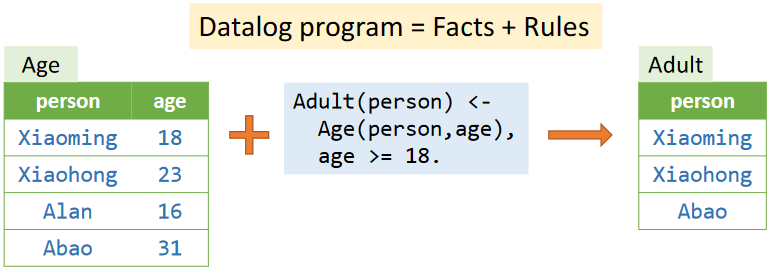

Conventionally, predicates in Datalog are divide into two kinds

* EDB（extensional database）
  * The predicates that are defined in a priori
  * Relations are immutable
  * Can be seen as input relations
* IDB（intensional database）
  * The predicates that are established only by rules
  * Relations are inferred by rules
  * Can be seen as output relations

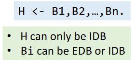

## Recursion

Datalog supports recursive rules, which allows that an IDB predicate can be deduced (directly/indirectly) from itself

* Without recursion, Datalog can only express the queries of basic relational algebra. (Just like SQL)
* With recursion, Datalog becomes much more powerful, and is able to express sophisticated program analyses, such as pointer analysis

```sql
Reach(from, to) <-
	Edge(from, to).

Reach(from, to) <-
	Reach(from, node),
	Edge(node, to).
```

Where `Edge(a,b)` means that the graph has an edge from node `a` to node `b`, and `Reach(a,b)` means that `b` is reachable from `a`.

## Rule Safety

A rule is safe if every variable appears in at least one non-negated relational atom

In Datalog, only safe rules are allowed

```sql
# below two are not safe
A(x) <- B(y), x > y.

A(x) <- B(y), !C(x,y).

# infinite values of x can satisfy the rule, which makes A an infinite relation

# recursion and negation of head are not allowed
A(x) <- B(x), !A(x).
```

## Execution

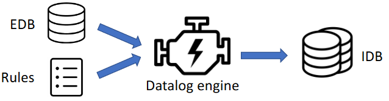

* Datalog engine deduces facts by given rules and EDB predicates until no new facts can be deduced. Some modern Datalog engines：
  * LogicBlox
  * XSB
  * Datomic
  * Flora-2
* Monotonicity: Datalog is monotone as facts cannot be deleted
* Termination: A Datalog program always terminates as
  * Datalog is monotone
  * Possible values of IDB predicates are finite (rule safety)

# Pointer Analysis via Datalog

* EDB：pointer-relevant information that can be extracted from program syntactically
* IDB：pointer analysis results
* Rules：pointer analysis rules

Modle：

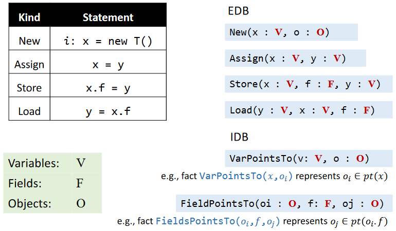

EDB：

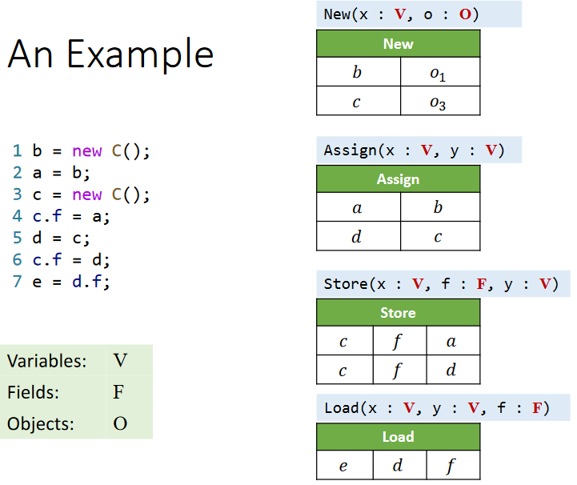

Rule：

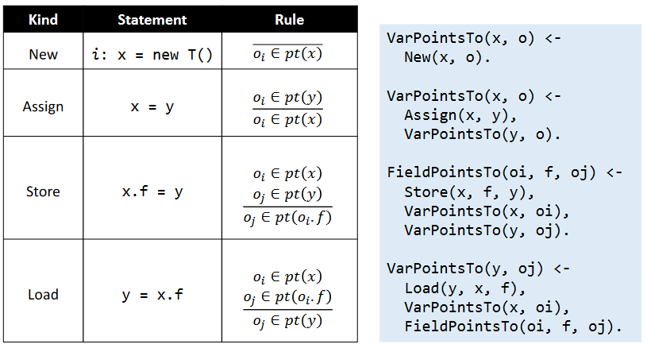

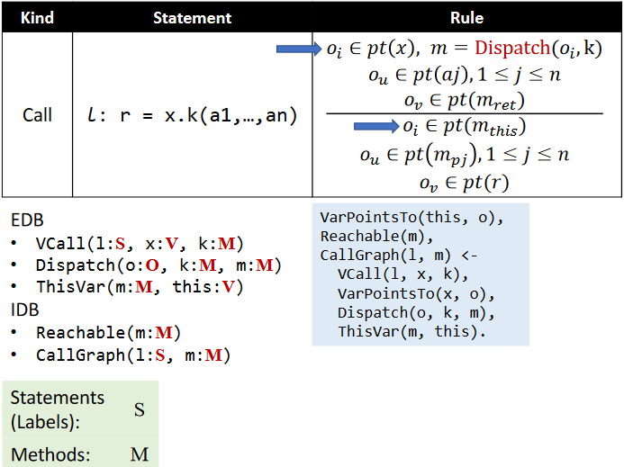

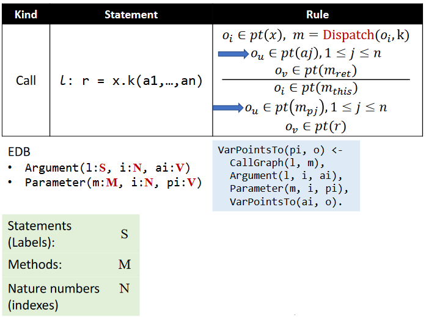

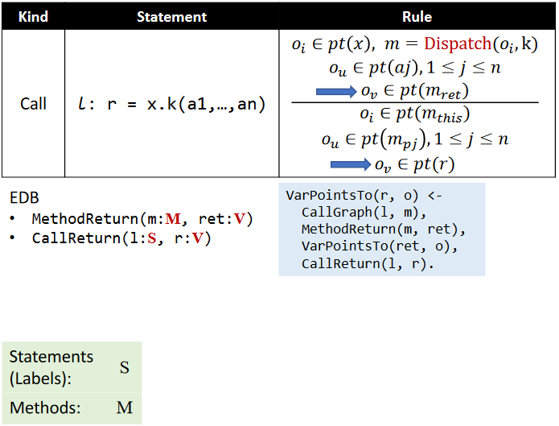

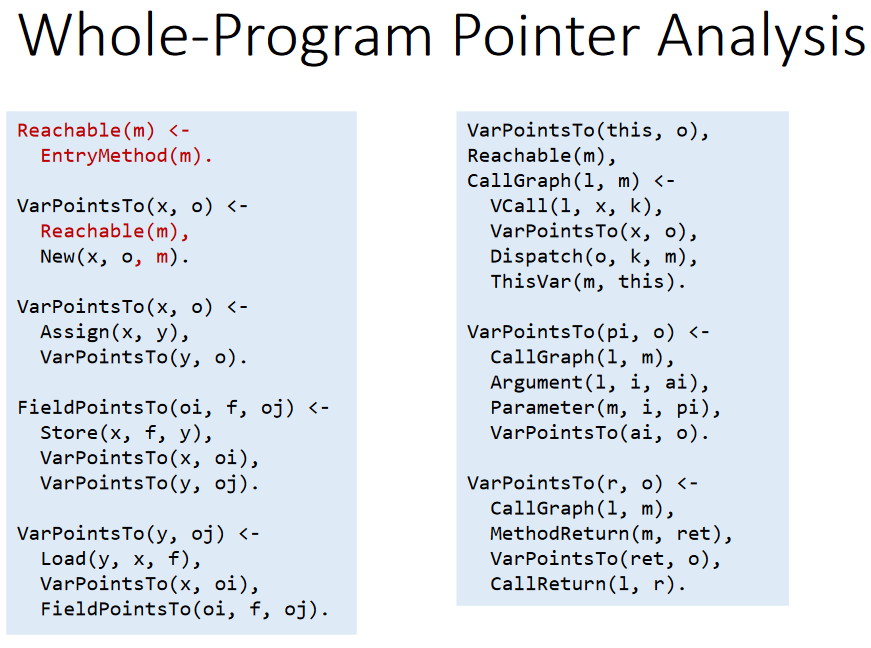

# Taint Analysis via Datalog

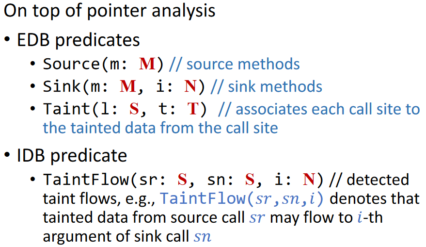

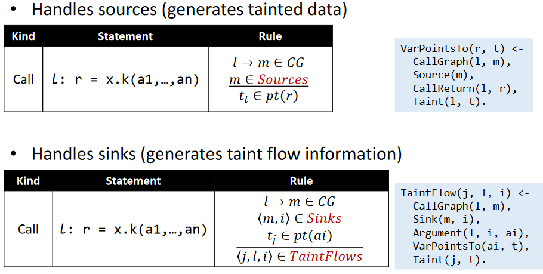

Pros & Cons of Datalog-Based Program Analysis:

* Pros
  * succinct and readable
  * easy to implement
  * benefit from off-the-shelf optimized Datalog engines
* Cons
  * restricted expressiveness, i.e., it is impossible or inconvenient to express some logics
  * Cannot fully control performance