# Information Flow Security

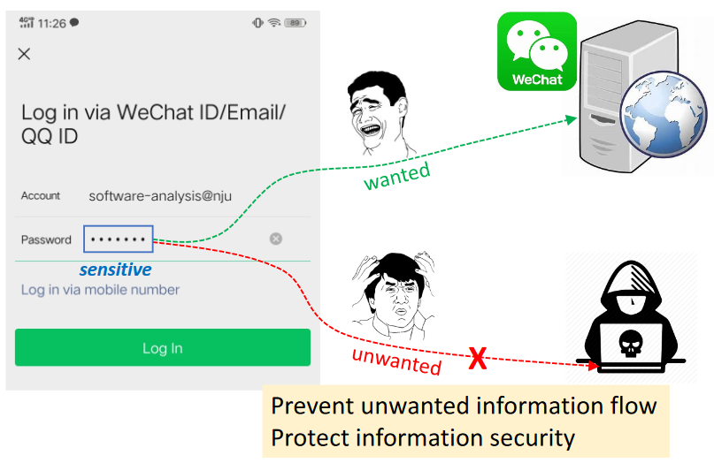

* Access Control(a standard way to protect sensitive data)
  * checks if the program has the right/permissions to access certain information
  * concerns how information is accessed
* Information flow security(end-2-end)
  * tracks how information flows through the program to make sure that the program handles the information securely
  * concerns how information is propagated

> "A practical system needs both access and flow control to satisfy all security requirements." ——— D. Denning, 1976

Both access control and flow control complement each other. We are not sure how information is used after accessed. So we need information flow control to keep the information under watch.

**Information Flow**: if the information in variable *x* is transfered to variable *y*, then there is information flow *x*->*y*

how to connect information flow to security ?

* Classifies program variables into different security levels
* Specifies permissible flows between these levels,i.e.,information flow policy

The most basic model is two-level policy, i.e., a variable is classified into one of two security levels(high security and low security)

Security levels can be modeled as *lattice* *L≤H*

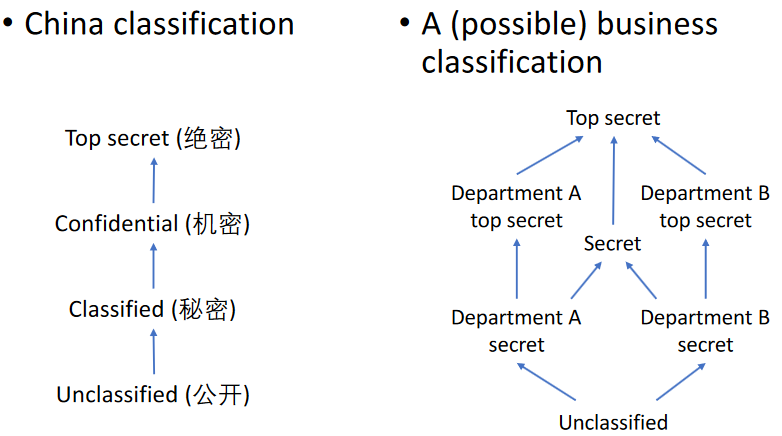

information flow policy restricts how information flows between different security levels.

Noninterference policy

* requires the information of high variable have no effect on the information of low variables
* that is, not able to conclude anything about high information by observing low variables

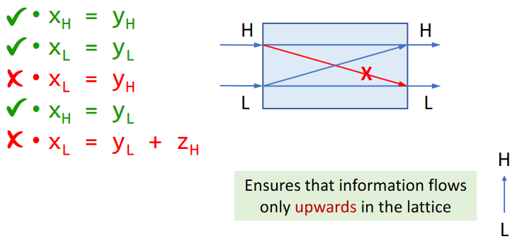

As seen above, low variables can override high variables which cannot provide integrity of high security information.

# Confidentiality and Integrity

Confidentiality

* Prevent secret information from being leaked

Integrity

* Prevent untrusted information from corrupting (trusted) critical information
* i.e., Injection attack

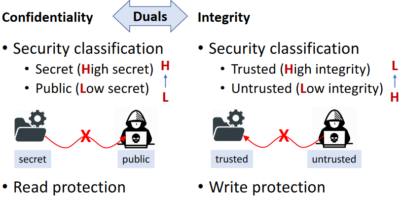

# Explicit Flows and Convert Channels

We have seen how information flows through direct copying.This is called explicit flow.(X~L~=Y~H~)

but there are also some implicit flows.

It may arise when the control flow is affected by secret information.

Any differences in side effects under secret control encode information about the control, which may be publicly observable and leak secret informatio

(convert channel: 隐蔽信道)

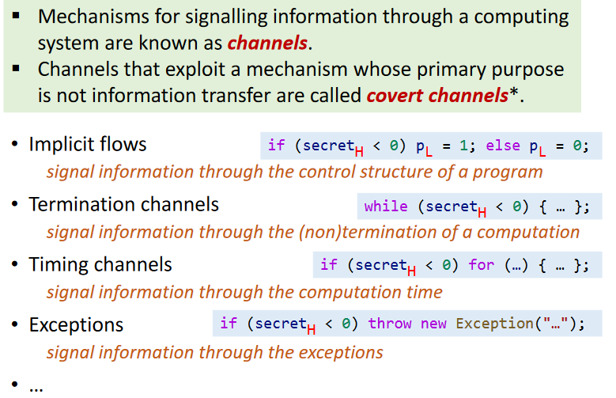

However, explicit flows generally carry more information than covert channels, so we focus on explicit flow.

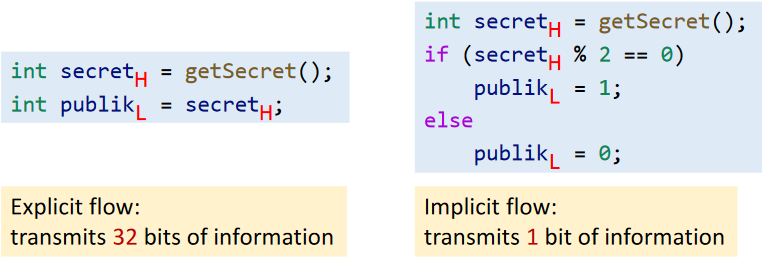

# Taint Analysis

Taint analysis is the most common information flow analysis. It classifies program data into two kinds:

* Data of interest, some kinds of labels are associated with the data, called tainted data
* Other data, called untainted data

Sources of tainted data is called sources. In practice, tainted data usually come from the return values of some methods (regarded as sources).

Taint analysis tracks how tainted data flow through the program and observes if they can flow to locations of interest (called sinks). In practice, sinks are usually some sensitive methods.

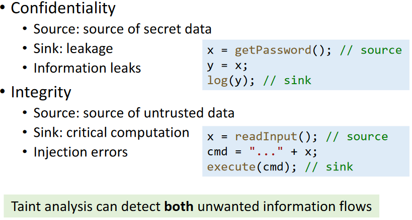

taint analysis and pointer analysis are very alike.

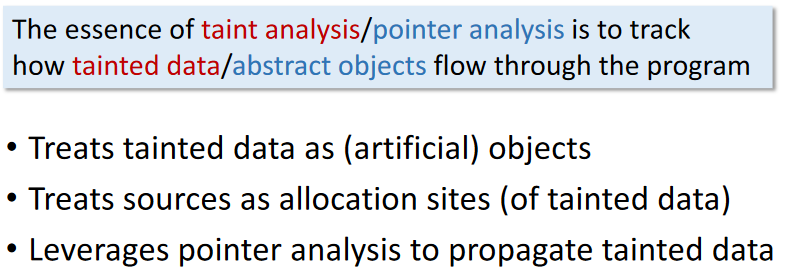

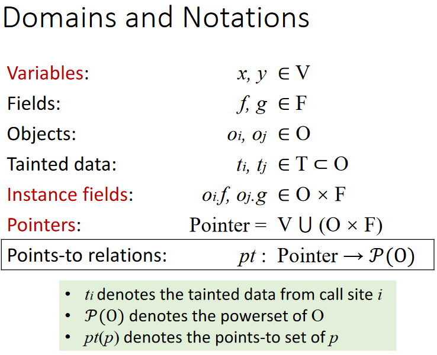

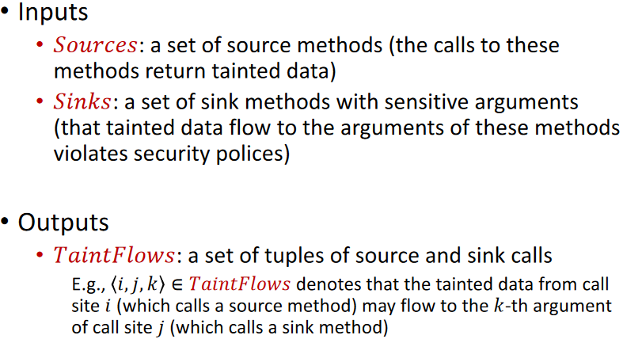

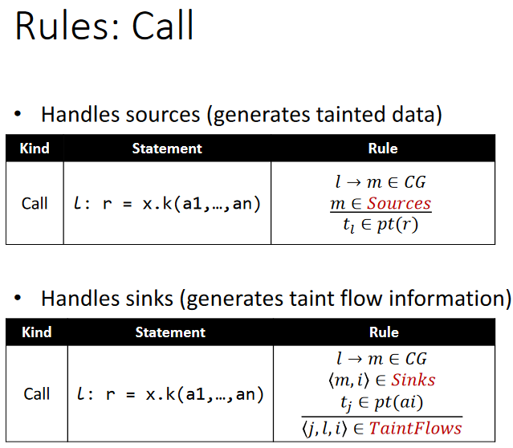

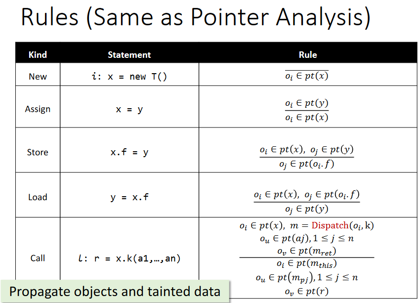

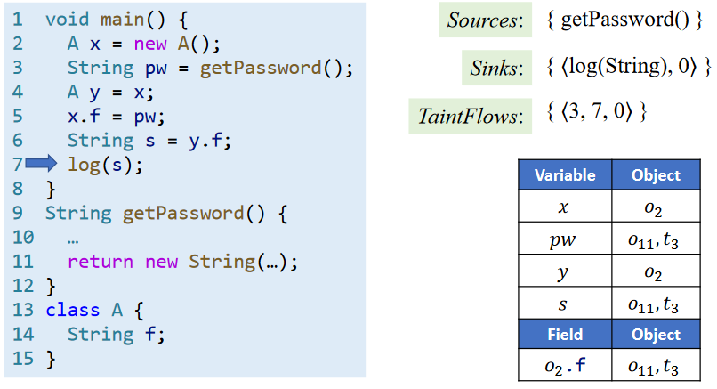