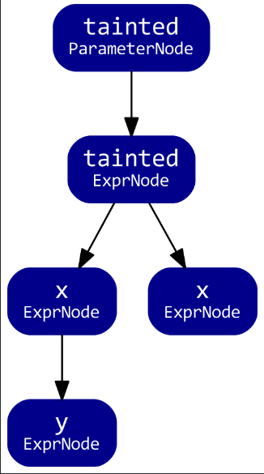

# 0x01 Getting Started

Create Database for java：

> codeql database create test4fun --language="java" --command="mvn clean install --file pom.xml" --source-root=D:\Code\Java\CodeQL\Demo\test1

Get Familiar With This Weird And Wicked Declarative Program🤧

Here is an example：Finding if statements which have an empty then block

```sql
import java

from IfStmt ifStmt, BlockStmt block
where
  block = ifStmt.getThen() and
  block.getNumStmt() = 0
select ifStmt, "This isf-statement has an empty then-block"
```

* Predicate Wrap

```sql
import java

predicate isEmpty(BlockStmt block) {
  block.getNumStmt() = 0
}

from IfStmt ifStmt
where
  isEmpty(ifStmt.getThen())
select ifStmt
```

* Class Wrap

```sql
import java

class EmptyBlock extends BlockStmt{
  EmptyBlock(){
    this.getNumStmt() = 0
  }
}
from IfStmt ifStmt
where
  ifStmt.getThen() instanceof EmptyBlock
select ifStmt
```

Or Use It In This Way

```sql
import java

class EmptyBlock extends BlockStmt{
  EmptyBlock(){
    this.getNumStmt() = 0
  }
}
from IfStmt ifStmt, EmptyBlock block
where
  ifStmt.getThen() = block
select ifStmt
```

# 0x02 Apprentice Lab

`Unsafe deserialization in Apache Struts —— CVE-2017-9805`

Download and unzip👉 [apache_struts_cve_2017_9805.zip database](https://github.com/githubsatelliteworkshops/codeql/releases/download/v1.0/apache_struts_cve_2017_9805.zip)

## Finding XML deserialization

XStream is a Java framework for serializing Java objects to XML used by Apache Struts. It provides a method `XStream.fromXML` for deserializing XML to a Java object. By default, the input is not validated in any way, and is vulnerable to remote code execution exploits. In this section, we will identify calls to `fromXML` in the codebase.

1. 查找程序中的所有方法调用

```sql
import java

from MethodAccess call
select call
```

2. 找到所有方法调用及其对应的方法声明

```sql
import java

from MethodAccess call, Method method
where call.getMethod() = method
select call, method
```

3. 找到程序中所有调用`fromXML`的地方

```sql
import java

from MethodAccess call, Method method
where 
  call.getMethod() = method and
  method.getName() = "fromXML"
select call, method
```

可以简化为

```sql
import java

from MethodAccess fromXML
where 
  fromXML.getMethod().getName() = "fromXML"
select fromXML
```

4. 找出调用`fromXML`方法的第一个参数

```sql
import java

from MethodAccess fromXML, Expr arg
where 
  fromXML.getMethod().getName() = "fromXML" and
  arg = fromXML.getArgument(0)
select fromXML, arg
```

5. 使用谓词包装

```sql
import java

predicate isXMLDeserialized(Expr arg) {
  exists(MethodAccess fromXML | 
    fromXML.getMethod().getName() = "fromXML" and
    arg = fromXML.getArgument(0)  
  )
}

from Expr arg
where isXMLDeserialized(arg)
select arg
```

## Find the implementations of the toObject method from ContentTypeHandler

1. 创建一个`ContentTypeHandler`类，找到`org.apache.struts2.rest.handler.ContentTypeHandler`接口

```sql
import java

class ContentTypeHandler extends RefType {
  ContentTypeHandler() {
      this.hasQualifiedName("org.apache.struts2.rest.handler", "ContentTypeHandler")
  }
}
```

2. 创建一个`ContentTypeHandlerToObject`类，识别`org.apache.struts2.rest.handler.ContentTypeHandler`子类/实现类的`toObject`的方法

```sql
class ContentTypeHandlerToObject extends Method {
  ContentTypeHandlerToObject() {
    this.getName() = "toObject" and
    this.getDeclaringType().getASupertype() instanceof ContentTypeHandler
  }
}
```

3. `toObject`方法应将第一个参数视为不受信任的用户输入。查询`toObject`方法的第一个参数

```sql
from ContentTypeHandlerToObject toObject
select toObject.getParameter(0)
```

## Unsafe XML deserialization

（英文写的很通俗易懂，就直接搬运了）

We have now identified (a) places in the program which receive untrusted data and (b) places in the program which potentially perform unsafe XML deserialization. We now want to tie these two together to ask: does the untrusted data ever *flow* to the potentially unsafe XML deserialization call?

In program analysis we call this a *data flow* problem. Data flow helps us answer questions like: does this expression ever hold a value that originates from a particular other place in the program?

We can visualize the data flow problem as one of finding paths through a directed graph, where the nodes of the graph are elements in program, and the edges represent the flow of data between those elements. If a path exists, then the data flows between those two nodes.

Consider this example Java method:

```java
int func(int tainted) {
   int x = tainted;
   if (someCondition) {
     int y = x;
     callFoo(y);
   } else {
     return x;
   }
   return -1;
}
```

The data flow graph for this method will look something like this:



This graph represents the flow of data from the tainted parameter. The nodes of graph represent program elements that have a value, such as function parameters and expressions. The edges of this graph represent flow through these nodes.

CodeQL for Java provides data flow analysis as part of the standard library. You can import it using `semmle.code.java.dataflow.DataFlow`. The library models nodes using the `DataFlow::Node` CodeQL class. These nodes are separate and distinct from the AST (Abstract Syntax Tree, which represents the basic structure of the program) nodes, to allow for flexibility in how data flow is modeled.

```sql
/**
* @kind path-problem
*/
import java
import semmle.code.java.dataflow.DataFlow
import DataFlow::PathGraph

class ContentTypeHandler extends RefType {
  ContentTypeHandler() {
    this.hasQualifiedName("org.apache.struts2.rest.handler", "ContentTypeHandler")
  }
}

class ContentTypeHandlerToObject extends Method {
  ContentTypeHandlerToObject() {
    this.getName() = "toObject" and
    this.getDeclaringType().getASupertype() instanceof ContentTypeHandler
  }
}


predicate isXMLDeserialized(Expr arg) {
  exists(MethodAccess fromXML | 
    fromXML.getMethod().getName() = "fromXML" and
    arg = fromXML.getArgument(0)  
  )
}


class StrutsUnsafeDeserializationConfig extends DataFlow::Configuration {
  StrutsUnsafeDeserializationConfig() { this = "StrutsUnsafeDeserializationConfig" }
  override predicate isSource(DataFlow::Node source) {
    exists(ContentTypeHandlerToObject toObject |
      source.asParameter() = toObject.getParameter(0)
    )
  }
  override predicate isSink(DataFlow::Node sink) {
    exists(Expr arg |
      isXMLDeserialized(arg) and
      sink.asExpr() = arg
    )
  }
}

from StrutsUnsafeDeserializationConfig config, DataFlow::PathNode source, DataFlow::PathNode sink
where config.hasFlowPath(source, sink)
select sink, source, sink, "Unsafe XML deserialization"
```

# 0x03 CodeQL Recipe for Java

## RefType

> getACallable() 获取所有可以调用方法(包括构造方法)
>
> getAMember() 获取所有成员，其中包括调用方法，字段和内部类
>
> getAField() 获取所有字段
>
> getAMethod() 获取所有方法
>
> getASupertype() 获取父类
>
> getAnAncestor() 获取所有的父类相当于递归的getASupertype*()
>
> hasQualifiedName(packageName, className) 标识具有给定包名和类名的类

## Method

> getName() 获取类名
>
> getDeclaringType()  获取方法的声明类型
>
> getParameter(int index) 获取索引为index的参数（索引从0开始）