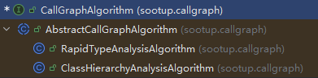
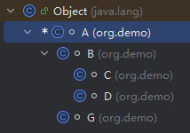
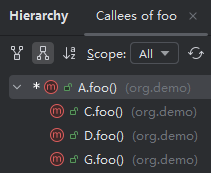
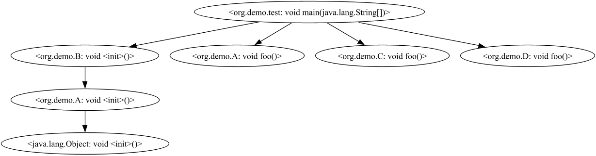
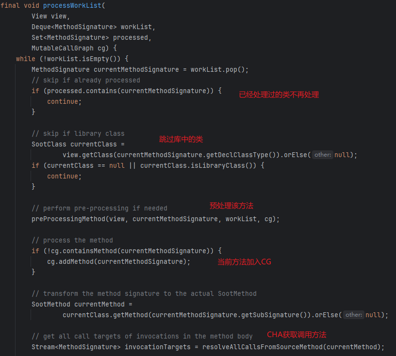
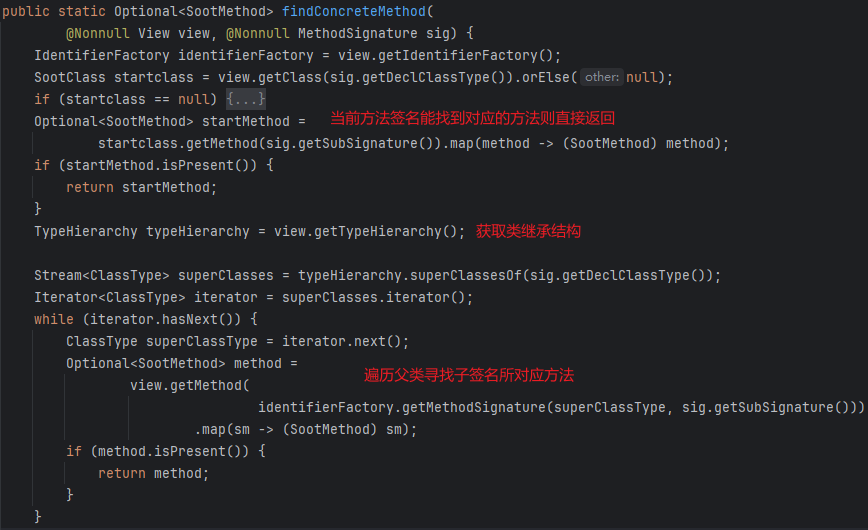
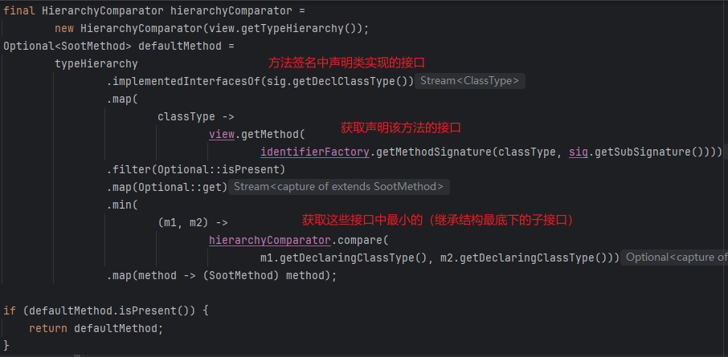
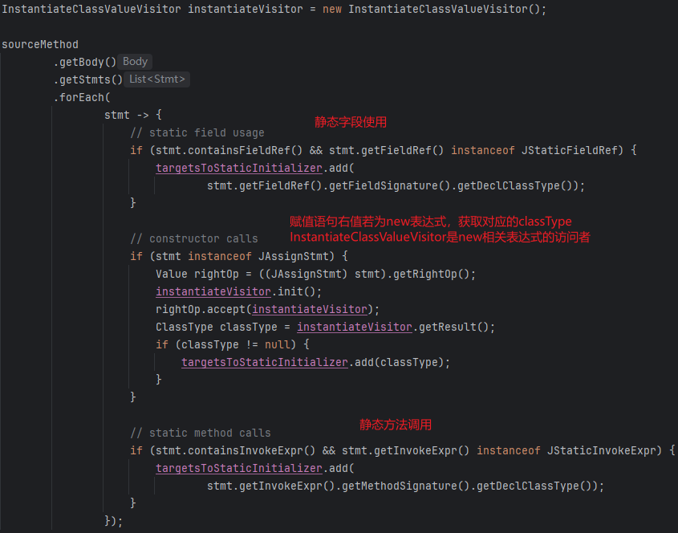
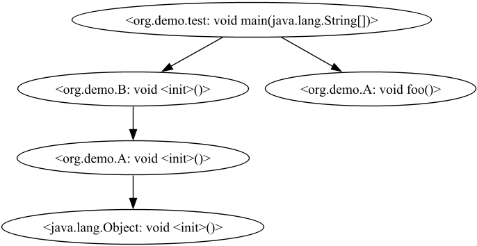
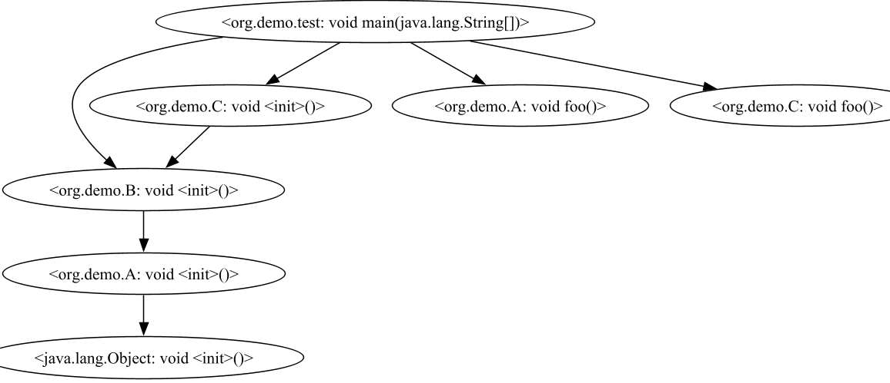

# Call Graph

进行过程间分析（Interprocedural Analysis，跨函数分析）前需要有函数调用图。

调用图是程序中调用关系的一种表示方式


JVM中的几种调用指令👇

|                  | Static Call    |                         Special Call                         |          Virtual Call          |
| :--------------: | -------------- | :----------------------------------------------------------: | :----------------------------: |
|   instruction    | invokestatic   |                        invokespecial                         | invokeinterface、invokevirtual |
| receiver objects | ×              |                              √                               |               √                |
|   description    | static methods | constructors、private instance methods、superclass instance methods |     other instance methods     |
|  target methods  | 1              |                              1                               |        ≥1(polymorphism)        |
|   determinacy    | Compile-time   |                         Compile-time                         |            Run-time            |

由于Java语言的多态特性，虚方法的调用是在动态执行时分派的，子类可能重写了父类的方法，我们无法通过静态分析确定实际调用的方法，因此只能做`May Analysis`。

`SootUp`目前提供了两种构建调用图的方法，分别是CHA和RTA



# CHA

Class Hierarchy Analysis（CHA）是根据`receiver variable`的声明类型来解析`virtual call`的，需要有类继承树的信息。

```java
A a = ...
a.foo()
```

这里变量`a`的声明类型是`A`，但实际上`a`可能`new`的是`A`类本身或者`A`的子类。

因此这里找的调用方法是`A`类的`foo`方法，以及所有能够继承到`A`类`foo`方法的子类重写的`foo`方法。

在`SootUp`中也提供了CHA的相关接口。

## Best Practice

以下面程序为例

```java
package org.demo;

class A {
    public void foo(){}
}

class B extends A {
}

class G extends A {
    public void foo() {}
}

class C extends B {
    public void foo() {}
}

class D extends B {
    public void foo() {}
}


public class test {
    public static void main(String[] args) {
        B b = new B();
        b.foo();
    }
}
```

继承关系如下：



IDEA -> navigate -> call hierarchy得到的结果如下：



下面用`SootUp`进行分析

`ClassHierarchyAnalysisAlgorithm`这个类实现了CHA算法

`In this algorithm, every virtual call is resolved to the all implemented overwritten methods of subclasses in the entire class path`

调用图的构建需要有一个入口方法，由入口方法逐步扩大 “reachable world”

`ClassHierarchyAnalysisAlgorithm#initialize`可以传入一个入口方法签名的列表，不传默认会寻找`main`方法

```java
JavaClassPathAnalysisInputLocation inputLocation
    = new JavaClassPathAnalysisInputLocation("target/classes");
JavaView view = new JavaView(inputLocation);

JavaClassType classType = view.getIdentifierFactory().getClassType("org.demo.A");
TypeHierarchy typeHierarchy = view.getTypeHierarchy();
System.out.println("Subclasses of A: " + Arrays.toString(typeHierarchy.subclassesOf(classType).toArray()));

MethodSignature methodSignature = view.getIdentifierFactory().getMethodSignature(
    view.getIdentifierFactory().getClassType("org.demo.test"),
    "main",
    "void",
    Collections.singletonList("java.lang.String[]"));

ClassHierarchyAnalysisAlgorithm cha = new ClassHierarchyAnalysisAlgorithm(view);
CallGraph cg = cha.initialize(Collections.singletonList(methodSignature));
String cgStr = cg.exportAsDot();
Files.write(Paths.get("src/main/resources/CG.dot"), cgStr.getBytes());

// Subclasses of A: [org.demo.G, org.demo.B, org.demo.D, org.demo.C]
```

得到的调用图



显然比IDEA的准确一点。。。

## Implementation

下面看一下`SootUp`中的实现

### find entrypoints

创建一个`ClassHierarchyAnalysisAlgorithm`需要传入`JavaView`，其含有所有类和方法的数据。`initialize`不传参则会寻找`main`方法，具体就是遍历当前`view`中所有的类（除掉`library class`），找到方法签名符合`main`方法签名的方法。

```java
public MethodSignature findMainMethod() {
    Set<SootClass> classes = new HashSet<>();
    for (SootClass aClass : view.getClasses()) {
        if (!aClass.isLibraryClass()) {
            classes.add(aClass);
        }
    }

    Collection<SootMethod> mainMethods = new HashSet<>();
    for (SootClass aClass : classes) {
        for (SootMethod method : aClass.getMethods()) {
            if (method.isStatic()&& method.getSignature().equals(
                JavaIdentifierFactory.getInstance()
                .getMethodSignature(
                    aClass.getType(), "main", "void",
 			Collections.singletonList("java.lang.String[]")))) 				{mainMethods.add(method);}
        }
    }

    return mainMethods.stream().findFirst().get().getSignature();
}
```

### initialize

找到`main`方法后会将其作为`entry point`

`initialize`开始构造CG

```java
final CallGraph constructCompleteCallGraph(View view, List<MethodSignature> entryPoints) {
    MutableCallGraph cg = initializeCallGraph();

    Deque<MethodSignature> workList = new ArrayDeque<>(entryPoints);
    Set<MethodSignature> processed = new HashSet<>();

    // implicit edge from entry point to static initializer
    addImplicitEdgesOfEntryPoints(entryPoints, cg, workList);

    processWorkList(view, workList, processed, cg);
    return cg;
}
```

`worklist`是`Queue`的一个具体实现`Deque`（`Double Ended Queue`，双端队列）

注意这里`worklist`中的元素是方法签名而非方法语句。

将`entryPoints`添加到`worklist`中。

这里就有一点比较tricky的，构造调用图的时候还是考虑到了Java语言的特性

`addImplicitEdgesOfEntryPoints`首先会找`entry point`方法所在类是否有静态初始化方法，即`<clinit>`方法，接着把`entry point`方法和`<clinit>`方法都加入CG，再加个`entry point`到`<clinit>`的调用边，并把`<clinit>`方法加入到`worklist`


### worklist process

接下来就是`worklist`算法启动，`processed`集合用于记录已经`reach`到的方法



从`worklist`里pop出一个方法签名，如果已经在`processed`集合里，就不进行处理。

找出当前方法签名所在类，对方法进行预处理（`preProcessingMethod`，这是一个抽象方法，由`AbstractCallGraphAlgorithm`子类实现），将当前方法签名加入CG。

找出当前方法中所有调用语句指向的`callee`（`resolveAllCallsFromSourceMethod`）

```java
sourceMethod.getBody().getStmts().stream()
    .filter(Stmt::containsInvokeExpr)
    .flatMap(s -> resolveCall(sourceMethod, s.getInvokeExpr()));
```

解析这些方法调用（`resolveCall`由子类实现）

### resolveCall

下面便是CHA的核心算法👇

```java
MethodSignature targetMethodSignature = invokeExpr.getMethodSignature();
if ((invokeExpr instanceof JDynamicInvokeExpr)) {
    return Stream.empty();
}

SootMethod targetMethod = findConcreteMethod(view, targetMethodSignature).orElse(null);

if (targetMethod == null
    || MethodModifier.isStatic(targetMethod.getModifiers())
    || (invokeExpr instanceof JSpecialInvokeExpr)) {
    return Stream.of(targetMethodSignature);
} else {
    ArrayList<ClassType> noImplementedMethod = new ArrayList<>();
    List<MethodSignature> targets =
        resolveAllCallTargets(targetMethodSignature, noImplementedMethod);
    if (!targetMethod.isAbstract()) {
        targets.add(targetMethod.getSignature());
    }
    if (invokeExpr instanceof JInterfaceInvokeExpr) {
        IdentifierFactory factory = view.getIdentifierFactory();
        noImplementedMethod.stream()
            .map(
            classType ->
            resolveConcreteDispatch(
                view,
                factory.getMethodSignature(
                    classType, targetMethodSignature.getSubSignature())))
            .filter(Optional::isPresent)
            .map(Optional::get)
            .forEach(targets::add);
    }
    return targets.stream();
}
```

CHA中，通过`receiver object`的声明类的类结构来获取所有可能的调用目标，声明类的每个子类，只要有调用方法的实现（不管是继承得到的还是重写的），都会被考虑为调用目标。

#### dispatch

`findConcreteMethod`会对方法进行dispatch，即从自身往父类上找，直到找到方法被实现的地方。



`superClassesOf`并不能得到接口的父接口。

这里还考虑了一个Java语言的另一个feature

> Java中接口是可以多继承的（类就不可以）
>
> 而且接口声明的方法不一定要被实现（默认方法default和静态方法static可以不被实现）
>
> 注意，default方法虽然被default修饰，但访问级别是public的

```java
package org.demo;

public interface inter1 {
    default void hack(){
        System.out.println("hack inter1");
    }
}

public interface inter2 {}

public interface inter3 extends inter1, inter2 {
    default void hack(){
        System.out.println("hack inter3");
    }
}

class A implements inter3
```



`implementedInterfacesOf`会找到当前类实现的所有接口，包括父类所实现的接口，以及接口所继承的父接口。（如果传入的`classType`是接口，也能找到其继承的接口）

在这些接口中寻找子签名对应的方法，并获取最小的那个接口中的方法（最小即继承结构最底端，因为对于default方法，子接口是可以重写的）

`B b = new B(); b.hack()`

这里得到的是`<org.demo.inter3: void hack()>`

> 能走到这一步要么是receiver object的声明类是接口，调用的是接口的普通方法
>
> 要么调用的是接口的默认方法或静态方法

`inter3 b = new B(); b.hack();`

改成`inter1`中声明普通方法，A类实现hack接口

这里得到的便是`<org.demo.inter1: void hack()>`

#### specialinvoke&staticinvoke

dispatch之后便对调用类型进行判断

```java
SootMethod targetMethod = findConcreteMethod(...);

if (targetMethod == null
    || MethodModifier.isStatic(targetMethod.getModifiers())
    || (invokeExpr instanceof JSpecialInvokeExpr)) {
    return Stream.of(targetMethodSignature);
```

感觉这里的逻辑有问题，`invoke static`/`invoke special`的一些特殊情况需要dispatch

super和静态方法的调用可能是目标继承得到的方法，通过原方法签名不能直接获取到，不能直接返回`targetMethodSignature`，而应该返回`findConcreteMethod`的得到的`targetMethod`的签名。

#### virtualinvoke

我们主要关注虚方法的调用


`subtypesOf`遍历子类（适用于接口）找非抽象的实现方法

如果子类中没找到这个方法，即子类没有实现它并且子类不是接口，就将子类加入`noImplementedMethod`

接着看子类实现的接口中，如果有子签名对应的默认方法，也加入`targets`

这里`getInterfaces`得到的是类声明时明确写的`implements`后面跟的接口，是直接实现的接口，而非继承得到的。

这么操作的意图不是很懂。。。感觉会引入假的调用边。个人觉得这里的顺序应该这样，先在当前子类拿到method，拿不到再尝试接口的default方法，再拿不到才加入`noImplementedMethod`

#### interfaceinvoke

接着判断若是`invoke interface`，则将上面`noImplementedMethod`再进行dispatch

`resolveConcreteDispatch`还是调的`findConcreteMethod`

### implicit targets

接着还得对当前方法中的一些隐式调用进行处理。

`resolveAllStaticInitializerCallsFromSourceMethod`

对于当前方法中存在的：

* 静态字段使用
* 构造器调用
* 静态方法调用

都会造成对目标类静态初始化方法`clinit`方法的隐式调用



`ClassType#getStaticInitializer`获取这些类的`<clinit>`方法

接着在CG中添加当前方法到这些`<clinit>`方法的调用边

最后对方法进行后处理（`postProcessingMethod`）

# RTA

Rapid Type Analysis（RTA）在CHA的基础上，对不可能调用到的方法进行剪枝。

RTA只关注分析中已经被用于初始化了的类型。

把上面的`ClassHierarchyAnalysisAlgorithm`改成`RapidTypeAnalysisAlgorithm`

得到调用图如下：



因为我们上面并没有对`C`类和`D`类进行实例化，所以这里的结果就只有`A#foo`

如果我们增加一个语句`C c = new C();`

那么结果就会多出一条`C#foo`


