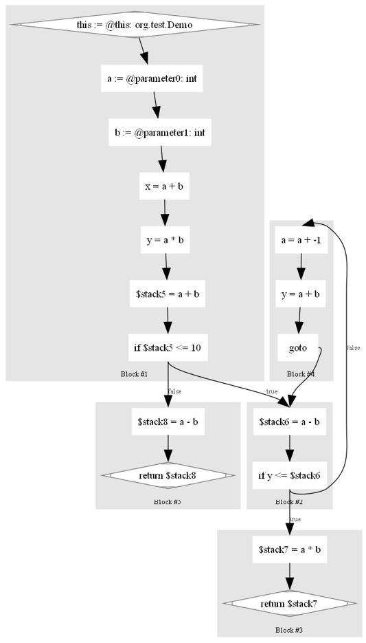

 


```java
package org.test;

public class Demo {
    public int foo(int a, int b) {
        int x = a + b;
        int y = a * b;
        if (a + b > 10) {
            return a - b;
        } else {
            while (y > a - b) {
                a--;
                y = a + b;
            }
            return a * b;
        }
    }
}
```




```java
import sootup.analysis.intraprocedural.ForwardFlowAnalysis;
import sootup.core.graph.BasicBlock;
import sootup.core.graph.StmtGraph;
import sootup.core.jimple.basic.LValue;
import sootup.core.jimple.common.expr.AbstractBinopExpr;
import sootup.core.jimple.common.expr.AbstractUnopExpr;
import sootup.core.jimple.common.expr.Expr;
import sootup.core.jimple.common.stmt.AbstractDefinitionStmt;
import sootup.core.jimple.common.stmt.Stmt;

import javax.annotation.Nonnull;
import java.util.HashSet;
import java.util.Set;

public class AvailExprAnalysis extends ForwardFlowAnalysis<Set<Expr>> {

    public <B extends BasicBlock<B>> AvailExprAnalysis(StmtGraph<B> graph) {
        super(graph);
    }

    // Transfer Function
    @Override
    protected void flowThrough(@Nonnull Set<Expr> in, Stmt d, @Nonnull Set<Expr> out) {
        // NOTICE: intra-procedural analysis, ignore `InvokeStmt`
        Set<Expr> gen = new HashSet<>();
        Set<Expr> kill = new HashSet<>();
        Set<Expr> exists = new HashSet<>();

        d.getUses()
                .filter(v -> v instanceof AbstractBinopExpr || v instanceof AbstractUnopExpr)
                .forEach(v -> {
                    Expr expr = (Expr) v;
                    gen.add(expr);
                    if (in.stream().anyMatch(e -> e.equivTo(v))) {
                        exists.add(expr);
                    }
                });
        out.addAll(in);
        out.addAll(gen);
        out.removeAll(exists);
        if (d instanceof AbstractDefinitionStmt) {
            AbstractDefinitionStmt defStmt = (AbstractDefinitionStmt) d;
            LValue def = defStmt.getLeftOp();
            out.stream()
                    .filter(expr -> expr.getUses().anyMatch(use -> use.equivTo(def)))
                    .forEach(kill::add);
        }
        out.removeAll(kill);
        System.out.println("=======================================");
        System.out.println(d.getClass().getName() + " : " + d);
        System.out.println("In: " + in);
        System.out.println("Out: " + out);
        System.out.println("Gen: " + gen);
        System.out.println("Kill: " + kill);
        System.out.println("=======================================");
    }

    // Boundary
    @Nonnull
    @Override
    protected Set<Expr> newInitialFlow() {
        // 这里不能用`Collections.emptySet();`, 否则会陷入死循环
        return new HashSet<>();
    }

    // Control Flow Merge
    @Override
    protected void merge(@Nonnull Set<Expr> in1, @Nonnull Set<Expr> in2, @Nonnull Set<Expr> out) {
        out.addAll(in1);
        out.retainAll(in2);
    }

    // Helper - shallow copy
    @Override
    protected void copy(@Nonnull Set<Expr> source, @Nonnull Set<Expr> dest) {
        dest.addAll(source);
    }

    public void run() {
        execute();
    }
}
```

```java
import sootup.core.graph.StmtGraph;
import sootup.core.signatures.MethodSignature;
import sootup.java.bytecode.inputlocation.JavaClassPathAnalysisInputLocation;
import sootup.java.core.JavaSootClass;
import sootup.java.core.JavaSootMethod;
import sootup.java.core.types.JavaClassType;
import sootup.java.core.views.JavaView;

import java.util.ArrayList;
import java.util.Collections;
import java.util.Optional;

public class Main {
    public static void main(String[] args) {
        JavaClassPathAnalysisInputLocation inputLocation
                = new JavaClassPathAnalysisInputLocation("target/classes");
        JavaView view = new JavaView(Collections.singletonList(inputLocation));
        JavaClassType classType
                = view.getIdentifierFactory().getClassType("org.test.Demo");
        Optional<JavaSootClass> clazzOpt = view.getClass(classType);
        if (!clazzOpt.isPresent()) {
            System.out.println("Class not found");
            return;
        }
        JavaSootClass clazz = clazzOpt.get();
        MethodSignature methodSignature = view.getIdentifierFactory().getMethodSignature(
                classType,
                "foo",
                "int",
                new ArrayList<String>(2) {
                    {
                        add("int");
                        add("int");
                    }
                });
        Optional<JavaSootMethod> methodOpt = view.getMethod(methodSignature);
        if (!methodOpt.isPresent()) {
            System.out.println("Method not found");
            return;
        }
        JavaSootMethod method = methodOpt.get();
        StmtGraph<?> stmtGraph = method.getBody().getStmtGraph();
        AvailExprAnalysis analysis = new AvailExprAnalysis(stmtGraph);
        System.out.println("======start to analyze======");
        analysis.run();

        stmtGraph.forEach(stmt -> {
            System.out.println("================================================");
            System.out.println(stmt.getClass().getName() + " : " + stmt);
            System.out.println("IN : " + analysis.getFlowBefore(stmt));
            System.out.println("OUT : " + analysis.getFlowAfter(stmt));
            System.out.println("================================================");
        });
    }
}
```

