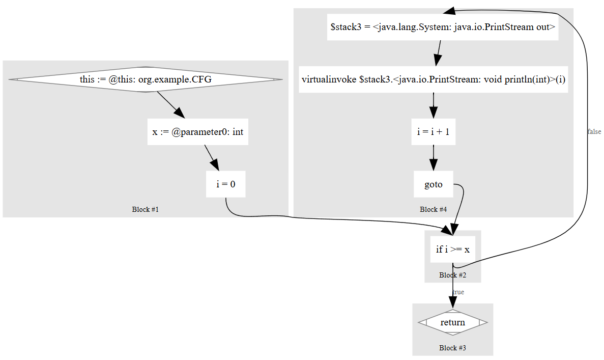

## Getting Started

在利用`SootUp`分析程序之前，需要了解它的一些核心数据结构：

* `AnalysisInputLocation`：指向待载入`View`的目标代码的位置，是`SoutClass`的来源。这个位置可以是Java源代码的路径、Java类路径、JAR文件、Android APK文件、Jimple文件等
* `View`：处理待分析代码的表现形式
* `SootClass`：Soot中类的表示，通过`ClassType`从`View`获取
* `SootMethod`：Soot中类方法的表示，通过`MethodSignature`从`View`获取
* `SootField`：Soot中类字段的表示，通过`FieldSignature`从`View`获取
* `Body`：Soot中方法体的表示
* `StmtGraph`：方法体的控制流图

### Create a View

首先得创建一个`AnalysisInputLocation`指定分析对象所在位置，再将其传入创建一个`JavaView`

查看`AnalysisInputLocation`的实现类对应不同的分析对象


以分析Java源代码为例：

```java
JavaSourcePathAnalysisInputLocation inputLocation
    = new JavaSourcePathAnalysisInputLocation("src/main/resources/");
JavaView view = new JavaView(inputLocation);
```

官方文档（`v1.3.0`）说直接分析源码目前是实验性阶段，通常应该自己先把源码编译成字节码再进行分析

```java
JavaClassPathAnalysisInputLocation inputLocation
    = new JavaClassPathAnalysisInputLocation("target/classes/");
JavaView view = new JavaView(inputLocation);
```

默认情况下，一个类被获取时会被永久存储到缓存中，如果我们不希望类被无限缓存，可以给`View`提供不同的`CacheProvider`。

比如下面的`LRUCache`最多存储50个类，当有一个新的类被获取时，会替代掉最近最少被使用到的类

```java
JavaView view = new JavaView(Collections.singletonList(inputLocation),
                new LRUCacheProvider(50));
```

### Retrieving a Class

每个类都由一个独特的签名来标识，也就是类的全限定名（`fully-qualified class name`, aka `fqcn`），在`SootUp`中是通过`ClassType`来表示一个类的签名的

比如我们要分析的类为

```java
package org.example;

public class HelloWorld {
    public HelloWorld(){}
    public static void main(String[] args) {
        System.out.println("Hello World");
    }
}
```

先定义一个`ClassType`来标识`HelloWorld`类，再利用它从`View`中获取对应的`SootClass`对象。

```java
JavaClassType classType = view.getIdentifierFactory().getClassType("org.example.HelloWorld");

Optional<JavaSootClass> clazzOpt = view.getClass(classType);
if(!clazzOpt.isPresent()){
    System.out.println("Class not found");
    return;
}
JavaSootClass clazz = clazzOpt.get();
```

### Retrieving a Method

类似地，方法也有签名，在`SootUp`中通过`MethodSignature`来表示

比如下面获取`HelloWorld#main`方法

```java
MethodSignature methodSignature = view.getIdentifierFactory().getMethodSignature(
    classType,   // 类签名
    "main",      // 方法名
    "void",      // 返回类型
    Collections.singletonList("java.lang.String[]")  // 参数类型
);
```

接着从`View`中获取对应的`SootMethod`

```java
Optional<JavaSootMethod> methodOpt = view.getMethod(methodSignature);
if(!methodOpt.isPresent()){
    System.out.println("Method not found");
    return;
}
JavaSootMethod method = methodOpt.get();
System.out.printf("Method Signature: %s\n", method.getSignature());
System.out.println(method.getBody());
```

```txt
Method Signature: <org.example.HelloWorld: void main(java.lang.String[])>

[PUBLIC, STATIC]

{
    java.io.PrintStream $stack1;
    java.lang.String[] args;


    args := @parameter0: java.lang.String[];
    $stack1 = <java.lang.System: java.io.PrintStream out>;
    virtualinvoke $stack1.<java.io.PrintStream: void println(java.lang.String)>("Hello World");

    return;
}
```

这里`method.getBody()`返回的就是方法体对应的`Jimple IR`，下一节再细讲`Jimple`

当然也可以从`SootClass`获取它包含的`SootMethod`

```java
MethodSubSignature subSignature = methodSignature.getSubSignature();
System.out.println(subSignature);

Optional<JavaSootMethod> clazzMethod = clazz.getMethod(subSignature);
if(!clazzMethod.isPresent()){
    System.out.println("Method not found");
    return;
}
JavaSootMethod method = clazzMethod.get();
```

`SubSignature`为`void main(java.lang.String[])`，实际上就是去掉了签名的类名部分

### Retrieving the CFG

每个`SootMethod`都包含一个控制流图CFG，由`StmtGraph`表示，这个结构是后面进行程序分析的基础。

```java
StmtGraph<?> stmtGraph = method.getBody().getStmtGraph();
```

`DotExporter`可以将CFG导出为dot文件，再通过`graphviz`等工具查看

以下面的程序为例

```java
package org.example;

public class CFG {
    public void foo(int x){
        for (int i = 0; i < x; i++){
            System.out.println(i);
        }
    }
}
```

生成的`Jimple`：

```java
{
    int i, x;
    java.io.PrintStream $stack3;
    org.example.CFG this;

    this := @this: org.example.CFG;
    x := @parameter0: int;
    i = 0;

  label1:
    if i >= x goto label2;
    $stack3 = <java.lang.System: java.io.PrintStream out>;
    virtualinvoke $stack3.<java.io.PrintStream: void println(int)>(i);
    i = i + 1;

    goto label1;

  label2:
    return;
}
```

下面会打印一个url，可以在线查看和编辑生成的CFG的dot文件

```java
String urlToWebeditor = DotExporter.createUrlToWebeditor(stmtGraph);
        System.out.println(urlToWebeditor);
```



下面会将CFG写入一个dot文件

```java
String dotStr = DotExporter.buildGraph(stmtGraph, false, null, method.getSignature());
Files.write(Paths.get("src/main/resources/CFG.dot"), dotStr.getBytes());
```

`dot -T png .\CFG.dot -o CFG.dot.png`转png图片