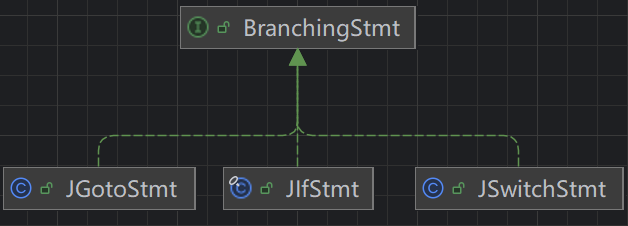
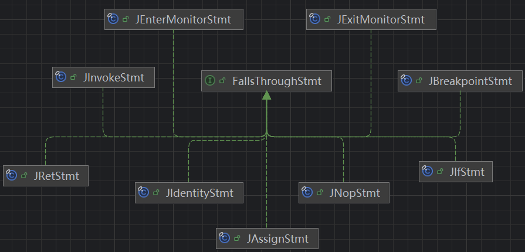
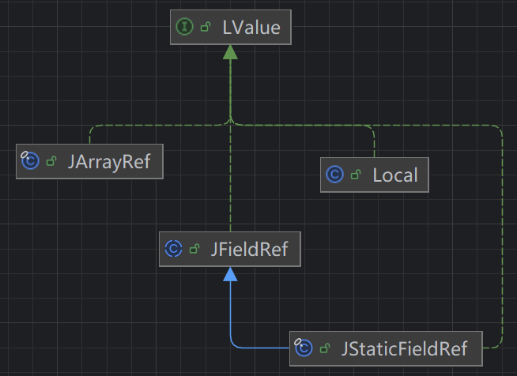
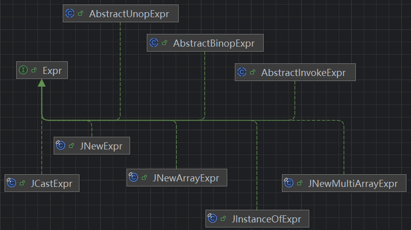

# Jimple IR

> like Java, but simple -> Jimple

`Jimple`是`Soot`采用的中间表示形式`IR`，`Soot`是在IR的基础上进行程序分析的。

JVM字节码是基于栈的语言，不能直观地知道其操作码的意图，而模拟栈的执行相对困难；而Java源代码有着嵌套的结构，也不适合做程序分析。

Jimple IR 作为一种带类型的三地址码（typed 3 Address Code）结合了两者的优点：

* 局部变量，无栈操作，可读性比字节码强
* this和形参有特殊的变量表示
* 只有简单语句，平坦结构非嵌套

三地址码：左边最多一个引用，右边最多两个引用

更多参考：[sable-thesis.pdf (washington.edu)](https://courses.cs.washington.edu/courses/cse501/01wi/project/sable-thesis.pdf)

`Jimple`中签名（`Signature`）用于全局唯一表示一个类/方法/字段，在`Soot`中分别由`SootClass`、`SootMethod`、`SootField`表示，对应的签名分别为`ClassType`、`MethodSignature`、`FieldSignature`

# Jimple Stmt

## Branching Stmts

模拟语句间的条件/无条件跳转，CFG中有多个后继节点



### JGotoStmt

无条件跳转到目标语句

```java
label1:
for (int i = 0; i < 5; i++) {
    if (i == 3) {
        break label1;
    }
}
```

```java
{
    int i;
    i = 0;

  label1:
    if i >= 5 goto label3;
    if i != 3 goto label2;
    goto label3; 👈

  label2:
    i = i + 1;
    goto label1; 👈

  label3:
    return;
}
```

第8行和第12行的`goto`语句都是`JGotoStmt`的实例

### JIfStmt

第一个后继节点为紧跟着的语句（条件为真），第二个后继节点为分支语句（条件为假）

```java
if (x % 2 == 0) {
    return 1;
} else {
    return 0;
}
```

```java
{
    int $stack1, x;
    
    x := @parameter0: int;
    $stack1 = x % 2;

    if $stack1 != 0 goto label1; 👈
    return 1;

  label1:
    return 0;
}
```

```java
method.getBody().getStmts().stream()
    .filter(stmt -> stmt instanceof JIfStmt)
    .forEach(stmt -> System.out.println(
        stmt + "\n" +
        ((JIfStmt) stmt).getCondition() + "\n" +
        ((JIfStmt) stmt).getTargetStmts(method.getBody())
    ));
```

打印得到：

```txt
if $stack1 != 0
$stack1 != 0
[return 0]
```

`getCondition`获取条件表达式

`getTargetStmts`即为`goto`后面跟着的标签指向的语句。

### JSwitchStmt

```java
switch (x){
    case 1:
        x = 2;
        break;
    case 2:
        x = 4;
        break;
    default:
        x = 6;
        break;
}
```

```java
{
    byte x#1, x#2, x#3;
    int x#0;

    x#0 := @parameter0: int;

    switch(x#0)  👈
    {
        case 1: goto label1;
        case 2: goto label2;
        default: goto label3;
    };

  label1:
    x#1 = 2;
    goto label4;

  label2:
    x#2 = 4;
    goto label4;

  label3:
    x#3 = 6;

  label4:
    return;
}
```

```java
method.getBody().getStmts().stream()
    .filter(stmt -> stmt instanceof JSwitchStmt)
    .forEach(stmt -> System.out.println(
        stmt + "\n" +
        ((JSwitchStmt) stmt).getTargetStmts(method.getBody()) + "\n" +
        ((JSwitchStmt) stmt).getDefaultTarget(method.getBody())+"\n" +
        ((JSwitchStmt) stmt).getKey() + "\n" +
        ((JSwitchStmt) stmt).getValues()
    ));
```

```txt
switch(x#0) {     case 1:     case 2:     default:  }
[x#1 = 2, x#2 = 4, x#3 = 6]
Optional[x#3 = 6]
x#0
[1, 2]
```

`getValues`：case语句匹配的值（`List<IntConstant>`）

`getKey`：switch语句要匹配的目标（`Immediate`）

## FallsThrough Stmts

这些语句只有一个后继节点



### JInvokeStmt

转换控制流到另一个方法直到方法调用返回。

`virtualinvoke`、`specialinvoke`等

### JAssignStmt

rhs（right hand-side）赋值给lhs（left hand-side）

lhs可以是变量、字段、数组的引用（`LValue`）

rhs可以是表达式（Expr）、变量（Local）、引用（Ref）、常量（Constant）（`Value`）




```java
package org.example;
public class CFG {
    public static int KEY = 666;
    public static void foo(int x) {
        int counter = 3;
        counter = KEY + counter;
    }
}
```

```java
{
    byte counter#0;
    int $stack2, counter#1, x;

    x := @parameter0: int;
    counter#0 = 3;   👈
    $stack2 = <org.example.CFG: int KEY>;  👈
    counter#1 = $stack2 + 3;  👈

    return;
}
```

`getLeftOp`和`getRightOp`用于获取lhs和rhs

### JIdentityStmt

类似`JAssignStmt`，但是是处理一些隐式赋值

* `JParameterRef`将形参赋值给变量，`@parameter0: int`表示第一个形参，类型为int
* `JCaughtExceptionRef`将异常赋值给变量，如`@caughtexception: java.lang.NullpointerException`
* `JThisRef`将`this`赋值给变量

### JEnterMonitorStmt & JExitMonitorStmt

标记`synchronized`代码块的入口和出口

```java
package org.example;
public class CFG {
    private int counter = 0;
    public void foo() {
        synchronized (this) {
            counter = counter + 1;
        }
    }
}
```

```java
{
    int $stack3, $stack4;
    java.lang.Throwable $stack5, l2;
    org.example.CFG l1, this;

    this := @this: org.example.CFG;
    l1 = this;
    entermonitor this;  👈

  label1:
    $stack3 = this.<org.example.CFG: int counter>;
    $stack4 = $stack3 + 1;
    this.<org.example.CFG: int counter> = $stack4;
    exitmonitor this;   👈

  label2:
    goto label5;

  label3:
    $stack5 := @caughtexception;
    l2 = $stack5;
    exitmonitor this;   

  label4:
    throw $stack5;

  label5:
    return;

 catch java.lang.Throwable from label1 to label2 with label3;
 catch java.lang.Throwable from label3 to label4 with label3;
}
```

## Other Stmts

### JReturnStmt & JReturnVoidStmt

结束当前方法的控制流并返回一个值给调用者

`JReturnStmt`：`return xxx;`

`JReturnVoidStmt`：`return;`

### JThrowStmt

如果抛出的异常没有被`Trap`捕捉，结束当前方法的执行，并跳转到异常处理器。

`throw xxx;`

### Good Tip

很多`SootUp`的API都会返回`Stmt`接口，可以利用`instanceof`来判断它的子类

```java
List<Stmt> stmts = ... ;
for( Stmt stms : stmts ){
    if(stmt instanceof JAssignStmt){
        // found a JAssignStmt
        Value rhsOp = ((JAssignStmt) stmt).getRightOp();
        ...
    }else if(stmt instanceof JInvokeStmt){
        // found a JInvokeStmt
        JInvokeStmt ivkStmt = ((JInvokeStmt) stmt);
        MethodSignature rhsOp = ivkStmt.getInvokeExpr().getMethodSignature();
        ...
    }else ...
}
```

但这会造成大量的`if-else`语句，总归不太优雅。

因此`SootUp`提供了另一种处理方式，实现一个`AbstractStmtVisitor`子类

```java
List<Stmt> stmts = ...;
AbstractStmtVisitor visitor = new AbstractStmtVisitor<Integer>() {
    private int ifStmtsCounter = 0;
    @Override
    public void caseIfStmt(@Nonnull JIfStmt stmt) {
        ifStmtsCounter++;
        setResult(ifStmtCounter);
    }
};

for( Stmt stms : stmts ){
    stmt.accept(visitor);
}

int amountOfIfStmts = visitor.getResult();
```

# Jimple Values

## Immediate

立即数，包括`Local`（变量）和`Constant`（常量）

### Local

`Local`是作用域在当前方法中的变量，可以通过`JIdentityStmt`或`JAssignStmt`将`Value`赋值给`Local`

### Constant

表示实际的值，如一个具体的数字或字符串

常量通常赋值给`Local`或`Ref`（即lhs可能的情况）

## Expr

表达式是一种能够被计算并返回值的语言结构

* `AbstracBinopExpr`二元表达式
* `AbstracUnopExpr`一元表达式
* `AbstractInvokeExpr`调用表达式



## Ref

### JArrayRef

数组索引来引用

```java
$arr[1] = 42;
$anotherLocal = arr[99];
```

### JFieldRef

对`SootField`的引用

* `JStaticFieldRef`：静态字段
* `JInstanceFieldRef`：实例字段

### IdentityRef

用于隐式赋值（`JIdentityStmt`）的引用

* `JThisRef`
* `JCaughtExceptionRef`
* `JParameterRef`

### Good Tip

和`Stmts`类似，很多`SootUp`的API返回`Value`接口，可以利用`instanceof`判断它的子类

```java
Value op = assignStmt.getRightOp();
if(op instanceof Local){
    // found a Local
    ...
}else if(stmt instanceof Constant){
    // found a Constant
    ...
}else ...
```

也可以实现一个`AbstractValueVisitor`的子类

```java
Value op = assignStmt.getRightOp() ;
AbstractValueVisitor visitor = new AbstractValueVisitor<Integer>() {
    private int intConstantCounter = 0;
    @Override
    public void caseConstant(@Nonnull Constant c) {
        intConstantCounter++;
        setResult(intConstantCounter);
    }
};

op.accept(visitor);
int amountOfIfStmts = visitor.getResult();
```

如果只需要处理`Value`的子集，也可以考虑实现`ImmediateVisitor`、`ConstantVisitor`、`ExprVisitor`、`RefVisitor`

# Jimple Type

PrimaryType

- `BooleanType`
- `ByteType`
- `CharType`
- `ShortType`
- `IntType`
- `LongType`
- `DoubleType`
- `FloatType`

ReferenceType

- `(Java)ClassType` 
- `ArrayType` 
- `NullType`

VoidType

* `VoidType`

# Jimple Trap

`Trap`是用于模拟异常流的机制（`try-catch-finally`结构）

其定义了捕捉的异常类型、捕捉的范围（`from-to`）、以及处理异常的代码（`handler`）

```java
public static void foo(){
    try {
        Runtime.getRuntime().exec("calc");
    } catch (IOException e) {
        throw new RuntimeException(e);
    }
}
```

```java
{
    java.lang.Object $stack3;
    java.lang.Runtime $stack1;
    java.lang.RuntimeException #l1;
    java.lang.Throwable #l0, $stack2, e;

  label1:
    $stack1 = staticinvoke <java.lang.Runtime: java.lang.Runtime getRuntime()>();
    virtualinvoke $stack1.<java.lang.Runtime: java.lang.Process exec(java.lang.String)>("calc");

  label2:
    goto label4;

  label3:
    $stack2 := @caughtexception;
    e = $stack2;
    $stack3 = new java.lang.RuntimeException;
    #l1 = (java.lang.RuntimeException) $stack3;
    specialinvoke #l1.<java.lang.RuntimeException: void <init>(java.lang.Throwable)>($stack2);
    #l0 = (java.lang.Throwable) $stack3;

    throw #l0;

  label4:
    return;

 catch java.io.IOException from label1 to label2 with label3;
}
```

调用`Body#getTraps`可获取

```java
System.out.println(method.getBody().getTraps());
System.out.println(method.getBody().getStmtGraph().buildTraps());
```

```
java.io.IOException
from: $stack1 = staticinvoke <java.lang.Runtime: java.lang.Runtime getRuntime()>()
to: goto
handler: $stack2 := @caughtexception
```
