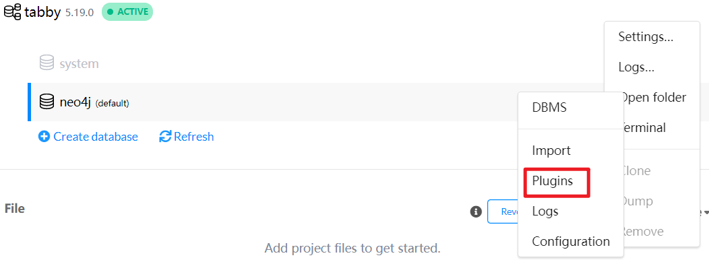
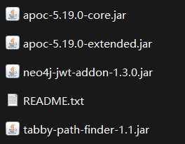
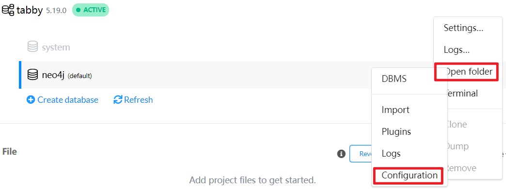

# Tabby安装

> Tabby版本：1.3.2
>
> Neo4j版本：5.19.0

## jar包下载

需要下面几个文件

* tabby core

用于将代码转化为CPG

直接从release下载👉https://github.com/wh1t3p1g/tabby/releases/

* tabby-path-finder

tabby污点分析的neo4j扩展，也是直接从release下，后面要将这个jar包导入为neo4j的插件。

https://github.com/wh1t3p1g/tabby-path-finder

* tabby-vul-finder

用于动态生成配置后的 cypher 语句，也就是用于将图数据导入neo4j

https://github.com/wh1t3p1g/tabby-vul-finder

将项目git下来后生成jar文件，注意需要JDK11的环境

```sh
mvn clean package -DskipTests
```

得到的`tabby-vul-finder.jar`放到`tabby core`目录下，和`tabby.jar`同级

另外`tabby core`目录下创建`config/db.properties`，配置neo4j数据库连接配置

```properties
tabby.neo4j.username                      = neo4j  
tabby.neo4j.password                      = password  
tabby.neo4j.url                           = bolt://127.0.0.1:7687
```

* apoc
  * apoc-core          https://github.com/neo4j/apoc
  * apoc-extended  https://github.com/neo4j-contrib/neo4j-apoc-procedures

Neo4j v5 版本 apoc 插件改成了两个部分 `apoc-core` 和 `apoc-extend`，分别下载

## neo4j配置

Neo4j Desktop新建一个Local DBMS，设置插件



将上面准备的几个jar包移入plugins目录



接着修改数据库配置 Edit settings

```properties
# 注释下面的配置，允许从本地任意位置载入csv文件
#server.directories.import=import

# 允许 apoc 扩展
dbms.security.procedures.unrestricted=jwt.security.*,apoc.*

dbms.memory.heap.initial_size=1G
dbms.memory.heap.max_size=1G
dbms.memory.pagecache.size=1G
```

Neo4j v5 拆分了 apoc 的配置信息，需要在配置文件目录下另外设置apoc的配置



新建`apoc.conf`文件

```properties
apoc.import.file.enabled=true
apoc.import.file.use_neo4j_config=false
```

接着启动数据库。

打开 Neo4j Brower 进行如下查询验证

```sql
CALL apoc.help('all')
CALL tabby.help('tabby')
```

为了加快导入/删除的速度，需提前对节点进行索引建立

```sql
CREATE CONSTRAINT c1 IF NOT EXISTS FOR (c:Class) REQUIRE c.ID IS UNIQUE;
CREATE CONSTRAINT c2 IF NOT EXISTS FOR (c:Class) REQUIRE c.NAME IS UNIQUE;
CREATE CONSTRAINT c3 IF NOT EXISTS FOR (m:Method) REQUIRE m.ID IS UNIQUE;
CREATE CONSTRAINT c4 IF NOT EXISTS FOR (m:Method) REQUIRE m.SIGNATURE IS UNIQUE;
CREATE INDEX index1 IF NOT EXISTS FOR (m:Method) ON (m.NAME);
CREATE INDEX index2 IF NOT EXISTS FOR (m:Method) ON (m.CLASSNAME);
CREATE INDEX index3 IF NOT EXISTS FOR (m:Method) ON (m.NAME, m.CLASSNAME);
CREATE INDEX index4 IF NOT EXISTS FOR (m:Method) ON (m.NAME, m.NAME0);
CREATE INDEX index5 IF NOT EXISTS FOR (m:Method) ON (m.SIGNATURE);
CREATE INDEX index6 IF NOT EXISTS FOR (m:Method) ON (m.NAME0);
CREATE INDEX index7 IF NOT EXISTS FOR (m:Method) ON (m.NAME0, m.CLASSNAME);
:schema //查看表库
:sysinfo //查看数据库信息
```

若想删除约束：

```sql
DROP CONSTRAINT c1;
DROP CONSTRAINT c2;
DROP CONSTRAINT c3;
DROP CONSTRAINT c4;
DROP INDEX index1;
DROP INDEX index2;
DROP INDEX index3;
DROP INDEX index4;
DROP INDEX index5;
DROP INDEX index6;
DROP INDEX index7;
```

## tabby配置

配置文件介绍👉https://www.yuque.com/wh1t3p1g/tp0c1t/mgihyvp3vgscgt63

```properties
# need to modify
tabby.build.target                        = cases/commons-collections-3.2.1.jar
tabby.build.libraries                     = libs/
tabby.build.mode                          = gadget
tabby.output.directory                    = ./output/dev

# debug
tabby.debug.details                       = false
tabby.debug.print.current.methods         = true

# jdk settings
tabby.build.useSettingJRE                 = false
tabby.build.isJRE9Module                  = true
tabby.build.javaHome                      = /Library/Java/JavaVirtualMachines/zulu-17.jdk/Contents/Home
tabby.build.isJDKProcess                  = false
tabby.build.withAllJDK                    = false
tabby.build.isJDKOnly                     = false

# dealing fatjar
tabby.build.checkFatJar                   = true

# pointed-to analysis
tabby.build.isFullCallGraphCreate         = false
tabby.build.thread.timeout                = 2
tabby.build.method.timeout                = 5
tabby.build.isNeedToCreateIgnoreList      = false
tabby.build.timeout.forceStop             = false
tabby.build.isNeedToDealNewAddedMethod    = true
```

要分析的jar包放cases目录下，接着运行👇

```sh
# 生成代码属性图
./run.sh build
./run.sh load output/dev
# 此处 output/dev 为上一步所生成的 csv 文件夹路径
```

eg:

```SQL
match (source:Method) where source.NAME="readObject" 
match (m1:Method) where  m1.NAME="transform" and m1.CLASSNAME="org.apache.commons.collections.Transformer"
call apoc.algo.allSimplePaths(m1, source, "<CALL|ALIAS",6) yield path 
where any(n in nodes(path) where n.CLASSNAME="java.util.PriorityQueue")
return path limit 10
```

